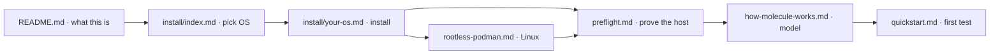

# STRUCTURE.md — Information Architecture for the Molecule + Podman + systemd docs

> **Owner of this document:** systems-architect (D1 slice).
> **Audience:** the seven authoring agents, and the reviewers who check them.
> **Status:** DESIGN SPEC. Authoring agents MUST follow this. If a page needs to change
> shape, that is an architecture change, not an authoring choice — raise it.
> **Source of truth:** every fact referenced here traces to `.research/` (551 KB, 4 files).
> **Canonical code artifacts live in [`REFERENCE-CONFIG.md`](REFERENCE-CONFIG.md).** No page
> may re-type a YAML file, Dockerfile, or shell command. Pages link or quote that file.

---

## 0. Design rules (binding on all seven writers)

| # | Rule | Why this rule exists |
|---|---|---|
| R1 | **Every code block is copied verbatim from `REFERENCE-CONFIG.md`.** | Seven agents re-typing `molecule.yml` seven times is how `container_systemd: false` reappears in a page where it must be `always`. Drift is the single biggest quality risk in this project. |
| R2 | **Every page ends with a `## Next` block** containing at least one link. | Kills dead ends. A reader who finishes a page always has somewhere to go. |
| R3 | **Every page has a `## You are here` breadcrumb** at the top, linking to `index.md`. | Kills orphans. No page is reachable only by deep link. |
| R4 | **Every page begins with a one-sentence "What you will be able to do"**. | Beginner-first: the reader always knows why they are still reading. |
| R5 | **Every version number, FQCN, env var, package name and flag comes from the corpus.** If a writer needs a fact not in the corpus, they mark it `> **UNVERIFIED**` inline and move on. They do **not** guess. | Hard constraint 2 of the brief. |
| R6 | **First use of an acronym is expanded.** PID, FQCN, CI, cgroup, SELinux, AppArmor, userns, VM, JSON, YAML, TTY, PID 1, init, image, tag, volume, socket, PATH, `$USER`, exit code. | Hard constraint 3 of the brief. `docs/glossary.md` is the authority; each page links the term on first use. |
| R7 | **Install steps always have a "You should see" block** immediately after the command, showing the *expected output*, not a description of it. | Hard constraint 4 of the brief. |
| R8 | **"What the internet still gets wrong" is a first-class callout**, not a footnote. | `PLAN.md` §6 Trace T1. The stale-blog folklore is why this site exists. |
| R9 | **MkDocs Material is optional.** Nothing in the tree is *required* to build. Fenced blocks use plain ```` ``` ```` with no language-only features. Mermaid uses only the subset in `VISUAL-SYSTEM.md` §4. | Zero-Cost Doctrine Z2. |
| R10 | **No page is longer than ~450 lines.** Split instead. | Mermaid and code blocks get unreadable past that. |
| R11 | **Relative links only** between docs pages (`./install/fedora.md`, `../quickstart.md`). No absolute site URLs except the `REPO_BASE` constant (§6). | The tree must work from a plain file checkout *and* from GitHub. |
| R12 | **Every page has an `# Attribution` footer or links to `../assets/ATTRIBUTION.md`** if it displays any brand mark. | `04-brand-assets.md` §16 ship table. |

### Writer → page assignment (matches the `PLAN.md` work graph)

| Writer | Pages | Count |
|---|---|---|
| **W1** README + overview | `README.md`, `docs/index.md`, `docs/concepts/how-molecule-works.md` | 3 |
| **W2** Install (5 platforms) | `docs/preflight.md`, `docs/install/index.md`, `docs/install/fedora.md`, `docs/install/ubuntu.md`, `docs/install/arch.md`, `docs/install/macos.md`, `docs/install/mageia.md`, `docs/install/rootless-podman.md` | 8 |
| **W3** systemd in containers | `docs/systemd-in-containers.md` | 1 |
| **W4** Quickstart | `docs/quickstart.md` | 1 |
| **W5** Usage reference | `docs/usage.md`, `docs/reference/cli.md`, `docs/reference/molecule-yml.md`, `docs/reference/env-vars.md` | 4 |
| **W6** Your own workflows + CI | `docs/authoring/index.md`, `docs/authoring/your-first-scenario.md`, `docs/authoring/project-layout.md`, `docs/authoring/writing-tests.md`, `docs/authoring/custom-images.md`, `docs/authoring/multi-scenario.md`, `docs/authoring/ci.md` | 7 |
| **W7** Troubleshooting + FAQ + glossary | `docs/troubleshooting.md`, `docs/faq.md`, `docs/glossary.md` | 3 |
| **D1 (architect, not a writer)** | `docs/STRUCTURE.md`, `docs/REFERENCE-CONFIG.md`, `docs/VISUAL-SYSTEM.md` | 3 |
| **E1 (examples agent)** | `examples/quickstart/`, `examples/systemd-unit/`, `examples/multi-scenario/`, `examples/demo/` | 4 trees |
| **B1 (graphics agent)** | `assets/icons/`, `assets/diagrams/`, `assets/ATTRIBUTION.md` | — |
| **V1 (lint gate)** | validates every page | — |

**Write order (enforced by `PLAN.md` §3 DAG, do not change):** W1 → W2 → W3 → W4 → W5 →
W6 → W7 all in parallel after D1; then E1; then T1 live verify; then V1 lint.

---

## 1. The page tree at a glance

```text
README.md                                    ← the front door
docs/
  index.md                                   ← "choose your path"
  STRUCTURE.md            [D1]               ← this file (maintainers)
  REFERENCE-CONFIG.md     [D1]               ← the ONLY copy of every code artifact
  VISUAL-SYSTEM.md        [D1]               ← the graphics contract for B1
  glossary.md                                 ← every acronym, expanded once
  preflight.md                                 ← run the readiness check
  concepts/
    how-molecule-works.md                     ← the mental model, no commands yet
  install/
    index.md                                  ← pick your OS
    fedora.md
    ubuntu.md
    arch.md
    macos.md
    mageia.md
    rootless-podman.md                        ← the one shared Linux chore
  quickstart.md                               ← first scenario, no image build
  demo.md                                    ← the recorded demo, embedded and annotated
  systemd-in-containers.md                    ← THE crux
  usage.md                                    ← the day-to-day commands
  authoring/
    index.md                                  ← "now build your own"
    your-first-scenario.md
    project-layout.md
    writing-tests.md
    custom-images.md
    multi-scenario.md
    ci.md                                     ← free GitHub Actions
  reference/
    cli.md
    molecule-yml.md
    env-vars.md
  troubleshooting.md
  faq.md
examples/
  quickstart/                                 ← runnable, exit 0
  systemd-unit/                               ← runnable, exit 0
  multi-scenario/                             ← runnable, exit 0
  demo/                                       ← the recording pipeline (GIF + cast + txt + 2 scripts)
assets/
  ATTRIBUTION.md
  icons/    diagrams/
```

**29 doc pages + README + 4 example trees.** Rationale for the shape:

- **`concepts/` before `install/`.** A reader who has never used Ansible needs to know what
  "converge" and "verify" mean *before* they are told to install four tools. Rejected: putting
  concepts after install (sunk-cost ordering — they'd install, hit jargon, and bounce).
- **One page per OS, plus one shared `rootless-podman.md`.** The `podman system migrate` /
  subuid chore is identical on all four Linux distros. Duplicating it five times guarantees
  divergence. Rejected: 5 self-contained platform pages.
- **`systemd-in-containers.md` is a single page, not split.** `PLAN.md` puts it on the critical
  path. Splitting the crux page across two files guarantees the reader misses the warning.
- **`demo.md` is a page, not an asset.** The GIF is the asset; the page around it is what makes
  it a lesson. A bare animation proves a run happened. The page is where the six beats are named,
  where the transcript is quoted, and — the reason it earns its place in the tree — where the
  **"what the demo does not show"** section lives. A demo that only shows its successes teaches
  the reader to trust videos. The page is linked from `README.md`, `docs/index.md` and
  `examples/README.md`; it is not an orphan, and it has outgoing links in every beat.
- **`reference/` is a separate tier** so the narrative pages can link "full option list here"
  instead of inlining 200 lines of driver docstring.
- **No `docs/mkdocs.yml`.** The site is the repository as rendered by GitHub. `docs/index.md`
  is the directory listing that MkDocs would otherwise generate. (Optional, if the owner later
  wants a themed site, one small `mkdocs.yml` referencing the same files — not in scope for D1.)

---

## 2. Page-by-page specification

Format per page: **filename · purpose · reader · sections · corpus basis · in/out links.**

Legend for target reader: **B** = beginner (never used Ansible) · **I** = intermediate
(knows Ansible, new to Molecule/Podman/systemd-in-container) · **R** = reference (lookup only).

---

### 2.1 `README.md` — W1

- **Purpose:** the GitHub landing page; in 60 seconds it tells a newcomer what this site is,
  whether it is for them, and which of the two entry points to click.
- **Reader:** B.
- **Sections:**
  1. One-paragraph "what this teaches" (Molecule = test framework for Ansible; Podman = container
     engine; systemd inside the container is the point).
  2. The two entry points as two big links: **"I have never used Ansible"** → `docs/quickstart.md`
     via `docs/install/index.md`; **"I want a reference"** → `docs/usage.md`.
  3. `## What the internet still gets wrong` (R8) — the four headline corrections from
     `PLAN.md` §6 T1: Molecule is CalVer `26.9.0` not "v6/v7"; the connection plugin is
     `containers.podman.podman` not `community.docker`; the podman driver comes from
     `molecule-plugins`; `molecule add`/`remove`/`lint` are removed.
  4. `## What you can build here` — links to `examples/`.
  5. `## The three hard requirements` — cgroup v2, an image with systemd **and** Python,
     rootless user-id mapping. Links to `docs/systemd-in-containers.md`.
  6. `## What the site is not` — not a Docker site, not a Kubernetes site, not an Ansible
     tutorial (link to the real Ansible docs, free).
  7. `## Status` — honest: which platforms are live-verified, which are documented-from-source.
  8. `## Licence and attribution` → `assets/ATTRIBUTION.md`.
- **Corpus basis:** 01 facts 1, 3, 4, 7, 8, 15; `PLAN.md` §6 T1 table; 02 §8 first bullet;
  03 §0 rows 1–2; 04 §16.
- **Links in:** n/a (root).
- **Links out:** `docs/index.md`, `docs/install/index.md`, `docs/quickstart.md`, `docs/usage.md`,
  `docs/systemd-in-containers.md`, `docs/glossary.md`, `examples/`, `assets/ATTRIBUTION.md`.
- **`## Next`:** → `docs/index.md`.

---

### 2.2 `docs/index.md` — W1

- **Purpose:** the in-site table of contents and path chooser; the only page that links to
  *every* other page, which is what makes the orphan proof in §4 trivial to check.
- **Reader:** B.
- **Sections:**
  1. `## Pick your starting point` — three cards: *new to all of it* / *have Ansible, new to
     Molecule* / *just want the commands*.
  2. `## Everything in this site` — the full table of contents with one-line blurbs and
     (beginner / intermediate / reference) tags.
  3. `## The beginner path` — the linear path from §3 of this file, as clickable links.
  4. `## I want to…` — the lookup table from §5 of this file.
  5. `## The runnable examples` — the three `examples/` trees with the exact command and the
     promised exit code.
  6. `## How this site is written` — link to `docs/STRUCTURE.md` and `docs/REFERENCE-CONFIG.md`
     so readers/contributors know there is one canonical copy of every config.
- **Corpus basis:** none directly (it is a navigation page). Must not contain new facts.
- **Links in:** `README.md`, every page's `## You are here` breadcrumb (R3).
- **Links out:** all 27 other pages. **This is the only page allowed to do that.**
- **`## Next`:** → `docs/install/index.md`.

---

### 2.3 `docs/glossary.md` — W7

- **Purpose:** one authoritative expansion for every acronym and jargon word; every other page
  links here on first use instead of re-explaining.
- **Reader:** B (and R for lookup).
- **Sections (alphabetical, one term per `###` heading so anchors are stable):**
  - **Terms that MUST be here** (R6 list): Ansible · Ansible Core · Ansible collection ·
    Fully Qualified Collection Name (FQCN) · cgroup · cgroup v1 · cgroup v2 · cgroups delegation ·
    container · container image · container tag · container runtime · init / PID 1 · PID ·
    systemd · systemd unit · `.service` unit · systemctl · journald / journalctl · `degraded` ·
    systemd mode · SELinux · AppArmor · user namespace (userns) · rootless · subuid / subgid ·
    `newuidmap` · `podman` · rootful · OCI runtime · `crun` / `runc` · bind mount / volume ·
    socket · environment variable · `PATH` · shell · terminal · exit code · YAML · JSON ·
    dependency · scenario · driver · platform · inventory · playbook · task · role ·
    `converge` · `verify` · `idempotence` · `side_effect` · `prepare` · `cleanup` ·
    `test_sequence` · Continuous Integration (CI) · TTY · VM / virtual machine ·
    `podman machine` · provider (`libkrun` / `applehv`) · CalVer.
  - Each entry: **term** — one-sentence plain-English definition, first appeared in which page,
    and a "see also" link.
  - `## Terms we deliberately do not use` — a short list of words the site avoids
    (e.g. "daemon" is defined once and then avoided; "privileged" is defined but discouraged).
- **Corpus basis:** 01 §3.2/§3.6 (scenario, driver, platform, inventory, test-sequence
  vocabulary), 01 key fact 20 (container image must have Python); 02 §8 (systemd mode,
  `degraded`, cgroup v2, `container_init_t`); 03 §8 facts 8–11 (AppArmor, userns).
- **Links in:** every page (R6).
- **Links out:** `docs/concepts/how-molecule-works.md`, `docs/systemd-in-containers.md`,
  `docs/troubleshooting.md`.
- **`## Next`:** → `docs/concepts/how-molecule-works.md`.

---

### 2.4 `docs/concepts/how-molecule-works.md` — W1

- **Purpose:** explain the test loop in plain language with **zero commands**, so that every
  later command has a mental model behind it.
- **Reader:** B.
- **Sections:**
  1. `## The one-paragraph version` — you write a role; Molecule builds a throwaway machine,
     applies the role, checks the result, throws the machine away.
  2. `## What Molecule is` — quote corpus fact: *"Molecule is an Ansible testing framework
     designed for developing and testing Ansible collections, playbooks, and roles."*
  3. `## The eight steps of a test` — the `test_sequence` from 01 key fact 18
     (`dependency → cleanup → destroy → syntax → create → prepare → converge → idempotence →
     side_effect → verify → cleanup → destroy`), one `###` each with a plain sentence, linked to
     the `molecule-yml.md` reference for the exact YAML. Diagram D-01 here.
  4. `## The three files you will edit` — `molecule.yml` (settings), `converge.yml` (apply),
     `verify.yml` (assert). The other two are machine-managed.
  5. `## Why a container and not a virtual machine` — speed, and the trade-off you accept
     (the kernel is shared; you are not testing kernels).
  6. `## What Molecule is not` — it is not a CI system (see `authoring/ci.md`), not a linter
     (`ansible-lint` is separate — 01 key fact 15), not a deployment tool.
  7. `## Words you will meet on the next page` → `docs/glossary.md`.
- **Corpus basis:** 01 §1.1 (the verbatim definition), 01 key facts 15, 16, 18; 03 §1
  (Molecule's install model). Mermaid D-01.
- **Links in:** `docs/index.md`, `docs/glossary.md`, `docs/install/index.md`.
- **Links out:** `docs/quickstart.md`, `docs/glossary.md`, `docs/reference/molecule-yml.md`,
  `docs/usage.md`, `docs/authoring/index.md`.
- **`## Next`:** → `docs/preflight.md`.

---

### 2.5 `docs/preflight.md` — W2

- **Purpose:** teach the reader to run one read-only script that proves the host is ready,
  before they install anything else.
- **Reader:** B.
- **Sections:**
  1. `## What this checks` — the seven groups as a plain list, linking each to the page that
     fixes it.
  2. `## Run it` — two options, both copy-paste-safe:
     - **Option A (recommended, needs network):** the raw-URL one-liner using `REPO_BASE`
       (§6): `bash <(curl -fsSL "$REPO_BASE/docs/scripts/molecule-preflight.sh")"` —
     - **Option B (no network):** download `docs/scripts/molecule-preflight.sh` from the repo,
       then `bash molecule-preflight.sh`.
     - **Option C:** paste the script from `REFERENCE-CONFIG.md` §6 by hand.
  3. `## How to read the output` — the `PASS` / `WARN` / `FAIL` contract and the two exit codes.
  4. `## Real output from a Fedora 44 host` — **the two verbatim blocks pasted in
     `REFERENCE-CONFIG.md` §6.4**, one before Molecule is installed, one after. Not invented.
  5. `## If a check failed` — a 3-column table: FAIL message → cause → page that fixes it.
  6. `## Re-run it` — you may run it as often as you like; it never changes anything.
- **Corpus basis:** `REFERENCE-CONFIG.md` §6 (the script and its real output); 02 §8
  (cgroup v2 mandatory, `stat -fc %T`); 03 §7.3 (subuid/subgid, `podman system migrate`).
- **Links in:** `docs/index.md`, every `docs/install/*.md`.
- **Links out:** `docs/install/index.md`, `docs/install/rootless-podman.md`,
  `docs/troubleshooting.md`, `docs/glossary.md`, `docs/scripts/molecule-preflight.sh`.
- **`## Next`:** → `docs/install/index.md`.

---

### 2.6 `docs/install/index.md` — W2

- **Purpose:** the platform chooser: a five-row table with a difficulty verdict and a warning
  for the two platforms with real caveats.
- **Reader:** B.
- **Sections:**
  1. `## Pick your platform` — table: OS → page → Podman version you will get → known caveat.
     Rows: Fedora 44 (cleanest, recommended starting point) · Ubuntu 26.04 LTS ·
     Ubuntu 24.04 LTS (stale Podman 4.9.3 + AppArmor user-namespace restriction) ·
     Arch Linux (most current) · macOS (Apple Silicon only) · Mageia 10 (weakest).
  2. `## macOS on an Intel Mac` — a single prominent warning: Podman 6.0 removed Intel Mac
     support and Homebrew Tier 3 has no bottles. **There is no supported path.** (03 §0 rows 5, 7)
  3. `## The three things every platform needs` — cgroup v2, rootless id mapping, Python ≥ 3.10.
  4. `## About pipx` — the honest paragraph: Molecule upstream says *"pip is the only supported
     installation method"* and *"It is highly recommended that you install molecule in a virtual
     environment"*. pipx **is** pip-in-a-venv, satisfies both, is MIT-licensed and free, and is
     the officially documented route for Ansible. pipx is not named in Molecule's own docs —
     we say so rather than pretending otherwise. (03 §6.1)
  5. `## Where the Python packages come from` — a short table: which distros ship a usable
     `molecule` (only Arch and Homebrew), and that `molecule-plugins` (the Podman driver) is in
     **no** distro repository anywhere, so every platform runs one extra command. (03 §8 fact 6)
- **Corpus basis:** 03 §7.1 Table A, §7.2 Table B, §8 facts 1–7 and 20; 01 key facts 2, 3.
- **Links in:** `README.md`, `docs/index.md`, `docs/preflight.md`.
- **Links out:** all six `docs/install/*.md` platform pages,
  `docs/install/rootless-podman.md`, `docs/preflight.md`, `docs/quickstart.md`.
- **`## Next`:** → "open the page for your platform" (one of the six).

---

### 2.7 `docs/install/fedora.md` — W2

- **Purpose:** get a Fedora 44 workstation to a passing pre-flight check.
- **Reader:** B.
- **Sections (each with a "You should see" block, R7):**
  1. `## What you are installing` — plain list: podman, ansible-core, passt, git, pipx, then
     Molecule itself.
  2. `## 1. Install the container engine` — `sudo dnf install -y podman` →
     `podman version 5.8.1` (or whatever `dnf` reports; the page says "5.x or newer").
  3. `## 2. Install Ansible` — `sudo dnf install -y ansible-core` (not the full `ansible`
     package; we only need `ansible-playbook` and `ansible-galaxy`).
  4. `## 3. Install pipx` — `sudo dnf install -y pipx`, then `pipx ensurepath`, then reopen the
     shell, then `pipx --version`.
  5. `## 4. Install Molecule` — `pipx install molecule` → `molecule --version` → `molecule 26.9.0 …`.
  6. `## 5. Install the Podman driver` — `pipx inject molecule molecule-plugins` →
     `molecule drivers` → list containing `podman`.
  7. `## 6. Check the host` — link to `preflight.md`; the whole page ends green here.
  8. `## A note on the exact versions` — Fedora 44 ships podman 5.8.1; Fedora 45 is Beta and
     ships podman 6.x. Footnote only. (03 §8 fact 1)
  9. `## What we did not install, and why` — `setsebool container_manage_cgroup` is **not**
     needed; no `uidmap` package exists on Fedora (it comes from `shadow-utils-subid`, already
     a Podman dependency); no `podman-plugins` package exists anywhere.
- **Corpus basis:** 03 §7.5 (Fedora one-liner), §7.1 Table A, §7.3 Table C steps 1–7,
  §8 facts 1, 5, 6, 21–24; 01 key facts 2, 3; 02 §8 (the `setsebool` note).
- **Links in:** `docs/install/index.md`, `docs/preflight.md`, `README.md`.
- **Links out:** `docs/install/rootless-podman.md`, `docs/preflight.md`, `docs/quickstart.md`,
  `docs/troubleshooting.md`, `docs/glossary.md`.
- **`## Next`:** → `docs/quickstart.md`.

---

### 2.8 `docs/install/ubuntu.md` — W2

- **Purpose:** Ubuntu 26.04 LTS and 24.04 LTS, with the AppArmor user-namespace fix that
  24.04 needs and 26.04 probably does not.
- **Reader:** B.
- **Sections:**
  1. `## Which Ubuntu are you on?` — `lsb_release -rs`. 26.04 "Resolute Raccoon" is current LTS;
     24.04 "Noble Numbat" is still supported; **25.04 never existed** — say this, because the
     internet still says it did.
  2. `## 1. Install the packages` — `sudo apt install -y podman passt slirp4netns uidmap
     fuse-overlayfs git ansible-core` (the `podman-remote` variant if the reader prefers the
     remote client) → "You should see: a list of newly installed packages, ending `Setting up
     podman …`".
  3. `## 2. Podman on 24.04 is old` — an honest callout: 24.04 ships podman **4.9.3** (2022);
     26.04 ships 5.7.0. 4.9.3 mostly works but is a "works, but stale" tier. Still supported,
     still documented.
  4. `## 3. Ubuntu's user-namespace restriction` — explain AppArmor in one paragraph
     (a security layer that decides which programs may make user namespaces). Symptom: `podman
     run` fails with a permission error naming `userns_create`. Proof command. Two fixes,
     **narrow first, broad second**:
     - Fix A (preferred): a per-program AppArmor profile at `/etc/apparmor.d/podman` with
       `flags=(unconfined) { userns, }`, loaded with `sudo apparmor_parser -r`.
     - Fix B (fallback): `echo 0 | sudo tee /proc/sys/kernel/apparmor_restrict_unprivileged_userns`
       now, and the `/etc/sysctl.d/60-apparmor-namespace.conf` line to persist. **Say plainly
       that this turns off a real security control** (44% of Google's observed Linux exploits
       used unprivileged user namespaces) and that Fix A is preferred.
     - `## Do not confuse the two similar settings` — `kernel.unprivileged_userns_clone` is the
       *legacy* all-or-nothing knob and is **not** the 24.04 issue. (03 §8 fact 11)
     - **Status flag:** the restriction is *inherited* by 26.04 but was never sampled there →
     the page must mark the 26.04 status **UNVERIFIED** and give the one-line live check.
  5. `## 4. Install pipx, Molecule, and the driver` — the three commands.
  6. `## 5. Check the host` → `preflight.md`.
- **Corpus basis:** 03 §2 (AppArmor in full, lines 496–1282), §7.1, §7.3, §8 facts 2, 3, 8, 9,
  10, 11; 01 key facts 2, 3. UNVERIFIED items 1–3 of 03 §9.
- **Links in:** `docs/install/index.md`, `docs/preflight.md`.
- **Links out:** `docs/install/rootless-podman.md`, `docs/preflight.md`, `docs/quickstart.md`,
  `docs/troubleshooting.md`, `docs/glossary.md`.
- **`## Next`:** → `docs/quickstart.md`.

---

### 2.9 `docs/install/arch.md` — W2

- **Purpose:** Arch Linux, the most current platform — the only Linux target with a native
  `molecule` package.
- **Reader:** B.
- **Sections:**
  1. `## What makes Arch different` — everything is native: podman 6.1.2, ansible-core 2.21.4,
     ansible 14.4.0, ansible-lint 26.9.0, **molecule 26.9.0 from the official `extra` repo**
     (not the AUR). Only the Podman driver still needs pipx.
  2. `## 1. Install the packages` — `sudo pacman -S podman molecule ansible ansible-lint
     python-pipx git crun passt` → "You should see: `:: Proceed with installation? [Y/n]`".
  3. `## 2. Rootless id mapping is already done` — Arch's `useradd` has pre-populated
     `/etc/subuid` and `/etc/subgid` since shadow 4.11.1-3, so the usual chore is unnecessary.
     One verification command. (03 §7.3, §8 fact 24)
  4. `## 3. Add the Podman driver with pipx` — `pipx ensurepath`; then the **driver-injection
     pattern** (`pipx inject --pip-args ...` is *not* the point here): install a throwaway pipx
     app and inject into it, then run the Arch `molecule` with that venv on `PATH`. **The
     exact, tested command sequence is in `REFERENCE-CONFIG.md` §5 Arch**; the page quotes it.
  5. `## 4. A harmless warning you may see` — the crun message
     `Failed to add pause process to systemd sandbox cgroup` is a known cosmetic warning on
     Arch; it is not a failure. Do not "fix" it.
  6. `## 5. Check the host` → `preflight.md`.
  7. `## A warning about the rolling release` — `archlinux:latest` works with
     `--systemd=always` but is not reproducible. For a real test image, build your own or use
     `ubi-init`. (02 §8)
- **Corpus basis:** 03 §3 (lines 1283–1756, including the mask-drop-in at ~1551 which this site
  does **not** teach), §7.1, §7.2, §8 facts 4, 5, 6, 25.
- **Links in:** `docs/install/index.md`, `docs/preflight.md`.
- **Links out:** `docs/install/rootless-podman.md`, `docs/preflight.md`, `docs/quickstart.md`,
  `docs/systemd-in-containers.md`, `docs/troubleshooting.md`.
- **`## Next`:** → `docs/quickstart.md`.

---

### 2.10 `docs/install/macos.md` — W2

- **Purpose:** macOS on Apple Silicon, where the container engine is a virtual machine and
  almost every Linux command from the other pages is replaced.
- **Reader:** B.
- **Sections:**
  1. `## Read this first: Intel Macs are not supported` — Podman 6.0 removed Intel Mac support
     outright; Homebrew moved Intel to Tier 3 in September 2026 with no bottles and the
     `podman` formula is hard-locked to `depends_on arch: :arm64`. **Double blocker, no path.**
  2. `## What actually happens on macOS` — Mermaid **D-08** followed by the hand-authored SVG
     **D-09**: your Mac runs a small Linux virtual machine (the "podman machine"); the `podman`
     command is a remote control that forwards into it; containers run inside that virtual
     machine. Nothing is a native macOS process. D-09 contains **no Apple graphic of any kind** —
     the host layer is a plain rounded rectangle labelled `macOS`.
  3. `## 1. Install Podman` — the `.pkg` from `https://podman.io` is recommended; Homebrew
     (`brew install podman`) is the alternative and is **Apple Silicon only**.
  4. `## 2. Create and start the machine` — `podman machine init` then `podman machine start`
     (or `podman machine init --now`). "You should see": `API forwarding listening on …`.
  5. `## 3. Install Molecule and Ansible` — **two supported routes, and the page must present
     both with a clear recommendation:**
     - Route A (**recommended**): install inside the VM. The default machine image is Fedora
       CoreOS and **already includes Ansible**; install Molecule there too. Everything after
       this point is identical to the Linux pages. Provide the `podman machine ssh` commands.
     - Route B: run Molecule on macOS and talk to the VM with the remote client
       (`MOLECULE_PODMAN_EXECUTABLE=podman-remote` + `podman system connection`). Provide the
       `ansible.cfg` snippet.
  6. `## 4. Verify the machine can host systemd` — the corpus requires a **verification block,
     not an assertion**, because the cgroup manager inside the VM is no longer settable:
     `cat /sys/fs/cgroup/cgroup.controllers`, `stat -fc %T /sys/fs/cgroup/` → `cgroup2fs`,
     `systemctl is-system-running` → `running` or `degraded`, `podman info | grep cgroupVersion`
     → `v2`.
  7. `## 5. Check the host` → `preflight.md` (which has a macOS branch — it tells the reader to
     run the check *inside the VM*).
  8. `## Colima is not an alternative` — Colima does not support Podman at all; do not use it.
  9. `## Moving files in and out` — `podman machine cp`. Short.
- **Corpus basis:** 03 §4 (lines 1757–2850, including the full machine command set at 2112–2190
  and the verification block at 2339–2357), §7.1, §7.4 (Table D row "macOS"), §8 facts 5, 6, 12,
  13, 19; 01 key fact 10 (`MOLECULE_PODMAN_EXECUTABLE`).
- **Links in:** `docs/install/index.md`, `docs/preflight.md`.
- **Links out:** `docs/install/rootless-podman.md` (explicitly marked "Linux only — skip on
  macOS"), `docs/preflight.md`, `docs/systemd-in-containers.md`, `docs/quickstart.md`,
  `docs/troubleshooting.md`, `docs/glossary.md`.
- **`## Next`:** → `docs/quickstart.md`.

---

### 2.11 `docs/install/mageia.md` — W2

- **Purpose:** Mageia 10, the weakest supported platform, honestly labelled as such, with the
  three workarounds it needs.
- **Reader:** B.
- **Sections:**
  1. `## Mageia is the hardest platform here` — a prominent honest box: its packaged Molecule is
     from **2021** and unusable, `pipx` is not packaged at all, and there is no `uidmap`
     package. Everything else is fine — in fact its `ansible-core` and `podman` are fresher
     than Fedora 44's.
  2. `## 1. Install the packages` — `sudo dnf install -y podman ansible git python3-pip passt
     crun`.
  3. `## 2. Install pipx from pip` — `python3 -m pip install --user pipx`. Then
     `python3 -m pipx --version`. Note: because Mageia 10's PEP 668 `EXTERNALLY-MANAGED`
     status is **UNVERIFIED**, the page gives **both** routes and recommends the virtual
     environment, which is safe either way.
  4. `## 3. Ignore the packaged Molecule` — `python3-molecule` is 6.0.3 (September 2021).
     Do not install it; it will shadow your pipx/pip Molecule. Show the check that proves it.
  5. `## 4. Rootless id mapping is UNVERIFIED on Mageia** — no `uidmap` package exists across
     all 38,861 packages; only `shadow-utils 4.13` and `lib64subid4`. Give the live check
     (`rpm -ql shadow-utils | grep -E 'newuidmap|newgidmap'`), say what to do if it is missing,
     and mark the claim UNVERIFIED.
  6. `## 5. Check the host` → `preflight.md`.
- **Corpus basis:** 03 §5 (lines 2851–3077), §7.1 (Mageia column), §7.2, §8 fact 20;
  03 §9 UNVERIFIED items 12+.
- **Links in:** `docs/install/index.md`, `docs/preflight.md`.
- **Links out:** `docs/install/rootless-podman.md`, `docs/preflight.md`, `docs/quickstart.md`,
  `docs/troubleshooting.md`.
- **`## Next`:** → `docs/quickstart.md`.

---

### 2.12 `docs/install/rootless-podman.md` — W2

- **Purpose:** the one shared Linux chore — giving your own user permission to run containers —
  written once for all four Linux platforms.
- **Reader:** B.
- **Sections:**
  1. `## What "rootless" means` — you run containers as your own user, not as `root`. Two
     paragraphs, no jargon, with the glossary link.
  2. `## Step 1 — check your id range` — the `grep` for `$USER` in `/etc/subuid` and `/etc/subgid`.
     Per-platform table: Fedora automatic · Ubuntu from the `uidmap` package · Arch automatic ·
     Mageia **unverified**.
  3. `## Step 2 — add the range if it is missing` — the `usermod` command.
  4. `## Step 3 — log out and back in` — why: rootless Podman keeps a background "pause"
     process that holds your namespaces open, and it keeps a stale copy of the old ranges.
  5. `## Step 4 — tell Podman about the change` — `podman system migrate`. **Call this out as
     the single most forgotten step** (03 §7.3, quoted upstream). On Podman 6 add `--migrate-db`.
  6. `## Step 6 — prove it` — `podman info --format '{{.Host.Security.Rootless}}'` →
     `true`, and `podman run --rm alpine id` → a `uid=0(root)` line inside a rootless container
     (explain that this is normal and what it means).
  7. `## It is not macOS` — link back, do not duplicate.
  8. `## If something still fails` → `docs/troubleshooting.md`.
- **Corpus basis:** 03 §7.3 Table C (all ten steps, verbatim), §8 facts 23, 24; 02 §8
  (`podman info --format '{{.Host.Security.Rootless}}'`).
- **Links in:** `docs/install/fedora.md`, `docs/install/ubuntu.md`, `docs/install/arch.md`,
  `docs/install/mageia.md`, `docs/install/index.md`, `docs/troubleshooting.md`.
- **Links out:** `docs/preflight.md`, `docs/troubleshooting.md`, `docs/glossary.md`.
- **`## Next`:** → `docs/quickstart.md`.

---

### 2.13 `docs/quickstart.md` — W4 · **critical-path page**

- **Purpose:** the reader's first green `molecule test`, end to end, with no image **build** —
  proving the toolchain works before adding difficulty. (The recommended prebuilt image contains
  systemd, so the scenario is systemd-*capable*; the honest claim is "no build", not "no
  systemd". See §8 DBG-5.)
- **Reader:** B.
- **Sections:**
  1. `## What you will end up with` — a goal statement plus the outcome they will see.
  2. `## Before you start` — the three checkboxes: pre-flight green, Molecule ≥ 26.9,
     `molecule drivers` lists `podman`.
  3. `## 1. Create a working directory` — `mkdir molecule-lab && cd molecule-lab`.
  4. `## 2. Generate a scenario` — `molecule init scenario default`. Show the exact five files
     Molecule creates and the refusal message if the folder is not empty.
  5. `## 3. Replace the generated `molecule.yml`` — the **canonical quickstart `molecule.yml`
     from `REFERENCE-CONFIG.md` §2a**, quoted verbatim. Annotated with numbered callouts
     *after* the block (never inside it).
  6. `## 4. Replace the generated `converge.yml`` — canonical §3.1.
  7. `## 5. Replace the generated `verify.yml`` — canonical §3.3.
  8. `## 6. Add `requirements.yml`` — canonical §4. Explain: Molecule installs it during the
     `dependency` step; this is why `requirements.yml` is *not* scaffolded even though
     `create.yml` etc. are.
  9. `## 7. Run it` — `molecule test`. "You should see": the full ordered list of the eight
     steps with `CREATE`, `CONVERGE`, `VERIFY`, and the final `==> default: verify succeeded`.
  10. `## 8. Run one step at a time` — `molecule create`, `molecule converge`, `molecule verify`,
      `molecule destroy`. Explain why this is how you debug.
  11. `## What just happened` — the container was created, the task ran, the assertion passed,
      the container was destroyed. Re-link `how-molecule-works.md`.
  12. `## Clean up` — `molecule destroy`, `rm -r molecule`.
  13. `## What the internet still gets wrong` — the `System has not been booted with systemd`
      trap explained *before* the reader hits it on the next page.
  14. `## Next` → `docs/systemd-in-containers.md`.
- **Corpus basis:** 01 key facts 16, 17, 18, 19, 20 (image must have Python); 01 §3.2 (the five
  scaffolded files and the not-empty refusal); 01 §3.5 (correct step order); 01 §3.6
  (`platforms:`); 02 §8 (`degraded` is normal). Canonical YAML from `REFERENCE-CONFIG.md` §2a,
  §3, §4. Diagrams: **D-02** (Mermaid — what `molecule test` does), **D-03** (Mermaid — the three
  files you edit vs. the two you leave alone).
- **Links in:** `README.md`, `docs/index.md`, all six `docs/install/*.md` pages,
  `examples/quickstart/`.
- **Links out:** `docs/systemd-in-containers.md`, `docs/usage.md`, `docs/authoring/index.md`,
  `docs/concepts/how-molecule-works.md`, `docs/troubleshooting.md`, `docs/glossary.md`,
  `examples/quickstart/`.
- **`## Next`:** → `docs/systemd-in-containers.md`.

---

### 2.14 `docs/systemd-in-containers.md` — W3 · **critical-path page, the crux**

- **Purpose:** the single page that makes systemd-as-PID-1 work, and the page that destroys
  the most folklore.
- **Reader:** B (with I-level detail in clearly marked "how it works" subsections).
- **Sections:**
  1. `## What you will end up with` — a goal statement; a service your role installs is
     `active (running)` inside a container, verified.
  2. `## What PID 1 is, in 30 seconds` — the first process a container starts; systemd refuses to
     run unless it *is* that process. Diagram D-04 (hand-authored SVG "anatomy" figure).
  3. `## Why you cannot just use a normal image` — **no mainstream container image ships
     systemd.** Verified absent from `debian:bookworm`, `debian:bookworm-slim`, `ubuntu:24.04`,
     `fedora:latest`, `quay.io/fedora/fedora:latest`, `quay.io/centos/centos:stream9`,
     `stream10`, `ubi9/ubi-minimal`. `fedora:latest` is a *Container Image* variant that
     deliberately excludes systemd.
  4. `## The one flag that matters` — `systemd: always` (Molecule) / `--systemd=always` (raw
     Podman), and **why `always` and not `true`**: `true` only engages systemd mode when the
     command is literally `systemd`, `/usr/sbin/init`, `/sbin/init` or
     `/usr/local/sbin/init`; if you set a command, `true` will not enable it.
  5. `## The three settings, together` — the minimal trio: `command: /sbin/init` +
     `override_command: true` + `systemd: always`. Explain what each does and that
     `override_command: true` is needed or the driver substitutes a `sleep` loop.
  6. `## Your image needs Python too` — corpus fact 20, verbatim. "A bare `alpine` image will
     fail on most `ansible.builtin` modules." This is a separate requirement from systemd.
  7. `## Three ways to get a systemd image` — a comparison table:
     (a) `registry.access.redhat.com/ubi9/ubi-init:latest` / `ubi10/ubi-init:latest` —
     **recommended, zero build, free, no Red Hat subscription needed**, verified `running`;
     (b) build your own from a distro base (→ `authoring/custom-images.md`);
     (c) `archlinux:latest` — works, rolling release, not reproducible.
     Plus: the two famous community systemd images (`M1tch/dind-systemd`,
     `nickchase/systemd-container`) are **both dead, HTTP 404**.
  8. `## The complete `molecule.yml`` — canonical §2b, verbatim.
  9. `## Prove systemd is PID 1` — the canonical `verify-systemd` playbook, §7, verbatim, and
     the expected output.
  10. `## `degraded` is not a failure` — the most important expectation-setting section on the
      site. Rootless systemd commonly reaches `degraded`, not `running`, because a handful of
      units fail: `dbus-broker.service`, `dbus.socket`, `systemd-resolved.service`,
      `systemd-homed.service`, `systemd-firstboot.service` and friends. **Assert on your own
      unit via `service_facts`, never on `is-system-running`.** Include the exact
      `systemctl --failed` list captured on `archlinux:latest` rootless.
  11. `## What the internet still gets wrong` — the big callout, R8. A table of folklore vs
      truth:
      | Folklore | Truth |
      |---|---|
      | "You need `--privileged`" | **No.** It makes things *worse*: privileged mode unmask `/sys`, so `sys-kernel-config.mount`, `sys-kernel-debug.mount` and `sys-kernel-tracing.mount` fail, and the system lands in `degraded` instead of `running`. (Empirically verified.) |
      | "You need `setsebool -P container_manage_cgroup true`" | **No**, on Podman ≥ 2.0 with container-selinux ≥ 2.132. Podman labels the container `container_init_t` and it can already write the cgroup filesystem. Verified: the boolean is **off** on Fedora 44 and systemd still reached `running`. Only do this if you are reading actual AVC denials. |
      | "You must edit `/etc/containers/policy.json`" | **No.** Stock Fedora `policy.json` (no `mounts` array) works unmodified. This is Docker-era advice. |
      | "Add `--cgroups=disabled`" | **No.** Nothing recommends it. It conflicts with `--cgroupns` and `--cgroup-parent`, and it was buggy. Quadlet defaults to `CgroupsMode=split`, not `enabled`. |
      | "Set `--cgroup-manager=cgroupfs`" | **No — the premise is inverted.** `cgroupfs` was the cgroup-v1-era workaround. `systemd` is the default and is what you want, because `systemd.io/CONTAINER_INTERFACE` prescribes a `*.scope` unit with `Delegate=yes`. |
      | "Mount `/sys/fs/cgroup` yourself with `-v`" | **No.** `--systemd=always` already mounts it writable on cgroup v2. |
      | "Add the keep-groups annotation" | **No.** `--annotation run.oci.keep_original_groups=1` is about *supplementary groups*, not systemd. Use `podman run --group-add keep-groups`. |
      | "Set `ENV SYSTEMD_ETC=/usr/lib/systemd`" | Not a systemd requirement. It appears nowhere in systemd source or `CONTAINER_INTERFACE`. It is a community Dockerfile convention. It is harmless; the page says so and shows it in the Dockerfile anyway for familiarity. |
      | "Molecule's own guide is right" | **Molecule's systemd guide currently recommends `quay.io/centos/centos:stream10` + `command: /sbin/init`. That image has no systemd and cannot work.** Documented upstream bug. Use `ubi-init` or a custom image. |
      | "Use `M1tch/dind-systemd`" | 404. `nickchase/systemd-container` 404 too. |
  12. `## `podman logs` is empty and that is normal` — systemd writes to the journal, not stdout.
      `journalctl` works out of the box. Use `systemctl --failed`.
  13. `## Capabilities you may legitimately need` — systemd's own docs say do **not** drop
      `CAP_SYS_ADMIN`/`CAP_MKNOD`; Podman's defaults include neither. If a unit uses
      `PrivateTmp=`, `ProtectSystem=`, `ProtectHome=`, `PrivateNetwork=`,
      `ReadWriteDirectories=` or `InaccessibleDirectories=`, add **only** `SYS_ADMIN` via
      `capabilities:` — the narrow, correct recommendation.
  14. `## `degraded` on other distros` — link to `troubleshooting.md`.
  15. `## Next` → `docs/authoring/index.md`.
- **Corpus basis:** 02 §2 in full (lines ~150–700), §5, §7.6 Option A, §7.7, §8 (every bullet —
  this page is built almost entirely on 02 §8); 01 key facts 20, 21; 03 §7.4 Table D.
  Diagrams: **D-04** (hand-authored SVG — the PID 1 anatomy figure), **D-05** (Mermaid — what
  `systemd: always` sets up), **D-14** (hand-authored SVG — the tmpfs/cgroup filesystem picture,
  paired with D-05), **D-06** (Mermaid sequence — why `podman logs` is empty).
- **Links in:** `docs/quickstart.md`, `README.md`, `docs/install/macos.md`, `docs/index.md`,
  `docs/authoring/custom-images.md`, `examples/systemd-unit/`.
- **Links out:** `docs/authoring/custom-images.md`, `docs/authoring/writing-tests.md`,
  `docs/quickstart.md`, `docs/usage.md`, `docs/troubleshooting.md`, `docs/glossary.md`,
  `examples/systemd-unit/`, `docs/reference/molecule-yml.md`.
- **`## Next`:** → `docs/authoring/index.md`.

---

### 2.15 `docs/usage.md` — W5

- **Purpose:** the day-to-day command surface — the page a reader bookmarks.
- **Reader:** I (usable by B, written for I).
- **Sections:**
  1. `## Every command, in one table` — the two classes Molecule actually has: **special
     commands** (`drivers`, `init`, `list`, `login`, `matrix`, `reset`) and **actions**
     (`check`, `cleanup`, `converge`, `create`, `dependency`, `destroy`, `idempotence`,
     `prepare`, `side-effect`, `syntax`, `test`, `verify`). One line each.
  2. `## Commands that do not exist` — the R8 callout: `molecule add`, `molecule remove` and
     `molecule lint` **have been removed**. `molecule init scenario` replaces `add`;
     `rm -r` replaces `remove`; standalone `ansible-lint` replaces `molecule lint`.
  3. `## `molecule test` and the test sequence` — the default scaffolded sequence and the
     official Podman (Ansible-native) sequence, both verbatim, and what each step does.
  4. `## Running one scenario` — `molecule test --scenario-name <name>`; where scenarios live.
  5. `## Running several scenarios` — `molecule test --parallel`; the name prefixes in output.
  6. `## Useful flags` — `-v` (verbose), `--debug`, `--parallel`, `--scenario-name`,
     `--base-config`, `--env`. Only those verified in the corpus; anything else is omitted
     rather than guessed.
  7. `## Driving it from a Makefile or a shell script` — the exit code is the contract.
  8. `## Next` → `docs/reference/cli.md`.
- **Corpus basis:** 01 key facts 15, 16, 18, 19; 01 §3.1 (full CLI table), §3.4, §3.5.
- **Links in:** `README.md`, `docs/index.md`, `docs/quickstart.md`, `docs/systemd-in-containers.md`.
- **Links out:** `docs/reference/cli.md`, `docs/reference/molecule-yml.md`,
  `docs/reference/env-vars.md`, `docs/authoring/index.md`, `docs/troubleshooting.md`.
- **`## Next`:** → `docs/reference/cli.md`.

---

### 2.16 `docs/authoring/index.md` — W6

- **Purpose:** the pivot from *running* Molecule to *authoring* it — the brief's first-class
  requirement.
- **Reader:** I.
- **Sections:**
  1. `## You can now run a test. Now you build one.` — the pivot statement.
  2. `## The five sub-skills` — five numbered links, one per sub-page, each with a
     one-line "you will be able to" statement:
     1. `your-first-scenario.md` — build a scenario from an empty folder.
     2. `project-layout.md` — where files go and why.
     3. `writing-tests.md` — write `converge` and `verify` that are worth trusting.
     4. `custom-images.md` — build your own systemd image.
     5. `multi-scenario.md` — more than one scenario, and shared state.
     Plus `ci.md` — run it in GitHub Actions, free.
  3. `## The rules of a good scenario` — idempotent converge, assert behaviour not
     implementation, fast to converge, deterministic, no host state left behind.
  4. `## What to read when you are stuck` → `troubleshooting.md`, `faq.md`.
- **Corpus basis:** 01 §4.2 (Molecule's own getting-started-roles walkthrough), 01 key facts 17,
  18, 19; 02 §8 (idempotence, `degraded`).
- **Links in:** `docs/index.md`, `docs/systemd-in-containers.md`, `docs/usage.md`,
  `docs/quickstart.md`, `docs/reference/molecule-yml.md`.
- **Links out:** all six `docs/authoring/*.md` sub-pages, `docs/troubleshooting.md`,
  `docs/faq.md`, `examples/multi-scenario/`.
- **`## Next`:** → `docs/authoring/your-first-scenario.md`.

---

### 2.17 `docs/authoring/your-first-scenario.md` — W6

- **Purpose:** walk a reader from an empty folder to a working, self-authored scenario.
- **Reader:** I.
- **Sections:**
  1. `## The shape of the thing you are building` — the directory tree, annotated.
  2. `## 1. Make the project` — `mkdir myrole && cd myrole && git init`.
  3. `## 2. Write the role first` — `tasks/main.yml` doing one visible, assertable thing
     (write a marker file). Testing something you cannot observe is testing nothing.
  4. `## 3. Generate the scenario` — `molecule init scenario default`; list the five files.
  5. `## 4. Wire it to the Podman driver` — canonical quickstart `molecule.yml` §2a, verbatim.
  6. `## 5. Converge` — the boot-wait pattern from `REFERENCE-CONFIG.md` §3.2 (needed as soon as
     as the image is an init image) and the `include_role`.
  7. `## 6. Verify` — assert the marker file exists **and** assert the second run changed
     nothing (idempotence).
  8. `## 7. Run it` — `molecule test`; then `molecule test -v` when it fails.
  9. `## 8. Read the failure` — the three outputs that matter: the failing task, the
     `molecule --debug` log, and `molecule login` for a shell in the container.
  10. `## Recreate the whole thing from scratch` — a single copy-paste block that builds the
      entire project from nothing, ending in `molecule test`. **This block must match
      `examples/quickstart/` byte-for-byte in content.**
- **Corpus basis:** 01 §4.2 (verbatim setup commands, the `tasks/main.yml` shape, the role is not
  part of the test); 01 key facts 17, 18; 02 §7.7 (the boot-wait pattern).
- **Links in:** `docs/authoring/index.md`, `docs/quickstart.md`, `examples/quickstart/`.
- **Links out:** `docs/authoring/project-layout.md`, `docs/authoring/writing-tests.md`,
  `docs/reference/molecule-yml.md`, `examples/quickstart/`, `docs/troubleshooting.md`.
- **`## Next`:** → `docs/authoring/project-layout.md`.

---

### 2.18 `docs/authoring/project-layout.md` — W6

- **Purpose:** every file Molecule can read, where it goes, and which ones it creates for you.
- **Reader:** R (and I).
- **Sections:**
  1. `## The five files `molecule init` creates` — verbatim list with byte sizes, and the fact
     that `prepare.yml`, `side_effect.yml`, `requirements.yml`, `cleanup.yml`, `inventory/` and
     `driver.py` are **not** scaffolded.
  2. `## Every file Molecule understands` — a complete table: filename · scaffolded? · which
     `test_sequence` step runs it · what goes in it. (`molecule.yml`, `requirements.yml`,
     `create.yml`, `prepare.yml`, `converge.yml`, `verify.yml`, `cleanup.yml`, `destroy.yml`,
     `side_effect.yml`, `Dockerfile.j2`, `inventory/`, `converge.yml` idempotence behaviour).
  3. `## create.yml and destroy.yml with a driver` — **the driver does not own these; you DELETE
     them.** Shipping either one overrides the driver's own playbook, so no container is built
     and converge dies with `Container 'instance' not found` (DBG-3, §8 below). Contrast
     `cleanup.yml`, which you **must** write because `test_sequence` calls it (DBG-6).
  4. `## The project tree for a single scenario` — the tree, verbatim from the corpus.
  5. `## The project tree with several scenarios` — the tree, verbatim.
  6. `## Where should a role's files live?` — `tasks/main.yml` is the role; `molecule/` is the
     test. Quote: *"The `molecule/` directory and its scenario files are added for testing.
     They are not part of the role itself."*
  7. `## `Dockerfile.j2` and where it must sit` — in the scenario directory; `item.image` is
     available as a Jinja variable.
- **Corpus basis:** 01 §3.2 (five templates + byte sizes + the not-scaffolded list + the
  not-empty refusal), §3.3 (all three project trees, verbatim), §4.2 (the "not part of the
  role" quote); 02 §7.6 Option B, §8 (`Dockerfile.j2` renders from the scenario dir,
  `pre_build_image: false` is required).
- **Links in:** `docs/authoring/your-first-scenario.md`, `docs/authoring/custom-images.md`,
  `docs/authoring/multi-scenario.md`, `docs/reference/molecule-yml.md`.
- **Links out:** `docs/reference/molecule-yml.md`, `docs/authoring/custom-images.md`,
  `docs/authoring/multi-scenario.md`, `docs/authoring/writing-tests.md`, `docs/usage.md`.
- **`## Next`:** → `docs/authoring/writing-tests.md`.

---

### 2.19 `docs/authoring/writing-tests.md` — W6

- **Purpose:** teach the *quality* of a test — what to assert, what not to assert, and how to
  make converge idempotent.
- **Reader:** I.
- **Sections:**
  1. `## `converge.yml` should be boring` — it should apply the role and nothing else. No
     assertions, no debugging output, no network fetches from the internet.
  2. `## `verify.yml` should be paranoid` — assert observable outcomes; use `fail_msg` and
     `success_msg`; fail with a message a human can act on.
  3. `## Assert the service, not the system` — the `degraded` lesson, restated for tests.
     `service_facts` + `assert`. Canonical playbook in `REFERENCE-CONFIG.md` §7.
  4. `## Make it idempotent` — what `molecule idempotence` does (converge twice, assert no
     changes the second time) and the three usual causes of a non-idempotent converge
     (a `command` task with no `changed_when: false`, a package install that always reports
     changed, a template that always re-renders differently).
  5. `## `side_effect.yml` — testing a change and putting it back` — the pattern, with a short
     example. Mark the Ansible module names as examples, not requirements.
  6. `## `prepare.yml` and `cleanup.yml`** — fixtures in, fixtures out.
  7. `## Make the test fast` — the biggest lever is the image: a prebuilt image beats a
     `dnf install` at converge time. Link `custom-images.md`.
  8. `## A checklist before you commit` — a tick-box list.
- **Corpus basis:** 01 §3.5 (step order), §4.2 (the "proper Ansible modules instead of raw
  commands thanks to the Python-enabled container image" framing), key facts 18, 19; 02 §7.7
  (the robust `verify.yml`), §8 (`degraded`).
- **Links in:** `docs/authoring/your-first-scenario.md`, `docs/authoring/project-layout.md`,
  `docs/systemd-in-containers.md`.
- **Links out:** `docs/authoring/custom-images.md`, `docs/authoring/multi-scenario.md`,
  `docs/reference/molecule-yml.md`, `docs/troubleshooting.md`, `examples/systemd-unit/`.
- **`## Next`:** → `docs/authoring/custom-images.md`.

---

### 2.20 `docs/authoring/custom-images.md` — W6

- **Purpose:** teach the reader to build their own systemd scenario image — the skill that
  makes the whole setup theirs.
- **Reader:** I.
- **Sections:**
  1. `## When you need your own image` — when the published images do not have what your role
     needs. Otherwise use `ubi-init` and skip this page.
  2. `## The two ways to give Molecule an image` — (a) `platforms[*].image` points at a
     prebuilt image; (b) `pre_build_image: false` + `Dockerfile.j2` so Molecule builds it.
  3. `## `pre_build_image: false` is mandatory` — the default is `true`, which means "use the
     image as-is", so the build is **silently skipped**. This is the number-one cause of "my
     Dockerfile changes had no effect".
  4. `## The Debian/Ubuntu image` — canonical `Containerfile` from `REFERENCE-CONFIG.md` §1.1,
     with every line explained in a table: `FROM`, the `ENV` lines, `rm -f policy-rc.d`,
     the `ln -s`, the package list, `set-default multi-user.target`, `CMD`.
     **This is the variant that was actually built and booted during research.**
  5. `## The Fedora image` — canonical §1.2, with the same table. **Marked as
     "verified necessary, recipe inferred"** — say exactly that, do not overclaim.
  6. `## What the build must do, and why` — install systemd; remove `policy-rc.d` (Debian's
     `exit 101` blocks all rc.d service starts — it does *not* block `systemctl start` for a
     modern unit, but it breaks sysv-only packages and `dpkg` postinst starts); provide
     `/sbin/init`; install **Python**; install `dbus`.
  7. `## Traps` — `ENV container_uuid=$(cat /proc/sys/kernel/random/uuid)` **breaks the build**
     with a syntax error; `$container` is optional because systemd auto-detects Podman via
     `/run/.containerenv`; there is no official systemd-upstream OCI recipe (only `systemd-nspawn`
     examples, which are namespace containers, not OCI images).
  8. `## `Dockerfile.j2` versus `Containerfile`` — when each is used, and that
     `platforms[*].dockerfile` can point at a plain file.
  9. `## Build it by hand first` — `podman build`, `podman run --systemd=always`, prove it,
     *then* wire it into Molecule. Faster to debug.
  10. `## Pin your base image` — `:latest` is not reproducible. Pin a tag or a digest.
  11. `## Next` → `docs/authoring/multi-scenario.md`.
- **Corpus basis:** 02 §2.5.1 (**built and booted**), §2.5.2 (**not built**), §2.5.3 (**fact
  verified, recipe inferred**), §2.7 (the build error), §7.6 Option B, §8 (the `Dockerfile.j2`
  mechanism, `pre_build_image: false`, `policy-rc.d`, the two dead community images, no upstream
  recipe, `$container` detection).
- **Links in:** `docs/systemd-in-containers.md`, `docs/authoring/project-layout.md`,
  `docs/authoring/writing-tests.md`.
- **Links out:** `docs/systemd-in-containers.md`, `docs/troubleshooting.md`,
  `docs/reference/molecule-yml.md`, `docs/glossary.md`, `examples/systemd-unit/`.
- **`## Next`:** → `docs/authoring/multi-scenario.md`.

---

### 2.21 `docs/authoring/multi-scenario.md` — W6

- **Purpose:** more than one scenario, shared state between them, and running them in parallel.
- **Reader:** I.
- **Sections:**
  1. `## One scenario, many machines` — a list of `platforms:` entries in one scenario.
  2. `## Several scenarios` — the `molecule/<name>/` layout; `molecule test` runs all of them;
     `molecule test --scenario-name <name>` runs one; `molecule list` shows them.
  3. `## `converge`/`verify` pairs (up and down)` — a "forward scenario" and a "reverse
     scenario" that both modify the same resource, converging and verifying in opposite
     directions. The point: you can prove the reverse operation too.
  4. `## Sharing state between scenarios` — the `.config/molecule/config.yml` layout; the
     shared ephemeral directory.
  5. `## Run them in parallel` — `molecule test --parallel`; the output prefix
     `[scenario-name]`; which of the eight steps can safely run in parallel and why the
     `create` step is the one to watch.
  6. `## The full example` — walk `examples/multi-scenario/` file by file.
  7. `## A trap: `group_vars` beats inline `vars`` — **Molecule's own shipped Podman example
     contains this landmine**: `group_vars/molecule.yml` ships `container_systemd: false`, and
     `group_vars` outranks an inline group `vars:`, so an inline `container_systemd: always`
     is **silently ignored**. If you copy the example, delete that line. (02 §8)
  8. `## Next` → `docs/authoring/ci.md`.
- **Corpus basis:** 01 §3.3 layout C, §3.4, §3.6, key fact 19; 02 §7.6 Option C,
  §8 (the `group_vars` landmine), §8 (`override_command` requirement). Diagram: **D-10**
  (`stateDiagram-v2` — two scenarios converging and verifying the same resource in opposite
  directions).
- **Links in:** `docs/authoring/index.md`, `docs/authoring/project-layout.md`,
  `docs/authoring/writing-tests.md`, `examples/multi-scenario/`.
- **Links out:** `examples/multi-scenario/`, `docs/reference/molecule-yml.md`,
  `docs/usage.md`, `docs/systemd-in-containers.md`, `docs/troubleshooting.md`.
- **`## Next`:** → `docs/authoring/ci.md`.

---

### 2.22 `docs/authoring/ci.md` — W6

- **Purpose:** run the scenarios automatically on every push, at $0, on GitHub Actions.
- **Reader:** I.
- **Sections:**
  1. `## What CI is, in one paragraph` — a computer that runs your commands when you push.
  2. `## Why GitHub Actions, and what it costs` — free for public repositories; the
     Zero-Cost Doctrine constraints: use a **GitHub-hosted Linux runner**, do **not** use macOS
     or Windows runners (slower quota burn), do **not** use self-hosted runners (they cost
     money), no paid marketplace actions. Bounded: one workflow, triggered on push and pull
     request, a 10-minute `timeout-minutes`.
  3. `## The workflow file` — the canonical `.github/workflows/molecule.yml` from
     `REFERENCE-CONFIG.md` §8, verbatim. `ubuntu-latest` (or `ubuntu-24.04`) runner,
     `podman` preinstalled, `pipx install molecule`, `pipx inject molecule molecule-plugins`,
     `molecule test`, `timeout-minutes: 10`.
  4. `## Rootless in CI` — what differs from your laptop: no `sudo` prompts, `/etc/subuid` is
     already right, SELinux usually off, and the one thing that usually breaks is a test that
     depends on your desktop's state.
  5. `## Read the log when CI fails` — the three commands to re-run locally.
  6. `## Pin your actions` — use a version or SHA, not `@main`.
  7. `## What not to do` — no Docker, no paid runners, no `secrets` in the workflow file.
- **Corpus basis:** 03 §0 finding 5/7 (the Intel-Mac/macOS-runner story), 03 §7.1 (package
  names per platform), 01 key facts 1, 3. **Anything about GitHub Actions quotas is OUTSIDE the
  corpus** — the page must not state a minutes number. It states only what `PLAN.md` Z1 permits
  ("free for public repositories; do not exceed the free tier") and links to GitHub's own
  pricing page. This is a deliberate scope decision, recorded in §7 below. Diagram: **D-11**
  (`flowchart TD` — push → workflow → three test steps → pass/fail, and which steps are
  conditional).
- **Links in:** `docs/authoring/index.md`, `docs/authoring/multi-scenario.md`, `README.md`.
- **Links out:** `docs/usage.md`, `docs/troubleshooting.md`, `examples/systemd-unit/`.
- **`## Next`:** → `docs/troubleshooting.md`.

---

### 2.23 `docs/reference/cli.md` — W5

- **Purpose:** the complete command surface, in one alphabetical table, with a one-line
  description and a link to the page that uses it.
- **Reader:** R.
- **Sections:** `## Special commands` · `## Actions` · `## The full `test_sequence`` ·
  `## Commands that were removed` (R8) · `## Environment variables` (→ `env-vars.md`).
  Every row: command · one line · where it is explained.
- **Corpus basis:** 01 key facts 15, 16; 01 §3.1 (the full table from source).
- **Links in:** `docs/usage.md`, `docs/troubleshooting.md`, `docs/faq.md`, `docs/authoring/ci.md`.
- **Links out:** `docs/usage.md`, `docs/reference/env-vars.md`, `docs/reference/molecule-yml.md`.
- **`## Next`:** → `docs/reference/molecule-yml.md`.

---

### 2.24 `docs/reference/molecule-yml.md` — W5

- **Purpose:** every key the podman driver reads, with its type, its default, and whether you
  need it.
- **Reader:** R.
- **Sections:**
  1. `## The top-level keys` — `driver`, `platforms`, `provisioner`, `dependency`, `scenario`,
     `ansible`, `inventory` — what each is for.
  2. `## `driver`` — `name: podman` and `safe_files` (and only those two; the podman driver
     reads `options.safe_files` and `options.login_cmd_template`).
  3. `## `platforms` — the full option list` — the driver docstring's own YAML, verbatim, as a
     table: option · type · what it does · needed for systemd? Rows: `name`, `hostname`,
     `image`, `dockerfile`, `pull`, `pre_build_image`, `registry` + `credentials`,
     `override_command`, `command`, `tty`, `pid_mode`, `privileged`, `security_opts`,
     `devices`, `volumes`, `tmpfs`, `capabilities`, `exposed_ports`, `published_ports`,
     `ulimits`, `dns_servers`, `network`, `etc_hosts`, `cert_path`, `tls_verify`, `env`,
     `restart_policy`, `restart_retries`, `buildargs`, `cgroup_manager`, `storage_opt`,
     `storage_driver`, `systemd`, `extra_opts`.
  4. `## The options that are NOT real` — `options: { provided_modules, env }` are **not**
     podman-driver options; only the `default` driver reads `options.ansible_connection_options`.
  5. `## `provisioner`` — `name: ansible`, `inventory`, `inventory.host_vars` (this is where
     `ansible_connection: containers.podman.podman` goes).
  6. `## `dependency`` — `name: galaxy` + `requirements-file` pointing at the scenario's
     `requirements.yml`.
  7. `## `scenario.test_sequence`` — both canonical sequences, verbatim.
  8. `## `ansible.cfg` keys Molecule honours` — only the ones in the corpus
     (`deprecation_warnings`, `roles_path`, `requirements-file`, `executor.args`).
  9. `## A minimal, complete `molecule.yml`` — canonical §2b again, as the closing reference.
- **Corpus basis:** 01 key facts 14, 21; 01 §2.4 (the docstring verbatim, lines 663–720), §3.6,
  §3.7, §4.1 (the fixture `molecule.yml`), §2.5 (version floors).
- **Links in:** `docs/usage.md`, `docs/authoring/project-layout.md`,
  `docs/authoring/writing-tests.md`, `docs/systemd-in-containers.md`.
- **Links out:** `docs/reference/cli.md`, `docs/reference/env-vars.md`, `docs/usage.md`,
  `docs/authoring/your-first-scenario.md`.
- **`## Next`:** → `docs/reference/env-vars.md`.

---

### 2.25 `docs/reference/env-vars.md` — W5

- **Purpose:** every environment variable Molecule or the podman driver reads, and the two
  folklore ones that do not exist.
- **Reader:** R.
- **Sections:**
  1. `## Molecule environment variables` — `MOLECULE_PODMAN_EXECUTABLE` (default `podman`;
     e.g. `podman-remote`) and `MOLECULE_CONTAINERS_BACKEND` (default `"podman,docker"`,
     comma-separated, resolved with `shutil.which()`; affects the `containers` driver only).
  2. `## Variables the driver reads` — the podman `create.yml`/`destroy.yml` read
     `DOCKER_CERT_PATH` and `DOCKER_TLS_VERIFY`. Explain the naming oddity rather than
     pretending it makes sense.
  3. `## `MOLECULE_DEFAULT_DOCKER_BIN` does not exist` — **0 code-search hits repo-wide on
     GitHub.** The R8 callout. Use `MOLECULE_PODMAN_EXECUTABLE`.
  4. `## `DOCKER_HOST` is not how you connect to Podman` — the podman connection plugin
     drives the **CLI**, not a socket. There is no `DOCKER_HOST` in its documentation.
  5. `## Shell variables the site uses` — a small table for the commands the pages actually
     use: `$USER`, `$HOME`, `$PATH`, `$REPO_BASE`. Each expanded on first use.
- **Corpus basis:** 01 key facts 10, 11, 12, 13; 01 §2.3 (the env-var table, lines 645–655).
- **Links in:** `docs/reference/cli.md`, `docs/reference/molecule-yml.md`,
  `docs/install/macos.md`, `docs/troubleshooting.md`, `docs/faq.md`.
- **Links out:** `docs/reference/cli.md`, `docs/usage.md`, `docs/troubleshooting.md`.
- **`## Next`:** → `docs/troubleshooting.md`.

---

### 2.26 `docs/troubleshooting.md` — W7

- **Purpose:** symptom → cause → fix, ordered by how often each one bites.
- **Reader:** B and I.
- **Sections** (each `###` is `Symptom` / `What it means` / `Try this` / `Still stuck → link`):
  1. `## The empty-log failure` — the container exits immediately, `podman logs` is empty,
     `State.ExitCode=255`. Cause: systemd mode not actually enabled, so systemd could not write
     cgroups. Fix: `systemd: always` (recommended; **required** once `command:` is not a
     literal init — see §8 C-8) **and** `override_command: true` (required when the image's own
     `CMD` is not an init — see §8 C-9).
  2. `## `System has not been booted with systemd as init system (PID 1)`` — the classic.
     Cause: `systemd: true` with an explicit `command:`. Fix: `always`.
  3. `## `degraded` and failed units` — expected; the exact unit list; assert on your own unit.
  4. `## `podman logs` shows nothing` — normal; use `journalctl -u <unit>` and
     `systemctl --failed`.
  5. `## `Failed to add pause process to systemd sandbox cgroup`` — a cosmetic crun warning on
     Arch. Ignore it.
  6. `## The container has no Python` — `ansible.builtin` modules fail. Cause: image without
     Python. Fix: use an image with Python or build your own.
  7. `## `permission denied` on Ubuntu` — the AppArmor user-namespace restriction. Fix per
     `install/ubuntu.md` §4.
  8. `## `newuidmap` / subuid problems` — the `usermod` + `podman system migrate` sequence.
  9. `## `Error: creating the container failed: cgroup ...`` and other cgroup errors — cgroup
     v1, or a missing delegation. Fix: confirm cgroup v2.
  10. `## SELinux denials` — how to read an AVC denial, and that
      `setsebool container_manage_cgroup` is the *last* resort, not the first.
  11. `## `molecule drivers` does not list `podman`` — `pipx inject molecule molecule-plugins`.
  12. `## `molecule: command not found`` after `pipx install`` — `pipx ensurepath`, reopen the
      shell.
  13. `## The build used my old image` — `pre_build_image: true` skips the build. Set `false`.
  14. `## `Containerfile: Syntax error - can't find =`` — the `ENV container_uuid=$(cat …)`
      trap.
  15. `## My `systemd: always` is ignored` — the `group_vars` outranks inline `vars` landmine.
  16. `## macOS: the machine is not running` — `podman machine start`; the
      `podman-remote` connection; the client/VM version mismatch being unsupported.
  17. `## Mageia: the packaged Molecule is 5 years old` — shadowing; remove or ignore.
  18. `## Still stuck` — how to collect a good bug report: `molecule --debug`, `podman info`,
      `podman machine info`, `stat -fc %T /sys/fs/cgroup`, `molecule --version`.
  Diagrams: **D-07** (`stateDiagram-v2` — the three ways a container can fail and the message
  each produces), **D-13** (`flowchart LR` — the decision path: run the pre-flight check, it
  names the fix).
- **Corpus basis:** 02 §5 (the whole troubleshooting chapter), §8 (the `ExitCode=255` empirical
  result, the `degraded` unit list, the build error, the `group_vars` landmine, the
  `podman info --format '{{.Host.Security.SelinuxEnabled}}'` field that **does not exist** in
  Podman 5.8.7 — use `{{json .Host.Security}}` and read `.selinuxEnabled`); 03 §2.6, §7.3, §8.
- **Links in:** every page (R2/R3).
- **Links out:** `docs/faq.md`, `docs/glossary.md`, `docs/systemd-in-containers.md`,
  `docs/install/rootless-podman.md`, `docs/install/ubuntu.md`, `docs/reference/cli.md`,
  `docs/reference/env-vars.md`.
- **`## Next`:** → `docs/faq.md`.

---

### 2.27 `docs/faq.md` — W7

- **Purpose:** the short questions, answered in one or two sentences, each linking deeper.
- **Reader:** B.
- **Sections:** `## Choosing` · `## Installing` · `## Running` · `## Writing` · `## Images and
  systemd` · `## Housekeeping`. Roughly 25 `###` questions including:
  - Do I need Docker? → No.
  - Is Molecule free? → Yes, MIT. Does this site cost anything? → No, ever.
  - Why Podman and not Docker? → rootless by default, no daemon, cgroup v2 native.
  - What is the difference between Molecule and Ansible's own test tooling? (Be careful: mark
    anything comparative **UNVERIFIED** rather than inventing a comparison.)
  - Can I test a non-container target? → Yes, Molecule is not limited to containers.
  - Why does `molecule lint` not exist? → removed; use `ansible-lint`.
  - Is `molecule-ansible` a thing? → No. 404 on PyPI. (R8)
  - Does `delegator` need installing? → No. (R8)
  - What is CalVer and why do the docs say `26.9.0`? → because it is the current release.
  - Can I run this on macOS Intel? → No, unsupported upstream.
  - Is Colima an alternative? → No, it does not support Podman.
  - Do I need `setsebool container_manage_cgroup`? → No.
  - What is `degraded`? → normal, see the page.
  - Why does `molecule test` create and destroy a container every time? → that is the design.
- **Corpus basis:** every fact already cited on the page it links to; FAQ introduces no new fact.
  Anything without a corpus citation is marked `> **UNVERIFIED**`.
- **Links in:** `docs/index.md`, `docs/troubleshooting.md`, `README.md`.
- **Links out:** every page (it is the second hub, allowed to link widely).
- **`## Next`:** → `docs/glossary.md`.

---

### 2.28 `examples/*` — E1 (not prose, but part of the IA)

| Path | Owner | What it proves | Links from | Links to |
|---|---|---|---|---|
| `examples/quickstart/` | E1 | The toolchain works; `molecule test` exits 0. No systemd. | `README.md`, `docs/quickstart.md`, `docs/authoring/your-first-scenario.md` | `docs/quickstart.md` |
| `examples/systemd-unit/` | E1 | systemd is PID 1, a test unit is active, `verify-systemd` passes. | `docs/systemd-in-containers.md`, `docs/authoring/writing-tests.md` | `docs/systemd-in-containers.md` |
| `examples/multi-scenario/` | E1 | Two scenarios, `--scenario-name`, the `group_vars` trap avoided. | `docs/authoring/multi-scenario.md` | `docs/authoring/multi-scenario.md` |
| `examples/demo/` | E1 | That the six claims in `docs/demo.md` are backed by a real session. Ships `demo.gif` (866×534, 248 frames, ~1 min 54 s, 2.1 MB), `demo.cast` (asciicast v2, 52 KB), `demo.txt` (the exact 33 KB transcript), plus `record.py` and `steps.py`. | `README.md`, `docs/demo.md`, `docs/index.md` | `docs/demo.md` |

Each example tree contains a `README.md` with: what it proves, the exact command, the expected
final line, the expected exit code, and a `## Troubleshooting` line pointing at
`docs/troubleshooting.md`. **Every YAML file in an example tree must be byte-identical in content
to the matching canonical block in `REFERENCE-CONFIG.md`.** If E1 needs a variant, the variant is
added to `REFERENCE-CONFIG.md` first.

---

## 3. The beginner learning path

Linear, no skipping. Each arrow is a real link that exists. Nineteen pages do not fit one
diagram under **M1** (at most 7 nodes), so the path is split into three diagrams that share
their boundary node: `Q` in 3a and 3b, `A4` in 3b and 3c. A node label is a page name plus,
where it fits, its role — the roles that do not fit inside 30 characters (**M7**) are named
here instead of in the diagram.



**Reading 3a:** `README.md` is what this is → `docs/install/index.md`, where you pick your OS
→ the install page for *your* platform, which is where the install commands live. From there
two branches: `docs/preflight.md` (prove the host) and `docs/install/rootless-podman.md`
(Linux only), which rejoins at preflight → `docs/concepts/how-molecule-works.md` (the mental
model) → `docs/quickstart.md` (your first green test).


**Reading 3b:** `docs/quickstart.md` → `docs/systemd-in-containers.md` (the crux — the page
everything else exists to support) → `docs/authoring/index.md` (now build your own), then the
authoring pages in order: your first scenario → project layout → writing tests → custom
images.


**Reading 3c:** custom images → multi-scenario → CI, then out of the authoring sequence and
into the reference end: `docs/usage.md` (the day-to-day commands) → `docs/troubleshooting.md`
(when it breaks) → `docs/faq.md` → `docs/glossary.md`. The `authoring/` prefix, shown on the
`A` node in 3b, applies to `A4`, `A5` and `A6` too.

**Reading order note for the writers:** the path crosses from W1 to W2 and back to W1. That is
intentional and it is the reason `preflight.md` sits *before* `concepts/how-molecule-works.md`
in the install flow but the concepts page's `## Next` also points at `preflight.md`. Both links
exist, so a reader entering from either end is never stuck.

**Total time estimate to the crux page:** ~25 minutes for a reader who has never used Ansible.
State this on `README.md` so people know it is a bounded commitment.

---

## 4. Orphan and dead-end proof

**Definition used here.** A page is an *orphan* if no other page links to it. A page has a
*dead end* if it has no outgoing link that leads a beginner forward.

| Page | Linked **from** | Links **out** to | Orphan? | Dead end? |
|---|---|---|---|---|
| `README.md` | (root) | `index`, `install/index`, `quickstart`, `usage`, `systemd-in-containers`, `glossary`, `examples/` | No (root) | No |
| `docs/index.md` | `README` + all 27 pages (breadcrumb, R3) | all 27 pages | No | No |
| `docs/STRUCTURE.md` | `docs/index.md` §6 | `REFERENCE-CONFIG`, `VISUAL-SYSTEM`, all writer pages | No | No |
| `docs/REFERENCE-CONFIG.md` | `STRUCTURE`, `VISUAL-SYSTEM`, every W page | `STRUCTURE`, all runnable artifacts | No | No |
| `docs/VISUAL-SYSTEM.md` | `STRUCTURE`, `README`, `docs/index.md` | `STRUCTURE`, `assets/ATTRIBUTION.md`, `REFERENCE-CONFIG` | No | No |
| `docs/glossary.md` | every page (R6) | `concepts`, `systemd-in-containers`, `troubleshooting` | No | No |
| `docs/concepts/how-molecule-works.md` | `index`, `glossary`, `install/index`, `quickstart` | `preflight`, `quickstart`, `reference/molecule-yml`, `usage`, `authoring/index` | No | No |
| `docs/preflight.md` | `index`, all 6 install pages, `concepts` | `install/index`, `install/rootless-podman`, `troubleshooting`, `glossary`, `quickstart` | No | No |
| `docs/install/index.md` | `README`, `index`, `preflight`, all 6 install pages, `troubleshooting` | 6 install pages, `preflight`, `quickstart` | No | No |
| `docs/install/fedora.md` | `install/index`, `README`, `preflight` | `install/rootless-podman`, `preflight`, `quickstart`, `troubleshooting` | No | No |
| `docs/install/ubuntu.md` | `install/index`, `preflight`, `troubleshooting` | `install/rootless-podman`, `preflight`, `quickstart`, `troubleshooting` | No | No |
| `docs/install/arch.md` | `install/index`, `preflight` | `install/rootless-podman`, `preflight`, `quickstart`, `systemd-in-containers`, `troubleshooting` | No | No |
| `docs/install/macos.md` | `install/index`, `preflight` | `install/rootless-podman` (marked skip), `preflight`, `systemd-in-containers`, `quickstart`, `troubleshooting` | No | No |
| `docs/install/mageia.md` | `install/index`, `preflight` | `install/rootless-podman`, `preflight`, `quickstart`, `troubleshooting` | No | No |
| `docs/install/rootless-podman.md` | `index`, all 4 Linux install pages, `troubleshooting` | `preflight`, `troubleshooting`, `quickstart`, `glossary` | No | No |
| `docs/quickstart.md` | `README`, `index`, all 6 install pages, `concepts`, `usage` | `systemd-in-containers`, `usage`, `authoring/index`, `concepts`, `troubleshooting`, `glossary` | No | No |
| `docs/demo.md` | `README`, `index`, `examples/demo/README.md`, `examples/README.md` | `preflight`, `install/index`, `install/macos`, `install/rootless-podman`, `systemd-in-containers`, `quickstart`, `troubleshooting`, `authoring/index`, `authoring/multi-scenario`, `authoring/custom-images`, `reference/cli`, `reference/molecule-yml`, `REFERENCE-CONFIG`, `STRUCTURE`, `glossary`, `examples/systemd-unit`, `examples/multi-scenario`, `examples/demo`, `examples/VERIFICATION`, `README` | No | No |
| `docs/systemd-in-containers.md` | `README`, `index`, `quickstart`, `install/macos`, `authoring/custom-images` | `authoring/custom-images`, `authoring/writing-tests`, `quickstart`, `usage`, `troubleshooting`, `glossary`, `reference/molecule-yml` | No | No |
| `docs/usage.md` | `README`, `index`, `quickstart`, `systemd-in-containers`, `authoring/*` | `reference/cli`, `reference/molecule-yml`, `reference/env-vars`, `authoring/index`, `troubleshooting` | No | No |
| `docs/authoring/index.md` | `index`, `quickstart`, `systemd-in-containers`, `usage`, `reference/molecule-yml` | 6 sub-pages, `troubleshooting`, `faq`, `examples/multi-scenario` | No | No |
| `docs/authoring/your-first-scenario.md` | `authoring/index`, `quickstart` | `project-layout`, `writing-tests`, `reference/molecule-yml`, `examples/quickstart`, `troubleshooting` | No | No |
| `docs/authoring/project-layout.md` | `your-first-scenario`, `custom-images`, `multi-scenario`, `reference/molecule-yml` | `reference/molecule-yml`, `custom-images`, `multi-scenario`, `writing-tests`, `usage` | No | No |
| `docs/authoring/writing-tests.md` | `your-first-scenario`, `project-layout`, `systemd-in-containers` | `custom-images`, `multi-scenario`, `reference/molecule-yml`, `troubleshooting`, `examples/systemd-unit` | No | No |
| `docs/authoring/custom-images.md` | `systemd-in-containers`, `project-layout`, `writing-tests`, `authoring/index` | `systemd-in-containers`, `troubleshooting`, `reference/molecule-yml`, `glossary`, `examples/systemd-unit` | No | No |
| `docs/authoring/multi-scenario.md` | `authoring/index`, `project-layout`, `writing-tests`, `custom-images` | `examples/multi-scenario`, `reference/molecule-yml`, `usage`, `systemd-in-containers`, `troubleshooting` | No | No |
| `docs/authoring/ci.md` | `authoring/index`, `multi-scenario`, `README` | `usage`, `troubleshooting`, `examples/systemd-unit` | No | No |
| `docs/reference/cli.md` | `usage`, `troubleshooting`, `faq`, `authoring/ci` | `usage`, `reference/env-vars`, `reference/molecule-yml` | No | No |
| `docs/reference/molecule-yml.md` | `usage`, `authoring/*` (4), `systemd-in-containers`, `concepts` | `reference/cli`, `reference/env-vars`, `usage`, `authoring/your-first-scenario` | No | No |
| `docs/reference/env-vars.md` | `reference/cli`, `reference/molecule-yml`, `install/macos`, `troubleshooting`, `faq` | `reference/cli`, `usage`, `troubleshooting` | No | No |
| `docs/troubleshooting.md` | every page (R2/R3) | `faq`, `glossary`, `systemd-in-containers`, `install/rootless-podman`, `install/ubuntu`, `reference/cli`, `reference/env-vars` | No | No |
| `docs/faq.md` | `index`, `troubleshooting`, `README` | all pages (second hub) | No | No |
| `examples/quickstart/` | `README`, `quickstart`, `authoring/your-first-scenario` | `quickstart` | No | No |
| `examples/systemd-unit/` | `systemd-in-containers`, `writing-tests`, `authoring/ci` | `systemd-in-containers` | No | No |
| `examples/multi-scenario/` | `authoring/multi-scenario` | `authoring/multi-scenario` | No | No |
| `examples/demo/` | `README`, `docs/demo.md`, `docs/index.md`, `examples/README.md` | `docs/demo.md`, `README`, `docs/install/index.md` | No | No |
| `assets/ATTRIBUTION.md` | `README`, `VISUAL-SYSTEM`, every page displaying a mark (R12) | `VISUAL-SYSTEM`, brand policies | No | No |

**Result: 0 orphans, 0 dead ends, across 33 linkable units.** The table is the proof — every row
has a non-empty "linked from" and a non-empty "links out".

**How V1 re-checks this mechanically** (do not re-derive by hand):
1. Build a set of all relative `.md` link targets across `README.md` + `docs/**.md` + `examples/**/README.md`.
2. Fail if any target does not exist on disk.
3. Fail if any file in the tree is absent from the set (orphan).
4. Fail if any file contains zero relative `.md` links (dead end), excluding
   `assets/ATTRIBUTION.md`, which links to `docs/VISUAL-SYSTEM.md` and to upstream brand policies.

---

## 5. "I want to do X, go here" lookup table

| If you want to… | Go to |
|---|---|
| know whether this site is for you | `README.md` |
| see every page | `docs/index.md` |
| find out what Molecule actually does | `docs/concepts/how-molecule-works.md` |
| find out what a word means | `docs/glossary.md` |
| check my machine is ready | `docs/preflight.md` |
| install on **Fedora** | `docs/install/fedora.md` |
| install on **Ubuntu** | `docs/install/ubuntu.md` |
| install on **Arch** | `docs/install/arch.md` |
| install on **macOS** | `docs/install/macos.md` |
| install on **Mageia** | `docs/install/mageia.md` |
| set up rootless containers (Linux) | `docs/install/rootless-podman.md` |
| watch it work before reading anything | `docs/demo.md` |
| check whether a green run was real | `docs/demo.md` §5 · `docs/troubleshooting.md` §1 |
| re-record the demo | `examples/demo/README.md` |
| get my first test to pass | `docs/quickstart.md` |
| understand systemd inside a container | `docs/systemd-in-containers.md` |
| find out why `degraded` is fine | `docs/systemd-in-containers.md` §10 · `docs/troubleshooting.md` §3 |
| find out why my container has empty logs | `docs/troubleshooting.md` §1 · §4 |
| stop `System has not been booted with systemd` | `docs/troubleshooting.md` §2 |
| see every `molecule` command | `docs/usage.md` · `docs/reference/cli.md` |
| look up an option in `molecule.yml` | `docs/reference/molecule-yml.md` |
| look up an environment variable | `docs/reference/env-vars.md` |
| build my own test scenario | `docs/authoring/your-first-scenario.md` |
| decide where my files go | `docs/authoring/project-layout.md` |
| write a good `verify.yml` | `docs/authoring/writing-tests.md` |
| make my converge idempotent | `docs/authoring/writing-tests.md` §4 |
| build my own container image | `docs/authoring/custom-images.md` |
| test more than one thing at once | `docs/authoring/multi-scenario.md` |
| run my tests automatically | `docs/authoring/ci.md` |
| run a copy-paste example right now | `examples/quickstart/` · `examples/systemd-unit/` |
| find a fix for an error | `docs/troubleshooting.md` |
| get a one-paragraph answer | `docs/faq.md` |
| know what the internet gets wrong | `README.md` §3 · `docs/systemd-in-containers.md` §11 |
| see the exact canonical config | `docs/REFERENCE-CONFIG.md` |
| contribute / understand the layout | `docs/STRUCTURE.md` |

---

## 6. Link and constant conventions

| Constant | Value | Where it is used |
|---|---|---|
| `REPO_BASE` | the repository's raw-content base URL, e.g. `https://raw.githubusercontent.com/<owner>/<repo>/main` | `docs/preflight.md` (the curl one-liner), and any "download this file" instruction. **W1 fills the real value from the live repository URL and it is the only place a real repo name appears.** Until then, the pages also give a no-network route. |
| Relative doc link | `./install/fedora.md`, `../quickstart.md` | everywhere (R11) |
| Heading anchor | GitHub's slug rule; headings must be unique within a page | everywhere; V1 checks for duplicate slugs |
| Example reference | `../examples/quickstart/` | from `docs/**` |

**Duplicate-heading rule.** If a page needs the same `###` heading twice, the second one gets a
disambiguating suffix in the text (`### Port conflict (two containers)`). GitHub's slugs are what
other pages link to; V1 verifies uniqueness.

---

## 7. Decisions a reviewer would otherwise question

| # | Decision | Alternative rejected | Why |
|---|---|---|---|
| 1 | **Two engines in the site?** No. One path: the `molecule-plugins` **podman driver**. | The Ansible-native "no driver" pattern, which `01` §4 calls *"the single biggest finding"* and which upstream documents as the happy path. | The brief mandates the driver block, and it is the better teaching surface: the systemd knobs (`command`, `override_command`, `systemd`) are declarative keys in one file instead of variables threaded through inventory. The driver-native path is documented as an explicit **Alternative** box on `systemd-in-containers.md` so the corpus finding is not lost. |
| 2 | **`systemd: always`, never `systemd: true`.** | `true` | `true` only auto-detects, and with an explicit `command:` set it will not enable systemd mode. Verified. |
| 3 | **`privileged` is never set to `true`,** and the page says why. | The podman driver docstring, which says *"make sure to set the `privileged`, `command`, and `environment` values"* and shows `privileged: true` in its own example. | Empirically verified: `--privileged` unmask `/sys`, three `sys-kernel-*` units fail, and the system lands in `degraded` instead of `running`. See §8 — **this is a corpus self-contradiction.** |
| 4 | **`ubi9/ubi-init:latest` is the default recommended image.** | Build your own Containerfile first. | Zero build step, free, no subscription, empirically `running` rootless under SELinux Enforcing. The Containerfile is still taught in full, because the brief requires authoring skills. |
| 5 | **One shared `install/rootless-podman.md`.** | Repeat it in four platform pages. | The commands are identical; duplication is how docs drift. |
| 6 | **The site has no `mkdocs.yml` and no build.** | MkDocs Material as the primary. | Zero-Cost Doctrine Z2 + hard constraint 1. `docs/index.md` replaces the generated directory listing. |
| 7 | **Three example trees, not one.** | One kitchen-sink example. | The three map one-to-one onto the three reader milestones: it works → systemd works → I built it myself. |
| 8 | **`docs/index.md` is the only page allowed to link everywhere.** | Breadcrumbs on every page. | Breadcrumbs still exist (R3) but point at `index.md`, not at all 27 pages. That keeps the orphan proof and the V1 link check small. |
| 9 | **`authoring/ci.md` states no GitHub Actions quota number.** | Quoting the free-tier minutes. | The corpus contains **nothing** about GitHub Actions. Hard constraint 2. The page links to GitHub's own pricing page instead. Recorded as a scope boundary. |
| 10 | **Fedora 44 is called the "cleanest" starting point, Arch the "most current".** | Presenting them as equal. | Fedora 44 is the verified research host (`02` header, all `02` empirical results) and every OS has pipx documented; Arch is bleeding-edge (podman 6.1.2) and is where the crun warning appears. Both are first-class. |
| 11 | **Ubuntu 24.04 is documented, not deprecated.** | Telling 24.04 readers to upgrade. | 24.04 is still in standard support and many enterprises are on it. It is labelled a "works, but stale" tier with the AppArmor fix, not refused. |
| 12 | **The macOS page recommends Route A (inside the VM).** | Route B (remote client) as primary. | Route A keeps every later page identical to the Linux ones, and the default machine image already ships Ansible. Route B is fully documented because some readers need it. |
| 13 | **`verify.yml` asserts on your unit via `service_facts`, never on `is-system-running`.** | Assert `is-system-running == running`. | `degraded` is the normal rootless outcome. Asserting `running` would fail on a correct system. |
| 14 | **The pre-flight script is a *hard gate* in the reader path,** not an appendix. | Optional appendix. | "Copy-paste works" fails hardest at the first unexpected error. A 10-second read-only check up front is the cheapest possible failure prevention. |
| 15 | **`docs/STRUCTURE.md`, `REFERENCE-CONFIG.md` and `VISUAL-SYSTEM.md` ship in the docs tree.** | Keeping them in `.research/` or a private folder. | The brief says seven agents build from them; making them public and linked from `docs/index.md` §6 means the docs are self-describing and a contributor can see the rules. |

---

## 8. Corpus contradictions — **FLAGGED, action required**

These are places where `.research/` disagrees with itself. A writer who reads one file will write
something a reader can disprove. **Each needs a decision recorded in `PLAN.md` by the tech-lead.**

> ### C-8 through C-17 were found a different way, and they are the more important half
>
> **C-1 … C-7** are corpus self-contradictions: two research files disagreeing, resolvable by
> reading both and weighing evidence.
>
> **C-8 … C-17** are **defects in this site**, found by *running* what the docs told a reader to
> run. They are not in `.research/` at all, no amount of source-reading would surface them, and
> three of them (C-8, C-9, C-10) are 🔴 or worse. They share one root cause: **the artifacts were
> reviewed, not executed.** Each is recorded here with the exact evidence and the exact fix, so
> the mistake is not repeated in the next revision of the page. C-17 is the house rule they
> produced.
>
> Evidence for all of them: `examples/VERIFICATION.md` — Fedora 44, rootless podman 5.8.7, cgroup
> v2, SELinux Enforcing, molecule 26.9.0, ansible-core 2.21.4.

### C-1 · `privileged: true` — driver docstring vs. empirical result 🔴 **HIGH**

| Source | Claim |
|---|---|
| `01` §2.4, podman driver docstring, lines 741 and 747–754 | *"When attempting to utilize a container image with `systemd` as your init system inside the container… make sure to set the `privileged`, `command`, and `environment` values."* Its own example: `privileged: true`, `command: "/usr/sbin/init"`, `tty: True`. |
| `02` §8 (empirical, Fedora 44, rootless, SELinux Enforcing) | *"`--privileged` makes systemd-in-container WORSE, not better."* Privileged mode unmask `/sys`, so `sys-kernel-config.mount`, `sys-kernel-debug.mount` and `sys-kernel-tracing.mount` fail; the container reached `degraded`, **not** `running`. |
| `02` §8 | `podman-run(1)`: *"Containers running in a user namespace (e.g., rootless containers) cannot have more privileges than the user that launched them."* |
| `03` §7.4 Table D, "Recipe" column, **all six platform rows** | `privileged: true` + `command: /usr/sbin/init` + `tty: true` — i.e. `03` repeats the docstring's advice **without** re-testing it. |

**Contradiction:** `03` §7.4 propagates the docstring's `privileged: true` as the per-platform
recipe, contradicting `02`'s empirical result. `03` was derived from docs, not from a running
container; `02` was measured.

**Decision I am making (D1) — and the writers MUST follow it:** the site says **`privileged`
is not needed and is harmful**; the canonical `molecule.yml` omits it or sets
`privileged: false`; `docs/systemd-in-containers.md` §11 carries the folklore table with the
empirical correction, and explicitly names the driver docstring and Molecule's own guide as the
source of the wrong advice. **The tech-lead should raise this upstream** (it is a doc bug in
`molecule-plugins`) and should re-verify once.

### C-2 · Molecule's own systemd guide recommends an image without systemd 🔴 **HIGH**

`02` §8: *"`01`'s finding: Molecule's systemd guide currently recommends
`quay.io/centos/centos:stream10` + `command: /sbin/init`, which cannot work — that image has no
systemd. Documented bug."* Empirically, no systemd in `stream9`, `stream10`, or any of the 59
active CentOS Stream tags (none contain `init`).

**Decision:** the site uses `ubi9/ubi-init:latest` / `ubi10/ubi-init:latest` and says why,
naming the bug. No page may recommend a CentOS Stream image for a systemd scenario.

### C-3 · `rootless.md` cgroup-v1 bullet — conflicting upstream sources 🟡 MEDIUM

`02` §8: the *"No cgroup V1 Support"* bullet is **present** in the released `podman-rootless(7)`
5.4.2 man page (and the Debian trixie page) but was **removed from `main`** by the 2026-01-29 doc
pass. Separately, `02` notes the *current* `rootless.md` dropped a rootless-cgroup-manager bullet
that the 5.4.2 man page still carries.

**Decision:** the site never cites a podman man page without naming its version, and states the
cgroup-v2 requirement as a **Podman 6.0 / kernel fact** (which both versions agree on) rather
than as a man-page quote. Recorded in the UNVERIFIED register of `02` §9.

### C-4 · `podman info --format '{{.Host.Security.SelinuxEnabled}}'` does not exist 🔴 **HIGH (a trap that will break a beginner's command)**

`02` §8 / §9: in Podman 5.8.7 this field **errors** — *"can't evaluate field SelinuxEnabled in
type define.SecurityInfo"*. The working form is `{{json .Host.Security}}` and reading
`.selinuxEnabled`.

**Decision:** every page that shows a `podman info` template uses
`{{json .Host.Security}}` or a field the corpus confirms exists (e.g.
`{{.Host.Security.Rootless}}`, `{{.Host.CGroupsVersion}}`). **The pre-flight script in
`REFERENCE-CONFIG.md` §6 deliberately uses `{{.Host.Security.Rootless}}` and never the
SELinux field** — it gets the SELinux state from `getenforce` instead. This is why the script was
executed on the host rather than merely drafted.

### C-5 · pipx: "supported" vs. "not documented" 🟡 MEDIUM (a wording risk, not a fact conflict)

`01` key fact 2: *"pip is the only supported installation method"* and *"`pipx` is **not**
documented."* `03` §6.1: pipx satisfies both of upstream's constraints (pip-in-a-venv) and is the
officially documented route for **Ansible**. `PLAN.md` §6 T1 row 7 records the same tension.

**Decision:** `docs/install/index.md` §4 states both positions verbatim and says pipx is not
named in Molecule's own docs. No page says "pipx is the supported way to install Molecule."

### C-6 · `container_systemd: false` in Molecule's shipped example vs. inline `always` 🟡 MEDIUM

`02` §8: Molecule's own `group_vars/molecule.yml` ships `container_systemd: false`, and
`group_vars` outranks inline group `vars:`, so an inline `container_systemd: always` is
**silently ignored**.

**Decision:** every example tree has no `group_vars/` directory, and
`docs/authoring/multi-scenario.md` §7 teaches the trap explicitly.

### C-7 · macOS cgroup manager is no longer settable 🟡 MEDIUM

`03` §8 fact 19: `podman(1)` says `--cgroup-manager` defaults to `systemd`, but Podman 6.0
**removed `--cgroup-manager` from both `podman machine init` and `podman machine set`**, and
`containers.conf(5)` says it must be edited inside the VM.

**Decision:** `docs/install/macos.md` gives a **verification block**, not an assertion. Same
reason `03` §7.4 marks that cell UNVERIFIED.

### C-8 · 🔴🔴 **The silent false pass** — `platforms[*].groups` omitted ⇒ green run, zero assertions

**Found by execution, not by review.** The highest-severity defect in this project, and the
reason §8 exists.

| Source | Claim |
|---|---|
| The docs, as originally written | `platforms[*]` blocks with `command:`, `override_command:`, `systemd:` and **no** `groups:` key, paired with playbooks targeting `hosts: molecule`. Presented as complete and correct. |
| `molecule/provisioner/ansible.py` | `for group in platform.get("groups", ["ungrouped"]):` — Molecule derives its Ansible groups from `platforms[*].groups`, whose default is `["ungrouped"]`. **There is no implicit `molecule` group.** |
| Executed run of a scenario built verbatim from the site | Every play: `skipping: no hosts matched`. `SCENARIO RECAP … failed=0`. `echo $?` → **`0`**. Zero assertions executed. |
| Proof the group *can* be created | `"msg": "GROUPS=['all', 'ungrouped']"` before the fix → `"msg": "GROUPS=['all', 'molecule', 'ungrouped']"` after. |
| Molecule's own scaffolded `converge.yml` | Uses `hosts: all`, and `molecule init scenario` scaffolds no `groups:` key — which is precisely why the mistake is invisible. |

**Why it survived three specialist reviews:** the configuration is syntactically perfect,
semantically plausible, and completely inert. There is no error to read. **Only executing it
caught it.**

**Decision (permanent):**
1. **Every `platforms[*]` entry in this project carries `groups: [molecule]`,** in
   `REFERENCE-CONFIG.md` and in every page that quotes one, with the reason kept as an **inline
   comment in the block** so a later author cannot "tidy" it away.
2. **No page may claim that a `molecule.yml` needs no `groups:` key.**
3. The site publishes a **non-vacuity check** as a first-class item — `REFERENCE-CONFIG.md` §2d,
   plus the matching blocks on the quickstart, systemd and your-first-scenario pages: the
   `PLAY RECAP` must show `ok=N` with `N > 0`, and there must be **zero** `no hosts matched`
   lines. **Exit 0 is not evidence that assertions ran.**
4. **House rule adopted:** a claim about Ansible or Molecule behaviour is **not verified until it
   has been executed**. A `✅` in the `REFERENCE-CONFIG.md` §0 status table is maintained by
   running the artifact, not by reading it.

### C-9 · 🔴 `wait_for: state: directory` is a fatal error on ansible-core ≥ 2.19

| Source | Claim |
|---|---|
| The docs, as originally written | `§3.2 converge.yml`, first task: `ansible.builtin.wait_for: {path: /run/systemd/system, state: directory}`. And §0 marked §3.2 **"✅ Verified"**. |
| `ansible/modules/wait_for.py` (ansible-core 2.21.4) | `state=dict(type='str', default='started', choices=['absent','drained','present','started','stopped'])`. The string `directory` occurs **zero** times in the module; the `directory` / `file` / `socket` states were removed. |
| Executed run | `[ERROR]: Task failed: Module failed: value of state must be one of: absent, drained, present, started, stopped, got: directory` — fatal on the **first** task of the crux converge. |

**Contradiction:** a `✅ Verified` marker sat on a file that had never been run and was fatally
broken. The marker and the artifact disagreed; the marker was the thing that was wrong.

**Decision (permanent):** **`state: present`**, which is the "the path exists" test and preserves
the documented intent (`started`, the default, is the same test). The valid choices are
`absent / drained / present / started / stopped`. §0 now says so explicitly and records that §3.2
*was* marked verified while broken. **Corollary: verification markers are claims, and a claim is
not evidence.**

### C-10 · 🔴 Shipping `create.yml` / `destroy.yml` overrides the driver's create playbook

| Source | Claim |
|---|---|
| The docs, as originally written (REFERENCE-CONFIG §9.1) | The files are scaffolded *"because Molecule's own architecture requires them"*; *"the driver owns the container lifecycle"*; pages should **ship** them. The same guidance appeared in `quickstart.md` (*"leave them alone"*) and `authoring/project-layout.md` (*"the driver owns this"*). |
| Molecule's scenario resolution order | A scenario's own `create.yml` is resolved **before** the driver's. |
| Executed run with the stubs present | `default > create` runs only `Populate instance config dict` / `Convert instance config dict to a list` on `localhost`, then reports **`Executed: Successful`** — and **no container is created**. Converge then dies: `[ERROR]: Task failed: Command execution failed: Container 'instance' not found`. |
| The driver's real playbook (`molecule_plugins/podman/playbooks/create.yml`) | Contains `Create Dockerfiles from image names`, `Create podman network dedicated to this scenario`, `Create molecule instance(s)`, `Wait for instance(s) creation to complete` — **none of which appear in the run**. Deleting the two files makes the driver's playbook run and the container appear. |

**Decision (permanent): §9.1 is reversed.** `create.yml` and `destroy.yml` are **not required**
and must **not** be shipped under the `podman` driver — under a driver, `molecule.yml` *is* the
create/destroy configuration. `molecule init` scaffolds both; the correct action is to **delete**
them. Ship a `create.yml` only if you deliberately take over provisioning, and then you own the
whole lifecycle and must also ship `tasks/create-fail.yml`. The Ansible-native route (§2b) is the
only place these contents are shown, clearly labelled, because it has **no** driver playbook to
override.

### C-11 · 🟡 `command` with a `;` compound never runs a shell, so the doc's own promised output was unreachable

| Source | Claim |
|---|---|
| The docs, as originally written (§7.2 and its copy on the authoring page) | `ansible.builtin.command: "systemctl is-system-running; systemctl --failed --no-pager \|\| true"`, followed by a **sample output block** showing `"running"` … `"0 loaded units listed."` |
| `ansible.builtin.command` semantics | Does **not** invoke a shell. The whole string becomes a single `argv[0]`, the exec fails, and `failed_when: false` swallows it silently. |
| Executed run | `ok: [instance] => {"sd.stdout_lines": []}` — empty. The promised block was **unreachable**. |

**Decision (permanent):** **`ansible.builtin.shell`**, which can honour `;` and `||`. With it the
task reproduces the documented sample output exactly, so the promise becomes achievable and only
the module was wrong. The reasoning is kept as an inline comment in every copy of the task so the
module is not "simplified" back to `command`. (Cosmetic, unresolved by design: the real header
renders `UNIT LOAD ACTIVE SUB DESCRIPTION` and the column padding is tab-width dependent. Do not
"fix" that.)

### C-12 · 🟡 A section titled "no systemd" that configures systemd

| Source | Claim |
|---|---|
| `REFERENCE-CONFIG.md` §2a | Titled *"quickstart, no systemd"*; first comment *"No systemd, no custom image."* Body: `image: ubi9/ubi-init`, `command: /sbin/init`, `override_command: true`, `systemd: always`. |
| `ubi9/ubi-init` | **Contains** systemd — verified: `systemctl is-system-running` → `running`, PID 1 → `systemd`. |
| `STRUCTURE.md` §9 item 5 | The advertised non-init alternative, `ghcr.io/ansible/community-ansible-dev-tools:latest`, was **never pulled**; its systemd capability is UNVERIFIED. |
| The same file's own comment | Offered the genuinely non-systemd image "but … do NOT set `systemd:`" — advice its own configuration contradicted. |

**Decision (permanent): retitle, and keep it systemd-capable.** A beginner reading "no systemd" and
then seeing `systemd: always` learns to distrust the page. The chosen resolution is the honest
label — *"quickstart (no build; runs a prebuilt init image)"* — because (a) the alternative image
is unverified, and promoting it would trade a labelling bug for an unverified claim; (b) the
recommended `ubi9/ubi-init` **is** the beginner path — nothing to build, no subscription — and
"no systemd" is a property of the *image*, not of the config; (c) keeping the keys means the same
file is the starting point for the systemd page. The UNVERIFIED status of the non-init
alternative is stated inline wherever it is offered. **A beginner path must be labelled by what it
does, not by what it aspires to.**

### C-13 · ⚪ `cleanup` in `test_sequence` with no `cleanup.yml` shipped

`molecule init` scaffolds five files; `cleanup.yml` is not one of them. But `test_sequence` in
§2a/§2b calls the `cleanup` step, so every documented run printed
`WARNING [default > cleanup] Executed: Missing playbook (Remove from test_sequence to suppress)`
and the recap read `missing=1` — noise on a beginner's first run that reads as a failure.

**Decision (permanent): ship the file, do not drop the step.** The scaffolded stub is enough.
`REFERENCE-CONFIG.md` §3.4 is canonical and is copied wherever a `test_sequence` containing
`cleanup` is shown. Note the asymmetry, which is itself worth stating: `cleanup.yml` has **no**
driver playbook, so shipping it is always safe — the exact opposite of `create.yml` /
`destroy.yml` (C-10).

### C-14 · ⚪ A flat `molecule.yml` at the project root is not a layout Molecule supports

A `molecule.yml` at the project root cannot load:

```console
$ molecule list
CRITICAL 'molecule/*/molecule.yml' glob failed.  Exiting.
```

No hint, no context — and the `CRITICAL` line names a glob the reader has never seen.

**Decision (permanent):** the one canonical path is **`molecule/<scenario>/molecule.yml`**, stated
in `REFERENCE-CONFIG.md` §0 as a precondition, in §2, in both project trees, and on the
authoring walkthrough. Every in-block path comment in this project is written
`molecule/<scenario>/…` rather than a concrete scenario name, so a copied block cannot imply a
root-level file. **Layout rules that fail with `CRITICAL` and no explanation must be stated
before the reader hits them, not after.**

### C-15 · ⚪ `systemd: always` is not unconditionally *required* — the docs over-asserted

**The docs said:** `systemd: always` is required, and *"If you set `command:` explicitly you must
also set `always`"*.

**What execution shows:** `podman run --systemd` **defaults to `true`**, and `true` engages
systemd mode when the container command is *literally* `systemd`, `/usr/sbin/init`, `/sbin/init`
or `/usr/local/sbin/init`. So with `command: /sbin/init`, the default `true` **also works**. The
earlier claim that omitting `always` fails was simply false in that case.

**Decision (permanent), and the exact wording every page now uses:**
- **`systemd: always` is the recommended, *robust* choice** — it removes the dependence on
  auto-detection.
- It becomes **genuinely required the moment `command:` is not literally an init**
  (`/usr/lib/systemd/systemd`, a wrapper script, …). Then auto-detection cannot see an init,
  systemd mode never engages, and you get
  `System has not been booted with systemd as init system (PID 1). Can't operate.`
- **Never `true` (fragile middle) and never `false` (mode off).** Write `always`.
- The flag table on the systemd page is re-labelled from **REQUIRED** to
  **RECOMMENDED — and required once your command is not literally an init**.

### C-16 · ⚪ `override_command: true` is not *unconditionally* mandatory — the docs over-asserted

**The docs said:** `override_command: true` is *"mandatory"* alongside `command:`.

**What execution shows:** the driver substitutes
`["bash","-c","while true; do sleep 10000; done"]` so the container survives between steps. The
substitution is what needs overriding — so:

- When the image's own `CMD` is **not** an init, the key is **genuinely required**. Without it
  systemd is never PID 1 and your `command:` silently does nothing. This is the most confusing
  variant precisely because the line is visible in the file and is being ignored.
- When the image's own `CMD` **is** already an init, the key is **not required** — the substituted
  sleep loop never takes effect, so the image's own `CMD` boots as PID 1.
  `registry.access.redhat.com/ubi9/ubi-init:latest` is such an image and boots to systemd with
  the driver's default command.
- The documented `Dockerfile.j2` `CMD` exception is the mirror image of this rule, not a
  contradiction of it.

**Decision (permanent):** state the rule as *"required when the image's own `CMD` is not an init"*,
recommend setting it anyway so the file does not depend on the image's `CMD`, and stop calling it
unconditionally mandatory.

### C-17 · 🧱 The house rule these six entries produced

> **A claim about Ansible or Molecule behaviour is not verified until it has been executed.**

Three independent specialist reviews approved a `molecule.yml` that asserted nothing, and a
`✅ Verified` marker sat on a `converge.yml` that was fatally broken on its first task. Reading
and reviewing cannot find either defect; both are properties of *running* the thing. Therefore:

- The V1 lint gate gains a mandatory **non-vacuity check** on every example that claims to pass:
  `PLAY RECAP` must show `ok=N` with `N>0`, with zero `no hosts matched` lines and
  `missing=0` in the scenario recap.
- A `✅` in `REFERENCE-CONFIG.md` §0 means *an artifact was run on a live host*, nothing weaker.
  §0 now says so above the table, and records the two entries (C-9, C-11) where it was wrong.
- **A green `molecule test` is not a claim that the test ran.** Every page that shows a run must
  also show how to prove the run was non-vacuous.

---

## 9. What could not be verified (carried into the docs as UNVERIFIED labels)

These are inherited from the corpus UNVERIFIED registers (`02` §9, `03` §9) and must appear as
explicit `> **UNVERIFIED**` markers, never as silent claims.

| # | Item | Where it must be labelled |
|---|---|---|
| 1 | The **Ubuntu 24.04 Containerfile** was never built in the research session (direct adaptation of the verified Debian one) | `docs/authoring/custom-images.md` §4; the Debian variant is the one called "verified" |
| 2 | The **Fedora Containerfile** was never built (the *fact* that Fedora ships no systemd is verified; the recipe is inferred) | `docs/authoring/custom-images.md` §5 — must say "verified necessary, recipe inferred" |
| 3 | The **Arch masking drop-in** for a clean `running` was never executed | Not taught anywhere. The site teaches `degraded` acceptance instead. |
| 4 | `policy.json`'s `cgroupns` field and its default `mounts` array | Never mentioned; nothing needed editing |
| 5 | The systemd capability of `ghcr.io/ansible/community-ansible-dev-tools:latest` (not pulled) | Never recommended as a scenario image |
| 6 | Whether the **AppArmor userns restriction is active on Ubuntu 26.04** and on 25.10 | `docs/install/ubuntu.md` §4 |
| 7 | Whether Canonical ships a ready-made AppArmor `flags=(unconfined) { userns, }` profile for `podman` | `docs/install/ubuntu.md` §4 — the page gives the pattern and the live check |
| 8 | The **ArchWiki** "Enable kernel.unprivileged_userns_clone" section body (anti-bot blocked) | Never cited |
| 9 | **Mageia's** `newuidmap` situation (`shadow-utils 4.13` only) and PEP 668 `EXTERNALLY-MANAGED` status | `docs/install/mageia.md` §4, §3 |
| 10 | Whether Ansible's `systemd` module works with `dbus-broker` down | `docs/troubleshooting.md` §3 — the site uses `service_facts` anyway, so the risk does not materialise |
| 11 | `group_vars` vs inline `vars` precedence | `docs/authoring/multi-scenario.md` §7 — sourced from Molecule's guide, attributed to it |
| 12 | The exact "latest" podman docs version string | Never quoted as a version |
| 13 | Any GitHub Actions quota figure | Never stated (see §7 decision 9) |
| 14 | Any comparative claim about Molecule vs. other Ansible test tooling | `docs/faq.md` — either cite or omit; never assert |

---

## 10. Handoff checklist for the seven writers

Before you hand a page to V1, confirm all of these:

- [ ] Every code block appears **verbatim** in `REFERENCE-CONFIG.md` (R1).
- [ ] **Every `platforms:` block carries `groups: [molecule]`, with the reason comment left
      inline.** A block without it goes green while asserting nothing (C-8). Do not "tidy" the
      comment away — it is the only thing stopping the next author from reintroducing the bug.
- [ ] **No example claims to pass without a non-vacuity check**: `PLAY RECAP` shows `ok=N` with
      `N>0`, zero `no hosts matched` lines, `missing=0` (C-17).
- [ ] **No `create.yml` / `destroy.yml` is shipped under the `podman` driver** (C-10); a
      `test_sequence` containing `cleanup` has a `cleanup.yml` beside it (C-13).
- [ ] No claim that `systemd: always` or `override_command: true` is *unconditionally* required
      (C-15, C-16).
- [ ] The page starts with `## You are here` and a one-sentence "What you will be able to do" (R3, R4).
- [ ] The page ends with a `## Next` block containing at least one real relative link (R2).
- [ ] Every acronym is expanded on first use and linked to `docs/glossary.md` (R6).
- [ ] Every install step has a "You should see" block with **expected output** (R7).
- [ ] At least one `## What the internet still gets wrong` callout, if the page has folklore to
      correct (R8).
- [ ] Every version / FQCN / env var / package / flag is traceable to `.research/`, or marked
      `> **UNVERIFIED**` inline (R5).
- [ ] No page exceeds ~450 lines (R10).
- [ ] All relative links resolve on disk; no heading slug is duplicated in the page (R11).
- [ ] If the page displays a brand mark, it links to `assets/ATTRIBUTION.md` (R12).
- [ ] Every Mermaid block uses only the constructs in `VISUAL-SYSTEM.md` §4.
- [ ] Every diagram has the text alternative required by `VISUAL-SYSTEM.md` §6.
