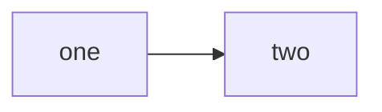
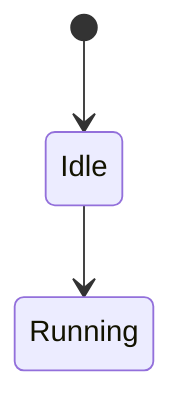
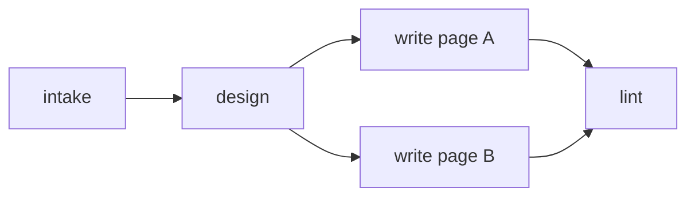
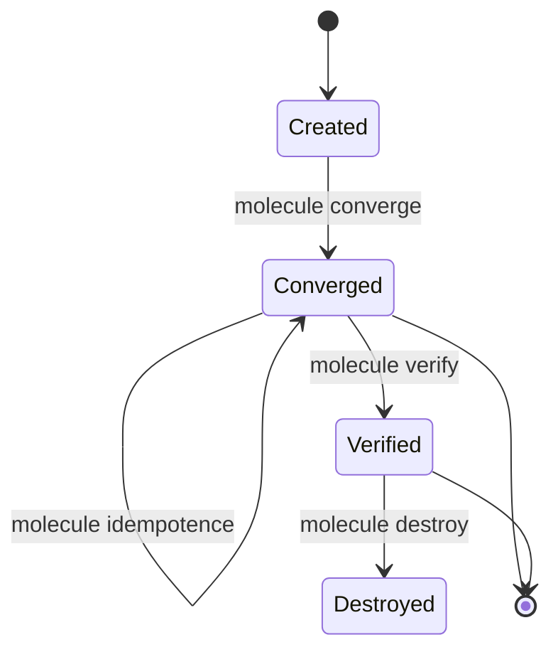
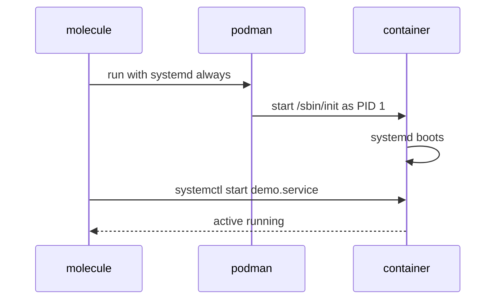

# VISUAL-SYSTEM.md — the graphics and diagram specification

> **Owner:** systems-architect (D1 slice). **Status:** DESIGN SPEC. The SVG files are a separate
> track (**B1** in the `PLAN.md` work graph); this document is the *contract B1 builds against* and
> the *rules the seven writing agents follow*.
> **Source of truth:** `.research/04-brand-assets.md` (105 KB) for every licence and trademark
> claim. **This file adds no licence claim of its own** — it routes to §16's SHIP DECISION TABLE
> and §17's ready-to-paste attribution lines, both of which are quoted verbatim in §7 below.
> **Related:** [`STRUCTURE.md`](STRUCTURE.md) · [`REFERENCE-CONFIG.md`](REFERENCE-CONFIG.md)

---

## 1. The three-line brief

1. **Two graphic systems, never mixed in one image:** *original house-style SVG* for everything we
   author, and *official marks* for the brands. No hybrids, no recoloured brands, no brand marks
   inside house-style icon sets.
2. **Mermaid for anything with edges** (flows, graphs, states, sequences). **Hand-authored SVG for
   anything that is an illustration, a cross-section, or a badge.**
3. **Zero build step.** No icon font, no sprite sheet, no bundler, no paid pack. Plain `.svg`
   files in `assets/icons/`, referenced with relative `` or Markdown image syntax.

---

## 2. The house icon style

### 2.1 The geometric system

**One rule: a 24-unit square grid, 2-unit stroke, no fills.** Every house icon is drawn on the
same grid with the same stroke weight so a row of them reads as a set.

| Property | Value | Why this value |
|---|---|---|
| `viewBox` | **`0 0 24 24`** on **every** icon, no exceptions | One grid. Mixed viewBoxes are the single biggest reason an icon set looks amateur. |
| Grid | 24 × 24 units; **all coordinates are integers** unless a line is exactly diagonal | Half-pixel coordinates render differently at different zoom levels and blur. |
| Padding | **2 units on every side** (drawable area 20 × 20) | Optical consistency. Glyphs must not touch the viewBox edge. |
| **Stroke width** | **`2`** (not 1.5, not 1.75) | At 24 px rendered, 1.5 disappears on low-DPI screens and 2.5 turns blobby. 2 is the only value that survives 16 px. |
| Stroke cap | `round` | Softer, friendlier, matches a beginner audience. |
| Stroke linejoin | `round` | Same. |
| Fill | **`none` everywhere** | Fills and strokes in one set is the classic amateur tell. Also keeps icons legible when inverted. |
| Colour | `currentColor` **only** | See §3. A hard-coded hex in a house icon is a bug. |
| Stroke dasharray | `none` | Dashed strokes read as "disabled" and are never what we mean. |
| Corners | 2-unit radius on any corner | |
| `shape-rendering` | **omit entirely** | The attribute is a hint, not a guarantee, and it differs across renderers. `geometricPrecision` and `crispEdges` both cause problems at some zooms. |

**The mandatory opening of every house icon file:**

```svg
<svg xmlns="http://www.w3.org/2000/svg" viewBox="0 0 24 24" width="24" height="24"
     fill="none" stroke="currentColor" stroke-width="2" stroke-linecap="round"
     stroke-linejoin="round" role="img" aria-label="…">
```

No `<title>` and no `<desc>` inside the SVG — **see §6.1**; the text alternative lives in the
Markdown, not in the file.

### 2.2 What "house style" means for the shapes

- **Geometric and literal.** A container is a rectangle. A process is a circle. Do not draw a
  mascot, a mascot's hat, or a smiley.
- **One idea per icon.** If it needs a second idea, it is two icons.
- **No text inside a house icon.** If a label is essential, it is a **platform badge** (§5.3) and
  it follows the badge rules, not the icon rules.
- **No brand colour.** House icons are `currentColor`. A house icon that is Podman blue breaks the
  system, because the reader will read the colour as a brand claim.
- **Symmetry where the subject is symmetric, asymmetry where it is not.** A container with a
  cgroup tree is asymmetric; a terminal window is symmetric.

### 2.3 The canonical list of house icons to author

B1 authors exactly these **20** files. No more, no fewer — a bounded list is what keeps a set
consistent.

| # | File | Draws | Used on |
|---|---|---|---|
| 1 | `icon-container.svg` | A rectangle with a smaller offset rectangle behind it | concepts, quickstart |
| 2 | `icon-image.svg` | A rectangle containing a circle (sun) and a triangle (mountain) | concepts, custom-images |
| 3 | `icon-layers.svg` | Three stacked parallelograms | multi-scenario |
| 4 | `icon-tag.svg` | A tag/label shape with one dot | versions, pinning |
| 5 | `icon-gear.svg` | A circle with eight short radial teeth | preflight, checks |
| 6 | `icon-check.svg` | A check mark | PASS, verify success |
| 7 | `icon-warning.svg` | A triangle with an exclamation bar and dot | WARN, folklore callouts |
| 8 | `icon-stop.svg` | An octagon with a bar | FAIL, prohibitions |
| 9 | `icon-terminal.svg` | A rectangle with a `>` and an underscore | every code-adjacent callout |
| 10 | `icon-puzzle.svg` | Two interlocking rounded squares | your-first-scenario |
| 11 | `icon-branch.svg` | A line that forks into two, with two dots | test_sequence, ci |
| 12 | `icon-clock.svg` | A circle with two hands | idempotence, timeouts |
| 13 | `icon-shield.svg` | A shield outline | security notes |
| 14 | `icon-book.svg` | An open book, two page rectangles | glossary, reference tier |
| 15 | `icon-link.svg` | Two interlocking chain links | cross-references |
| 16 | `icon-key.svg` | A circle with a shaft and two teeth | secrets, tokens |
| 17 | `icon-download.svg` | A down arrow into a tray | install pages |
| 18 | `icon-folder-tree.svg` | A folder with a smaller folder and two lines | project-layout |
| 19 | `icon-list-check.svg` | Three horizontal lines, the first with a tick | reference tier |
| 20 | `icon-house.svg` | A square with a triangular roof | "back to the start" |

**Explicitly rejected** (so a reviewer does not ask why they are missing): a Molecule mascot, an
Ansible "A", any gear-cluster variant, a "cloud" icon (we never discuss hosted services — the
Zero-Cost Doctrine forbids them), and any icon implying payment (no credit card, no coin, no
dollar sign; `$0` is set in text, not in an icon).

---

## 3. Colour tokens

### 3.1 The house palette

Colours live in **exactly one place**: the `assets/assets.css` custom-property block that B1
writes. No page hard-codes a hex value for a house graphic.

| Token | Light value | Dark value | Meaning | Never used for |
|---|---|---|---|---|
| `--fg` | `#1f2328` | `#e6edf3` | Primary stroke / body text | — |
| `--fg-muted` | `#59636e` | `#9198a1` | Secondary stroke, captions | Anything that must be read |
| `--accent` | `#0969da` | `#4493f8` | Links, active state, the one highlight per diagram | More than one thing per diagram |
| `--ok` | `#1a7f37` | `#3fb950` | PASS, verified, success | Decoration |
| `--warn` | `#9a6700` | `#d29922` | WARN, staleness, "works but" | Errors |
| `--danger` | `#cf222e` | `#f85149` | FAIL, folklore callouts, prohibitions | Anything decorative |
| `--surface` | `#ffffff` | `#0d1117` | Diagram background behind a badge | — |
| `--border` | `#d1d9e0` | `#30363d` | Hairlines, grid, badge edges | — |

**These eight values are GitHub's own light/dark primitives**, chosen deliberately: a house icon
using them inherits GitHub's theme for free, needs no `prefers-color-scheme` media query, and
cannot go out of step with the page it sits on. The corpus prohibits the **Apple** graphic in
*any* form; nothing here is Apple-derived.

### 3.2 Light/dark theme behaviour — the exact mechanism

**House icons:** `stroke="currentColor"` and nothing else. The colour is whatever the surrounding
text is. There is no media query, no theme switch, no second file. This is the whole mechanism
and it is why the icon set is 20 files instead of 40.

**Platform badges (§5.3):** each badge is a single SVG with:

```svg
<svg xmlns="http://www.w3.org/2000/svg" viewBox="0 0 120 32" width="120" height="32"
     role="img" aria-label="Fedora">
  <style>
    .bg { fill: #ffffff; stroke: #d1d9e0; }
    .fg { fill: #1f2328; }
    @media (prefers-color-scheme: dark) {
      .bg { fill: #0d1117; stroke: #30363d; }
      .fg { fill: #e6edf3; }
    }
  </style>
  <rect class="bg" x="0.5" y="0.5" width="119" height="31" rx="6"/>
  <text class="fg" x="12" y="21" font-family="…stack…" font-size="14">…label…</text>
</svg>
```

Two rules make this work on GitHub and fail everywhere else:
- **The `<style>` block carries literal hex values, not `var(--…)`.** An SVG loaded through
  `` is a **separate document** and does **not** inherit the parent page's custom
  properties. This is the single most common mistake in themed badge sets. Both the base rules
  and the `@media (prefers-color-scheme: dark)` block use literal hex — consistency beats
  cleverness.
- **`role="img"` and `aria-label` are on the `<svg>`,** and the full description is in the
  surrounding Markdown (§6.1).

### 3.3 Colour in Mermaid

**Mermaid diagrams are monochrome plus one accent.** Concretely:

- **No `classDef` in any shipped Mermaid diagram.** Mermaid's `classDef` sets hard-coded fills and
  GitHub's renderer does not re-theme them, so a `classDef ok fill:#1b5e20` becomes an unreadable
  dark-green block in dark mode. This is rule **M5**... (see **M2** in §4) and it is the rule most
  likely to be broken by a writer copying from `PLAN.md` — `PLAN.md`'s own diagrams use `classDef`
  because they are for internal review, not for the site.
- **No `themeVariables`, no `%%{init}%%` block** (rule M5). You cannot theme GitHub's renderer; a
  `%%{init}%%` block is dead weight that misleads the next editor and breaks in dark mode.
- **Nodes, edges and text use Mermaid's own theme.** It already follows the page's colour scheme.
  Fighting it produces the exact "unstyled blob" look we are avoiding.

**How a diagram gets emphasis without colour:** shape and label. A **rounded** node is a
suggestion, a **sharp** node is a command, a `{{ }}` hexagon is a decision, a `[( )]` cylinder is
data. Put the word `always` inside the node. Put the word `WRONG` in the node. Do not rely on a
green fill.

---

## 4. Mermaid rules for this repository

These are **hard rules**. V1 (`PLAN.md`) enforces M2–M4 mechanically; the rest are review items.

| # | Rule | Why |
|---|---|---|
| **M1** | **At most 7 nodes per diagram.** | A beginner cannot hold more, and GitHub renders a big Mermaid diagram as an unreadable scroll. If the story needs 8+, **split it into two diagrams** with a sentence joining them. |
| **M2** | **No `classDef`, no `class`, no `style`, no `:::name`.** | GitHub's Mermaid renderer does not re-theme hard-coded fills; they break in dark mode. **This is the most frequently broken rule** — see §3.3. |
| **M3** | **No `click` directives, no `href`, no raw HTML (`<br/>`, ``, `<b>`).** | Mermaid's default `securityLevel` is `strict`, which **disables `click` and raw HTML tags**. Anything relying on them silently fails. Link from the surrounding Markdown instead. |
| **M4** | **Only these diagram types:** `flowchart`, `stateDiagram-v2`, `sequenceDiagram`, `classDiagram`. | Everything else is either unmaintained, marked experimental (`architecture-beta`, `mindmap`), or has no benefit here. `pie` is allowed **only** for a literal proportion with at most 3 slices. |
| **M5** | **No `themeVariables`, no `%%{init}%%` block.** | Cannot be themed by the renderer; dead configuration. |
| **M6** | **No `subgraph` nested inside a `subgraph`.** | Renders unreliably at small widths. Two levels maximum. |
| **M7** | **Every node label is ≤ 30 characters**, plain text, no raw HTML. | Long labels force the diagram wider than the viewport. If a label genuinely cannot be short, it does not belong in a node — put it in the prose next to the diagram. |
| **M8** | **The first line inside the fence is the diagram type** — no `---` front-matter, no YAML config, no comments before it. | Anything before the type line is parsed as part of the diagram. |
| **M9** | **Every Mermaid block is immediately followed by a bold one-line caption and then the text alternative** (§6). | Accessibility. |
| **M10** | **Direction is `LR` for flows and `TD` for hierarchies/state.** Never `BT` or `RL`. | `RL` and `BT` produce scroll-direction surprises on narrow screens. |

**Fence convention — the only one used in this repo:**

````markdown

````

````markdown

````

No `title` statement (it renders inconsistently and duplicates the caption). No front matter. The
fence language is exactly `mermaid`.

### 4.1 Canonical examples

**`flowchart LR` for processes — the shipped form, no `classDef`:**



**`stateDiagram-v2` for `test_sequence` and container states:**



**`sequenceDiagram` for the PID 1 story:**



**Forbidden, for the record** — a writer copying any of these produces a broken or unreadable
diagram on GitHub: `classDef crit fill:#b71c1c,stroke:#ef9a9a,color:#fff`; `subgraph` inside
`subgraph`; `A -- click B "go" --> C`; `<br/>` inside a label; `%%{init: {'theme':'dark'}}%%`.

---

## 5. The canonical list of diagrams

**Thirteen diagrams. Each has exactly one thing to communicate.** If a diagram needs two things,
it is two diagrams.

### 5.1 Mermaid diagrams (10) — for anything with edges

| ID | Type | Page | The **one** thing it must communicate | Hard constraint |
|---|---|---|---|---|
| **D-01** | `flowchart LR` | `concepts/how-molecule-works.md` | The phases of a test in order, with `destroy` at both ends | ≤ 7 visible nodes → the eight steps are **grouped into five phases** (prepare / create / apply / check / destroy) and the full 12-entry sequence is in the prose and in `REFERENCE-CONFIG.md` §9.2 |
| **D-02** | `flowchart LR` | `quickstart.md` | What `molecule test` actually does: one command, one container created, converged, verified, destroyed | ≤ 7 nodes |
| **D-03** | `flowchart TD` | `quickstart.md` | Which three files the reader edits and which two they leave alone | 5 nodes (3 edited + 2 managed) |
| **D-05** | `flowchart LR` | `systemd-in-containers.md` | What `systemd: always` sets up inside the container: the four tmpfs mounts, the writable cgroup mount, `container_uuid`, the stop signal | ≤ 7 nodes |
| **D-06** | `sequenceDiagram` | `systemd-in-containers.md` | Why `podman logs` is empty: Podman starts init, init writes to the journal, nobody reads stdout | ≤ 4 participants |
| **D-07** | `stateDiagram-v2` | `troubleshooting.md` | The three ways a container can fail, and the message each one produces | 5 states |
| **D-08** | `flowchart LR` | `install/macos.md` | On macOS the engine lives in a Linux virtual machine; three hops from your terminal to a container | ≤ 7 nodes |
| **D-10** | `stateDiagram-v2` | `authoring/multi-scenario.md` | Two scenarios converging and verifying the same resource in opposite directions | ≤ 6 states |
| **D-11** | `flowchart TD` | `authoring/ci.md` | Push → workflow → three test steps → pass/fail, and which steps are conditional | ≤ 7 nodes |
| **D-13** | `flowchart LR` | `troubleshooting.md` | The decision path: run the pre-flight check → it names the fix | ≤ 7 nodes |

### 5.2 Hand-authored SVG illustrations (3) — for anything that is a picture

| ID | File | Page | The **one** thing it must communicate | Size | Notes |
|---|---|---|---|---|---|
| **D-04** | `assets/diagrams/pid1-anatomy.svg` | `systemd-in-containers.md` | **"The thing you see when you `podman exec` is not the thing that started the container."** A cross-section: host kernel on the left, the container boundary in the middle, `/sbin/init` (= PID 1) at the *top* of the container, and the reader's shell *below* it, with an arrow showing that commands arrive through the podman CLI, not by walking up the tree. | 720 × 420 | **The most important illustration in the site.** It has to make "PID 1" physical. Readable in a 400 px column: minimum 14 px effective type, no detail smaller than 12 px. If it does not survive being scaled to 50%, it is too detailed — **simplify, do not shrink.** |
| **D-09** | `assets/diagrams/macos-machine.svg` | `install/macos.md` | **"Your Mac has three layers, and Podman is not the one you type into."** macOS host at the bottom, the podman machine (Fedora CoreOS) in the middle, the container on top; an arrow labelled `podman` CLI crossing from the host into the machine. | 720 × 360 | **Must contain no Apple graphic of any kind.** The host layer is a plain rounded rectangle labelled `macOS`. Apple's policy prohibits *"the Apple Logo or any other Apple-owned graphic symbol, logo, or icon"*; a plain text label in our own drawing is a textual acknowledgement, which is the permitted form. |
| **D-14** | `assets/diagrams/systemd-mode-filesystem.svg` | `systemd-in-containers.md` | **"What `--systemd=always` mounts, and why systemd can write cgroups only because of it."** A container filesystem with `/run`, `/run/lock`, `/tmp` and `/var/lib/journal` shown as tmpfs, and `/sys/fs/cgroup` shown as read-write on cgroup v2. | 720 × 400 | Pairs with D-05. D-05 is the Mermaid *summary*; D-14 is the *picture*. Both on the same page, **D-05 first**. |

**Rejected:** a "container vs virtual machine" comparison illustration (it invites a false binary — a
container is not a cheaper VM, and the framing would teach a wrong mental model). **Rejected:** a
"the road to production" funnel (we test; we do not deploy). **Rejected:** any mascot.

### 5.3 Platform badges (4) — text, in a rounded frame

| File | Label | Type | Notes |
|---|---|---|---|
| `assets/badges/badge-fedora.svg` | `Fedora` | **text-only badge** | 🚩 The corpus marks the Fedora *word design* as **BLOCKED until the logo packet is approved** by `logo@redhat.com`. So the Fedora badge is **text only** with our own frame. The **Infinity logo must never be drawn.** Attribution per §7. Use `Fedora®` on the first instance on each page. |
| `assets/badges/badge-ubuntu.svg` | `Ubuntu` | **text-only badge** | 🚩 **Do NOT append ® or ™.** Canonical's IPR policy forbids trademark symbols on product documentation distributed outside the United States. |
| `assets/badges/badge-arch.svg` | `Arch Linux` | **text-only badge** | The Arch *logo* is a permitted official mark **with conditions** — ™ must remain visible, proportions retained, no composite lockup. **This site does not ship the Arch logo**; the badge is text-only. Simpler, and it removes an entire class of compliance failure. |
| `assets/badges/badge-mageia.svg` | `Mageia` | **text-only badge** | ❓ No licence or policy retrievable; absent from Simple Icons and Devicon. Text only. |

**Plus the marks that get no badge at all**, because a badge implies a graphic: **CNCF**,
**Ansible®**, **systemd**, **Mermaid**, **macOS**, and **Fedora** until the packet arrives. They
are set in the house style — `--fg`, 12–14 px — and carry the acknowledgement line from §7.2.

**No Apple badge, ever.** §7.2's macOS line is the entire treatment.

---

## 6. Accessibility — non-negotiable

### 6.1 The text-alternative rule

**Every diagram and every image is followed by a bold one-line caption and then a plain-language
description.** The description is *in the Markdown*, not inside the SVG. Reason: an SVG loaded
through `` has its `<title>` and `<desc>` inconsistently exposed to assistive technology,
and GitHub's Markdown renderer gives no control over it.

**The pattern, used everywhere:**

````markdown
```mermaid
flowchart LR
  …
```

**What this shows:** one sentence naming the *direction* of the story and the *thing* it ends at.

A text description of the diagram, in reading order, for anyone who cannot see it.
````

**Rules for the description:**

- It is **not** a repeat of the caption, and **not** a list of the Mermaid source. It is a
  paragraph a person could use instead of the picture.
- It is **in reading order**: left to right for `flowchart LR`, top to bottom for `TD`.
- It uses the same words as the surrounding prose, so a reader who jumps to the description is
  not lost.
- **Minimum 2 sentences.** A one-sentence description usually means the diagram has one idea, and
  a single idea does not need a diagram.

**For the three SVG illustrations specifically**, the description must additionally cover:

| Diagram | The description must say |
|---|---|
| D-04 | which layer is the host, which is the container, what PID 1 is, and how a command typed inside the container reaches the host |
| D-09 | that the containers run inside a Linux virtual machine, not natively on macOS, and that the `podman` command is a remote control |
| D-14 | which four paths are tmpfs, that `/sys/fs/cgroup` is writable **because** of `--systemd=always`, and what the consequence is if the flag is missing |

### 6.2 Contrast

Every house graphic must reach **4.5:1** contrast against both `#ffffff` and `#0d1117`. All eight
tokens in §3.1 were chosen to clear that bar in both themes; B1 verifies each icon by rendering it
on both backgrounds before shipping. A `WARN` triangle is never `--warn` fill on `--warn` text.

### 6.3 Never rely on colour alone

Every status in this project is a **word plus a shape**, never a colour alone — this applies to the
pre-flight script's `PASS`/`WARN`/`FAIL`, to the badges, and to any diagram that distinguishes
states. This is also the rule that makes the site work for readers with a colour vision
deficiency, and it is why §3.3 forbids Mermaid `classDef`.

### 6.4 Both themes must work

B1's definition of done, verified by rendering each SVG in both `prefers-color-scheme` values:

- [ ] Every house icon uses `currentColor` and has no hard-coded colour.
- [ ] Every badge and illustration has literal hex values in **both** the base rules and the
      `@media (prefers-color-scheme: dark)` block.
- [ ] Every diagram is legible on `#ffffff` **and** on `#0d1117` — **checked by looking**, not
      assumed.
- [ ] No diagram depends on a `classDef` fill for meaning (§3.3, M2).

---

## 7. Licence and attribution — the routing table

**This is `04-brand-assets.md` §16 (SHIP DECISION TABLE) and §17 (ready-to-paste lines), restated
so B1 and the writers cannot misread them. Nothing here is a new claim.**

### 7.1 The six graphics we ship

| Asset | Class | Licence | May we ship it? | Binding condition |
|---|---|---|---|---|
| `markdown-mark.svg` | official-brand | **CC0 1.0 Universal** | ✅ **YES, unconditionally** | None. Cleanest licence in the set. Attribution optional but included. |
| `podman-logo.svg` | official-brand | **Apache-2.0** | ✅ YES | Retain licence/NOTICE and state changes. **Must hyperlink to `https://podman.io`.** State it is a CNCF project. |
| `mark-github.svg` | official-brand (Octicons) | **MIT** (artwork) + GitHub trademark | ✅ YES, as a link to our repo | **Do not modify or recolour. Must be a link.** No implication of endorsement. |
| `archlinux-logo.svg` | official-brand | Trademark (editorial use permitted) | ⚠ YES, **with conditions** | **™ MUST remain visible.** Retain proportions. No composite lockup. Not in SEO `<title>`. Clear non-affiliation. **This site ships the text badge instead** (§5.3). |
| `molecule-logo.png` | official-brand | **CC BY-ND 4.0** | ✅ YES, **unmodified display only** | 🚩 **NoDerivatives: do NOT crop, recolour or alter. It is a PNG, not an SVG.** Attribution required. State that it is displayed unmodified. |
| `fedora-wordmark.svg` | official-brand (email-gated) | Trademark of Red Hat, Inc. | 🚩 **BLOCKED until the packet is approved by `logo@redhat.com` (1–2 weeks).** | 🚩 **Must request first.** One-colour **word design only** — **NO Infinity logo.** Hyperlink to `https://fedoraproject.org/`. Use `Fedora®` on first instance. Never modify. **Until then, ship the text-only badge.** |

### 7.2 The seven text-only marks — no graphic, ever

| Mark | Required acknowledgement line |
|---|---|
| **CNCF** | `CNCF® is a registered trademark of The Linux Foundation.` — the landscape logo is **not** a permitted decorative icon; expand to "Cloud Native Computing Foundation (CNCF)" on first reference |
| **Ansible** | `Ansible® is a registered trademark of Red Hat, Inc. in the United States and other countries.` — the 3,993-byte white PNG is **not** openly licensed, and "never alter a trademark" means it cannot be recoloured |
| **Ubuntu** | `Ubuntu and Canonical are registered trademarks of Canonical Ltd.` — 🚩 **do NOT append ® or ™** |
| **systemd** | ❓ **UNVERIFIED** — no licence, no policy, no brand page. The SVG exists but **no licence covers it**; the LGPL covers "all code" only. **Text only.** |
| **Mageia** | ❓ **UNVERIFIED** — no licence or policy retrievable; absent from Simple Icons and Devicon. **Text only.** |
| **Mermaid** | ❓ code MIT, graphic **UNVERIFIED**; all logo probes 404. **Text only.** |
| **macOS** | `macOS is a trademark of Apple Inc.` *(textual acknowledgement only)* — 🚩 **Apple's published policy: "You may not use the Apple Logo or any other Apple-owned graphic symbol, logo, or icon on or in connection with web sites, products, packaging, manuals…"** CC0/MIT from Simple Icons or Devicon **does not help**. |

### 7.3 The per-page footer

Any page displaying a shipped graphic or naming a text-only mark carries:

```text
This site is not affiliated with or endorsed by the Fedora Project,
the Arch Linux Project, Red Hat, Inc., Canonical Ltd., or The Linux Foundation.
All product names, logos, and brands are property of their respective owners.
Their use does not imply endorsement.
```

The full catalogue, with the source URL and licence for all thirteen entries, lives in
`assets/ATTRIBUTION.md`, which every such page links (rule R12 in `STRUCTURE.md`).

---

## 8. File layout and the zero-build contract

```text
assets/
  ATTRIBUTION.md              licence + source URL for all 13 marks
  assets.css                  the 8 colour tokens as custom properties (the ONLY place)
  icons/                      20 house-style SVGs, 24x24, stroke=currentColor
  badges/                     4 text-only platform badges, 120x32, dual-theme
  diagrams/                   3 hand-authored SVG illustrations, 720px wide
```

**Zero build step, concretely:**

- No sprite sheet, no icon font, no `<symbol>` + `<use>` sprite file. Every icon is a standalone
  `.svg` referenced by a relative
  ``.
- No SVG minifier in the pipeline. Hand-write them small and tidy.
- No `npm`, no bundler, no `package.json` in the assets tree. **If B1 finds itself wanting one, the
  design is wrong.**
- Every `alt` attribute is the short form of the text alternative from §6.1. The full paragraph
  description is in the Markdown under the image.
- Icons are **always** rendered at 16 px inline or 24 px standalone. Two sizes, no more.

---

## 9. Decisions a reviewer would otherwise question

| # | Decision | Rejected alternative | Why |
|---|---|---|---|
| 1 | **Mermaid for edges, SVG for pictures.** | All-SVG, or all-Mermaid. | Mermaid is *editable in the Markdown* — a maintainer fixes a diagram with a text editor and a typo in a label is visible in the source. An anatomy cross-section cannot be expressed in Mermaid without becoming unreadable. |
| 2 | **No `classDef` anywhere in shipped Mermaid.** | Copying `PLAN.md`'s coloured diagrams. | Those are for internal review in a terminal. On GitHub a hard-coded `fill:#1b5e20` is an unreadable dark block in dark mode. M2 is the rule most likely to be broken by a writer doing exactly that. |
| 3 | **One 24-unit grid, stroke 2, no fills.** | Per-icon optical sizing, mixed viewBoxes. | A mixed set never looks like a set. Stroke 2 at 24 px is the only weight that survives being rendered at 16 px. |
| 4 | **`currentColor`, so 20 icons rather than 40.** | A light and a dark variant per icon. | Two files per icon means they drift, and `currentColor` already resolves correctly against the surrounding text. |
| 5 | **Literal hex in the badge `<style>` block, not `var(--…)`.** | Theme tokens in the SVG. | An SVG loaded via `` is a separate document and does **not** inherit the parent page's custom properties; `var(--surface)` resolves to nothing. |
| 6 | **A bounded 20-icon list.** | Authoring icons as pages are written. | An open-ended list is why icon sets end up with six different stroke weights. B1 has a fixed deliverable. |
| 7 | **Text-only badges for Fedora, Ubuntu, Arch, Mageia.** | Shipping the Fedora and Arch logos. | Fedora's is **email-gated and blocked**; Arch's carries a ™-visibility obligation. Text badges remove two shipping blockers and a whole class of compliance risk, at the cost of a little visual richness. |
| 8 | **No Apple graphic, and D-09 draws a plain labelled rectangle.** | A stylised laptop or window chrome. | Apple's policy prohibits *"any other Apple-owned graphic symbol, logo, or icon"* on or in connection with web sites, in any size. A plain rounded rectangle with the word `macOS` on it is a textual acknowledgement — the permitted form. |
| 9 | **≤ 7 nodes per diagram, hard.** | Showing the full 12-entry `test_sequence` in one graph. | GitHub renders a wide Mermaid diagram as a horizontal scroll, which on a phone is unusable. The full sequence is a **table**; the graph shows the phases. |
| 10 | **Text alternatives in the Markdown, never `<title>`/`<desc>` inside the SVG.** | Accessible-by-attribute SVGs. | ``-loaded SVG internals are not reliably exposed to screen readers and GitHub's renderer gives no control. The alternative must live where a maintainer will actually see it. |
| 11 | **Three SVG illustrations, not more.** | Illustrating every concept. | Every extra illustration is another file to keep in both themes and a third thing to check for contrast. Three covers the two places a picture genuinely beats a graph (the PID 1 anatomy, the macOS machine) plus the filesystem picture that pairs with D-05. |
| 12 | **Mermaid is the only diagram engine.** | PlantUML, Graphviz, D2, Excalidraw. | PlantUML and Graphviz need a render step (breaks zero-build); the hosted ones need a network call at view time and are SaaS. D2 is fine but unfamiliar. Mermaid is the one GitHub renders natively. |
| 13 | **Mermaid's own theme colours, no `themeVariables`.** | Hand-tuned per-diagram colours. | You cannot theme GitHub's renderer. Attempting it produces dead configuration that misleads the next editor and breaks in dark mode. |
| 14 | **No build tooling in `assets/`, enforced as a rule.** | "Just a tiny npm script to minify." | Zero-Cost Doctrine Z2 and a real risk: the moment a toolchain exists, someone adds a step, the site stops rendering as plain Markdown, and the $0 guarantee quietly acquires a dependency. |

---

## 10. Handoff checklist for B1 (the graphics agent)

- [ ] `assets/assets.css` defines exactly the 8 tokens in §3.1 and nothing else.
- [ ] 20 house icons, each `viewBox="0 0 24 24"`, `fill="none"`, `stroke="currentColor"`,
      `stroke-width="2"`, round caps and joins, integer coordinates, 2-unit padding.
- [ ] 4 platform badges, 120 × 32, dual-theme with **literal hex** in both blocks, **text only**.
- [ ] 3 illustrations (D-04, D-09, D-14), 720 px wide, legible at 50% scale, **no Apple graphic in
      D-09**, **no Infinity logo anywhere**, minimum 12 px effective type.
- [ ] `assets/ATTRIBUTION.md` has one row per mark with source URL, licence, and the attribution
      string from §7 — 6 graphics + 7 text-only marks.
- [ ] Every SVG renders legibly on `#ffffff` **and** on `#0d1117` (actually checked, not assumed).
- [ ] Every graphic has ≥ 4.5:1 contrast in both themes.
- [ ] No build step, no `package.json`, no sprite, no icon font, no minifier.
- [ ] Every status is a **word plus a shape**, never colour alone.

## 11. Handoff checklist for the seven writing agents

- [ ] Every Mermaid block follows M1–M10. **Check M2 first** — it is the one that gets broken.
- [ ] No diagram exceeds 7 nodes.
- [ ] Every diagram has a bold one-line caption **and** a ≥ 2-sentence description, in reading
      order, in the Markdown (§6.1).
- [ ] Every image has an `alt` attribute; every `` has an explicit `width` **and** `height`
      (so the page does not jump while loading).
- [ ] Icons are used at 16 px inline or 24 px standalone. Nothing else.
- [ ] No Apple graphic, no Fedora Infinity logo, no recoloured brand mark, no Ubuntu ®/™.
- [ ] A page displaying any mark links to `assets/ATTRIBUTION.md` (rule R12).
- [ ] The Mermaid source in the page is the source that was intended to render — no leftover
      `classDef` from a copy-paste out of `PLAN.md`.
