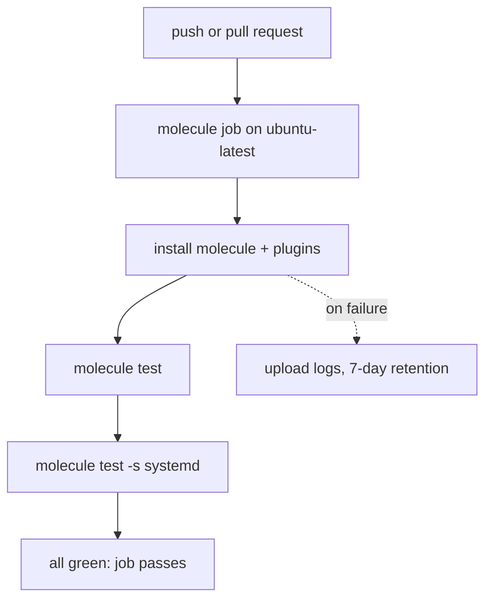

# Continuous Integration

> **You are here:** [Authoring](./index.md) → [Multi-scenario](./multi-scenario.md) → **CI** → [Usage reference](../usage.md)

**What you will be able to do:** run every scenario automatically on every push, at $0
forever, on GitHub Actions — with a hard time bound so the free tier cannot be exceeded.

---

## What CI is, in one paragraph

**CI** stands for **Continuous Integration**. It is a computer that runs your commands for
you when you push code. You push; somewhere else, a clean machine installs your tools and
runs `molecule test`. If a test fails, you find out before anyone else does — not in
production, and not in a pull request from a colleague.

One thing to be clear about: **Molecule is not a CI provider.** It watches nothing, schedules
nothing, and runs on no schedule. It is a lifecycle runner — it creates an environment, runs
your Ansible content against it, asserts the outcome, and tears it down. CI is the service
that *invokes* it.

---

## Why GitHub Actions, and what it costs

**The Zero-Cost Doctrine is a hard gate on this page.** A pipeline that can ever produce a
bill is not an acceptable pipeline, and no payment method should ever be on file for it.

GitHub Actions is recommended because:

- it is already where your code is;
- it is free for public repositories;
- its runners come with Podman preinstalled, so there is nothing to install and nothing to
  register;
- it needs no account, no card, and no separate service.

**On the quota, honestly:** the research corpus behind this site contains **nothing** about
GitHub Actions, its pricing, or its allowances. This page therefore states **no minutes
figure and no quota number**, because an invented number is worse than no number — a reader
would plan against it. What is stated is only what the design requires: use a free tier, and
do not exceed it.

> **Check the current limits in the GitHub Actions documentation:**
> <https://docs.github.com/en/billing/managing-billing-for-your-products/managing-billing-for-github-actions/about-billing-for-github-actions>
> and <https://github.com/pricing>

### The five rules that keep it at $0

| Rule | Why |
|---|---|
| **GitHub-hosted Linux runner only** (`runs-on: ubuntu-latest`). | The free tier is built around Linux runners. Do **not** use `macos-*` or `windows-*`: they draw on a separate, much smaller pool, and podman on macOS needs a virtual machine anyway. |
| **No self-hosted runners.** | A self-hosted runner is a machine you pay for. Forbidden. |
| **No paid marketplace actions.** | Only the first-party `actions/*`. |
| **A hard `timeout-minutes` bound.** | A hung test must not be able to burn the quota. This is the single most important line in the file. |
| **`concurrency` with `cancel-in-progress: true`.** | Push five times in a minute and GitHub will happily start five runs against the same ref, all drawing on the same free quota, and you only care about the last one. Cancelling in-progress runs spends one run's minutes instead of five, which is a free-tier limit as much as a speed one. |

Plus the ordinary discipline: trigger on `push` and `pull_request` rather than on every
possible event, keep artifact retention short, and cache the dependency layer so each run
installs less.

---

## The workflow file

Save this as `.github/workflows/molecule.yml` in your project. It is the canonical file and it is
complete — but **adjust it before your first run**: it assumes you have scenarios named `default`
**and** `systemd`, and it will fail on a project that has only `molecule/default/`. The three
places to change are listed under the file.

```yaml
---
# .github/workflows/molecule.yml
# Continuous Integration: a machine that runs your tests every time you push code.
# $0 forever: GitHub-hosted Linux runners are free for public repositories.
name: molecule

on:
  push:
    branches: ["main"]
  pull_request:
  workflow_dispatch:

# One run per workflow per ref. A new push to a branch cancels the run already in flight for
# that branch, so a rapid series of pushes costs ONE run instead of N queued runs. This is a
# free-tier rule as much as a speed one: superseded runs would otherwise each burn runner
# minutes to produce an answer nobody reads.
concurrency:
  group: ${{ github.workflow }}-${{ github.ref }}
  cancel-in-progress: true

# Hard bound so the free tier can never be exceeded.
timeout-minutes: 10

jobs:
  molecule:
    # A GitHub-hosted Linux runner. Podman is preinstalled.
    # Do NOT use macos-* or windows-* runners: they burn the quota far faster
    # and podman needs a VM on macOS anyway.
    runs-on: ubuntu-latest

    # Least privilege. The default token can do far more than this job needs; without this
    # line every `GITHUB_TOKEN` in the run is broadly scoped, so a compromised action or a
    # malicious test could push to your repository. This job only reads the code it checks out.
    permissions:
      contents: read

    steps:
      - name: Check out the repository
        uses: actions/checkout@v4

      - name: Install Molecule and the Podman driver
        run: |
          set -euo pipefail
          python3 -m pip install --user pipx
          export PATH="$HOME/.local/bin:$PATH"
          pipx install molecule ansible-core molecule-plugins
          molecule --version
          molecule drivers

      - name: Run the default scenario
        run: molecule test

      - name: Run the systemd scenario
        run: molecule test --scenario-name systemd

      - name: Upload the scenario logs on failure
        if: failure()
        run: |
          mkdir -p molecule-artifacts
          for s in default systemd; do
            cp -v "molecule/$s/molecule.log" "molecule-artifacts/$s.log" 2>/dev/null || true
          done
          ls -la molecule-artifacts
        shell: bash

      - uses: actions/upload-artifact@v4
        if: failure()
        with:
          name: molecule-logs
          path: molecule-artifacts/
          retention-days: 7
```

> **You should see:** one workflow run named **molecule** on your commit, a green check, and these
> steps in order: *Check out the repository* → *Install Molecule and the Podman driver* →
> *Run the default scenario* → *Run the systemd scenario*. The install step's log ends with a
> `podman` line from `molecule drivers` — that line is the proof the driver is present. The two
> upload steps are **absent** from a green run, because they are `if: failure()`.
>
> **If you see `Error: Scenario 'systemd' not found` on a project that only has
> `molecule/default/`:** that is the file working exactly as written, not a Molecule fault. Delete
> the *Run the systemd scenario* step and the `systemd` entry in the upload loop — the three
> places to adjust are listed under *What each piece is doing* below.

### What each piece is doing

| Piece | Reason |
|---|---|
| `branches: ["main"]` | Only test the integration branch on push. Every other branch is covered by the `pull_request` trigger, so nothing goes untested. |
| `workflow_dispatch` | A button on the Actions page to re-run by hand. Free, and invaluable when you are debugging the pipeline itself. |
| `concurrency` + `cancel-in-progress: true` | One run per workflow per ref; a newer push supersedes the run already in flight. Keeps superseded runs from each spending quota on an answer nobody reads. |
| `permissions: contents: read` | Least privilege. The default `GITHUB_TOKEN` is broadly scoped; this job only checks code out and runs tests, so it says so. Without it, any code your tests run — including anything pulled into a container — inherits a token that can write to your repository. |
| `timeout-minutes: 10` | A hard bound, so a hung test cannot exhaust the free quota. |
| `runs-on: ubuntu-latest` | Free tier. macOS and Windows runners are quota-expensive, and podman on macOS needs a virtual machine. |
| `python3 -m pip install --user pipx` then `export PATH` | Ubuntu ships `pipx` in `apt`, but this works on every runner image. `pipx` *is* pip inside a per-application virtual environment, which satisfies Molecule's own stated requirements without touching the runner's system Python. |
| `pipx inject molecule molecule-plugins` | The Podman driver is a **separate package**. `pipx install molecule` alone gives you a Molecule with no driver, and the failure looks like a Molecule bug. |
| `molecule drivers` before the test | **Fails fast with a readable message** if the driver never installed, instead of an opaque error inside `molecule test`. This is the single most useful line in the file. |
| One step per scenario | Separate log lines in the CI interface make triage trivial. You see which scenario broke without scrolling. |
| `if: failure()` on the upload steps | Uploads cost nothing and only run when something broke. |
| `retention-days: 7` | Artifacts are not free forever. Seven days is plenty for reading a log. |

**You should see,** on your first successful run, a green check beside the commit, and three
completed steps in the order: *Check out the repository* → *Install Molecule and the Podman
driver* → *Run the default scenario*. The install step's log shows a `podman` line from
`molecule drivers` — that line is the proof the driver is present.

**Adjust the scenario names.** The two `molecule test` steps assume scenarios called `default`
and `systemd`, and the `for s in default systemd` loop matches them. If yours are named
differently, change all three places.

### What runs, and what only runs on failure



**Reading the diagram:** the three solid steps always run, in order — install, first
scenario, second scenario — and a fully green run is the job passing. The dotted step is
conditional: the log upload fires **only** when something failed, because an upload that runs
on success would cost storage for nothing. `timeout-minutes: 10` sits around the whole job,
not around a step, so a hang anywhere is bounded.

---

## CI hygiene

### Pin your actions

`uses: actions/checkout@v4` — a **version** tag. Never `uses: actions/checkout@main`. A
branch or tag named after a moving branch means your pipeline can change behaviour without
any commit on your side, and a compromised upstream is your problem too. A full commit SHA
is stricter still and is the right choice for a pipeline you care about.

The same applies to your own dependencies: pin the container image in `molecule.yml` to a
named tag or a digest, not `:latest`. See [Custom images](./custom-images.md).

### Pin your Python dependencies

`pipx install molecule` resolves to **whatever is newest on PyPI that day**. Two runs of the same
commit two weeks apart install different code, and when a release breaks your pipeline you cannot
tell from the log which version you were on. Pin the toolchain exactly.

The lightest option is to pin in the install line itself — no extra file, still exact:

```yaml
      - name: Install Molecule and the Podman driver
        run: |
          set -euo pipefail
          python3 -m pip install --user pipx
          export PATH="$HOME/.local/bin:$PATH"
          pipx install molecule==26.9.0 ansible-core==2.20.6
          pipx inject molecule molecule-plugins
          molecule --version
          molecule drivers
```

Note the `ansible-core==` pin: `pipx install molecule` alone gives you a Molecule whose
`--version` dies with `FileNotFoundError: 'ansible-config'`, because Molecule shells out to
`ansible-config` at start-up and does not declare `ansible-core` as a hard dependency. Naming it
in the same command is the fix — and pinning it is the same edit.

The more maintainable option is a lock file the workflow actually reads, so there is one list to
update rather than a line buried in YAML:

```bash
# requirements-ci.txt, committed at the root of your project
molecule==26.9.0
ansible-core==2.20.6
molecule-plugins==26.9.28
```

```yaml
      - name: Install the pinned toolchain
        run: |
          set -euo pipefail
          python3 -m pip install --user pipx
          export PATH="$HOME/.local/bin:$PATH"
          pipx install -r requirements-ci.txt
          molecule --version
          molecule drivers
```

> **UNVERIFIED:** the exact versions above are the ones this site was built and tested against on
> the host recorded in [`../REFERENCE-CONFIG.md`](../REFERENCE-CONFIG.md). They are shown as
> *shape*, not as a recommendation — pin to whatever versions you have actually verified, and
> check them against the release notes when you bump. Also UNVERIFIED: whether
> `molecule-plugins==26.9.28` is the current release. `pipx install -r` reads a plain
> requirements file, so any pinning syntax pip understands works there.

### Cache the pipx layer

Every run currently reinstalls Molecule from PyPI. GitHub Actions offers a cache keyed on a
lock file:

> **Not part of the canonical workflow.** The block below is the one piece of this page that
> is *not* copied from [`../REFERENCE-CONFIG.md`](../REFERENCE-CONFIG.md) §8. It is a standard
> `actions/cache` usage, offered as a recommendation — confirm the syntax against the
> `actions/cache` documentation before relying on it.
>
> **The key must hash a file the install step actually reads.** A key like
> `${{ hashFiles('**/requirements.txt') }}` paired with a `pipx install molecule` step that reads
> *no* file is a bug that looks like it works: the hash is constant, so the cache never
> invalidates and you keep installing the *old* Molecule from a stale cache even after you
> upgrade. Either hash the lock file your install step reads, or drop the hash. The two must agree.

```yaml
      # Install step first, and it must read requirements-ci.txt (see the pin section above).
      - name: Install the pinned toolchain
        run: |
          set -euo pipefail
          python3 -m pip install --user pipx
          export PATH="$HOME/.local/bin:$PATH"
          pipx install -r requirements-ci.txt

      # Keyed on the SAME file the install step just read, so a version bump is a cache miss.
      - name: Cache the Python toolchain
        uses: actions/cache@v4
        with:
          path: ~/.local/pipx
          key: pipx-${{ runner.os }}-${{ hashFiles('requirements-ci.txt') }}
```

Because the key hashes the file the install step reads, bumping a version in
`requirements-ci.txt` invalidates the cache, and a commit that changes nothing else keeps it.
This cuts install time — it does not add cost, and the cache is free at these volumes.

### Run the pre-flight check first

`molecule drivers` is the cheapest possible gate, and it is already in the canonical
workflow. If you want the fuller check — Podman present, cgroup v2, SELinux state, Python —
the pre-flight script does it all in about ten seconds and is read-only:

> **Not part of the canonical workflow — an opt-in addition.** The block below is offered as a
> recommendation and is deliberately *not* in the canonical YAML above, so the workflow you copy
> stays exactly the file from [`../REFERENCE-CONFIG.md`](../REFERENCE-CONFIG.md) §8. Add it as
> the first step yourself if you want the fuller diagnosis. The script is read-only and never
> uses `sudo`; the command is safe to run anywhere.

```bash
bash docs/scripts/molecule-preflight.sh
```

It ends with `RESULT: READY` or names the specific thing that is wrong. Put it as the first
step, before the install, so a runner that is missing something says so in one line instead
of failing three steps later inside an Ansible log. The script and its real output are in
[`../REFERENCE-CONFIG.md`](../REFERENCE-CONFIG.md) §6; how to read a `FAIL` line is §6.5.

### Fail fast, with output that helps

Three habits, all present in the canonical workflow:

1. **`set -euo pipefail`** at the top of a `run:` block. Without it, a failing command in the
   middle of a multi-line script does not stop the script.
2. **A read-only command that proves the toolchain works before you use it.** `molecule
   --version` and `molecule drivers` cost nothing and turn an opaque downstream error into
   an obvious upstream one.
3. **One step per scenario, and one failure handler.** A failure tells you which environment
   broke, and the logs are already attached to the run.

### Rootless in CI — what differs from your laptop

Almost nothing, and that is the point of the driver.

| | Your laptop | GitHub Actions |
|---|---|---|
| `sudo` prompts | Possible, if you install things | None — the runner user already has what it needs |
| `/etc/subuid` and `/etc/subgid` | You configure them for rootless Podman | Already correct on the runner image |
| SELinux | Often enforcing | Usually absent or permissive |
| Rootless | Yes, by design | Yes, by default — `podman` on a runner is rootless |

**The one thing that usually breaks** is not the container runtime. It is a test that depends
on state only your machine has: a file outside the project directory, a locally installed
collection, a hostname, a port already in use, a `~/.ssh` key. A CI failure on the first run
is almost always a test that reached outside its own container. If that happens, the fix
belongs in the test, and [Writing tests](./writing-tests.md) §`converge.yml` should be boring
is where to fix it.

---

## Read the log when CI fails

Three commands, in this order, on your own machine:

```bash
molecule --debug test                       # 1. the full log, as CI saw it
molecule test -v                            # 2. more detail if you need it
molecule login                              # 3. a shell inside the container
```

The workflow already uploads each scenario's `molecule.log` on failure, so step 1 is often
just downloading the artifact named `molecule-logs` from the run page.

If the failure only happens in CI, the difference is almost always the environment, not the
code. Ask in this order: does it depend on a file outside the repo? on a collection you have
installed locally but did not put in `requirements.yml`? on a port? on a hostname?

---

## What not to do

Each of these breaks the Zero-Cost Doctrine or the pipeline.

| Do not | Why |
|---|---|
| **Do not use Docker.** No `docker build`, no `docker login`, no `docker-compose`. | This site's whole stack is Podman. A Docker step in a Molecule pipeline is a second runtime to install, secure, and reason about — for nothing. |
| **Do not use self-hosted runners.** | They cost money. |
| **Do not use paid marketplace actions.** | Only the first-party `actions/*`. |
| **Do not put secrets in a workflow file.** | See below. |
| **Do not use `@main` or `@master` for an action.** | Pin a version, or a commit SHA. |
| **Do not remove `timeout-minutes`.** | Without it, one hung test can burn the free allowance. |
| **Do not push to a container registry from the pipeline.** | Registries have storage, bandwidth and privacy costs. Keep the image local to the job — nothing downstream needs it. |

### No secrets in a workflow file

**Never put a credential, token, or password in a `.github/workflows/*.yml` file, and never
commit one to the repository.** Workflow files are source code: they are read, diffed,
cached, and shown to anyone who can see the repository.

This site documents a systemd scenario that pulls a public image and runs entirely inside a
throwaway container, so it needs **no secrets at all**. That is not an accident — it is the
design. If your test genuinely needs a credential:

- keep it in the platform's secret store, and reference it by name;
- use variable substitution, never a hard-coded value. The rule Molecule's own documentation
  gives is direct: *"Hard-coded credentials in `molecule.yml` should be avoided, instead use
  variable substitution."* The same rule applies one level up, in the workflow file;
- if you must pass a secret to a test, make the test read it from the environment and never
  echo it. `no_log: true` on a task suppresses its output.

If you think you need a paid secret store to solve this: stop. The $0 answer is almost always
"do not put the secret in the pipeline at all".

**When something in CI fails in a way you cannot explain,** go to
**[Troubleshooting](../troubleshooting.md)** before you start changing the workflow. Most CI
failures are the ordinary ones — a missing driver, an image without Python, a systemd
container that never became PID 1 — and they are all documented there.

---

## Next

- **[Usage reference](../usage.md)** — the day-to-day commands, for when you are back at a
  terminal.
- **[Troubleshooting](../troubleshooting.md)** — the failures, ordered by how often each
  one actually happens.
- **[Multi-scenario](./multi-scenario.md)** — what you just automated, and when to add
  another scenario.
- **[FAQ](../faq.md)** · **[Glossary](../glossary.md)**

---

## Attribution

No brand marks or logos are displayed on this page. Brand and licence records live in
[`../../assets/ATTRIBUTION.md`](../../assets/ATTRIBUTION.md); product names identify the
software being discussed and imply no endorsement.

---

## Sources

- <https://docs.github.com/en/actions> — GitHub Actions documentation
- <https://docs.github.com/en/billing/managing-billing-for-your-products/managing-billing-for-github-actions/about-billing-for-github-actions> — **the current quota and cost model; the authoritative figure, and the one this site deliberately does not copy**
- <https://github.com/pricing> — GitHub's pricing page
- <https://github.com/actions/checkout> — `actions/checkout`, version-tagged releases
- <https://github.com/actions/upload-artifact> — `actions/upload-artifact`, and `retention-days`
- <https://github.com/actions/cache> — `actions/cache`, for the pipx layer
- <https://docs.ansible.com/projects/molecule/installation/> — *"pip is the only supported installation method."* and the recommendation to install in a virtual environment
- <https://pypi.org/project/molecule-plugins/> — the separate package that supplies the `podman` driver, and why `pipx inject` is required
- <https://github.com/ansible/molecule/blob/main/docs/usage.md> — `molecule --debug`, `molecule login`
- <https://docs.ansible.com/projects/molecule/usage/> — `molecule test --scenario-name`, and the `-s` short form
- **Scope note:** the research corpus for this site contains no GitHub Actions data. The workflow file is copied verbatim from [`../REFERENCE-CONFIG.md`](../REFERENCE-CONFIG.md) §8, which specifies the structure and explicitly forbids stating a minutes figure. The cache step is the one block on this page **not** from the canonical file — it is a standard `actions/cache` usage, added as a recommendation, and should be verified against the `actions/cache` documentation before you rely on it.
