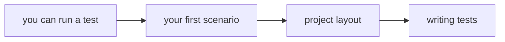
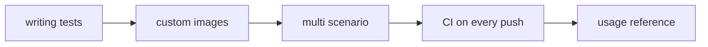

# Build your own workflows

> **You are here:** [Docs home](../index.md) → [Quickstart](../quickstart.md) → [systemd in containers](../systemd-in-containers.md) → **Authoring** → [Your first scenario](./your-first-scenario.md)

**What you will be able to do:** write a Molecule scenario of your own — one that tests the
Ansible content you actually maintain — and know which of the seven pages below you need next.

---

## You can now run a test. Now you build one.

The [Quickstart](../quickstart.md) let you run someone else's scenario. That proves the
toolchain works on your machine. It does not prove anything about *your* work.

This section is about the second thing: **a test harness for the Ansible content you
maintain.** A Molecule project is not a demo. It is a small, disposable laboratory that you
build, run, throw away, and rebuild — every time you change a role, a playbook, or a
collection.

**The one idea to carry through all seven pages:** a Molecule project is a *test harness for
your Ansible content*. It answers one question — "if I change this, does the machine still
end up in the state I promised?" — by building a real container, applying your content to
it, and then asserting on what is actually observable.

### A scenario is one independent test environment

A **scenario** is one test environment. It gets:

- its own folder, `molecule/<name>/`;
- its own `molecule.yml`, so it can name a different container image;
- its own container, created fresh and destroyed afterwards;
- its own pass-or-fail result.

Scenarios are **independent**. Running scenario `reverse` does not run scenario `default`.
That independence is the point: when a test fails, you know exactly which environment failed
and nothing else was involved. The cost is time — every scenario pays the full
container-create cost. That trade-off is measured on
[Several scenarios](./multi-scenario.md).

---

## The map

Read top to bottom on your first pass. The arrows are the order the pages are meant to be
read in, not just the links between them. Eight steps do not fit one diagram under **M1**,
so the map is split in two; `D` is the shared node that joins them.

**Reading the first half:** you can run a test → your first scenario → project layout →
writing tests.

**Reading the second half:** writing tests → custom images → multi scenario → CI on every
push → the usage reference. The page-by-page table below is the authoritative version of this
map; the two diagrams above are only its shape.

| # | Page | What you will be able to do |
|---|---|---|
| 1 | **[Your first scenario](./your-first-scenario.md)** | Build a working scenario in an empty folder, and adapt it toward a systemd container. |
| 2 | **[Project layout](./project-layout.md)** | Put every file where Molecule looks for it, and understand how one project fans out into many scenarios. |
| 3 | **[Writing tests](./writing-tests.md)** | Write a `converge` that is boring and a `verify` that is worth trusting — including idempotence. |
| 4 | **[Custom images](./custom-images.md)** | Build your own systemd container image, and understand the one setting that silently skips the build. |
| 5 | **[Multi-scenario](./multi-scenario.md)** | Test more than one thing, in more than one environment, and choose when the cost is worth it. |
| 6 | **[CI](./ci.md)** | Run every scenario automatically on every push, for $0 forever, on GitHub Actions. |

`CI` stands for **Continuous Integration**: a computer that runs your commands for you when
you push code. It is page 6, and it is deliberately last — do not automate a test you have
not watched pass by hand.

---

## The three recipes you will build here

All three use the same machinery. Only the thing being tested changes.

### Recipe 1 — test a role

**You will be able to:** prove that one role, applied twice, leaves the machine in the state
you documented.

A **role** is the reusable, self-contained bundle of Ansible tasks you publish. It is the
most common thing to test, and the easiest place to start. The shape is one folder
`tasks/main.yml`, plus a `molecule/` directory that Molecule owns.

Start here: **[Your first scenario](./your-first-scenario.md)**. It builds exactly this, from
an empty folder, in about ten commands.

### Recipe 2 — test a playbook

**You will be able to:** prove that a whole playbook — every role, every `vars` file, every
ordering decision — reaches the intended end state.

A **playbook** is the YAML file that lists plays and the hosts they run against. Testing a
playbook instead of a role means your `converge.yml` runs the playbook rather than calling
`ansible.builtin.include_role`. The test *quality* advice is identical, so read
[Writing tests](./writing-tests.md) either way; the difference is one task in `converge.yml`.

### Recipe 3 — test a collection

**You will be able to:** prove that every role inside a collection works, and that the
`meta/runtime.yml` wiring between them is real.

A **collection** is the packaging format that groups many roles, modules, and plugins under
one name and version. The `F` in `FQCN` — **Fully Qualified Collection Name**, the dotted
name like `containers.podman.podman` — only exists because collections exist. Testing a
collection means one scenario per role, plus a scenario that installs the collection from
your `requirements.yml` the way a user would. That shape is
[Several scenarios](./multi-scenario.md).

> A **driver** is the part of Molecule that owns a container engine. You never write one.
> `molecule-plugins` supplies the `podman` driver. See
> [Project layout](./project-layout.md) for why `driver.py` is never in your tree.

---

## The rules of a good scenario

These five rules are what separates a test that catches bugs from a test that passes.

| Rule | Why it matters | Taught on |
|---|---|---|
| **The converge is idempotent.** Running it twice changes nothing the second time. | If converge always reports changes, it tells you nothing — and it hides real bugs inside a wall of noise. | [Writing tests](./writing-tests.md) |
| **Assert behaviour, not implementation.** "The service is running" beats "this exact line is in this file". | Implementation assertions break every time you refactor correctly, so you learn to ignore them. | [Writing tests](./writing-tests.md) |
| **Converge fast.** The test should be quick enough that you run it before every commit. | A slow test is a test you skip. | [Custom images](./custom-images.md) |
| **Be deterministic.** Same input, same result, every run. | A test that passes on Tuesday and fails on Wednesday is worse than no test — you learn to re-run. | [Writing tests](./writing-tests.md) |
| **Leave no state behind.** The `destroy` step at both ends of `test_sequence` must give you back a clean machine. | Leftover containers and volumes make the *next* failure impossible to read. | [Project layout](./project-layout.md) |

---

## What Molecule does **not** do

Read this before you reach for the wrong tool. Molecule is narrower than its reputation.

| Molecule is **not** a… | Because… | Use instead |
|---|---|---|
| **Linter.** It will not tell you your YAML is badly written. | Linting is a separate tool with its own rules. `molecule lint` **was removed**. | `ansible-lint`, run standalone. See [What the internet still gets wrong](./your-first-scenario.md#three-commands-that-no-longer-exist). |
| **Unit-test framework for your Python code.** It cannot assert that a Python function returns 42. | Molecule drives Ansible playbooks against real containers. It never imports your Python. | `pytest` or the standard library's `unittest`. |
| **CI provider.** It does not watch your repository or run anything on a schedule. | CI is a separate service that *invokes* Molecule. | [GitHub Actions](./ci.md), or anything else that can run one command. |
| **Production deployer.** Nothing it does should ever touch a real machine. | Scenarios are meant to be thrown away. A scenario that reaches outside its own container is a bug. | Your deployment tooling. |
| **A way to test your base operating system image.** | Molecule tests *your content* against an image, not the image itself. | The image's own test suite. |

What Molecule *is*: a lifecycle runner. It creates an environment, runs your Ansible
content against it, asserts the outcome, and tears it down — repeatedly and automatically.
That is a narrower job than people assume, and it is a genuinely useful one.

> **What the internet still gets wrong.** Many tutorials for Molecule tell you to run
> `molecule add`, `molecule remove`, and `molecule lint`. **All three commands have been
> removed.** You will find that claim, with a correction, on
> [Your first scenario](./your-first-scenario.md#three-commands-that-no-longer-exist).

---

## What to read when you are stuck

- **[Troubleshooting](../troubleshooting.md)** — ordered by how often each failure actually
  bites, with the exact error text you can search for.
- **[FAQ](../faq.md)** — the questions that do not belong in a tutorial.
- **[Glossary](../glossary.md)** — every acronym on this site, expanded once.

---

## Next

- **[Your first scenario](./your-first-scenario.md)** — build one from an empty folder.
  Start here if you have never written a `molecule.yml`.
- **[Multi-scenario example tree](../../examples/multi-scenario/)** — a runnable project to
  read when you want the whole shape at once instead of one file at a time.

---

## Attribution

No brand marks or logos are displayed on this page. Brand and licence records live in
[`../../assets/ATTRIBUTION.md`](../../assets/ATTRIBUTION.md); product names identify the
software being discussed and imply no endorsement.

---

## Sources

- <https://docs.ansible.com/projects/molecule/> — Molecule documentation home
- <https://docs.ansible.com/projects/molecule/getting-started-roles/> — the role walkthrough that defines a scenario and its lifecycle
- <https://github.com/ansible/molecule/blob/main/docs/usage.md> — the command surface, including `molecule login` and `--debug`
- <https://github.com/ansible/molecule/tree/main/src/molecule/data/templates/scenario> — the five scaffold templates
- <https://github.com/ansible/molecule/blob/main/src/molecule/command/init/init.py> — `molecule init` registers exactly one subcommand
- <https://github.com/ansible/molecule/blob/main/docs/getting-started-roles.md> — *"The `molecule/` directory and its scenario files are added for testing. They are not part of the role itself."*
- <https://github.com/ansible-community/molecule-plugins> — the package that supplies the `podman` driver
- Internal, reproducible: the file layouts named on this page are quoted from
  [`../REFERENCE-CONFIG.md`](../REFERENCE-CONFIG.md) §2c and from `.research/01-molecule-podman-driver.md` §3.2–§3.4 — the single source of truth; no page in this project re-types a config file.
