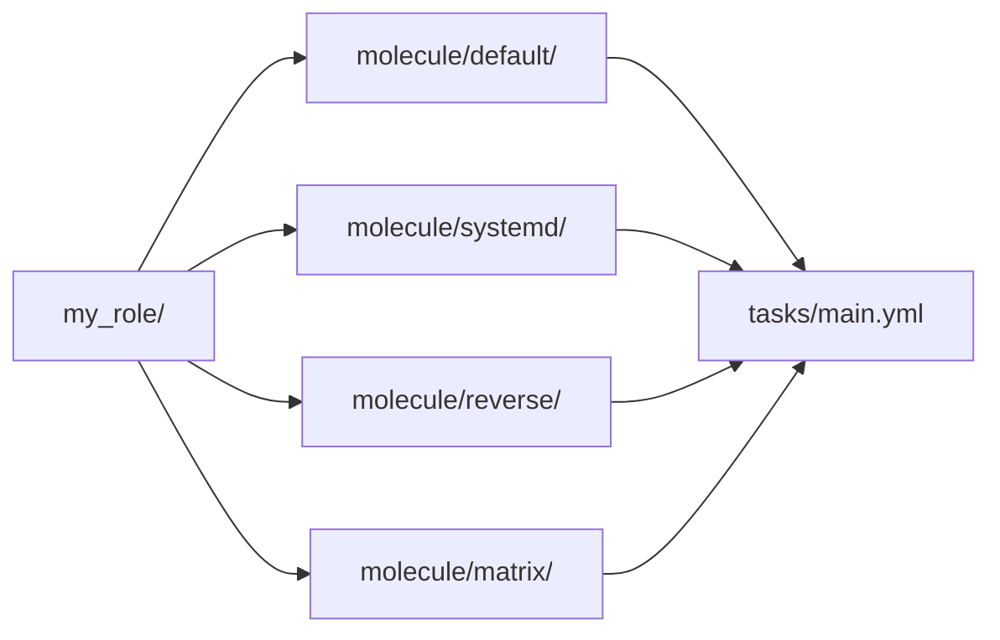

# Multi-scenario

> **You are here:** [Authoring](./index.md) → [Custom images](./custom-images.md) → **Multi-scenario** → [CI](./ci.md)

**What you will be able to do:** decide when splitting your tests into several scenarios is
worth what it costs, run one scenario or all of them, and avoid the one configuration trap
that silently disables the setting this whole site is about.

---

## What a scenario costs

A scenario is an independent test environment. It gets its own container, created from
scratch and destroyed afterwards. **That creation cost is the price of every scenario.**

This is the entire trade-off:

| | One scenario | Several scenarios |
|---|---|---|
| `molecule test` wall time | roughly 1 × container-create | roughly N × container-create |
| Blast radius of a failure | you know which environment failed | same — they are independent |
| Coverage | one environment | one environment *per question you ask* |

Because scenarios are independent, the second scenario failing tells you nothing about the
first. That isolation is what you are paying for. If your two tests are the same test with
different assertions, do not split them — you will pay twice and learn nothing extra.

---

## When to split, and when not to

Split into a **new scenario** when:

- the test needs a **different container image** — a different distribution, a different
  systemd version, a different package set. This is the strongest reason, because a different
  image is the one thing a scenario cannot share.
- the test needs a **different `test_sequence`** — for example a `reverse` scenario that runs
  `converge` → `idempotence` → `verify` against state a previous scenario left behind.
- the two tests would otherwise **fight over the same resource**. If test A must stop a
  service and test B must assert it is running, they cannot share a container.
- you are testing a **collection**, and each role deserves its own pass or fail.

Do **not** split when:

- the only difference is a different `assert` list. That is one `verify.yml` with two
  `ansible.builtin.assert` tasks.
- the tests share an image, a sequence, and a container. That is a slower test suite for no
  new information.
- you are avoiding writing one good test. Splitting is not a substitute for a test that
  asserts the right thing.

---

## The shape

One folder per scenario, each with its own `molecule.yml`, each converging and verifying the
same role:



**Reading the diagram:** the project root fans out into four scenario folders. Every one of
them points at the *same* role. So one role, four independent environments, four
pass-or-fail results. `default` is the plain container. `systemd` runs init as PID 1.
`reverse` undoes what `default` did. `matrix` runs the same converge against several images.
None of them shares a container with any other.

The `default` + `systemd` pair above is the shape in
[`../../examples/multi-scenario/`](../../examples/multi-scenario/), which ships those two
scenarios for real. The `reverse` and `matrix` folders in the diagram are the other two
layouts this page describes; they are not in that tree, which is the smallest pair that
demonstrates the point — one plain container and one init container, two independent
pass-or-fail results.

### Two layouts, and the difference matters

**With a driver, each scenario is self-contained.** You copy the files. The tree in
[Project layout](./project-layout.md) shows it: each folder has its own `molecule.yml`,
`requirements.yml`, `converge.yml` and `verify.yml`.

**With shared state, a scenario can be three lines.** Molecule discovers
`.config/molecule/config.yml` at your version-control root and deep-merges it into every
scenario. A scenario that inherits everything can be:

```yaml
---
# Inherits shared_state, the test sequence, and the inventory from
# .config/molecule/config.yml.
```

The inventory path stays anchored to the project directory, so an inheriting scenario does
not look for an inventory inside its own folder. That is the behaviour that makes a `reverse`
scenario work with three files instead of seven.

**When `shared_state: true` is on**, Molecule interleaves the scenarios instead of running
them one after another:

```text
default  → create
reverse  → converge → idempotence → verify
default  → destroy
```

Read that carefully. The `reverse` scenario does **not** create or destroy a container. It
runs *inside* the container `default` created. That is the whole point of shared state: the
two scenarios test one machine from opposite ends. To run only `reverse`, use
`molecule test -s reverse` — and Molecule still runs `default`'s `create` and `destroy`
around it.

---

## Running one scenario, or all of them

```bash
molecule list                        # what scenarios exist
molecule test -s default             # one scenario
molecule test -s systemd             # another one
molecule test -s appliance_vlans/merged   # a nested scenario
molecule test -s "appliance_vlans/*"      # a whole group of them
molecule test                        # everything
molecule test --all                  # everything, explicitly
molecule test --parallel             # run them at the same time
```

`-s` is short for `--scenario-name`. The `/` separator and the wildcard form are for
**nested** scenarios — a layout this site does not use, but which exists in current Molecule
for larger suites. The long form is the same thing: `--scenario-name reverse`.

**You should see:** `molecule list` printing one row per scenario, each with its name, the
steps in its `test_sequence`, and the drivers in use. `molecule test -s default` running that
scenario's steps and nothing else.

`--parallel` runs scenarios at the same time, and the output is prefixed with
`[scenario-name]` so the lines interleave legibly. One warning: **`create` is the step to
watch.** Two scenarios creating containers at once compete for the same image pulls, and
under rootless Podman for the same cgroup and network setup. If a parallel run behaves
differently from a serial one, that is the first place to look.

---

## A matrix scenario

There are two things people mean by "matrix", and the corpus is clear about each.

### What is verified: several platforms in one scenario

`platforms:` is a list of instance definitions. The `podman` driver iterates it, creating one
container per entry, and Ansible then runs your converge and verify against **all of them**.
That is a matrix: same test, several images, one pass or fail per instance. It is a real,
supported feature, and it is the cheapest matrix there is — one scenario, N containers, no
extra `molecule.yml` files.

> **The block below is an illustration, not a canonical file.** `platforms:` being a list
> that the driver iterates is verified; these two entries are assembled from the two prebuilt
> images in [`../REFERENCE-CONFIG.md`](../REFERENCE-CONFIG.md) §1.3, using the per-platform
> shape from the corpus. Adapt it, and keep the three systemd keys **and** the `groups:` key on
> every entry.

```yaml
platforms:
  - name: rhel9
    image: registry.access.redhat.com/ubi9/ubi-init:latest
    # Supply chain: `latest` is a moving tag, so two runs are not the same build and
    # the registry decides what you execute. OPTIONAL: append `@sha256:<digest>` to pin
    # it -- get one with `podman image inspect --format '{{index .Digest}}' <the image above>`.
    command: /sbin/init
    override_command: true
    systemd: always
    # REQUIRED on EVERY entry (DBG-1). Molecule derives its Ansible groups from
    # platforms[*].groups (default ["ungrouped"]), so there is no implicit `molecule`
    # group. Omit it and `hosts: molecule` matches nothing: every play reports
    # "skipping: no hosts matched" and `molecule test` still EXITS 0. Silent false pass.
    groups:
      - molecule
  - name: rhel10
    image: registry.access.redhat.com/ubi10/ubi-init:latest
    # Supply chain: `latest` is a moving tag, so two runs are not the same build and
    # the registry decides what you execute. OPTIONAL: append `@sha256:<digest>` to pin
    # it -- get one with `podman image inspect --format '{{index .Digest}}' <the image above>`.
    command: /sbin/init
    override_command: true
    systemd: always
    # REQUIRED on EVERY entry, not just the first one -- see the note below the block.
    groups:
      - molecule
```

> **Name each instance after the image it runs.** `name:` is what appears in Ansible output, in
> `molecule list`, and in every failure message, so `rhel9` and `rhel10` above tell you which image
> broke at a glance. A `name: debian` pointing at `ubi9/ubi-init` is actively misleading: the whole
> point of a matrix scenario is that a failure *names* the platform that failed.

> **The `groups:` key is per entry, not per file.** It is the single most common cause of a
> scenario that goes green without asserting anything, and with several instances it is easy to
> add it to the first entry and forget the rest. With a multi-instance scenario, one entry
> missing `groups:` means that instance is silently untested while the others look fine.
>
> `multi-scenario.md`'s predecessor guidance also omitted it entirely, and a scenario built that
> way reported `skipping: no hosts matched` for every play and exited `0`.

**You should see:** `create` reporting two containers, and both `converge` and `verify`
running against `rhel9` **and** `rhel10` in the output. A failure on one names that instance,
so you learn which image broke without re-running anything.

**How to choose between a multi-instance scenario and multiple scenarios:** a multi-instance
scenario is right when the *test is the same* and only the image differs. Multiple scenarios
are right when the *steps* differ — different `test_sequence`, shared state, a reverse test.
If you find yourself writing different `verify.yml` per image, you want separate scenarios.

### What `molecule matrix` does

There is also a `molecule matrix` command. Its documented behaviour, verbatim: *"Matrix will
display the subcommand's ordered list of actions, which can be changed in scenario
configuration."*

So it **displays** the ordered list of actions for a subcommand — it is an inspection tool
for your `test_sequence`, not a separate test runner.

```bash
molecule matrix
```

> **UNVERIFIED / out of scope.** The research corpus for this site contains the `matrix`
> command and its one-line description, and nothing more. There is **no verified
> matrix-scenario configuration** — no `molecule.yml` block, no schema, no worked example —
> anywhere in the corpus. This page therefore does not show you one. Rather than invent a
> configuration that might not exist, the multi-`platforms` approach above is what this site
> teaches, because it *is* verified. If you need the matrix-scenario feature, read
> [the Molecule configuration reference](https://docs.ansible.com/projects/molecule/configuration/)
> and confirm the schema yourself.

---

## A trap: `group_vars` beats inline `vars`

**This one is in Molecule's own shipped Podman example, and it silently breaks the central
setting of this entire site.**

Molecule's shipped example contains a `group_vars/molecule.yml` with:

```yaml
container_systemd: false
```

In Ansible, **`group_vars` outranks an inline group `vars:`**. So if your inventory has an
inline group `vars:` block with `container_systemd: always`, that inline value is
**silently ignored** — no warning, no error, and the container does not run in systemd mode.
The line you wrote is right; it is simply never read.

> **What the internet still gets wrong.** Copying Molecule's shipped Podman example — the
> obvious thing to do, since it is the official one — imports this landmine along with it.

**The fix, in order of preference:**

1. **Every example tree in this project has no `group_vars/` directory at all.** If you are
   following along, you cannot hit this.
2. **If you copied a config that has one, delete the line.** Not the file — the line.
   `container_systemd: false` has no business existing in a scenario that runs systemd.
3. **If you keep `group_vars/molecule.yml` for other variables, never set a systemd key in
   it.** Put `container_systemd` in the inline `vars:` where you can see it.

The inventory pattern itself, without the landmine, is on
[`../REFERENCE-CONFIG.md`](../REFERENCE-CONFIG.md) §2b — the Ansible-native alternative,
where the inventory *is* the list of containers.

---

## Next

- **[CI](./ci.md)** — run all of these on every push, for $0.
- **[Project layout](./project-layout.md)** — `.config/molecule/config.yml` and the two
  multi-scenario trees.
- **[Writing tests](./writing-tests.md)** — what goes in the `side_effect.yml` that a
  `reverse` scenario undoes.
- **[Usage reference](../usage.md)** — the day-to-day commands.
- **Runnable example:** [`../../examples/multi-scenario/`](../../examples/multi-scenario/)

---

## Attribution

No brand marks or logos are displayed on this page. Brand and licence records live in
[`../../assets/ATTRIBUTION.md`](../../assets/ATTRIBUTION.md); product names identify the
software being discussed and imply no endorsement.

---

## Sources

- <https://docs.ansible.com/projects/molecule/getting-started-roles/> — the `default` + `reverse` layout, `shared_state: true`, the VCS-root discovery of `.config/molecule/config.yml`, and the interleaved execution order
- <https://docs.ansible.com/projects/molecule/usage/> — `-s` / `--scenario-name`, the `/` separator and wildcard form, `--all`, and `--parallel` / `--no-parallel`
- <https://github.com/ansible/molecule/blob/main/src/molecule/command/matrix.py> — the `matrix` command: *"Matrix will display the subcommand's ordered list of actions, which can be changed in scenario configuration."*
- <https://github.com/ansible/molecule/blob/main/src/molecule/command/test/scenario.py> — the scenario selection logic
- <https://github.com/ansible-community/molecule-plugins/blob/main/src/molecule_plugins/podman/driver.py> — `platforms:` is a list of instance definitions the driver iterates
- <https://github.com/ansible-community/molecule-plugins/blob/main/src/molecule_plugins/podman/playbooks/create.yml> — the container name is `item.name`, and the image reference expression
- <https://docs.ansible.com/projects/molecule/configuration/> — the configuration reference, including the `group_vars` precedence rule
- <https://docs.ansible.com/projects/ansible/latest/playbook_guide/playbooks_inventory.html> — Ansible's variable precedence: `group_vars` outranks an inline group `vars:`
- Internal, reproducible: the multi-scenario tree is quoted from
  [`../REFERENCE-CONFIG.md`](../REFERENCE-CONFIG.md) §2c; the `group_vars` landmine is
  `.research/02` §8, recorded as contradiction C-6 in
  [`../STRUCTURE.md`](../STRUCTURE.md) §8.
