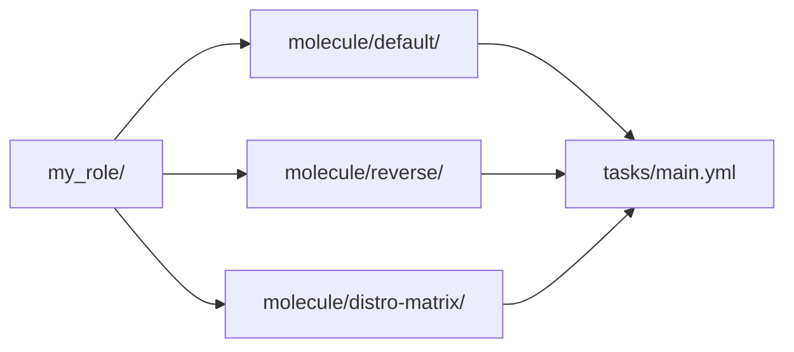

# Project layout

> **You are here:** [Authoring](./index.md) → [Your first scenario](./your-first-scenario.md) → **Project layout** → [Writing tests](./writing-tests.md)

**What you will be able to do:** place every file Molecule reads in the right place, tell
which ones it creates for you from which ones you write by hand, and understand how one
project becomes several independent test environments.

---

## The five files `molecule init` creates

Run `molecule init scenario default` in an empty project and you get **exactly five files**.
This is verified by reading the template directory in the Molecule source, not inferred.

| File | Template size | Scaffolded? |
|---|---|---|
| `molecule/default/molecule.yml` | 1203 bytes | ✅ yes |
| `molecule/default/create.yml` | 1207 bytes | ✅ yes |
| `molecule/default/converge.yml` | 372 bytes | ✅ yes |
| `molecule/default/verify.yml` | 312 bytes | ✅ yes |
| `molecule/default/destroy.yml` | 647 bytes | ✅ yes |

**And these are *not* scaffolded**, despite what most tutorials claim:

| Not scaffolded | Why you might expect it | Where it actually comes from |
|---|---|---|
| `requirements.yml` | Every driver-based scenario needs it | You write it. §4 of the [Quickstart](../quickstart.md) shows it. |
| `inventory/` | The Podman getting-started guide has one | Only in the Ansible-native route. With the `podman` driver, inventory comes from `molecule.yml`. |
| `prepare.yml` | It is in the default `test_sequence` | You write it, only if a test needs fixtures. |
| `side_effect.yml` | Also in the default `test_sequence` | You write it, only if a test must undo something. |
| `cleanup.yml` | Also in the default `test_sequence` | You write it, only if a test leaves artefacts. |
| `driver.py` | Some older tutorials show one | Never scaffolded, and no current getting-started guide mentions it. A custom driver is still possible through the plugin API, but **there is no current official tutorial** — treat writing one as out of scope. |
| `<scenario>/tests/` | It sounds like it would hold the tests | Not scaffolded and not referenced in any current documentation. Your tests are `converge.yml` and `verify.yml`, at the top level of the scenario folder. |

> **What the internet still gets wrong.** The generated `molecule.yml` lists
> `cleanup: cleanup.yml`, `prepare: prepare.yml` and `side_effect: side_effect.yml` under
> `playbooks:`. That makes them look like they exist. They do not. A step whose playbook file
> is missing is simply skipped — so a scenario with no `side_effect.yml` runs fine through
> the default 12-step sequence, and the step quietly does nothing.

---

## Every file Molecule understands

One table. "Scaffolded" means `molecule init scenario` writes it for you.

| File | Scaffolded? | Runs at step | What goes in it |
|---|---|---|---|
| `molecule.yml` | ✅ | every step | The scenario's whole configuration: driver, platforms, provisioner, inventory, dependencies, and `test_sequence`. You edit this one constantly. |
| `requirements.yml` | ❌ | `dependency` | The roles and collections to install. For the Podman path it lists `containers.podman`. Molecule installs it for you. |
| `create.yml` | ✅ | `create` | Creates the containers — **for the `default` driver only.** With the `podman` driver you **delete this file**: keeping it overrides the driver's own create playbook, so no container is ever built. |
| `prepare.yml` | ❌ | `prepare` | Fixtures your test needs *before* converge: sample data, a fake credential, a directory. |
| `converge.yml` | ✅ | `converge` | **Applies your role, playbook, or collection.** The step that does the work. |
| `side_effect.yml` | ❌ | `side_effect` | Makes a change purely so a later step can undo it. For "and now turn it back off" tests. |
| `verify.yml` | ✅ | `verify` | **Asserts the outcome.** The only step that decides pass or fail on behaviour. |
| `cleanup.yml` | ❌ | `cleanup` | Removes artefacts a previous run left behind. **You must write it** whenever your `test_sequence` calls `cleanup` and you use the `podman` driver, or every run warns `Missing playbook` and the recap reads `missing=1`. |
| `destroy.yml` | ✅ | `destroy` | Deletes the containers — **for the `default` driver only.** With the `podman` driver you **delete this file**, for the same reason as `create.yml`. |
| `Dockerfile.j2` | ❌ | `create` (build) | The template for a custom image. Lives in the **scenario** directory. See [Custom images](./custom-images.md). |
| `inventory/` | ❌ | — | Only for the Ansible-native route, where the inventory *is* the list of containers. With the `podman` driver it is not used. |
| `<scenario>/tests/` | ❌ | — | Not part of current Molecule. Do not create it. |

**`create.yml` and `destroy.yml` with a driver — delete them.** They are scaffolded because the
*default* driver requires them and because one of them writes `instance_config.yml`, the file the
built-in `default` driver reads. Under a **container** driver that reasoning does not apply, and
keeping them is actively harmful: Molecule resolves a scenario's own `create.yml` **before** the
driver's, so yours **overrides** the driver's real playbook. The `create` step then runs only the
inert local stub, reports `Executed: Successful`, and **no container is ever built** — the run
then dies at converge with `Command execution failed: Container 'instance' not found`. Measured,
not inferred.

The three files the table above lists as scaffolded, and what to do with each under `podman`:

| Scaffolded file | Under the `podman` driver |
|---|---|
| `molecule.yml` | **Replace it.** It is the whole configuration, including how containers are created. |
| `converge.yml` | **Replace it.** |
| `verify.yml` | **Replace it.** |
| `create.yml` | **Delete it.** It overrides the driver's create playbook; the driver's must run. |
| `destroy.yml` | **Delete it.** Same reason. |

Add two files `init` does not create: `requirements.yml` (§4 of the
[Quickstart](../quickstart.md)) and `cleanup.yml`, because the `test_sequence` calls a `cleanup`
step — without it every run prints `Missing playbook` and the recap reads `missing=1`.

---

## The project tree for a single scenario

This is the complete, runnable shape. Read it as a picture: the role at the top, the test
below it, and nothing shared.

```text
my_role/
│
├── tasks/                              ← YOUR ROLE. This is what you ship.
│   └── main.yml                           the tasks, and nothing else
│
├── defaults/                           ← optional, your role's own files
│   └── main.yml
│
└── molecule/                           ← THE TEST. Thrown away every run.
    └── default/                            one scenario = one test environment
        ├── molecule.yml                 ← the configuration; you edit this
        ├── requirements.yml             ← collections to install; YOU write this
        ├── converge.yml                 ← applies your role; you edit this
        ├── verify.yml                   ← asserts the outcome; you edit this
        ├── prepare.yml                  ← fixtures in; only if needed
        ├── side_effect.yml              ← a change to undo; only if needed
        ├── cleanup.yml                  ← tidy up; YOU write it, the sequence needs it
        └── Dockerfile.j2                ← custom image recipe; only if building one

    (with a driver you never write: driver.py)
    (you never create:  tests/)
    (molecule init also scaffolds create.yml + destroy.yml here: DELETE BOTH
     under a container driver - they override the driver's own playbooks)
```

The key line is the one from Molecule's own guide: *"The `molecule/` directory and its
scenario files are added for testing. They are not part of the role itself."* If you publish
this role, the `molecule/` folder is a bonus for your users, not part of the contract.

---

## The project tree with several scenarios

Each scenario is a self-contained folder with its own `molecule.yml`.

```text
my_role/
├── tasks/
│   └── main.yml
├── Dockerfile.j2                     → only if scenarios share a custom image
└── molecule/
    ├── default/                      → the happy path
    │   ├── molecule.yml              (copy of section 2b, scenario name "default")
    │   ├── requirements.yml          (copy of section 4)
    │   ├── converge.yml              (copy of section 3.2)
    │   ├── verify.yml                (copy of section 7)
    │   └── cleanup.yml               (copy of section 3.4 - NOT scaffolded by molecule init)
    └── reverse/                      -> undo the same thing, prove the undo works
        ├── molecule.yml
        ├── requirements.yml
        ├── converge.yml
        ├── verify.yml
        └── cleanup.yml
```

> **`create.yml` and `destroy.yml` are absent on purpose.** `molecule init` writes them into every
> scenario; under the `podman` driver you **delete** them, because shipping either one overrides
> the driver's own playbook and no container gets built. `cleanup.yml` is the opposite case: the
> `test_sequence` calls a `cleanup` step, `init` does not scaffold the file, and you **must** add
> it or every run warns.

Note what is **not** at the project root: there is no project-level `molecule.yml`.
Multi-scenario does not mean a different configuration shape — it means one
`molecule/<name>/` directory per scenario, each with its own. The **role** is shared; the
test environments are not.

**What is shared and what is not:**

| Shared | Not shared |
|---|---|
| The role itself — `tasks/`, `defaults/`, everything the role owns | The containers. Every scenario creates and destroys its own. |
| A `Dockerfile.j2` at the project root, if several scenarios build the same image | The inventory, if you use one — each scenario resolves its own |
| The **version-control root**, where a shared config file is discovered | The `test_sequence` outcome. One scenario failing does not fail another. |

---

## How one project fans out into scenarios



**Reading the diagram:** the project root points at each scenario folder. Every scenario
folder then points at the *same* role. So one role, three independent test environments,
each with its own container and its own pass-or-fail result. Changing the role changes what
all three test; breaking one environment does not touch the others.

`molecule test` runs all of them. `molecule test -s reverse` runs one. `molecule list` shows
what exists.

---

## The three conventions that make a multi-scenario project work

### 1. Scenario inheritance

Molecule discovers `.config/molecule/config.yml` at your **version-control root** and
deep-merges it into every scenario. That is why step 1 of the
[first scenario](./your-first-scenario.md) runs `git init`: without a repository, there is no
root, and there is nothing to discover.

```text
my_role/
├── .config/
│   └── molecule/
│       └── config.yml        ← merged into every scenario
├── tasks/
│   └── main.yml
└── molecule/
    ├── default/
    │   ├── molecule.yml      ← only its own differences
    │   └── ...
    └── reverse/
        ├── molecule.yml      ← only its own differences
        └── ...
```

A scenario that inherits everything can be very short:

```yaml
---
# Inherits shared_state, the test sequence, and the inventory from
# .config/molecule/config.yml.
```

The inventory path stays anchored to the project directory, so an inheriting scenario does
not look for an inventory inside its own folder. That is the behaviour that makes the
`reverse` scenario in the layout above work with three files instead of seven.

**When to use it:** three or more scenarios that share the same driver, the same image, and
the same step order. With two scenarios, copy the file — the indirection costs more than it
saves.

### 2. `MOLECULE_SCENARIO_DIRECTORY`

This environment variable is the absolute path of the scenario's own folder. Molecule sets it
before each step. Use it whenever a path in `molecule.yml` must point at a file that sits
next to `molecule.yml`:

```yaml
dependency:
  name: galaxy
  options:
    requirements-file: ${MOLECULE_SCENARIO_DIRECTORY}/requirements.yml
```

**Why it matters:** it is what lets you copy a scenario directory to a different project, or
into a different parent folder, without editing a single path. The companion variable is
`MOLECULE_PROJECT_DIRECTORY`, the project root.

**The shared-`requirements.yml` question.** You *can* point every scenario at one shared file
by using `${MOLECULE_PROJECT_DIRECTORY}` instead:

```yaml
    requirements-file: ${MOLECULE_PROJECT_DIRECTORY}/requirements.yml
```

> The block below shows the trade-off, not a canonical file. `MOLECULE_PROJECT_DIRECTORY`
> is a real Molecule variable; this particular `dependency:` form is assembled for this page.

It is not forbidden. But note the trade-off honestly: Molecule installs what
`requirements.yml` lists, on **every** scenario run. If two scenarios need *different*
collection versions, a shared file forces you to pick one — and the way you would pin it is
a pin in your project, not in the test that needs it. For a per-scenario test suite, keeping
`requirements.yml` inside each scenario folder is the honest default: a scenario then carries
everything it needs, and you can copy it out and run it alone. Use the shared form when every
scenario genuinely needs the same thing.

### 3. One scenario per environment, one file per job

The last convention is a rule rather than a mechanism:

- **`create.yml` and `destroy.yml` are not yours** once you have named a driver — and under the
  `podman` driver you should **delete** them, not edit them. A scenario's own `create.yml` is
  resolved before the driver's, so keeping it replaces container creation with an inert local
  stub and the run dies with `Container 'instance' not found`. This is how a working test
  environment gets broken in a way that looks like an Ansible problem.
- **`converge.yml` applies. `verify.yml` asserts. Never both in one file.** The moment
  assertions live next to the tasks that change the machine, you cannot tell whether a test
  passed because the machine was right or because the task was clever.
- **Name scenarios after the *question* they answer**, not after the step. `default` is
  conventional. `reverse`, `upgrade-from-3-9`, and `no-network` tell a reader what the test is
  for; `scenario2` tells them nothing.

---

## Next

- **[Writing tests](./writing-tests.md)** — make the `verify.yml` in these trees worth
  trusting, and make the `converge.yml` idempotent.
- **[Multi-scenario](./multi-scenario.md)** — when to actually split, what it costs, and how
  to run one scenario or all of them.
- **[Custom images](./custom-images.md)** — where `Dockerfile.j2` sits and the one setting
  that silently skips the build.
- **[`molecule.yml` reference](../reference/molecule-yml.md)** — every option, field by field.

---

## Attribution

No brand marks or logos are displayed on this page. Brand and licence records live in
[`../../assets/ATTRIBUTION.md`](../../assets/ATTRIBUTION.md); product names identify the
software being discussed and imply no endorsement.

---

## Sources

- <https://github.com/ansible/molecule/tree/main/src/molecule/data/templates/scenario> — the five scaffold templates and their sizes, verified by directory listing
- <https://github.com/ansible/molecule/blob/main/src/molecule/data/init-scenario.yml> — the scaffolding playbook, the non-empty-folder refusal, and the `molecule/` + `scenario_name` path expression
- <https://github.com/ansible/molecule/blob/main/src/molecule/command/init/scenario.py> — the `Scenario` class that exits when the directory already exists
- <https://docs.ansible.com/projects/molecule/getting-started-roles/> — the three project layouts: what `molecule init` produces, what the Podman getting-started produces, and the shared-state layout
- <https://github.com/ansible/molecule/blob/main/docs/getting-started-roles.md> — *"The `reverse` scenario does not need its own create, destroy, requirements, or inventory files."* and the VCS-root discovery of `.config/molecule/config.yml`
- <https://github.com/ansible/molecule/blob/main/docs/configuration.md> — `MOLECULE_SCENARIO_DIRECTORY`, `MOLECULE_PROJECT_DIRECTORY`
- <https://github.com/ansible-community/molecule-plugins/blob/main/src/molecule_plugins/podman/playbooks/> — the `create.yml` and `destroy.yml` the driver supplies
- <https://github.com/ansible-community/molecule-plugins/blob/main/src/molecule_plugins/podman/playbooks/Dockerfile.j2> — the driver's own image template, used only when `pre_build_image: false`
- <https://docs.ansible.com/projects/molecule/usage/> — `molecule list`, `molecule test -s`, `molecule test --all`
- Internal, reproducible: the trees and the inheritance snippet are quoted from
  [`../REFERENCE-CONFIG.md`](../REFERENCE-CONFIG.md) §2c and from `.research/01-molecule-podman-driver.md` §3.2–§3.3. No page in this project re-types a config file.
