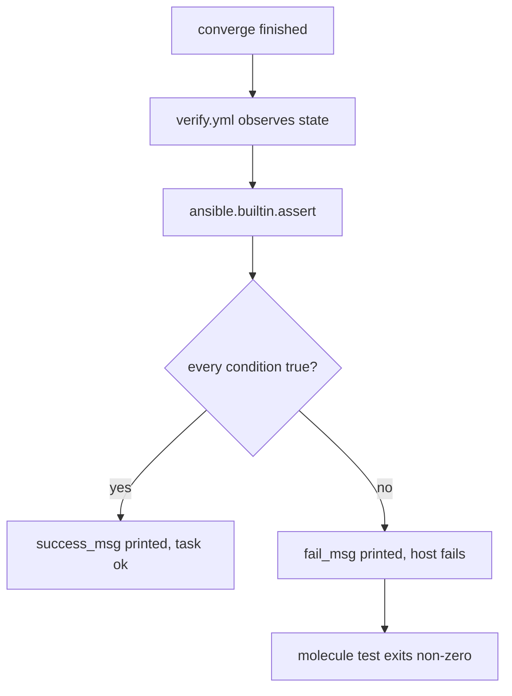

# Writing tests

> **You are here:** [Authoring](./index.md) → [Project layout](./project-layout.md) → **Writing tests** → [Custom images](./custom-images.md)

**What you will be able to do:** write a `converge.yml` that is boring, a `verify.yml` that
is worth trusting, and a converge that is **idempotent** — meaning running it twice changes
nothing the second time.

---

## `converge.yml` should be boring

`converge.yml` does exactly one job: **apply your work**. Nothing else belongs in it.

| Do not put in `converge.yml` | Why |
|---|---|
| `ansible.builtin.assert` | An assertion in converge means your test can pass for the wrong reason. Assertions live in `verify.yml`. |
| `ansible.builtin.debug` for your own troubleshooting | It runs on every test, forever, and trains you to ignore the output. Use `molecule login` instead. |
| `curl`, `wget`, or any fetch from the internet | A test that depends on a third-party server is a test that fails when *they* are down. |
| Machine-specific paths or hostnames | The container is rebuilt every run. Assume nothing survives. |
| Fix-ups for things your role should have done | A converge that patches its own work hides the bug it was supposed to expose. |

The whole file, ideally, is a single task:

```yaml
- name: Apply the role under test
  ansible.builtin.include_role:
    name: my_role
```

That is not an aesthetic preference. Every extra task in `converge.yml` is a thing that can
be non-idempotent, and the `idempotence` step will hold it responsible.

> **Why proper modules, not raw commands.** The Molecule documentation frames this as
> *"using proper Ansible modules instead of raw commands thanks to the Python-enabled
> container image"*. It matters more than style: a module knows how to report whether it
> changed anything, which is exactly what the `idempotence` step measures. A
> `ansible.builtin.shell` call can never tell Molecule that it did nothing.

---

## `verify.yml` should be paranoid

`verify.yml` is the only file that decides pass or fail. Treat every line as a claim you are
willing to defend.

### The anatomy of a `verify.yml`

Four parts, in this order:

1. **The play.** `hosts: molecule` — the inventory group your instances are in **only if you put
   them there**: add `groups: [molecule]` to each entry under `platforms:` in `molecule.yml`.
   Molecule derives its groups from that key, defaulting to `["ungrouped"]`, so **there is no
   implicit `molecule` group**. Write `hosts: all` instead and you sidestep the question
   entirely. Either way, `gather_facts: false` unless you need facts (see below).
   > **The failure this prevents is silent.** A play that matches no hosts reports
   > `skipping: no hosts matched`, `failed=0`, and `molecule test` **exits 0** — a green run
   > that asserted nothing. Before believing any pass, confirm the `PLAY RECAP` shows `ok=N`
   > with `N > 0` and that there are zero `no hosts matched` lines.
2. **A read task that has no side effects.** `ansible.builtin.stat` for a file,
   `ansible.builtin.service_facts` for services, `ansible.builtin.setup` for facts. The point
   is to *observe*, never to change. A read task that reports `changed` is a bug in the test.
3. **`register`.** A `register:` on the read task names a variable. That is how the
   assertion refers to what it saw.
4. **`ansible.builtin.assert`.** The claim, with a `fail_msg` written for a human at 2 a.m.

Here is the canonical example, verbatim:

```yaml
---
# molecule/<scenario>/verify.yml
- name: Verify
  hosts: molecule
  gather_facts: false
  tasks:
    - name: Read the marker file back
      ansible.builtin.stat:
        path: /tmp/molecule-was-here
      register: marker

    - name: Assert the marker file exists and has the right content
      ansible.builtin.assert:
        that:
          - marker.stat.exists
          - marker.stat.checksum is defined
        fail_msg: The marker file is missing. Converge did not run.
        success_msg: The marker file is there.

    - name: Assert the file content
      ansible.builtin.slurp:
        src: /tmp/molecule-was-here
      register: marker_content

    - name: Check the content
      ansible.builtin.assert:
        that:
          - "'hello from molecule' in (marker_content.content | b64decode)"
        fail_msg: Unexpected content in the marker file.
        success_msg: The content is correct.
```

**Two rules about the `that:` list.** First, make each condition read like a sentence. A
colleague should be able to say the condition out loud. Second, **use `success_msg` as well
as `fail_msg`** — on a green run the `success_msg` lines are the only proof that your
assertions actually executed rather than being skipped.

### Assert files

`ansible.builtin.stat` is the workhorse. It answers: does it exist, is it a regular file, what
is its mode, its size, and when was it last modified. `ansible.builtin.slurp` goes further
and returns the whole file, base64-encoded — pipe it through `b64decode` before comparing, as
above.

### Assert services

This is the systemd case, and it has a trap:

```yaml
    - name: Collect the instance's service facts
      ansible.builtin.service_facts:

    - name: Confirm systemd is running the managed service
      ansible.builtin.assert:
        that:
          - "'molecule-demo.service' in ansible_facts.services"
          - "ansible_facts.services['molecule-demo.service'].state == 'running'"
        fail_msg: molecule-demo.service is not running inside the container.
        success_msg: molecule-demo.service is active.
```

Two assertions, deliberately. The first asks "does systemd know about this unit at all?" —
which catches a missing `daemon_reload`, a unit written to the wrong path, or a
`systemctl daemon-reload` that never ran. Without it, the second assertion raises an
undefined-key error instead of a readable message.

> **Assert the service, not the system.** Do **not** assert that
> `systemctl is-system-running` returns `running`. In a rootless container `degraded` is the
> *normal* outcome, and asserting `running` fails a perfectly correct system. The full
> playbook, including the diagnostic task that prints the real state, is on
> [Your first scenario](./your-first-scenario.md#7-verify--assert-the-result).

### Assert facts

Facts are Ansible's inventory of what a machine is. With `gather_facts: false` you have
none, so a test that needs them must set `gather_facts: true` in the verify play — this is
the trade-off: facts cost time, and most assertions do not need them.

```yaml
- name: Verify
  hosts: molecule
  gather_facts: true
  tasks:
    - name: Assert the distribution is what the role supports
      ansible.builtin.assert:
        that:
          - ansible_facts['distribution'] == 'Debian'
        fail_msg: This role supports Debian only; found {{ ansible_facts['distribution'] }}.
        success_msg: The distribution is supported.
```

> **This is an example, not a canonical file.** The `gather_facts: true` line and its
> comment are quoted in shape from the scaffolded `converge.yml` Molecule generates — *"Disable
> if your role does not rely on facts"*. The assertion body is a worked illustration using the
> same `ansible.builtin.assert` used throughout this page. Swap `Debian` for the
> distribution your role supports.

### Assert listeners — an example, not a requirement

To check that something is listening on a **port** — that a network socket is open and
accepting — you read the socket table rather than a service fact. Here is the pattern, marked
honestly for what it is:

```yaml
    - name: Read the listening sockets
      ansible.builtin.command: ss -ltn
      register: listeners
      changed_when: false     # so it never breaks the idempotence step
      failed_when: false

    - name: Assert the port is listening
      ansible.builtin.assert:
        that:
          - "':8080' in listeners.stdout"
        fail_msg: Nothing is listening on port 8080.
        success_msg: Port 8080 is listening.
```

**Two caveats, both real.** First, `ss` comes from the `iproute2` package, which is **not**
in either verified package list in
[`../REFERENCE-CONFIG.md`](../REFERENCE-CONFIG.md) §1.1 or §1.2 — if you use this pattern,
add `iproute2` to your `Dockerfile.j2`, or the task fails with "command not found". Second,
matching on `stdout` is a substring test, so `:8080` also matches `:80800`. If you need
precision, assert on `ansible_facts.services` instead and treat the socket table as a
diagnostic. **This pattern was not run during the research session for this site.** Prefer
`service_facts` where it can answer the question.

---

## How an assert decides pass or fail



**Reading the diagram:** the assert does not decide anything by itself. It evaluates every
condition in the `that:` list, and *all* of them must be true. One false condition fails the
host, the step, and the run. The `fail_msg` is the only text your future self gets, so write
it as a sentence about what went wrong — not as "assertion failed".

---

## The failure output, and how to read it

When a `that:` condition is false, Ansible prints the failing task and the reason:

```console
TASK [Assert the marker file exists and has the right content] *****************************************
fatal: [instance]: FAILED! => {
    "assertion": "marker.stat.exists",
    "changed": false,
    "evaluated_to": false,
    "msg": "The marker file is missing. Converge did not run."
}
```

Read it in this order:

| Line | What it tells you |
|---|---|
| `TASK [...]` | Which assertion failed. If the name is not specific, rename the task — you are looking at a test you cannot debug. |
| `fatal: [instance]` | Which **host** failed. `instance` is the `name` from `platforms:` in your `molecule.yml`. |
| `"assertion": "marker.stat.exists"` | The **exact condition** that evaluated to false. This is the single most useful line. |
| `"evaluated_to": false` | The condition ran and was false. If this line is *absent*, the condition was malformed — usually a quoting mistake. |
| `"msg"` | Your `fail_msg`, which you wrote. |

**If the failure is a Python traceback rather than a clean `assert` output**, the problem is
not your assertion. It is that the container image has no Python, so Ansible's built-in tasks
cannot run. That requirement is separate from systemd and applies to every scenario.

**If nothing failed but the run still fails**, look at the step *before* `verify` in the log.
Molecule reports the first failing step and stops.

For everything else: [Troubleshooting](../troubleshooting.md), and `molecule --debug test`
for the full log.

---

## Make it idempotent

**Idempotent** means: applying the same change twice leaves the same result, and the second
application reports **no change**. This is not a nicety. It is a first-class test, and
Molecule runs it for you.

### What the `idempotence` step does

The step is in the default `test_sequence` and in the Podman sequence. It:

1. runs `converge.yml` a second time, on the **same container** the first converge used;
2. checks that **no task reported `changed`**.

If any task reports `changed`, the step fails. A typical failure:

```console
TASK [Write a marker file] ***************************************************************
changed: [instance] => (item=changed)

==> Scenario: default
==> Running Ansible playbook...
ERROR: Idempotence check failed. Please run the idempotence report script to find the task that is not idempotent.
```

**What a failure means — and why it is worth caring about.** A task that reports a change on
every run is doing work it did not need to do. That causes one of three real problems:

| Problem | Example |
|---|---|
| **It is slow.** | A `dnf update` that re-resolves repositories on every run. |
| **It is noisy.** | You cannot see the real changes in a 400-line log of false positives. |
| **It is a bug.** | Something your role *manages* is being pushed back on every run — a config file rendered slightly differently each time, a permissions drift, a service being restarted. On a real machine, that is a restart every 30 minutes forever. |

The third is the one that bites you in production, and the `idempotence` step is the only
thing that finds it before your users do.

### The three usual causes, and the fix for each

**Cause 1 — a `command` task with no `changed_when: false`.**
`ansible.builtin.command` always reports `changed`, because it cannot know whether it did
anything. Say so explicitly:

```yaml
    - name: Read what PID 1 is
      ansible.builtin.command: cat /proc/1/comm
      register: pid1
      changed_when: false
```

**Cause 2 — a package install that always reports changed.** Installing an already-installed
package should be `ok`, not `changed`. If yours reports `changed` every time, the usual cause
is installing the `latest` version rather than a named one: `latest` is a moving target, so
Ansible can never prove the machine already has it. Pin the version. If the module genuinely
always reports changed in your situation, `changed_when` is the honest fix — but pin first,
because a pinned version also makes your test reproducible.

**Cause 3 — a template that re-renders differently each time.** If your template embeds
something that changes per run — a timestamp, a random value, a host-specific path — then
`ansible.builtin.template` genuinely has new content to write, and reporting `changed` is
correct. The fix is not `changed_when: false`; the fix is to stop templating the changing
value. Assert on the stable part instead.

### How to write a converge that passes this step

- Prefer modules over `command` and `shell`. They report honestly on their own.
- On every `command` task, set `changed_when: false` — unless the command is *supposed* to
  change something, in which case say what makes it idempotent.
- Never template a value that changes between runs.
- Never depend on state the previous run left behind. The container is created fresh.
- Run `molecule test` twice in a row. The second run must still pass.

> **The spelling is `idempotence`**, with an *e*. `molecule idempotency` does not exist.

---

## `side_effect.yml` — testing a change and putting it back

Some behaviour can only be proven by *undoing* it. `side_effect.yml` is the step for that.

**When you need one:**

- a play and a reverse play that must cancel out;
- an "and now turn it off" test — does disabling actually stop the service?
- anything destructive that a second scenario must prove it can reverse.

**What it is not:** a place to put setup. That is `prepare.yml`.

The pattern, with a short example. The module names here are **illustrative examples, not
requirements** — your role decides which modules make sense:

```yaml
---
# molecule/default/side_effect.yml
- name: Side effect
  hosts: molecule
  gather_facts: false
  tasks:
    - name: Stop the service, so the reverse scenario can prove it starts again
      ansible.builtin.systemd:
        name: molecule-demo.service
        state: stopped
```

Then a second scenario, `reverse`, whose `converge.yml` starts it again and whose
`verify.yml` asserts it is running. `side_effect` is **not scaffolded** by
`molecule init scenario` — you create the file, and you must add `- side_effect` to
`test_sequence` yourself. The full two-scenario shape is on
[Multi-scenario](./multi-scenario.md).

---

## `prepare.yml` and `cleanup.yml` — fixtures in, fixtures out

Both are optional. Both are **not scaffolded**. A step whose file is missing is silently
skipped, so leaving them out of both the tree and the `test_sequence` is the tidiest state.

| File | Runs | Use it for |
|---|---|---|
| `prepare.yml` | after `create`, before `converge` | Putting fixtures in place that your role *reads* — a config file it merges, a directory it expects, a user it assigns something to. |
| `cleanup.yml` | at the **start and end** of the default sequence | Removing artefacts a previous run left behind, so a crashed run cannot poison the next one. |

If your scenario starts clean every time, you need neither. Most do not, because
`converge.yml` is where the mess is made.

---

## Make the test fast

The biggest lever is the container image, not your playbooks. Every `dnf install` or
`apt-get install` at converge time is time your test spends waiting.

| Faster | Slower | Why |
|---|---|---|
| A prebuilt image that already has your packages | A bare base image plus a `dnf install` in converge | The package install moves from every test run to once, at build time. |
| A prebuilt image (`ubi9/ubi-init`) | A custom `Dockerfile.j2` | Nothing to build at all. |
| `gather_facts: false` where you can | `gather_facts: true` everywhere | Facts cost real seconds per host. |

Building the image once instead of installing every run is what
[Custom images](./custom-images.md) is for. But note: a prebuilt image is the better default
if it already has what you need. Build your own only when it does not.

---

## A checklist before you commit

- [ ] `converge.yml` only applies. No asserts, no `debug`, no internet fetches.
- [ ] `verify.yml` only observes. No task in it reports `changed`.
- [ ] Every `command` and `shell` task sets `changed_when`.
- [ ] Every assertion has a `fail_msg` that names what was expected and what was found.
- [ ] Every assertion has a `success_msg`, so a green run proves the assertion ran.
- [ ] You assert your **service**, not `systemctl is-system-running`.
- [ ] You assert behaviour, not the exact text of a config file you also own.
- [ ] `molecule test` passes twice in a row from a clean state.
- [ ] `molecule --debug test` passes — the `-vvv` log has no unredacted secrets in it.
- [ ] The scenario destroys cleanly. `podman ps -a` shows nothing left behind afterwards.

---

## Next

- **[Custom images](./custom-images.md)** — make the test fast by moving the work to image
  build time.
- **[Multi-scenario](./multi-scenario.md)** — put the `side_effect`/reverse pair into a
  second scenario.
- **[Troubleshooting](../troubleshooting.md)** — idempotence failures and assert failures,
  with the exact error text.
- **Runnable example:** [`../../examples/systemd-unit/`](../../examples/systemd-unit/)

---

## Attribution

No brand marks or logos are displayed on this page. Brand and licence records live in
[`../../assets/ATTRIBUTION.md`](../../assets/ATTRIBUTION.md); product names identify the
software being discussed and imply no endorsement.

---

## Sources

- <https://docs.ansible.com/projects/molecule/getting-started-roles/> — the `verify.yml` shape, the `assert` with `fail_msg` / `success_msg`, and the framing about proper modules versus raw commands
- <https://docs.ansible.com/projects/molecule/usage/> — the step list, and `molecule idempotence`
- <https://github.com/ansible/molecule/blob/main/src/molecule/data/templates/scenario/converge.yml.j2> — the scaffolded `gather_facts: true` and its "Disable if your role does not rely on facts" comment
- <https://github.com/ansible/molecule/tree/main/src/molecule/command> — the action modules, including `idempotence.py` and `side_effect.py`
- <https://docs.ansible.com/projects/molecule/command-reference/> — the command surface; `molecule idempotency` does not exist
- <https://docs.ansible.com/projects/ansible/latest/modules/assert.html> — `ansible.builtin.assert`, the `that:` list, and the `assertion` / `evaluated_to` keys in the failure output
- <https://docs.ansible.com/projects/ansible/latest/collections/ansible/builtin/service_facts_module.html> — `ansible.builtin.service_facts` and the `ansible_facts.services` dictionary
- <https://docs.ansible.com/projects/ansible/latest/modules/stat.html> and <https://docs.ansible.com/projects/ansible/latest/modules/slurp.html> — the file-reading modules used in the canonical `verify.yml`
- <https://docs.ansible.com/projects/ansible/latest/modules/template.html> — why templating a changing value legitimately reports `changed`
- <https://docs.ansible.com/projects/ansible/latest/installation_guide/intro_installation.html> — the requirement for Python on the target, and the "proper modules instead of raw commands" framing
- Internal, reproducible: the two canonical `verify.yml` blocks are copied verbatim from [`../REFERENCE-CONFIG.md`](../REFERENCE-CONFIG.md) §3.3 and §7.2. The listener pattern and the facts assertion are labelled on the page as examples not sourced from the research corpus.
