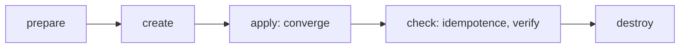
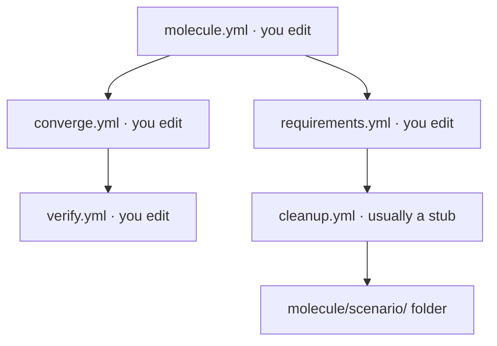

# How Molecule works

> **You are here:** [Docs home](../index.md) → **How Molecule works** → [Pre-flight](../preflight.md) → [Quickstart](../quickstart.md)

**What you will be able to do:** explain, in your own words, what `molecule test` actually
does — and know which of its moving parts creates the container, which one talks to it, and
which one proves your work is correct.

This page has **no commands**. That is deliberate. Every command in this site is on a later
page, and it is easier to remember a command once you know what it is for.

---

## The one-paragraph version

You write some Ansible content — a role, a playbook, a collection. Molecule builds a small
throwaway machine for it, applies your content to that machine, checks that the result is what
you said it should be, proves that applying it a second time changes nothing, and then throws
the machine away. Because the machine is new every single time, a green result means
something: it is not the leftovers of your last run making you feel good.

---

## What Molecule is

Molecule's own definition, quoted exactly:

> *"Molecule is an Ansible testing framework designed for developing and testing Ansible
> collections, playbooks, and roles."*

Three things are hiding in that sentence.

- **It is a *testing framework*, not a deployment tool.** It runs your content somewhere you do
  not care about, on purpose, to find out whether it works. Nothing it does is meant to last.
- **It is for Ansible content.** Molecule does not test your own application. It tests the
  automation *you* wrote, on the machines *you* care about.
- **It is a harness, not a test runner.** It builds the environment, hands your content to
  Ansible, and reads the result. The assertions are yours, in YAML, not in Python.

### The moving parts, in plain words

You will meet these eight words on every page in this site. This is the short version; the
[glossary](../glossary.md) is the long one.

| Word | What it means here |
|---|---|
| **platform** | One machine your test needs. In a container-based scenario, one entry under `platforms:` becomes one container. |
| **scenario** | One whole disposable test environment: its own folder, its own settings, its own playbooks. `default` is the conventional first name. |
| **driver** | The part that knows how to *make and unmake* platforms. This site uses the `podman` driver. |
| **provisioner** | The part that knows how to *do Ansible work*. In this site it is always `ansible`. |
| **inventory** | The list of machines, with their addresses and settings, that Ansible is allowed to talk to. Molecule generates it from your `platforms:`. |
| **converge** | The act of *applying* your content. `converge.yml` is where you put it. |
| **verify** | The act of *asserting* the result. `verify.yml` is where you put it, and it is the only step that decides pass or fail. |
| **idempotence** | The property that applying the same change twice leaves the same result. Molecule tests this for you, automatically. |

---

## The test lifecycle

`molecule test` is not one thing. It is an ordered list of steps, and the list is written in
your own configuration file under `scenario: test_sequence:`. You can shorten it, lengthen it,
or reorder it. What follows is the list `molecule init scenario` scaffolds for you, and what
each step is for.

### 1. `dependency`

Reads the `requirements.yml` in your scenario and installs the collections and roles it names,
using **Ansible Galaxy** — the free public registry where Ansible content is published. This
runs first so that every later step has what it needs.

*If it fails:* the scenario asked for something that does not exist, or the network is down.
Nothing has been created yet, so there is nothing to clean up.

### 2. `cleanup`

Removes anything a *previous* run left behind — files you asked to be preserved, typically
through the driver's `safe_files:` setting.

*If it fails:* usually harmless. It appears near the start precisely so a crashed previous run
cannot poison this one.

### 3. `destroy`

Deletes the platforms. It appears at the start as well as the end, for the same reason: a run
that crashed halfway must not leave a container that the next run tries to reuse.

*If it fails:* a container is stuck. See [Troubleshooting](../troubleshooting.md).

### 4. `syntax`

Checks that your playbooks can be *parsed*. It does not run them and does not connect to
anything.

*If it fails:* you have a YAML indentation error, a typo, or a task that names a module that
does not exist. This is the cheapest possible failure — it costs seconds and points at the
exact line.

### 5. `create`

This is the step that makes machines. On the `podman` driver it pulls the container image if it
is not already on your machine, then starts one container per entry in `platforms:`.

*If it fails:* almost always the image. Either it cannot be pulled, or it does not contain the
thing you need — most often **Python**, because Ansible's built-in tasks run Python on the
target. A bare `alpine` image will fail here.

> **This is the slow step, and only the first time.** The cost is not starting a container; it
> is *downloading the image*. After that the image is on your machine and `create` is quick.
> The [quickstart](../quickstart.md) budgets about 15 minutes for everything on a warm machine,
> and 1–2 minutes more the very first time for this download. ⚠️ That figure is an **unmeasured
> estimate**, not a timed measurement — see the label on the Quickstart page.
>
> **This site does not publish per-step timings.** The verification run measured the whole
> scenario, not each step separately, and inventing numbers would be worse than having none.

### 6. `prepare`

Applies changes to the platforms *before* your own work runs — installing fixtures, for
instance. `molecule init scenario` does not create a `prepare.yml` for you; you write it, or you
remove the step.

*If it fails:* your fixture is wrong. This is a step for test scaffolding, not for the thing
you are actually testing.

### 7. `converge`

**The step that does the work.** Molecule hands `converge.yml` to Ansible and points it at the
platforms it just created. Everything you are trying to test happens here.

*If it fails:* this is a real failure in your role, your playbook, or your collection — or a
missing prerequisite inside the container. This is the failure you most wanted to catch.

### 8. `idempotence`

Runs `converge.yml` a **second time** and fails the run if anything changed the second time.

*If it fails:* one of your tasks does something on every run instead of only when it needs to.
This is the step beginners most often do not expect and the one that most improves real code.
A role that is not idempotent will fight whatever tool runs it later.

### 9. `side_effect`

Makes a deliberate change, whose purpose is to be undone. It exists for the two-scenario
pattern: one scenario leaves a resource behind, the next one proves it cleans it up.

`molecule init scenario` does not create a `side_effect.yml` for you.

*If it fails:* a leftover resource was not cleaned up by the scenario that is responsible for
it. See [multi-scenario](../authoring/multi-scenario.md).

### 10. `verify`

**The step that decides pass or fail.** Molecule runs `verify.yml`, which is your own list of
assertions: is the file there, is the service active, is the port listening.

*If it fails:* your automation ran, and the result is not what you said it would be. This is
the failure that means your test is doing its job.

> #### The most important thing on this page
>
> **`molecule test` can exit 0 having asserted nothing at all.**
>
> This is not a theory. It happened to the authors of this site. A configuration was reviewed
> three times and approved by three people, looked perfect, and ran green — while every play
> printed `skipping: no hosts matched` and not one assertion executed.
>
> The cause: Molecule builds its Ansible groups from a key on each platform, and that key
> defaults to a group your playbooks do not name. The play matches no hosts, runs nothing, and
> Molecule — quite reasonably, from what it was told — reports success.
>
> The fix is a `groups:` key on the platform. The canonical configs in this site carry it, with
> the reason kept inline as a comment so you can see why it is there:
> [`REFERENCE-CONFIG.md`](../REFERENCE-CONFIG.md) §2.
>
> **The check that catches it:** the `verify` step's summary must show a non-zero `ok=` count
> and **no** `no hosts matched` line. An exit code of 0 is not enough. Full transcript:
> [`examples/VERIFICATION.md`](../../examples/VERIFICATION.md).

### 11. `cleanup`

The same step as number 2, now running at the end to tidy up after this run.

*If it fails:* the same harmless warning as before.

### 12. `destroy`

Deletes the platforms again, so your machine is left as you found it.

*If it fails:* a container could not be removed. Everything else in the run still happened.

### The lifecycle as one picture



**What this shows:** one `molecule test` run moves left to right through five phases — set up,
create the machine, apply your work, check the result, throw the machine away — and `destroy`
really does run at both ends, so a crashed run cannot poison the next one.

A text description of the diagram, in reading order, for anyone who cannot see it. The run
begins in a *prepare* phase, which installs dependencies and removes leftovers. It moves to
*create*, which is the only phase that starts a container and the slowest one, because the
first run downloads an image. It then moves to *apply*, where your `converge.yml` runs — this
is the phase that tests your work. Next is *check*, which runs your converge a second time to
prove nothing changed, then runs `verify.yml`, the only phase that decides pass or fail. The run
ends in *destroy*, which deletes the container and leaves your machine clean. The diagram shows
five phases; the full list of twelve steps, including the two extra `cleanup` passes and the
`syntax` check, is in the prose above and in
[`REFERENCE-CONFIG.md`](../REFERENCE-CONFIG.md) §9.

---

## The three files you will edit

A scenario is a folder of small text files. You only ever need three of them.



**What this shows:** four files flow into one scenario folder — three you write your own work
into, plus a requirements file — and the folder is the thing Molecule actually runs.

A text description of the diagram, in reading order. At the top left is `molecule.yml`, which
you edit and which holds the settings: which driver, which platforms, and the ordered list of
test steps. It flows to `converge.yml`, which you edit and which applies your work. That flows
to `verify.yml`, also edited by you, which asserts the outcome. Separately, `requirements.yml`,
which you edit to list the collections and roles to install, and `cleanup.yml`, which is
usually only a stub, both feed into the scenario folder. That folder — conventionally named
`molecule/<scenario>/` — is what Molecule finds and runs.

| File | You edit it? | What it is for |
|---|---|---|
| `molecule.yml` | yes | Settings. Which driver, which platforms, which steps, in what order. |
| `converge.yml` | yes | Applying your work. This is where your role, playbook or collection runs. |
| `verify.yml` | yes | Asserting the result. This is where your test lives. |
| `requirements.yml` | yes | The collections and roles to install before anything else runs. |
| `cleanup.yml` | rarely | Tidy-up. Often a two-line placeholder. |
| `create.yml`, `destroy.yml` | **no** | You do not write these on the `podman` driver — the driver has its own, and shipping your own **overrides the driver's and breaks the run**. |

> **A trap worth one sentence.** Molecule requires the exact folder shape
> `molecule/<scenario>/molecule.yml`. A flat `molecule.yml` at your project root does not work,
> and the error message it gives — `CRITICAL 'molecule/*/molecule.yml' glob failed` — does not
> tell you that. Details: [project layout](../authoring/project-layout.md).

---

## How Molecule talks to your containers

This is the part most tutorials on the internet get wrong, and getting it wrong sends you
hunting for a socket that does not exist.

### It is a command-line tool, not a socket

When Ansible needs to run something inside your container, it does **not** talk to a daemon over
a network socket. It runs the `podman` **command-line tool** as a child process — it executes
commands such as `podman exec` and reads what they print.

That has one practical consequence, and it is the one people trip over:

> **There is no `DOCKER_HOST` in this path.** Nothing to export. Nothing to point at a
> `.sock` file. No API forwarding socket to configure. If a guide tells you to set
> `DOCKER_HOST=.../podman.sock`, it is describing the Docker driver, not the Podman one.

The setting that names the Podman binary is `MOLECULE_PODMAN_EXECUTABLE`, which defaults to
plain `podman`. Full list: [environment variables](../reference/env-vars.md).

### Which plugin does this

The connection is made by the Ansible connection plugin named
**`containers.podman.podman`**. That is a **Fully Qualified Collection Name (FQCN)** — the
collection name, then the plugin name, dotted together.

It comes from the **`containers.podman`** collection, and it is worth being precise about where
it does *not* come from:

- **Not `community.docker`.** That collection ships `docker`, `docker_api` and `nsenter`. It
  has no Podman connection plugin at all.
- **Not Molecule itself.** The collection is installed by the `dependency` step from your
  `requirements.yml`, exactly like any other Ansible content.

### The `podman` driver is a separate package

The **driver** is the part of Molecule that creates and destroys the platforms. Molecule's core
ships a driver called `default` and nothing else useful for containers — the `podman` driver
comes from **`molecule-plugins`**, a separate distribution that is not in any Linux
distribution's package repository.

Check that you have it:

```console
$ molecule drivers
```

**You should see** a list that includes a line reading `podman`. If it does not, your install is
incomplete, not your configuration. See the [install index](../install/index.md).

### The `default` driver creates no containers

Worth stating plainly, because the name is misleading: Molecule's `default` driver manages **no
containers at all**. Internally it is a class whose own description reads *"Default driver, user
is expected to manage provisioning of test resources."* It expects *you* to have created the
machine already. It will not build one for you, and it will not clean one up.

This site uses the `podman` driver precisely so that "create the machine" is Molecule's job.

---

## Why a container and not a virtual machine

A test environment has to be cheap, disposable, and — most importantly — **reproducible**. A
container gives you that: starting one takes about a second, and it starts identically every
time.

What you give up is the kernel. A container shares your computer's kernel; a virtual machine
boots its own. So:

| | Container | Virtual machine |
|---|---|---|
| Start-up | about a second | tens of seconds or more |
| Isolation | shares the host kernel | has its own kernel |
| Good for | testing *your automation* | testing *an operating system* |

**This is the right trade for Molecule, and it has a boundary.** You can test whether your role
installs and starts a service. You cannot test kernel behaviour, a bootloader, or a different
kernel version. If you need that, a virtual machine is the right tool — see
[macOS](../install/macos.md), where Podman uses one under the hood.

---

## What Molecule does NOT do

Four things it is regularly assumed to do, and does not.

**It is not a linter.** `ansible-lint` is a separate program with a separate name, and you run
it yourself. Molecule used to have a `molecule lint` subcommand; it was **removed**. There is no
replacement inside Molecule — just run `ansible-lint`.

**It is not a Continuous Integration (CI) system.** Molecule has no notion of a pipeline, a
repository, a trigger, or a pass/fail badge. You can run Molecule *inside* CI, and this site
shows how, but the pipeline is something else entirely — [CI](../authoring/ci.md).

**It is not a deployment tool.** Nothing Molecule does is meant to survive the run. Do not point
it at a machine you care about.

**It does not create containers for you unless a driver does.** Covered above, and it is the
single most confusing thing for a newcomer: `molecule` on its own, with the `default` driver,
starts nothing at all.

It is also worth naming three commands that people still copy from older tutorials and that
**have been removed**: `molecule add`, `molecule remove` and `molecule lint`. Their
replacements are in [the CLI reference](../reference/cli.md).

---

## Next

You have the mental model. Now make it real:

- **Not installed yet?** → [Pre-flight check](../preflight.md) — ten seconds, read-only, free.
- **Ready to run something?** → [Quickstart](../quickstart.md) — your first green
  `molecule test`, about 15 minutes *(unmeasured estimate)*.
- **Want to test a role that manages a service?** → [systemd in containers](../systemd-in-containers.md).
- **A word you did not know?** → [Glossary](../glossary.md).
- **Building your own?** → [Build your own workflows](../authoring/index.md).
- **Something broke?** → [Troubleshooting](../troubleshooting.md).

---

## Attribution

This page names Ansible®, Podman, Molecule and systemd. All product names, logos and brands
are the property of their respective owners; their use here does not imply endorsement. This
site is not affiliated with or endorsed by the Fedora Project, the Arch Linux Project, Red Hat,
Inc., Canonical Ltd., or The Linux Foundation. Full licence and provenance record:
[`assets/ATTRIBUTION.md`](../../assets/ATTRIBUTION.md).

## Sources

Every non-obvious claim on this page traces to the research corpus and to the
[executed verification run](../../examples/VERIFICATION.md):

- The Molecule definition, the `default` driver containing no container logic, the
  `molecule-plugins` entry point, the FQCN `containers.podman.podman`, the absence of any
  `DOCKER_HOST`, the removed commands, and both `test_sequence` values: research report
  [`01-molecule-podman-driver.md`](../../.research/01-molecule-podman-driver.md).
- The `groups:` silent-false-pass finding, the `create.yml`/`destroy.yml` override, and the
  `molecule/*/molecule.yml` glob requirement: [`examples/VERIFICATION.md`](../../examples/VERIFICATION.md).
- The canonical `molecule.yml`, `converge.yml`, `verify.yml` and the full step table:
  [`docs/REFERENCE-CONFIG.md`](../REFERENCE-CONFIG.md).
