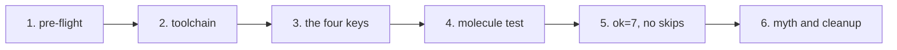

# The demo — one minute fifty-four seconds, annotated

> **You are here:** [Docs home](./index.md) → **The demo** → [Pre-flight](./preflight.md) → [Quickstart](./quickstart.md)

**What you will be able to do:** watch a real Molecule run end to end, understand what each of
its six beats proves, and know exactly which claims it does *not* support.

![Animated terminal recording of this project's demo on Fedora 44: a real `molecule test` run with rootless Podman 5.8.7 and Molecule 26.9.0. It shows the pre-flight check reporting ready with one informational warning, `molecule --version` and the driver list including `podman`, the four keys in `molecule.yml` that make systemd PID 1, the verify recap reporting `ok=7` alongside `systemd is PID 1.` and `molecule-demo.service is active.`, a plain `podman run --systemd=always` container reporting `running`, the same container re-run with `--privileged` reporting `degraded`, and cleanup leaving no containers behind.](../examples/demo/demo.gif)

*866 × 534 px · 248 frames · ~1 min 54 s · 2.1 MB. Plays inline on GitHub with no build step,
no JavaScript and no external viewer.*

This page is the long version of the GIF. Every line quoted below is copied from
[`examples/demo/demo.txt`](../examples/demo/demo.txt), which is the exact terminal output of the
recording — 26 KB, greppable, and the source of every quoted command on this site. Nothing here
is re-typeset from memory.

> **How the recording works, in one paragraph.** The demo is not hand-animated.
> [`examples/demo/record.py`](../examples/demo/record.py) runs every command for real in a
> pseudo-terminal, and the callout cards pull their lines out of the captured output — so if a
> claim stops being true, the card goes empty rather than lying. It runs from a `git clone` at a
> neutral path, `/tmp/molecule-demo-home/proj`, not from a checkout, so the video can never show
> the recording machine's home directory or username; a leak check refuses to write the GIF if
> either reaches the frames. Because it runs from a clone, the video always shows the *committed*
> state and cannot drift from what a reader downloads. And it is rendered by Pillow alone — no
> asciinema, no ffmpeg, no headless browser, no network. Full details, including how to re-record
> it: [`examples/demo/README.md`](../examples/demo/README.md).

---

## The flow of the demo



**What this shows:** the six beats of the demo, in the order they appear. It is a single straight
line, not a decision tree — each beat depends on the one before it having worked, and each one
checks something the previous one has not yet checked.

A text description of the diagram, in reading order, for anyone who cannot see it. Beat 1 is the
pre-flight check: does this machine have the seven things it needs. Beat 2 is the toolchain:
Molecule is installed and the `podman` driver exists. Beat 3 is the crux: the four keys in
`molecule.yml` that make `systemd` the first process in the container. Beat 4 is the run itself,
`molecule test`, which creates the container, converges, verifies and destroys. Beat 5 is the
non-vacuity check: the recap shows `ok=7` and nothing was skipped, so the assertions really ran.
Beat 6 is the folklore test — the same container with `--privileged` reports `degraded` rather
than `running` — followed by cleanup, after which no container remains.

---

## Beat 1 — Pre-flight: is this machine ready?

**What you see.** A card of narration, then one command:

```console
$ bash docs/scripts/molecule-preflight.sh 2>&1 | sed "s/\b$USER\b/youruser/g"
Molecule + Podman + systemd pre-flight check
host: Linux x86_64

== 1. Control groups (cgroups)
  PASS  cgroup v2 is in use (cgroup2fs)

== 2. Podman (the container engine)
  PASS  podman found: podman version 5.8.7
        major version 5 is supported
```

Seven numbered sections later, the run ends like this:

```console
== 6. Molecule and the Podman driver
  PASS  molecule 26.9.0
  PASS  the 'podman' driver is available (from molecule-plugins)

== 7. The containers.podman Ansible collection
  WARN  containers.podman is not installed yet
        You do not need it installed up front. 'molecule test' installs it from
        requirements.yml during the 'dependency' step. Run 'ansible-galaxy collection
        install containers.podman' if you want it now.

----------------------------------------
RESULT: READY WITH WARNINGS - 1 warning(s), no hard failures
You can continue. Read each WARN line before you start.

[exit 0]
```

**What it proves.** The machine can run this at all. Every check passes except one, and that one
is a `WARN` rather than a failure because the thing it wants — the `containers.podman` Ansible
collection, the connection plugin Ansible uses to reach into the container — is installed by
`molecule test` itself during the `dependency` step, and you can see that happening in beat 4.

The `sed` in the command is not cosmetic and not a filter on the result: it replaces the
recording machine's login name with a placeholder so the published video cannot leak it. The
check itself is unmodified.

**Go deeper.** The [pre-flight page](./preflight.md) lists all seven checks, says why each one
exists, and gives the fix for each. The demo shows the result; the page explains the questions.

---

## Beat 2 — The toolchain: Molecule, and the driver that is not in Molecule

**What you see.** Two commands, one of which prints a long list:

```console
$ molecule --version; echo; molecule drivers | grep -x podman
molecule 26.9.0 using python 3.14
    ansible:2.21.4
    vagrant:26.9.28 from molecule_plugins
    podman:26.9.28 from molecule_plugins requiring collections: containers.podman>=1.8.1
    ec2:26.9.28 from molecule_plugins
    azure:26.9.28 from molecule_plugins
    containers:26.9.28 from molecule_plugins requiring collections: ...
    docker:26.9.28 from molecule_plugins requiring collections: ...
    default:26.9.0 from molecule
    gce:26.9.28 from molecule_plugins requiring collections: ...
    openstack:26.9.28 from molecule_plugins requiring collections: ...

podman

[exit 0]
```

*(Three lines are elided inside the driver list, where the output runs off the right edge of the
100-column recording; the trailing `...` marks where. Nothing is reordered or re-worded.)*

**What it proves.** Two things, and the second is the one that catches people. Molecule is
`26.9.0` — [calendar versioning](https://calver.org/), not "version 6" or "version 7", which is
what most tutorials on the internet still say. And the `podman` driver exists, because the
`grep -x podman` at the end prints a bare `podman`.

The driver is the reason that second check exists. Molecule does not ship it. It comes from the
separate **`molecule-plugins`** package, which is in no distribution's package repository — so
`molecule drivers` listing `podman` is a fact you have to verify rather than assume, and if it
is missing, nothing in the rest of the demo can work.

**Go deeper.** The [`podman` driver row](./systemd-in-containers.md) on the crux page, and
[`molecule-plugins` is in NO distro repository](./install/index.md) in the install index. The full
driver list and what each one does is in [the CLI reference](./reference/cli.md).

---

## Beat 3 — The crux: four keys in `molecule.yml`

**What you see.** A file, not a command. Four lines are highlighted:

```yaml
driver:
  name: podman

platforms:
  - name: instance
    image: registry.access.redhat.com/ubi9/ubi-init:latest
    command: /sbin/init
    override_command: true
    systemd: always
    privileged: false
    groups:
      - molecule

provisioner:
  name: ansible
  inventory:
    host_vars:
      instance:
        ansible_connection: containers.podman.podman
```

**What it proves.** This is the whole subject of the site, in one file. Three keys make
`systemd` the first process inside the container — `command: /sbin/init` says what runs as
[PID 1](./glossary.md), `override_command: true` stops Molecule replacing that command
with its own sleep loop, and `systemd: always` turns on Podman's systemd mode. The image is
prebuilt and already contains `systemd`, so there is no Dockerfile and no build step.

The fourth highlighted line is `groups: [molecule]`, and it is the one almost every tutorial
forgets. Molecule builds its Ansible groups from this list, and there is **no implicit
`molecule` group** — a playbook that says `hosts: molecule` without it matches nothing at all.
That is not a crash; it is a silent false pass, and beat 5 is about catching exactly that.

Note also `privileged: false`, which is the correct value, and beat 6 is what happens when you
change it.

**Go deeper.** The [systemd in containers](./systemd-in-containers.md) page — the four keys
explained, the flag-by-flag verdict table, and the eight myths. Every key above is specified in
[`molecule.yml` reference](./reference/molecule-yml.md), and the canonical file itself lives once
and only once in [`REFERENCE-CONFIG.md` §2b](./REFERENCE-CONFIG.md).

---

## Beat 4 — The run: `molecule test`

**What you see.** Eight actions execute: `dependency`, `destroy`, `create`, `converge`,
`idempotence`, `verify`, `cleanup`, `destroy`. The `dependency` step installs the
`containers.podman` collection the pre-flight script warned about:

```console
INFO     default ➜ dependency: Executing
  │ ansible-galaxy collection
  │   install
  │ --requirements-file
  │ .../examples/systemd-unit/molecule/default/requirements.yml
  │ Starting galaxy collection install process
  │ Nothing to do. All requested collections are already installed. If you want to reinstall them,
  │   consider using `--force`.
  └─ Return code: 0 ─────────────────────────────────────────────────────────────────
INFO     default ➜ dependency: Executed: Successful
```

*(The path is elided here because the recording shows a 100-column terminal and the full
`/tmp/molecule-demo-home/proj/…` path wraps across three rows on screen. The transcript has it
unwrapped.)*

Then the verify play runs, and two tasks are the entire point of the exercise:

```console
  │ TASK [Confirm systemd is the top process] **************************************
  │ ok: [instance] => {
  │     "changed": false,
  │     "msg": "systemd is PID 1."
  │ }
```

```console
  │ TASK [Confirm systemd is running the managed service] **************************
  │ ok: [instance] => {
  │     "changed": false,
  │     "msg": "molecule-demo.service is active."
  │ }
```

A third task prints the real systemd state, non-fatally:

```console
  │ TASK [Print the diagnostics] ***************************************************
  │ ok: [instance] => {
  │     "sd.stdout_lines": [
  │         "running",
  │         "  UNIT LOAD ACTIVE SUB DESCRIPTION",
  │         "0 loaded units listed."
  │     ]
  │ }
```

**What it proves.** Not "the playbook ran". Not "the exit code was 0". The init system is
[PID 1](./glossary.md) inside a rootless, unprivileged container, and the
`.service` unit the test installed and started is **active** — which is the claim a role that
manages a service actually has to be able to prove.

`0 loaded units listed` is the `systemctl --failed` line and it means no unit failed on this
host. That is the best case, not the guaranteed one: `degraded` is also a correct rootless
outcome, and the converge step waits for *running or degraded* rather than insisting on
`running`.

**Go deeper.** [Quickstart](./quickstart.md) to run this yourself, and
[`examples/systemd-unit/`](../examples/systemd-unit/) for the project on disk. The `verify.yml`
that produces these two messages is in [`REFERENCE-CONFIG.md` §7.2](./REFERENCE-CONFIG.md).

---

## Beat 5 — The non-vacuity check: `ok=7`, and nothing skipped

**What you see.** The last line of the verify play:

```console
  │ PLAY RECAP *********************************************************************
  │ instance                   : ok=7    changed=0    unreachable=0    failed=0    skipped=0
  │   rescued=0    ignored=0
```

and the scenario summary:

```console
SCENARIO RECAP
default                   : actions=8  successful=7  disabled=0  skipped=0  missing=0  failed=0
```

**What it proves.** This is the site's signature lesson, and it is the beat most people skip.

**`molecule test` exiting `0` does not prove your assertions ran.** A play that matches no hosts
is not a failure — it is reported as `skipping: no hosts matched`, the recap still reads
`failed=0`, and the command still exits `0`. This is not a hypothesis; it happened here, to the
canonical configuration on this very site, which passed three independent reviews because it is
syntactically perfect and semantically plausible. The full transcript of that empty run is in
[`examples/VERIFICATION.md`](../examples/VERIFICATION.md), defect DBG-1.

So the check is two conditions, and both are required:

| # | Condition | What a healthy run looks like | What it means if you see it |
|---|---|---|---|
| 1 | **The `PLAY RECAP` shows `ok=N` with `N > 0`** | `instance : ok=7 … failed=0 … skipped=0` | `ok=0`, or no `PLAY RECAP` line for your instance at all, means nothing ran. |
| 2 | **Zero `skipping: no hosts matched` lines anywhere in the output** | none — grep the transcript and find none | One appearing anywhere means that play asserted nothing, whatever the exit code says. |

`ok=7`, not `ok=0`. And in this recording, `grep -c "no hosts matched"` on
[`demo.txt`](../examples/demo/demo.txt) returns nothing at all.

**Go deeper.** The first entry in the [troubleshooting reference](./troubleshooting.md) —
*"`skipping: no hosts matched` on every play — and `molecule test` still exits 0"* — is the
one-second habit and the full diagnosis.
[`REFERENCE-CONFIG.md` §2d](./REFERENCE-CONFIG.md) is the canonical statement of the same
two conditions.

---

## Beat 6 — The myth, and the cleanup

**What you see.** The same thing done by hand in plain Podman, with one flag doing the work:

```console
$ podman run -d --name demo --systemd=always registry.access.redhat.com/ubi9/ubi-init >/dev/null && sleep 4 && podman exec demo systemctl is-system-running; podman rm -f demo >/dev/null
running

[exit 0]
```

Then the folklore version, with the flag nearly every tutorial tells you to add:

```console
$ podman run -d --name demo --privileged --systemd=always registry.access.redhat.com/ubi9/ubi-init >/dev/null && sleep 5 && podman exec demo systemctl is-system-running; podman rm -f demo >/dev/null
degraded

[exit 0]
```

Then cleanup, and the proof that nothing is left behind:

```console
$ cd examples/systemd-unit && molecule destroy && podman ps -a
...
SCENARIO RECAP
default                   : actions=3  successful=2  disabled=0  skipped=0  missing=0  failed=0

CONTAINER ID  IMAGE       COMMAND     CREATED     STATUS      PORTS       NAMES

[exit 0]
```

**What it proves.** Two things, and the second one is why the site exists.

First, that Molecule is automating something real: `--systemd=always` is all it takes. No
`--privileged`, no `policy.json` edits, no `setsebool container_manage_cgroup`. That advice is
everywhere on the internet and most of it is Docker-era folklore.

Second, that the folklore is not merely useless but **actively harmful**. Adding `--privileged`
turns a `running` system into a `degraded` one. It weakens the sandbox — and it breaks the init
system, because privileged mode unmounts `/sys`, so three of `systemd`'s own units can no longer
mount. The real fix was the narrower flag that was already there. This is documented as a
contradiction in the driver documentation, in
[`STRUCTURE.md` §8 C-1](./STRUCTURE.md).

The cleanup is the last beat for a reason: the whole promise of the tool is that the machine is
disposable. `podman ps -a` printing its header row and nothing else is that promise kept.

**Go deeper.** The myth table on [systemd in containers](./systemd-in-containers.md), the flag
verdict table, and the [troubleshooting reference](./troubleshooting.md) if your own run reports
`degraded` for a different reason.

---

## What the demo does not show

Stated plainly, because a demo that overstates its coverage teaches the wrong lesson.

| Not shown | What is true, and where it is covered |
|---|---|
| **Rootful Podman** | Every result here was measured running **rootless**, as an unprivileged user. That is the configuration this whole site uses. The [rootless setup page](./install/rootless-podman.md) explains `subuid` and `subgid`; nothing here has been tested as `root`. |
| **cgroup v1** | Not tested, and not worth testing. Podman 6.0 removed cgroup v1 support entirely, and `systemd` as PID 1 needs the cgroup v2 hierarchy. If your host is still cgroup v1, the pre-flight script says so in check 1. |
| **A macOS or Windows host** | Not filmed. Containers run inside a Linux virtual machine on macOS, which is a different setup with its own page — and that page is [documented from research, not executed here](./install/macos.md). |
| **The cloud, Vagrant, EC2, Azure, GCE or OpenStack drivers** | Not touched. The demo uses exactly one driver, `podman`, from the `molecule-plugins` package. The [CLI reference](./reference/cli.md) lists the others. |
| **A multi-scenario project** | The run is **one scenario**, `default`, in one project. A project can hold several, which is a different shape with its own traps — notably the `group_vars` precedence trap. That is [multi-scenario](./authoring/multi-scenario.md), and there is a runnable pair at [`examples/multi-scenario/`](../examples/multi-scenario/). |
| **A custom image or a Dockerfile** | The scenario uses a prebuilt image, `registry.access.redhat.com/ubi9/ubi-init:latest`, so there is no build step. Building your own is [custom images](./authoring/custom-images.md), and one of those two Containerfiles has never been built at all. |
| **A rootless run that ends in `degraded` for a legitimate reason** | The run shown is the best case. The converge step accepts `running` **or** `degraded`, and a healthy rootless run can legitimately end degraded. ["Why is `degraded` not a failure?"](./systemd-in-containers.md) is the page that covers it. |
| **Ubuntu, Arch and Mageia hosts** | Not filmed. Those install pages are documented from package metadata and upstream sources, and every claim on them that could not be confirmed is labelled **UNVERIFIED** in place. See the honest caveat in the [status block](../README.md#status--what-is-verified-and-what-is-not). |

And one thing the demo deliberately does **not** do: it does not claim a passing run for the four
platforms that have not been run. Every number in the video came from one host —
**Fedora 44, x86-64, rootless Podman 5.8.7, SELinux Enforcing, cgroup v2** — and the recording
machine is stated on the video's own title card.

---

## Next

- **Run it yourself** → [Quickstart](./quickstart.md), then
  [`examples/systemd-unit/`](../examples/systemd-unit/).
- **Get the four keys right on your own role** → [Build your own workflows](./authoring/index.md).
- **Understand the crux properly** → [systemd in containers](./systemd-in-containers.md).
- **Something in the run broke** → [Troubleshooting](./troubleshooting.md).
- **Check any quote above against the raw transcript** →
  [`examples/demo/demo.txt`](../examples/demo/demo.txt), or
  [`examples/VERIFICATION.md`](../examples/VERIFICATION.md) for the defect list.
