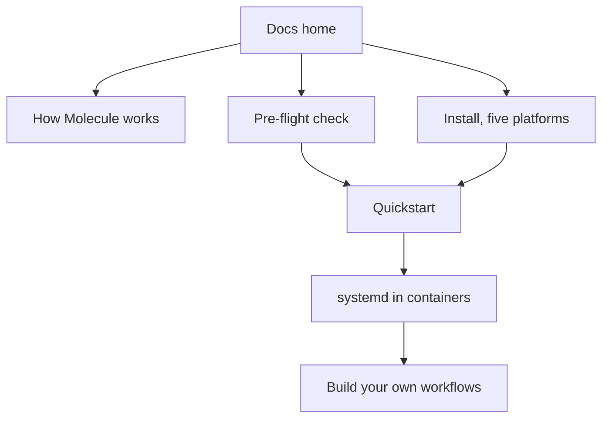

# Documentation home

> **You are here:** **Docs home** → [How Molecule works](./concepts/how-molecule-works.md) → [Pre-flight](./preflight.md) → [Install](./install/index.md) → [Quickstart](./quickstart.md) → [The demo](./demo.md)

**What you will be able to do:** find the one page that answers your question, from any page,
in one click.

---

## New here?

> ### 👉 Never used Ansible, Molecule or Podman? Start at the [quickstart](./quickstart.md).
>
> It is about 15 minutes *(an unmeasured estimate, not a timed figure — see the Quickstart
> row below)*, it costs nothing, and it gets one real test green on your own
> machine. Install your tools first — [pick your platform](./install/index.md) — and if you
> want to be sure your machine is ready, run the ten-second
> [pre-flight check](./preflight.md).

This site teaches one specific thing: **how to test your own Ansible content automatically,
using Molecule and Podman, on a laptop or in Continuous Integration (CI), for free.** If that
is what you need, you are in the right place. If you are looking for a general introduction to
Ansible itself, [docs.ansible.com](https://docs.ansible.com/) is free and better than anything
here.

---

## What Molecule is, in plain language

**Molecule** is a test harness for Ansible. You write a role, a playbook or a collection; Molecule
builds a small throwaway machine for it, applies your work there, checks that the result is what
you said it should be, and throws the machine away. The machine is brand new every run, so a
passing test is evidence rather than a memory.

**Podman** is the container engine that builds that machine. It runs without root privileges,
needs no background daemon, and is free.

**And the point of the whole thing** is that the machine is a **container running `systemd`** —
the init system that starts services on Linux. Most container images contain no `systemd` at
all, so a role that installs and starts a service cannot be tested in one. Getting that to work
correctly, in a way that survives contact with real folklore, is what most of this site is
about.

Read the longer version: [How Molecule works](./concepts/how-molecule-works.md).

---

## The whole site

**What this shows:** the recommended order — understand the idea, check your machine, install,
run one test, then the part that matters, then build your own.

A text description of the diagram, in reading order. Everything starts at the docs home, which
branches three ways. The first branch is *How Molecule works*, the mental model with no
commands in it. The second is the *Pre-flight check*, a ten-second read-only test of your
machine. The third is *Install*, which fans out to one page per platform. The pre-flight check
and the install pages both lead to the *Quickstart*, where you run one real test. The
quickstart leads to *systemd in containers*, the crux of the site. That leads to *Build your
own workflows*, the seven-page authoring section, which is the end of the learning path.
Troubleshooting and the glossary sit off this path deliberately: they are references you reach
for when something has already gone wrong, not steps you walk in order.

---

## Pick your starting point

| If you are… | Go to |
|---|---|
| **New to all of it.** Never used Ansible, Molecule or Podman. | [Install your platform](./install/index.md) → [Quickstart](./quickstart.md) |
| **Comfortable with Ansible, new to Molecule and Podman.** | [How Molecule works](./concepts/how-molecule-works.md) → [Quickstart](./quickstart.md) |
| **Just want the commands.** | [Quickstart](./quickstart.md) → [Usage reference](./usage.md) |
| **Here to fix something that broke.** | [Troubleshooting](./troubleshooting.md) |
| **Here to test a role that manages a service.** | [systemd in containers](./systemd-in-containers.md) |
| **Here to build a scenario for your own role or collection.** | [Build your own workflows](./authoring/index.md) |
| **Here to watch it work before reading any of it.** | [The demo](./demo.md) — 1 min 54 s, a real recorded run, annotated beat by beat. |

---

## Everything in this site

**Start here**

| Page | What it is | For |
|---|---|---|
| [How Molecule works](./concepts/how-molecule-works.md) | The mental model: what each step of a test does, how Molecule reaches your container, and what it does not do. No commands. | beginner |
| [Glossary](./glossary.md) | Every word this site uses, defined in one or two sentences. | beginner · reference |
| [Pre-flight check](./preflight.md) | One read-only script that tells you in ten seconds whether this machine can run Molecule, Podman and systemd — and which check to fix. | beginner |
| [The demo](./demo.md) | The 1 min 54 s recording, embedded and annotated: six beats, the real transcript quoted, and an explicit list of what it does **not** show. | beginner |
| [Quickstart](./quickstart.md) | Your first green `molecule test`, in about 15 minutes *(unmeasured estimate)*, copy-paste. | beginner |

**Install** — pick your platform, every command verified against a package manager

| Page | What it is | For |
|---|---|---|
| [Install: pick your platform](./install/index.md) | The install pattern that works, the four requirements, and the version table for all five platforms. | beginner |
| [Fedora](./install/fedora.md) | The cleanest path, and the platform this site was live-verified on. | beginner |
| [Ubuntu](./install/ubuntu.md) | 26.04 and 24.04 LTS, including the AppArmor check 24.04 needs. | beginner |
| [Arch Linux](./install/arch.md) | The most current platform, and the only Linux one with a native Molecule package. | beginner |
| [macOS](./install/macos.md) | Apple Silicon only. Containers run in a Linux virtual machine; two routes, one clearly better. | beginner |
| [Mageia](./install/mageia.md) | The weakest platform, honestly labelled: three workarounds, one of them unverified. | beginner |
| [Rootless Podman](./install/rootless-podman.md) | The one shared Linux page: what `subuid` and `subgid` are, and how to set them. | intermediate |

**The crux**

| Page | What it is | For |
|---|---|---|
| [systemd in containers](./systemd-in-containers.md) | How to get `systemd` running as PID 1 in a Podman container — the four keys that matter, the flag-by-flag verdict table, and the eight myths that will waste your time. | beginner · intermediate |

**Day-to-day use and reference**

| Page | What it is | For |
|---|---|---|
| [Usage](./usage.md) | The commands, in the order you will actually reach for them. | beginner |
| [CLI reference](./reference/cli.md) | Every `molecule` subcommand and action, with what it does. | reference |
| [`molecule.yml` reference](./reference/molecule-yml.md) | Every key in the settings file, one at a time, with its default. | reference |
| [Environment variables](./reference/env-vars.md) | The variables that change Molecule's behaviour, and which ones exist. | reference |

**Build your own workflows** — the seven pages for testing *your* content

| Page | What it is | For |
|---|---|---|
| [Authoring: index](./authoring/index.md) | The shape of a Molecule project and which of the seven pages you need. | intermediate |
| [Your first scenario](./authoring/your-first-scenario.md) | Writing one from an empty folder, with every decision explained. | intermediate |
| [Project layout](./authoring/project-layout.md) | Which files go where, and the folder shape Molecule hard-requires. | intermediate |
| [Writing tests](./authoring/writing-tests.md) | Writing a `verify.yml` worth trusting, and making your converge idempotent. | intermediate |
| [Custom images](./authoring/custom-images.md) | Building a container image that has everything your role needs. | intermediate |
| [Multi-scenario](./authoring/multi-scenario.md) | Testing more than one thing, and the two-scenario pattern for cleanup. | advanced |
| [CI](./authoring/ci.md) | Running your scenarios automatically on every push, for free. | intermediate |

**When something is wrong**

| Page | What it is | For |
|---|---|---|
| [Troubleshooting](./troubleshooting.md) | The named failures, the message each produces, and the fix. | beginner · reference |
| [FAQ](./faq.md) | One-paragraph answers to the questions people actually ask. | beginner |

**Runnable examples** — real projects, executed end to end

| Example | What it proves |
|---|---|
| [`examples/quickstart/`](../examples/quickstart/) | The toolchain works. Copy, write a file, assert on it. |
| [`examples/systemd-unit/`](../examples/systemd-unit/) | `systemd` is PID 1 in a rootless container and a unit the test installed is active. |
| [`examples/demo/`](../examples/demo/) | The recording pipeline behind [the demo](./demo.md): the GIF, the asciicast, the transcript, and how to re-record it. |
| [`examples/VERIFICATION.md`](../examples/VERIFICATION.md) | The transcripts from those runs, and **every defect they found in these docs** — read it before trusting a config. |

**Maintainer documents** — how this site is built, and the one true copy of every config

| Page | What it is |
|---|---|
| [`REFERENCE-CONFIG.md`](./REFERENCE-CONFIG.md) | **The single source of truth for every code artifact.** If a config appears on two pages, it was copied from here. |
| [`STRUCTURE.md`](./STRUCTURE.md) | The information architecture: which page quotes what, and why. |
| [`VISUAL-SYSTEM.md`](./VISUAL-SYSTEM.md) | The graphics contract for every diagram and icon. |
| [`assets/ATTRIBUTION.md`](../assets/ATTRIBUTION.md) | Licence and provenance for every graphic and every brand name. |

---

## The beginner path

If you read nothing else, read these five pages in this order.

1. **[How Molecule works](./concepts/how-molecule-works.md)** — the idea, with no commands.
2. **[Install](./install/index.md)** → your platform page — [Fedora](./install/fedora.md) ·
   [Ubuntu](./install/ubuntu.md) · [Arch](./install/arch.md) ·
   [macOS](./install/macos.md) · [Mageia](./install/mageia.md)
3. **[Pre-flight check](./preflight.md)** — ten seconds, read-only, tells you what is missing.
4. **[Quickstart](./quickstart.md)** — your first green test.
5. **[systemd in containers](./systemd-in-containers.md)** — the part that is actually hard.

Then, when you want to test your own work: **[Build your own workflows](./authoring/index.md)**.

---

## I want to…

| If you want to… | Go to |
|---|---|
| **install on my operating system** | [Install index](./install/index.md) — then [Fedora](./install/fedora.md) · [Ubuntu](./install/ubuntu.md) · [Arch](./install/arch.md) · [macOS](./install/macos.md) · [Mageia](./install/mageia.md) |
| **see it work before I read anything** | [The demo](./demo.md) — a 1 min 54 s recording of a real run, annotated, with the transcript quoted |
| **get my first test to pass** | [Quickstart](./quickstart.md) |
| **understand systemd in a container** | [systemd in containers](./systemd-in-containers.md) |
| **test my own role** | [Authoring: your first scenario](./authoring/your-first-scenario.md) |
| **test my own playbook** | [Authoring: your first scenario](./authoring/your-first-scenario.md) — a playbook is a `converge.yml` that calls your roles |
| **test my own collection** | [Authoring: project layout](./authoring/project-layout.md) — collections hold their tests inside the collection |
| **run it in CI** | [CI](./authoring/ci.md) |
| **fix something that is broken** | [Troubleshooting](./troubleshooting.md) |
| **find out what a word means** | [Glossary](./glossary.md) |
| **see every `molecule` command** | [Usage](./usage.md) · [CLI reference](./reference/cli.md) |
| **look up a setting in `molecule.yml`** | [`molecule.yml` reference](./reference/molecule-yml.md) |
| **look up an environment variable** | [Environment variables](./reference/env-vars.md) |
| **set up rootless containers** | [Rootless Podman](./install/rootless-podman.md) |
| **find out why my container has empty logs** | [Troubleshooting](./troubleshooting.md) |
| **find out why `degraded` is not a failure** | [systemd in containers](./systemd-in-containers.md) |
| **see the exact canonical config files** | [`REFERENCE-CONFIG.md`](./REFERENCE-CONFIG.md) |
| **run a copy-paste example right now** | [`examples/quickstart/`](../examples/quickstart/) |
| **know what the internet still gets wrong** | [systemd in containers](./systemd-in-containers.md) · [Troubleshooting](./troubleshooting.md) |
| **understand how this site is built** | [`STRUCTURE.md`](./STRUCTURE.md) |

---

## The runnable examples

Two real projects on disk, both executed end to end on real hardware. From a copy of either,
`molecule test` exits `0` with the assertions genuinely executed.

| Example | Run it | Proves |
|---|---|---|
| [`examples/quickstart/`](../examples/quickstart/) | `cd examples/quickstart && molecule test` | The toolchain works: create a container, write a file, assert on it, destroy the container. |
| [`examples/systemd-unit/`](../examples/systemd-unit/) | `cd examples/systemd-unit && molecule test` | `systemd` is PID 1 in a rootless Podman container, and a `.service` unit the test installed is active. |
| [`examples/demo/demo.gif`](../examples/demo/demo.gif) | watch it inline | Both of the above, recorded live: 866 × 534 px, 1 min 54 s, rendered by Pillow from a real session. [Annotated walkthrough →](./demo.md) |

Both were run on Fedora 44 with rootless Podman, SELinux enforcing, cgroup v2, Molecule
`26.9.0` and `ansible-core` `2.21.4`. **The transcripts are real, and
[`examples/VERIFICATION.md`](../examples/VERIFICATION.md) records the seven real defects those
runs found in this documentation** — including a configuration that passed three reviews and
asserted nothing at all. Read it before you trust a config on this site, including the ones
that look most authoritative.

---

## What this site costs

**Nothing, permanently.** No account, no payment method, no paid registry, no paid runner, no
subscription. Every tool is a free package-manager entry, a free Python package, or built into
your operating system. Molecule and Podman are open-source; the container image this site
recommends is free to pull; GitHub's free tier covers the CI. There is nothing here that stops
working because somebody changed a pricing page.

---

## How this site is written

Every version number, flag, package name and environment variable in this site traces to a
research corpus and, where possible, to an executed run. The rules that keep it honest:

- **One true copy of every config.** [`REFERENCE-CONFIG.md`](./REFERENCE-CONFIG.md) holds every
  `molecule.yml`, Containerfile and playbook. Pages quote it; they never re-type it. Seven
  authors re-typing the same YAML is how a wrong value reappears.
- **Unverified is labelled, not guessed.** Where the corpus could not confirm something, the
  page says **UNVERIFIED** rather than inventing a plausible answer.
- **Claims about behaviour are executed, not reviewed.** A claim about Molecule or Ansible is
  not considered verified until it has been run. Three independent reviews approved a config
  that asserted nothing; only execution caught it.
- **Known-wrong advice is a first-class section**, not a footnote — see
  [the myths table](./systemd-in-containers.md).
- **No build step.** Markdown and Mermaid, which GitHub renders natively.

The architecture and the reasoning are in [`STRUCTURE.md`](./STRUCTURE.md).

---

## Attribution

This site names Ansible®, Podman, Molecule, systemd, Fedora, Ubuntu, Arch Linux, macOS, Mageia,
Docker and Mermaid. All product names, logos and brands are the property of their respective
owners; their use here does not imply endorsement. This site is not affiliated with or endorsed
by the Fedora Project, the Arch Linux Project, Red Hat, Inc., Canonical Ltd., or The Linux
Foundation. Full licence and provenance record:
[`assets/ATTRIBUTION.md`](../assets/ATTRIBUTION.md).

---

## Next

- **New to everything?** → [Pre-flight check](./preflight.md) — ten seconds, free, tells you
  what your machine is missing.
- **Ready to install?** → [Install: pick your platform](./install/index.md).
- **Already installed?** → [Quickstart](./quickstart.md) — your first green test, about 15
  minutes.
