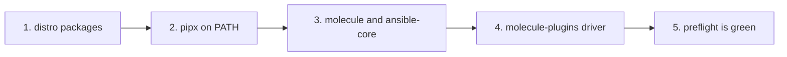
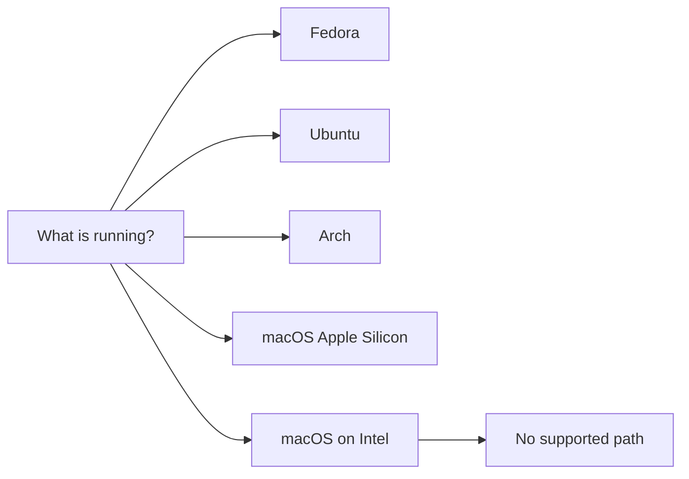

# Install — pick your platform

> **You are here:** [Docs home](../index.md) → **Install** → your platform page → [Quickstart](../quickstart.md)

**What you will be able to do:** choose the right page for your machine, and know in advance
which of your tools will come from your distribution's package manager and which two will come
from Python.

There are five supported platforms. Four are Linux. One is a virtual machine on a Mac. They are
not equally comfortable, and the differences are not marketing — they are real package-version
facts. Read the two tables below, pick your row, open your page.

**Everything here is free.** No page asks for a credit card, a paid registry, a proprietary
installer or a Personal Package Archive (PPA). Every package is open source and available from
your distribution's own free repositories.

---

## Start here: the install pattern that works

Before you open a platform page, read this. It is the single most important thing on this page,
and it is the one step most written-down guides get wrong.

**Molecule will not start unless `ansible-config` is on the same `PATH` as `molecule`.**
`PATH` is the list of folders your shell searches when you type a command name.
Molecule shells out to the `ansible-config` program, and if that program is not next to it,
the command dies immediately.

```bash
molecule --version
```

**You should see — if you got this far:**

```
molecule 26.9.0 using ansible-core 2.20.3
```

**You should see — if you installed Molecule on its own:**

```
ansible-config: not found
```

That second output is the whole reason this section exists. It is not a broken Python install.
It means **`ansible-core` is missing from the environment Molecule runs in.** Installing
`molecule` on its own produces a `molecule` binary that can never work.

The fix is one word: install them **together**, in the same isolated environment.

```bash
# pipx: correct — all three at once
pipx install molecule ansible-core molecule-plugins
```

That single command gives you three things at once:

| Package | What it is | Why Molecule needs it |
|---|---|---|
| `molecule` | the test driver itself | the program you are running |
| `ansible-core` | Ansible's core engine | provides `ansible-config`, which Molecule calls on start-up |
| `molecule-plugins` | the **Podman driver** | the `podman` driver is *not* in `molecule`; it lives here |

**The equivalent two-step route**, if you prefer to add the driver afterwards:

```bash
pipx install molecule ansible-core
pipx inject molecule molecule-plugins
```

**Already in the broken state?** Repair it without starting over:

```bash
pipx inject molecule ansible-core
molecule --version
```

**You should see:**

```
molecule 26.9.0 using ansible-core 2.20.3
```

> **Why this is a real finding, not a style preference.** It was verified directly on the
> research host: `pip install molecule` on its own leaves a binary that exits with
> `ansible-config: not found`. Molecule's own package metadata lists `ansible-core` as a
> *required* dependency, but the raw `pip` form Molecule documents for a single user
> (`python3 -m pip install --user molecule`) does not always put both on the same `PATH`.
> Installing all three together removes the ambiguity entirely.

**The order the whole toolchain goes together:**



**What this shows:** the five stages of a correct install, in order, ending at a green
pre-flight check.

Read left to right. First your distribution's package manager installs Podman and the
networking helpers. Second, `pipx` is installed and its application folder is put on `PATH` so
its commands are findable. Third, `molecule` and `ansible-core` go into the same isolated
environment together, so `ansible-config` sits next to `molecule`. Fourth, `molecule-plugins` is
added, which is what makes the `podman` driver appear. Fifth, the pre-flight script confirms all
of it. Every platform page on this site follows exactly this order.

---

## Pick your platform

Not sure? Run this and read the `ID` field:

```bash
cat /etc/os-release
```

| Platform | Open this page | Podman version you will get | The honest caveat |
|---|---|---|---|
| **Fedora 44** — [fedora.md](./fedora.md) | [Install on Fedora](./fedora.md) | `5.8.1` | **The cleanest path. Start here if you have a choice.** |
| **Ubuntu 26.04 LTS** — [ubuntu.md](./ubuntu.md) | [Install on Ubuntu](./ubuntu.md) | `5.7.0` | AppArmor may block user namespaces — the page shows the one-line check. |
| **Ubuntu 24.04 LTS** — [ubuntu.md](./ubuntu.md) | [Install on Ubuntu 24.04](./ubuntu.md) | `4.9.3` ⚠ | Podman is from **2022**. Works, but stale. AppArmor restriction is confirmed active. |
| **Arch Linux** — [arch.md](./arch.md) | [Install on Arch](./arch.md) | `6.1.2` | The most current platform, and the only Linux one with a native Molecule package. |
| **macOS on Apple Silicon** — [macos.md](./macos.md) | [Install on macOS](./macos.md) | `6.1.2` (inside a virtual machine) | Containers run in a **virtual machine**, not natively. Two routes; one is clearly better. |
| **Mageia 10** — [mageia.md](./mageia.md) | [Install on Mageia](./mageia.md) | `5.7.1` | The weakest platform. Three workarounds, one of them honestly **unverified**. |

### Which page do I open?



**What this shows:** one question at the top splits into five answers, and the one answer that
leads nowhere is an Intel Mac.

Start at the top box: read what `cat /etc/os-release` or System Settings told you. From there,
follow exactly one arrow. `Fedora` leads to [fedora.md](./fedora.md), `Ubuntu` to
[ubuntu.md](./ubuntu.md) — that page covers both the 26.04 and the 24.04 release, and asks you
which one you have. `Arch` leads to [arch.md](./arch.md). `macOS Apple Silicon` leads to
[macos.md](./macos.md). `macOS on Intel` leads to the dead end on the right, explained next.

---

## macOS on an Intel Mac: there is no supported path

If you have an Intel Mac, stop here. This is not a "hard" install or a "requires effort" case.
Three independent upstream decisions have closed the door, and all three would have to be undone:

1. **Podman 6.0 removed Intel Mac support outright.** From the Podman 6.0.0 release notes,
   verbatim: *"Support for running on Intel Macs has been removed."*
2. **Homebrew moved macOS Intel to Tier 3 in September 2026**, with no new pre-compiled bottles.
   Homebrew's own tiers document this as the tier that is supported best-effort only.
3. **The Homebrew `podman` formula is hard-locked to Apple Silicon**, carrying
   `depends_on arch: :arm64`. `brew install podman` is refused on an Intel Mac regardless of
   anything else.

There is no combination of these three that works. We will not give you an inferred recipe and
call it a guide. If you have an Intel Mac and want to use this toolchain, the honest options are
to run Linux on that machine, or to use a remote Linux host — and
[the rootless Podman page](./rootless-podman.md) plus
[the quickstart](../quickstart.md) are where you pick up from there.

---

## The three things every platform needs

Platforms differ in *packages*. They do not differ in *requirements*. These three are the same
everywhere, and every platform page ends by proving all three.

| # | Requirement | What it is, in plain words | If it is missing |
|---|---|---|---|
| 1 | **Control groups version 2** — *cgroup v2* | The kernel feature systemd uses to track which process owns which resource. | Podman 6.0 removed cgroup v1 support entirely, so there is no fallback. |
| 2 | **Rootless identity mapping** — `/etc/subuid` and `/etc/subgid` | A block of user IDs reserved for your account so a container can act as many users without being `root` on the host. | Rootless Podman cannot start. See [rootless-podman.md](./rootless-podman.md). |
| 3 | **Python 3.10 or newer** | Molecule is a Python program and declares `>=3.10` as its minimum. | Molecule refuses to install. All five platforms here already satisfy this. |

> **cgroup** is pronounced *see-group*. It is a Linux kernel feature that partitions resources
> — processor time, memory, devices — into buckets, and tells you which process is in which
> bucket. `v2` is the modern single-hierarchy design. See
> [the glossary](../glossary.md).

---

## The dependency matrix — what comes from where

This is the table to bookmark. Every version below was read from the distribution's own package
index. "Native" means your package manager has it. "**pipx**" means your distribution has **no
package at all** and it comes from Python instead.

| Tool | Fedora 44 | Ubuntu 26.04 LTS | Ubuntu 24.04 LTS | Arch Linux | macOS (Apple Silicon) | Mageia 10 |
|---|---|---|---|---|---|---|
| **Container engine** | `podman` **5.8.1** (dnf) | `podman` **5.7.0** (apt) | `podman` **4.9.3** ⚠ (apt) | `podman` **6.1.2** (pacman) | `.pkg` or `brew` **6.1.2** | `podman` **5.7.1** (dnf) |
| **Ansible** | `ansible-core` **2.20.3** (dnf) | `ansible-core` **2.20.1** (apt) | `ansible-core` **2.16.3** (apt) | `ansible` **14.4.0**, `ansible-core` **2.21.4** (pacman) | `brew install ansible` **14.4.0** | `python3-ansible-core` **2.20.6** (dnf) |
| **Molecule** | **pipx** ⚠ no package | **pipx** ⚠ no package | **pipx** ⚠ no package | `molecule` **26.9.0** (official `extra` repo) ✅ | `brew install molecule` **26.9.0** | `python3-molecule` **6.0.3** ⚠ **2021, unusable** → **pip** |
| **Podman driver** | **pipx** | **pipx** | **pipx** | **pipx** — in no repo either | **pipx** — brew has none | **pip** or a virtual environment |
| **pipx** itself | `pipx` **1.11.0** | `pipx` **1.4.3** | `pipx` **1.4.3** | **`python-pipx`** **1.15.0** ⚠ | `pipx` (brew) | **NOT PACKAGED** → install with pip |
| **git** | `git` **2.53.0** | `git` | `git` | `git` | Xcode command-line tools | `git` **2.52.0** |
| **`newuidmap`** helper | via `shadow-utils-subid` ⚠ **no `uidmap` package exists** | `uidmap` | `uidmap` | via `shadow` — already present | not needed — the virtual machine handles it | **NOT PACKAGED** ⚠ **UNVERIFIED** |
| **Rootless networking** | `passt` | `passt` | `passt` | `passt` | not needed | `passt` **0.20251223** |
| **Linter** (optional) | not verified | `ansible-lint` (universe) | `ansible-lint` (universe) | `ansible-lint` **26.9.0** | `brew` **26.9.0** | `ansible-lint` **26.4.0** |

Three things to read off this table:

- **The Podman driver row is `pipx` on all five platforms.** There is no exception. The
  `molecule-plugins` package — which is where the `podman` driver lives — is in **no**
  distribution repository anywhere. Not Fedora, not Ubuntu, not Arch, not Homebrew, not Mageia.
  Every platform runs one extra command because of this, and every platform page includes it.
- **The pipx package name is not the same everywhere.** Fedora and Ubuntu call it `pipx`. Arch
  calls it **`python-pipx`**. Mageia does not package it at all. There is no `python3-pipx`
  anywhere, and there is no `pipx` on Mageia.
- **Only Arch and Homebrew ship a usable Molecule package.** Fedora's package search for
  `molecule` returns twelve hits and every one of them is a chemistry package, a TeX package or
  a puzzle game. Ubuntu's returns exactly one, and it is not it.

---

## About pipx, honestly

Molecule's own documentation says two things, and we quote them rather than paraphrasing:

> "pip is the only supported installation method."

> "It is highly recommended that you install molecule in a virtual environment."

**Molecule's documentation does not mention `pipx` at all.** We are not going to tell you it
does.

So why does this site use pipx everywhere? Because pipx *is* pip inside a per-application virtual
environment, which satisfies both of the requirements above. It is free, it is MIT-licensed, and
it is the method Ansible's own installation guide documents. Molecule upstream has also begun
recommending the `ansible-dev-tools` metapackage, which pulls in a large bundle of collections
that this site does not need.

If you would rather use pip directly, the raw forms are:

```bash
# Core
python3 -m pip install --user molecule

# With ansible-lint
python3 -m pip install --user molecule ansible-lint

# With the Podman driver
python3 -m pip install --user "molecule-plugins[podman]"

# From source — NOT recommended for anything you depend on
# (see the note below)
python3 -m pip install -U git+https://github.com/ansible/molecule
```

> **Do not use the `git+https` form for anything you depend on.** It installs whatever is on
> `main` **at the moment you run it**, and `main` is a moving target: the same command produces a
> different Molecule on two different days, with no version number to record and no digest to pin.
> That is a supply-chain and reproducibility problem, not a convenience one. It is shown here only
> because Molecule's own documentation lists it. **For a project anyone else will run, install a
> released version** (the `pipx install molecule ansible-core molecule-plugins` form earlier on this
> page) so the version is fixed and auditable. If you genuinely need the development tip, pin the
> commit explicitly: `git+https://github.com/ansible/molecule@<40-char-sha>`.

> **If you take the raw pip route, install `ansible-core` in the same command.** The forms above
> are quoted from Molecule's documentation verbatim; they are the forms most likely to produce
> the `ansible-config: not found` failure described at the top of this page. Add `ansible-core`
> to the same `pip install` line and the problem cannot occur.

**One more official warning**, verbatim, that applies if you are upgrading from an old Molecule:

> "If you upgrade molecule from previous versions, make sure to remove previously installed
> drivers like for instance `molecule-podman` or `molecule-vagrant` since those are now available
> in the `molecule-plugins` package."

Those old, separately-installed drivers are dead. The driver is now one plugin inside
`molecule-plugins`.

---

## What the internet still gets wrong

> **Do not run `podman info --format '{{.Host.Security.SelinuxEnabled}}'`. It fails.**
> On Podman 5.8.7 that template errors with
> `can't evaluate field SelinuxEnabled in type define.SecurityInfo` — the field does not exist.
> To read whether SELinux (Security-Enhanced Linux) is active, use `getenforce`, which is a small
> separate program and always works. To read the whole security block in one go, use
> `{{json .Host.Security}}`. The pre-flight script in [preflight.md](../preflight.md) uses
> `getenforce` for exactly this reason.
>
> **Also: there is no `podman-plugins` package, on any platform, anywhere.** It is a
> Red Hat Enterprise Linux / CentOS habit. Searching for it wastes an afternoon. The thing you
> actually need is the `molecule-plugins` **Python** package.
>
> **Also: `podman info --format '{{.Host.Security.Rootless}}'` *does* work.** That one is
> correct and is the field the pre-flight script uses. Only the SELinux field is broken.

---

## "I want to…" — where to go

| If you want to… | Go to |
|---|---|
| check your machine *before* installing anything | [preflight.md](../preflight.md) |
| install on **Fedora 44** | [fedora.md](./fedora.md) |
| install on **Ubuntu** (26.04 or 24.04 LTS) | [ubuntu.md](./ubuntu.md) |
| install on **Arch Linux** | [arch.md](./arch.md) |
| install on **macOS** (Apple Silicon only) | [macos.md](./macos.md) |
| install on **Mageia 10** | [mageia.md](./mageia.md) |
| understand *why* rootless, in plain language | [rootless-podman.md](./rootless-podman.md) |
| find a fix for an error message | [troubleshooting.md](../troubleshooting.md) |
| look up a word I do not know | [glossary.md](../glossary.md) |
| run my first test | [quickstart.md](../quickstart.md) |
| see the exact canonical config files | [REFERENCE-CONFIG.md](../REFERENCE-CONFIG.md) |

---

## Next

- **Ready to install** → open the page for your platform from the table above.
  [Fedora](./fedora.md) · [Ubuntu](./ubuntu.md) · [Arch](./arch.md) ·
  [macOS](./macos.md) · [Mageia](./mageia.md)
- **Want to check your machine first** → [Pre-flight check](../preflight.md). One read-only
  script, about ten seconds, changes nothing.
- **Want to understand why rootless before touching packages** →
  [Rootless Podman](./rootless-podman.md). The one shared Linux chore, written once.

---

## Attribution

This page displays no brand marks or logos. Brand and licence records live in
[`../../assets/ATTRIBUTION.md`](../../assets/ATTRIBUTION.md). Distribution and product names are
used to identify the software being discussed, not to imply endorsement. The pipx and Molecule
quotations are from their own documentation, cited in [Sources](#sources).

---

## Sources

- <https://docs.ansible.com/projects/molecule/> — Molecule documentation home
- <https://docs.ansible.com/projects/molecule/installation/> — the "pip is the only supported
  installation method" and virtual-environment recommendation, and the obsolete-driver warning
- <https://pypi.org/project/molecule/> — Molecule `26.9.0`, released 2026-09-22, requires
  Python `>=3.10`
- <https://pypi.org/project/molecule-plugins/> — the `podman` driver package; no distribution
  ships it
- <https://docs.ansible.com/ansible/latest/installation_guide/intro_installation.html> — pipx as
  Ansible's own documented method
- <https://pipx.pypa.io/stable/> — pipx, MIT-licensed
- <https://podman.io/docs/installation> — Podman installation per platform
- <https://packages.fedoraproject.org/search?query=molecule> — proves Fedora has no `molecule`
  package
- <https://packages.ubuntu.com/search?keywords=molecule&searchon=names&suite=all&section=all> —
  proves Ubuntu has no `molecule` package
- <https://archlinux.org/packages/extra/any/molecule/> — Arch's native Molecule `26.9.0-1`
- <https://formulae.brew.sh/formula/molecule> — Homebrew's Molecule `26.9.0`
- <https://github.com/podman-container-tools/podman/issues/21422> — the `newuidmap` failure
  mode that Mageia risks
- Internal, reproducible: every command in the install pattern is quoted from
  [`../REFERENCE-CONFIG.md`](../REFERENCE-CONFIG.md) §5; the "install `ansible-core` together
  with `molecule`" finding was verified on the research host
