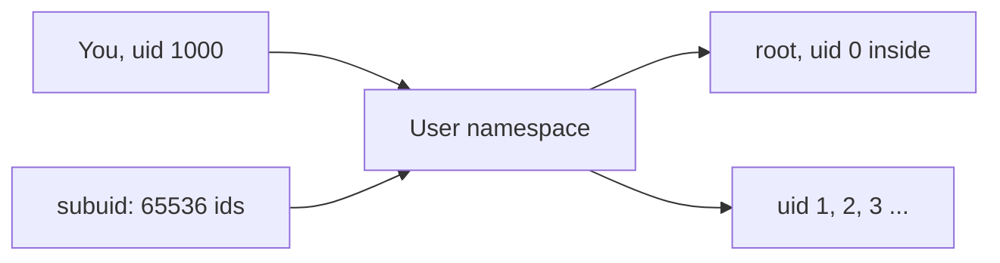

# Rootless Podman — the one shared Linux chore

> **You are here:** [Docs home](../index.md) → [Install](./index.md) → **Rootless Podman** → [Quickstart](../quickstart.md)

**What you will be able to do:** understand why your own user — not `root` — runs your test
containers, and check in four commands whether your machine is set up to do it.

**This page is for the four Linux platforms only.** If you are on macOS, containers run inside
a virtual machine that handles all of this for you — skip to [macos.md](./macos.md). Nothing
here applies to you.

You may not need this page at all. **Arch and Fedora are already done for you.** It exists
because the concept is the same on every Linux platform, and explaining it once is better than
repeating it four times.

---

## What "rootless" means

You have probably heard that Linux has a special user called `root`, and that `root` can do
anything to the machine. That is true. `root` is the administrator account: it can read every
file, change every setting, and delete everything.

**Rootless means your containers run as you, not as `root`.** When you type `podman run`, Podman
does not switch to the administrator account. It stays with your ordinary user account — the one
you made when you installed the system, with a name like `orlando` or `alice` — and it builds a
sandbox around whatever you asked it to run.

**That is not a limitation. It is the point.** Concretely, rootless is the right choice because:

- **There is no root daemon.** With root containers, a background process running as `root` sits
  on your machine the whole time and answers requests from anyone who can reach its socket. That
  socket is often reachable by every user on the machine, and occasionally by the network.
  Rootless has no such process. There is nothing listening, because nothing needs to be
  listening.
- **There is no shared daemon socket.** "Daemon" means a background service. Under root, every
  user's containers are served by **one** shared daemon that runs as `root`, and they all talk to
  it through the same socket. Under rootless, there is no shared daemon and no shared socket.
  Your containers are reachable only through processes you started yourself.
- **A bug in a container is a bug in your user account, not in the whole machine.** A
  vulnerability that a root container could exploit would give an attacker everything. The same
  vulnerability under rootless gives them what your user can already do — which is nothing they
  did not have.
- **It is what everyone actually runs.** Every result, every measurement and every configuration
  in this project was produced on a **rootless** system with SELinux in its `Enforcing` state.
  Following this page puts you on the configuration the rest of the site was written against.

The trade is real and worth naming: rootless containers have a few restrictions. They cannot
load kernel modules, they cannot use most real devices, and their networking is a little more
elaborate. **For testing systemd services — which is what this site is for — none of those
restrictions bite.**

---

## Step 1 — check your ID range

Here is the one non-obvious part, and it is worth two paragraphs.

A container wants to be able to act as *many different users at once*. A systemd service
container might run a process as `root`, another as `systemd-journal`, another as your
application's own user. Each of those is a different user ID — a *UID*, a number the kernel
uses to say who someone is.

A process on your machine can normally only act as **one** UID: its own. Rootless Podman solves
this with a feature called a **user namespace** — a kernel feature that lets a process see a
fresh, private set of user IDs that exist only inside the sandbox. Inside it, UID 0 can be
`root` and UID 1000 can be somebody else, and neither number means anything on your real system.

**But the kernel will not just invent those IDs.** Before it lets your process use UID numbers
inside a namespace, it insists that your account has been *given* a block of those numbers to
use — a reservation, held in two plain-text files:

| File | What it reserves |
|---|---|
| `/etc/subuid` | a range of **subordinate user IDs** for each user |
| `/etc/subgid` | a range of **subordinate group IDs** for each user |

*Subordinate* simply means "IDs you hold, that you are lending to your containers rather than
using yourself."

Check whether your account has one:

```bash
grep "^$USER:" /etc/subuid /etc/subgid
```

**You should see two lines — one from each file:**

```
/etc/subuid:yourname:100000:65536
/etc/subgid:yourname:100000:65536
```

Read that as: *user `yourname` owns the 65,536 user IDs numbered 100000 through 165535, and
likewise 65,536 group IDs in the same range.*

**Why 65,536?** It is the conventional block size, and it is not arbitrary. A full Linux system
image has far more than a handful of accounts, and each `systemd` unit can add its own. A
container running a realistic distribution needs room for tens of thousands of UIDs before
files start landing on the wrong user. 65,536 is the smallest power-of-two-ish block that
comfortably covers a whole system image, and because it is a round number it is easy for
distributions to hand out without colliding. Several users can each have their own 65,536-ID
block, at different starting numbers.

**What breaks without it.** If the range is missing, rootless Podman cannot start properly. The
real-world symptom is a message along the lines of:

```
WARN[0000] Error looking up user UID: ... should be setuid or have filecaps setgid
Falling back to single mapping
```

"**Falling back to single mapping**" means Podman gave up on the whole range and is pretending
your container has exactly one user ID. Most images then fail, because the image expects
several — a `systemd` container reaches `degraded` immediately and never reaches `running`.
This failure mode is documented in
[Podman issue #21422](https://github.com/podman-container-tools/podman/issues/21422).

**You should see the two `PATH` files, and 65,536 on both.** If you see nothing, go to step 2.

---

## Who is already set up, and who is not

This is the whole per-platform difference, in one table.

| Platform | `newuidmap` and `newgidmap` come from | Is your range already there? |
|---|---|---|
| **Fedora 44** | `shadow-utils-subid` — which is **already a hard dependency of `podman`**. There is **no `uidmap` package on Fedora**; the page 404s. | **Yes, automatically.** Installed with Podman, set up when the account was created. |
| **Ubuntu 24.04 / 26.04** | The **`uidmap`** package, which `podman` *recommends* (so a normal `apt install podman` pulls it in). | **Usually yes.** Comes from the same package. |
| **Arch Linux** | The **`shadow`** package, which is always installed. | **Yes, for accounts created after `shadow 4.11.1-3`.** Arch's `useradd` pre-populates `/etc/subuid` and `/etc/subgid` — the one platform where it is genuinely automatic. |
| **Mageia 10** | **Nothing verified.** There is **no `uidmap` package at all** — zero matches across all 38,861 packages. Only `shadow-utils 4.13` and the `lib64subid4` library. | ⚠ **UNVERIFIED.** See below. |

> **Mageia, honestly.** We could not determine whether Mageia's single `shadow-utils` package
> contains the `newuidmap` and `newgidmap` binaries or not, and we will not guess. Check it
> yourself — this is a read-only command and it takes two seconds:
>
> ```bash
> rpm -ql shadow-utils | grep -E 'newuidmap|newgidmap'
> ```
>
> If it prints two paths, you are fine. If it prints nothing, the full situation and the only
> recipe available to try are in [mageia.md](./mageia.md) §4.

### The idea, in one small diagram



**What this shows:** your real identity on the left, a reserved block of 65,536 IDs in the
middle, and a private set of user IDs inside the container on the right.

Read left to right. On the left is you — a real person with a real user ID, 1000, on your
actual machine. In the middle is a user namespace, a private view created by the Linux kernel,
and it is fed by the block of 65,536 subordinate IDs your account reserved in `/etc/subuid` and
`/etc/subgid`. On the right is what the container sees: a `root` at user ID 0, and a long series
of ordinary user IDs after it. None of those IDs on the right mean anything outside the
namespace. Inside, the container can act as `root` and as dozens of other users. Outside, it is
still you, with only the permissions you already had.

---

## Step 2 — add the range if it is missing

If step 1 printed nothing, give your account a block. `usermod` is the command that edits user
accounts, and it is part of the `shadow` package on every platform here.

```bash
sudo usermod --add-subuids 100000-165535 --add-subgids 100000-165535 "$USER"
```

**You should see:** no output. `usermod` is silent when it succeeds.

```bash
grep "^$USER:" /etc/subuid /etc/subgid
```

**You should see, now, the two lines:**

```
/etc/subuid:yourname:100000:65536
/etc/subgid:yourname:100000:65536
```

> **The range `100000`–`165535` is the conventional choice**, and it is used identically on every
> platform in this project. If you have several users on the machine, each needs its *own* range
> — check `/etc/subuid` first to see what is already taken, and pick a different starting
> number if `100000` is in use.

---

## Step 3 — log out and log back in

Log out of your desktop session completely, then log back in. Not just close the terminal — a
full logout.

**You should see:** the same prompt you always see.

**Why this is not optional**, and the reason is the subject of step 4: rootless Podman keeps a
background **pause process** alive, and that process holds a *copy* of the old ranges. Until it
is restarted, the files on disk and the values in the running process disagree, and Podman keeps
using the stale copy. Logging out kills the pause process. Logging in starts a fresh one that
reads the new files.

---

## Step 4 — tell Podman about the change

**This is the single most forgotten step in rootless Podman, on every Linux platform, by people
who have done all the other steps correctly.** We are not exaggerating: it is called out as such
in the upstream documentation and in the research for this project.

```bash
podman system migrate
```

**You should see:** the command returns you to the prompt with no output at all. There is no
success message — silence *is* the success case. Check the exit code:

```bash
echo $?
```

**You should see:**

```
0
```

Upstream documentation says this plainly:

> "Rootless Podman uses a pause process to keep the unprivileged namespaces alive. This prevents
> any change to the `/etc/subuid` and `/etc/subgid` files from being propagated to the rootless
> containers while the pause process is running. […] Instead of doing it manually, `podman system
> migrate` can be used."

> **On Podman 6, add `--migrate-db`**, which also moves the internal database from BoltDB to
> SQLite. If you are on Podman 6 or newer, the full command is:
>
> ```bash
> podman system migrate --migrate-db
> ```

**If you skipped step 3, do it now** — the migration only picks up changes that the fresh
process has already read.

---

## Step 5 — prove it

Two commands. Together they prove rootless mode is working end to end.

### 5a. Ask Podman directly

```bash
podman info --format '{{.Host.Security.Rootless}}'
```

**You should see:**

```
true
```

`true` means Podman is running without root, which is the correct and secure configuration.

> **Use this field, and do not be tempted by the similar-looking SELinux one.** The field
> `{{.Host.Security.SelinuxEnabled}}` **does not exist** — on Podman 5.8.7 it errors with
> `can't evaluate field SelinuxEnabled in type define.SecurityInfo`. If you want the SELinux
> state, use `getenforce`, which is a separate small program and always works. If you want the
> whole security block at once, `podman info --format '{{json .Host.Security}}'` is valid.
> `{{.Host.Security.Rootless}}` — the one on this page — is correct.

### 5b. Run a container and look inside

```bash
podman run --rm alpine id
```

**You should see:**

```
uid=0(root) gid=0(root) groups=0(root)
```

**Now read that carefully, because it looks alarming and it is not.** The command reports UID 0,
which is `root`. On your machine, you are not `root`. You are you, an ordinary unprivileged user.

What happened: the user namespace from the diagram above. Inside the container, the kernel is
presenting a private set of user IDs, and in that private set `0` happens to be mapped to one of
the 65,536 IDs your account borrowed. That borrowed ID, on the real system, is a number with no
special meaning and no powers.

`--rm` is why the container is already gone — it deletes itself on exit. Try it without:

```bash
podman run --rm --name keepme alpine sleep 60 &
podman exec keepme id -u
podman stop keepme
```

**You should see**, from the `exec`:

```
0
```

Same answer, and the same explanation. Inside the container, you are `0`. Outside it, you are
yourself.

### 5c. And the whole host, in one line

```bash
id -u
```

**You should see** your own real user ID — `1000`, or whatever yours is. **Not** `0`. That
difference, between what a container sees and what your machine sees, is the entire point.

---

## It is not macOS

Nothing on this page applies to macOS. On macOS, containers run inside a Linux virtual machine
that Podman creates, and that machine handles identity mapping itself. There is no `/etc/subuid`
to edit on your Mac, `usermod` does not exist there, and `podman system migrate` has nothing to
migrate.

All `podman machine` commands are rootless only by design — root inside the machine is not
something you opt into.

→ **[macOS installation →](./macos.md)**

---

## What the internet still gets wrong

> **"`podman info` proves rootless. If it runs, you are rootless."** Not quite. It proves the
> *engine* is configured for rootless mode. It does not prove the identity mapping works. A
> broken mapping shows up in `podman run`, not in `podman info` — you get
> `Falling back to single mapping` and a container that will not start. Run both commands in
> step 5.
>
> **"You do not need to log out after `usermod`."** You do, because the pause process holds a
> copy of the old ranges. See step 3.
>
> **"Set the sysctl and move on."** Setting `/etc/subuid` is not the last step.
> `podman system migrate` is, and it is the one everybody forgets.
>
> **`podman info --format '{{.Host.Security.SelinuxEnabled}}'`.** That field does not exist and
> the command errors. Use `getenforce`. See step 5a.

---

## Verify

Run the pre-flight script. It checks cgroup v2, `PATH`, rootless mode, `newuidmap` and both
`subuid`/`subgid` files, the SELinux state, your Python version, Molecule, the driver and the
`containers.podman` collection — as one read-only pass that never installs anything and never
asks for `sudo`.

→ **[Run the pre-flight check →](../preflight.md)**

---

## Next

- **Pre-flight passed** → [Quickstart](../quickstart.md). Build your first passing test.
- **A check failed** → [Troubleshooting](../troubleshooting.md), organised by error message.
- **You want a word defined** → [Glossary](../glossary.md).
- **You want to go back and pick a platform** → [Install index](./index.md).

---

## Attribution

This page displays no brand marks or logos. Brand and licence records live in
[`../../assets/ATTRIBUTION.md`](../../assets/ATTRIBUTION.md). Distribution and product names are
used to identify the software being discussed, not to imply endorsement. The pause-process and
identity-mapping quotations are from upstream documentation, cited in [Sources](#sources).

---

## Sources

- <https://raw.githubusercontent.com/podman-container-tools/podman/main/docs/tutorials/rootless_tutorial.md> — the upstream rootless tutorial; the pause-process and `podman system migrate` text in step 4 is quoted from it
- <https://docs.podman.io/en/latest/markdown/podman-system-migrate.1.html> — `podman system migrate` and `--migrate-db`
- <https://wiki.archlinux.org/title/Podman> — pre-populated `/etc/subuid` since `shadow 4.11.1-3`, and the `usermod` recipe, quoted in steps 2 and 3
- <https://github.com/podman-container-tools/podman/issues/21422> — the `Falling back to single mapping` failure mode described in step 1
- <https://docs.ansible.com/projects/ansible/latest/collections/containers/podman/podman_connection.html> — the `{{.Host.Security.Rootless}}` field used in the pre-flight script
- <https://man.archlinux.org/man/extra/podman/podman-rootless.7.en> — rootless mode, per distribution
- <https://www.redhat.com/en/blog/behind-scenes-podman> — what happens behind the scenes in a rootless container
- Internal, reproducible: the per-platform table is
  [`03-platform-install-matrix.md` §7.3](../../.research/03-platform-install-matrix.md) Table C
  and §8 facts 23–24; the commands are quoted from
  [`../REFERENCE-CONFIG.md`](../REFERENCE-CONFIG.md) §6 and §7
