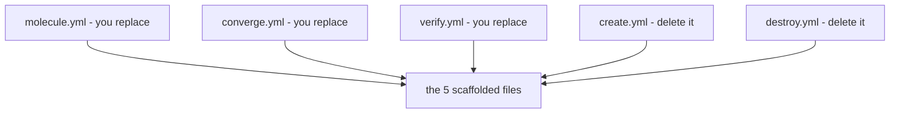
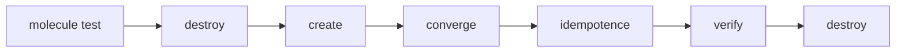

# Quickstart — your first green `molecule test`

> **You are here:** [Docs home](./index.md) → [Install](./install/index.md) → [Pre-flight](./preflight.md) → **Quickstart** → [systemd in containers](./systemd-in-containers.md)

**What you will be able to do:** build a small Molecule project, watch `molecule test` create a
container, run one Ansible task inside it, prove the result, and delete the container — without
leaving this page.

---

## What you are about to do

| | |
|---|---|
| **Time** | About **15 minutes** on a working machine. The first run also downloads a container image, so add 1–2 minutes the very first time. ⚠️ **Unmeasured estimate** — a judgement, not a measurement; this site does not state a GitHub Actions minutes figure for the same reason, and a quoted number nobody timed is worse than a rough one. Treat it as a rough one. |
| **Difficulty** | Low. You paste four files, then type one command. |
| **If it goes wrong** | Medium — but every failure mode is named in [When it does not work](#when-it-does-not-work), and [Troubleshooting](./troubleshooting.md) is one click away. |
| **Cost** | **$0.** No paid service, no account, no payment method. Every tool is a free package-manager entry or a free Python package. |
| **You will NOT do here** | Build a custom container image, or run systemd. Both are the *next* page. This page proves the toolchain works while the problem space is still small. |

**The shape of the task:** create an empty folder, ask Molecule to scaffold a *scenario* into
it, replace three of the files it generated with the ones on this page, add a fourth, and run
`molecule test`. Molecule then takes over: it creates a container, runs your task inside it,
checks the answer, and removes the container.

**Two words you will meet immediately.** A **scenario** is one test setup — its own folder, its
own `molecule.yml`, its own playbook files; `default` is the conventional first name. A
**converge** is the act of applying your work: `converge.yml` does it, `verify.yml` checks the
result.

---

## Before you start

Tick these three boxes. If any is unticked, go to the linked page first.

- [ ] **The pre-flight check is green.** Run it and look for `RESULT: READY`.
      → [`preflight.md`](./preflight.md)
- [ ] **Molecule is installed**, version 26.9.x — there is no Molecule "6" or "7", it uses
      calendar versioning. → your platform page: [Fedora](./install/fedora.md) ·
      [Ubuntu](./install/ubuntu.md) · [Arch](./install/arch.md) ·
      [macOS](./install/macos.md) · [Mageia](./install/mageia.md)
- [ ] **The `podman` driver is listed.** `molecule drivers` must include a line reading
      `podman`. This is a separate package from Molecule itself, and it is not in any
      distribution's repository. → [Install index](./install/index.md)

**macOS readers:** everything below is identical, but you must already have a Podman *machine*
(a small Linux virtual machine) created and started, and — following the recommended route on
[the macOS page](./install/macos.md) — you run these commands **inside that machine's shell**.

---

## 1. Create a working directory

```bash
mkdir molecule-lab
cd molecule-lab
```

**You should see:** no output at all — `mkdir` is silent when it succeeds. Confirm with `pwd`:
**you should see** a path ending in `molecule-lab`, e.g. `/home/you/molecule-lab`.

---

## 2. Generate a scenario

```bash
molecule init scenario default
```

**You should see:** Molecule report that it created a scenario. If it asks *What is the
scenario name?* first, type `default` and press Enter.

Scaffolding creates **exactly five files** — verified, not more and not less:
`molecule/default/molecule.yml`, `create.yml`, `converge.yml`, `verify.yml` and `destroy.yml`.
`requirements.yml` is **not** among them; Molecule does not scaffold it, and step 6 has you add
it. Check with `ls molecule/default` — **you should see** those five names, one per line.

> **If the folder is not empty, Molecule refuses.** That is deliberate, and the message is
> literal: *"Refused to expand templates as destination folder … as it already has content in
> it."* It is protecting you from overwriting work. Start in a new folder or empty the old one.

---

## 3. Replace the generated `molecule.yml`

Open `molecule/default/molecule.yml`, select all, and paste this **exactly**:

```yaml
---
# molecule/<scenario>/molecule.yml
# The smallest scenario that needs NO image build: it runs a prebuilt init image
# (ubi9/ubi-init) that already ships systemd, Python and /sbin/init. Nothing to build,
# nothing to subscribe to. The three keys below therefore ARE the systemd keys -- see
# section 2b, which is this same file with the systemd narrative written out. If you
# genuinely want a non-systemd instance, see the comment on `image` below.

driver:
  name: podman
  # safe_files:            # uncomment only if you have files worth keeping after `destroy`
  #   - foo

platforms:
  - name: instance
    image: registry.access.redhat.com/ubi9/ubi-init:latest
    # Supply chain: `latest` is a moving tag, so two runs are not the same build and the
    # registry decides what you execute. OPTIONAL: append `@sha256:<digest>` to pin it --
    # get one with `podman image inspect --format '{{index .Digest}}' <the image above>`.
    # `ubi9/ubi-init` already contains systemd, Python and /sbin/init, so nothing
    # needs building. See REFERENCE-CONFIG.md section 1.3.
    # For a plain non-systemd image you could use ghcr.io/ansible/community-ansible-dev-tools:latest
    # (it must contain Python) - but it is configured as a NON-init instance, so keep
    # `command:` as the driver's default sleep and do NOT set `systemd:`. NOTE: that image's
    # systemd capability is UNVERIFIED (STRUCTURE.md section 9, item 5) - it was never pulled -
    # which is why it is offered here as an aside and is not the canonical default.
    command: /sbin/init
    override_command: true
    systemd: always
    privileged: false
    # ---------------------------------------------------------------------------
    # REQUIRED. Molecule builds its Ansible groups from this key, defaulting to
    # ["ungrouped"] -- so there is NO implicit `molecule` group. Omit this line and
    # `hosts: molecule` in converge.yml/verify.yml matches nothing: every play reports
    # "skipping: no hosts matched" and `molecule test` still EXITS 0. Silent false pass.
    groups:
      - molecule
    # ---------------------------------------------------------------------------

provisioner:
  name: ansible
  inventory:
    host_vars:
      instance:
        ansible_connection: containers.podman.podman

dependency:
  name: galaxy
  options:
    requirements-file: ${MOLECULE_SCENARIO_DIRECTORY}/requirements.yml

scenario:
  test_sequence:
    - dependency
    - destroy
    - create
    - converge
    - idempotence
    - verify
    - cleanup
    - destroy
```

**You should see:** `podman` on its own line under `driver:`, and the image name under
`platforms:`. **What the parts mean** — deliberately *outside* the block, so the file stays
copy-paste clean.

| Line | What it means |
|---|---|
| `driver: name: podman` | The *driver* knows how to create and destroy containers. Under it, `platforms:` is the list of machines your test needs — each entry becomes one container, and `name: instance` is both the container's name and its hostname in Ansible's inventory. |
| `groups: [molecule]` | **Do not delete this line, and do not "tidy" it away.** It puts `instance` in an Ansible group called `molecule`, which is what `converge.yml` and `verify.yml` target with `hosts: molecule`. Molecule derives its groups from this key and defaults to `["ungrouped"]` — **there is no implicit `molecule` group**. Without it your plays match no hosts, print `skipping: no hosts matched`, run **zero** tasks, and `molecule test` still **exits 0**. A green run that asserted nothing. |
| the image | `ubi9/ubi-init` is a free Red Hat Universal Base Image that already contains systemd, Python and `/sbin/init`, so there is nothing to build and no subscription is needed. **A different image must still contain Python** — Ansible's built-in tasks run Python inside the container, and a bare `alpine` image will fail. |
| `ansible_connection: containers.podman.podman` | The FQCN (Fully Qualified Collection Name) of the Ansible connection plugin, from the **`containers.podman`** collection — *not* `community.docker`, which has no Podman plugin. It drives the `podman` command-line tool: no socket, no `DOCKER_HOST`, anywhere in this path. |
| `test_sequence:` | The ordered list of what `molecule test` does — expanded in [What just happened](#what-just-happened). |
| `privileged: false` | Keep it that way. Much advice says systemd-in-a-container needs `privileged: true`. It does not, and it makes things *worse*: privileged mode unmounts protections under `/sys`, three kernel mounts fail, and the container lands in `degraded` instead of `running`. |

> **This scenario is systemd-capable, and that is deliberate.** The recommended prebuilt image
> contains `systemd`, so the three keys `command:` / `override_command:` / `systemd:` are set.
> An earlier version of this page called the scenario *"no systemd"* while configuring exactly
> these three keys — a label that contradicted its own body. The honest description is *"the
> smallest scenario that needs no image build"*, and keeping the systemd keys means the same
> file is also the starting point for [systemd inside a container](./systemd-in-containers.md).
> If you truly want a non-systemd instance, the comment on `image` above says what to change —
> and note that the image it names has **unverified** systemd capability, which is why it is not
> the default.

---

## 4. Replace the generated `converge.yml`

The file that does the actual work. Open `molecule/default/converge.yml`, select all, and paste:

```yaml
---
# molecule/<scenario>/converge.yml
- name: Converge
  hosts: molecule
  gather_facts: false
  tasks:
    - name: Write a marker file
      ansible.builtin.copy:
        dest: /tmp/molecule-was-here
        content: "hello from molecule\n"
        mode: "0644"

    - name: Read the marker file back
      ansible.builtin.stat:
        path: /tmp/molecule-was-here
      register: marker
```

**You should see:** three lines mentioning `molecule-was-here` — one `copy` task that writes it,
one `stat` task that looks for it.

**In plain language:** the first task writes a small text file into the container at
`/tmp/molecule-was-here`. The second asks whether the file is there and stashes the answer in a
variable called `marker`. `stat` is Ansible's way of asking "does this path exist, and what are
its properties?" — it prints nothing on success.

---

## 5. Replace the generated `verify.yml`

This is the file that decides pass or fail. Open `molecule/default/verify.yml`, select all, and
paste:

```yaml
---
# molecule/<scenario>/verify.yml
- name: Verify
  hosts: molecule
  gather_facts: false
  tasks:
    - name: Read the marker file back
      ansible.builtin.stat:
        path: /tmp/molecule-was-here
      register: marker

    - name: Assert the marker file exists and has the right content
      ansible.builtin.assert:
        that:
          - marker.stat.exists
          - marker.stat.checksum is defined
        fail_msg: The marker file is missing. Converge did not run.
        success_msg: The marker file is there.

    - name: Assert the file content
      ansible.builtin.slurp:
        src: /tmp/molecule-was-here
      register: marker_content

    - name: Check the content
      ansible.builtin.assert:
        that:
          - "'hello from molecule' in (marker_content.content | b64decode)"
        fail_msg: Unexpected content in the marker file.
        success_msg: The content is correct.
```

**You should see:** the phrases `The marker file is there.` and `The content is correct.` —
those are what print on success.

**In plain language:** `slurp` reads a file and returns it as base64 (text-safe) data, which
`b64decode` turns back into text. `assert` compares what it finds against what you said should
be there, and stops the run with `fail_msg` if they disagree.



**What this shows:** three of the five scaffolded files — `molecule.yml`, `converge.yml`
and `verify.yml` — are replaced by you, and the other two are deleted.

> **Delete `create.yml` and `destroy.yml`. Do not fill them in.** Molecule scaffolds both because
> the *default* driver needs them. Under the `podman` driver they are actively harmful: Molecule
> resolves a scenario's own `create.yml` **before** the driver's, so yours **overrides** the
> driver's real playbook. The `create` step then runs only the inert local stub, reports
> `Executed: Successful`, and **no container is ever built** — so `converge` dies with
> `Command execution failed: Container 'instance' not found`.
>
> Under `podman`, `molecule.yml` **is** the create/destroy configuration. The resulting folder
> holds four files: `molecule.yml`, `converge.yml`, `verify.yml` and `requirements.yml` (step 6).

---

## 6. Add `requirements.yml` and `cleanup.yml`

### `requirements.yml`

This is a new file, not a replacement. Create `molecule/default/requirements.yml` with exactly
this content:

```yaml
---
# molecule/<scenario>/requirements.yml
collections:
  - name: containers.podman
    version: ">=1.10.0"
```

**You should see:** two lines naming the `containers.podman` collection.

**Why this file is not scaffolded:** Molecule does not create it, yet the generated
`molecule.yml` points at it anyway. `molecule test` reads it during its first step
(`dependency`) and installs the collection for you, so you never need `ansible-galaxy` by hand.
One line deserves a second look: `requirements-file:
${MOLECULE_SCENARIO_DIRECTORY}/requirements.yml` is an environment variable Molecule sets for
you, pointing at the scenario's own folder — do not hard-code a path. **Do not add
`community.docker`**; it is not needed here and invites the confusion this site exists to
remove.

### `cleanup.yml`

The `test_sequence` in step 3 calls a `cleanup` step, and Molecule does **not** scaffold a
`cleanup.yml` for it. Create `molecule/default/cleanup.yml`:

```yaml
---
# molecule/<scenario>/cleanup.yml
- name: Cleanup
  hosts: localhost
  connection: local
  gather_facts: false
  # no_log: "{{ molecule_no_log }}"
  tasks:
    # Developer must implement. Usually: remove files/directories created during the run.

    - name: Remove the instance config file
      ansible.builtin.file:
        path: "{{ molecule_instance_config }}"
        state: absent
```

**Why:** without it, every run prints
`WARNING [default > cleanup] Executed: Missing playbook (Remove from test_sequence to suppress)`
and the final recap reads `missing=1`, which looks like something is broken on your first run.
The stub above is enough; add real cleanup tasks only if your scenario leaves files behind. Note
it targets `localhost`, not `molecule` — it runs on your host, after `verify`, before the last
`destroy`.

> **Do not confuse this with `create.yml` / `destroy.yml`.** Those two you **delete** — they
> override the driver's own playbooks. `cleanup.yml` has no driver equivalent, so shipping it is
> always safe.

---

## 7. Run it

```bash
molecule test
```

**You should see** the eight steps from `test_sequence`, in this order, then a pass:

```console
==> default: dependency
==> default: destroy
==> default: create
==> default: converge
==> default: idempotence
==> default: verify
==> default: cleanup
==> default: destroy

TASK [Verify : Read the marker file back] **********************************
ok: [instance]

TASK [Verify : Assert the marker file exists and has the right content] ***
ok: [instance] => {
    "changed": false,
    "msg": "The marker file is there."
}

TASK [Verify : Check the content] *****************************************
ok: [instance] => {
    "changed": false,
    "msg": "The content is correct."
}

==> default: verify succeeded
PLAY RECAP ****************************************************************
instance  : ok=3  changed=1  unreachable=0  failed=0
```

> **Honest note on this block:** the pre-flight output earlier was captured from a real run.
> This one is the *expected shape* of a successful run, assembled from Molecule's own step names
> and Ansible's output format — not a transcript, and exact spacing and recap lines will differ.
> Watch for three things: the step banners in order, the two `ok: [instance]` results carrying
> your success messages, and the final `verify succeeded`.

If you see `molecule test` end in `verify succeeded`, **you are done** — go to
[What just happened](#what-just-happened).

> #### Did my test actually run? — a green `molecule test` is not proof
>
> **Read this before you believe the pass above.** A play that matches no hosts is **not** a
> failure: it reports `skipping: no hosts matched`, `failed=0`, and the command **exits 0**. So
> "exit 0" and "my assertions ran" are two different claims, and only one of them is implied by
> the exit code.
>
> This is not hypothetical. A version of this very scenario — with the `groups:` line missing
> from `molecule.yml` — printed `skipping: no hosts matched` for **every** play, ran **zero**
> assertions, and still exited `0`:
>
> ```console
> PLAY [Verify] *******************************************************************
> skipping: no hosts matched
> ...
> SCENARIO RECAP
> default                   : actions=8  successful=6  disabled=0  skipped=0  missing=1  failed=0
> $ echo $?
> 0
> ```
>
> **The check, on your own run — two conditions, both required:**
>
> 1. **The `PLAY RECAP` shows `ok=N` with `N > 0`.** For this scenario a healthy run looks like
>    `instance : ok=4 changed=0 unreachable=0 failed=0 skipped=0`. `ok=0`, or no `PLAY RECAP`
>    line for `instance` at all, means nothing ran.
> 2. **There are zero `skipping: no hosts matched` lines** anywhere in the output. One appearing
>    anywhere means that play asserted nothing, whatever the exit code.
>
> Also check the recap reads `missing=0` — a non-zero `missing` means your `cleanup.yml` from
> step 6 is missing. And the third, free signal: the two `success_msg` strings above
> (`The marker file is there.` and the content check) should be visible in the output. Absent
> means the asserts did not execute.
>
> **One line in `molecule.yml` decides all of this:** `groups: [molecule]`, in the block from
> step 3.

---

## 8. Run one step at a time

When something fails, `molecule test` reruns everything from the top every time. These four
commands are how you debug.

```bash
molecule create
```

**You should see:** a `CREATE` banner. `podman ps` then shows one line whose `NAMES` column
contains `instance`, status `Up`.

```bash
molecule converge
```

**You should see:** `CONVERGE`, then `TASK [Converge : Write a marker file]` with
`changed: [instance]` — the word `changed` is the important one, it means the task did something.

```bash
molecule verify
```

**You should see:** `VERIFY`, the two `ok: [instance]` assertions, and `verify succeeded`.

```bash
molecule destroy
```

**You should see:** a `DESTROY` banner, after which `podman ps` shows no rows.

---

## What just happened

Molecule ran eight steps, in the order your `molecule.yml` listed.



**What one `molecule test` command does, step by step.**

*You type `molecule test` once and Molecule does seven more things in order: remove any container
left over from a previous run, create a fresh one, converge it, converge it a second time to
check nothing changed, verify the result, and destroy it again. Two of the eight steps are left
out of the diagram to keep it small — `dependency` runs before the opening `destroy`, and
`cleanup` before the closing one. The table below is the full list.*

| Step | What it did |
|---|---|
| 1. `dependency` | Read `requirements.yml` and installed the `containers.podman` collection. |
| 2. `destroy` | Deleted any container left over from a previous run. |
| 3. `create` | Started the container from the image named in `platforms:`. |
| 4. `converge` | Ran your `converge.yml` inside it — the step that did the work: it wrote `/tmp/molecule-was-here`. |
| 5. `idempotence` | Ran `converge.yml` a *second* time and failed if anything changed. Yours changed nothing, because the file already had the right content. |
| 6. `verify` | Ran `verify.yml`, asserting the file exists and holds the right text. This step alone decides pass or fail. |
| 7. `cleanup` | Removed artefacts a previous run had left behind. |
| 8. `destroy` | Deleted the container again, so your machine is left clean. |

Three things worth understanding rather than memorising:

- **Why `destroy` appears twice, and why the container is thrown away at all** — nothing you do
  in a test is meant to outlive it. The container is a fresh, disposable machine every time,
  which is what makes the result trustworthy, and the double `destroy` means a failed run can
  never poison the next one.
- **Why `idempotence` matters** — it catches a task that acts on *every* run instead of only
  when it needs to. Beginners rarely expect it, and it most improves real code.
- **Where the systemd part went** — the image *does* have systemd and `molecule.yml` *does* ask
  for it, but this scenario never tests it. Toolchain first, interesting part next: [systemd in
  containers](./systemd-in-containers.md).

For the mental model behind all of this, read
[How Molecule works](./concepts/how-molecule-works.md).

---

## Clean up

When you are finished with the lab:

```bash
molecule destroy
rm -r molecule
cd ..
```

**You should see:** the `destroy` banner, then no output from `rm`. To keep the files, skip the
`rm -r molecule` line — the scenario is just four small text files.

---

## What the internet still gets wrong

One warning now, so it does not surprise you on the next page. You will read that systemd in a
container needs `privileged: true`. **It does not, and it breaks the container:** privileged
mode unmounts protections under `/sys`, three `sys-kernel-*` mounts then fail, and the container
reaches `degraded` instead of `running`. You will also read that you need `setsebool
container_manage_cgroup true` or must edit `/etc/containers/policy.json` — on Podman 2.0 or newer
neither is needed. And you will read that Molecule's own guide recommends
`quay.io/centos/centos:stream10`, which contains no systemd and cannot work. Full list, with
evidence: [systemd in containers](./systemd-in-containers.md).

---

## When it does not work

The four failures a first run actually hits:

| What you see | Most likely cause | Where the fix is |
|---|---|---|
| `molecule: command not found`, or `the 'podman' driver is missing` | Not installed, or the shell was not reloaded since `pipx ensurepath`. | [Install index](./install/index.md) |
| `Refused to expand templates as destination folder … already has content in it` | You ran `molecule init scenario default` twice, or the folder is not empty. | Start from a new empty folder. |
| `The marker file is missing. Converge did not run.` | The image has no Python, so Ansible's built-in tasks could not run — or `molecule.yml` was not replaced. | [Troubleshooting](./troubleshooting.md) §6 |
| `Failed to add pause process to systemd sandbox cgroup` (Arch) | A cosmetic warning from `crun`. | Ignore it. It is not a failure. |

Anything else: [Troubleshooting](./troubleshooting.md), ordered by how often each one bites. For
a bug report, `molecule --debug` prints everything the run knows.

---

## Next

- **[systemd in containers](./systemd-in-containers.md)** — the crux page. Your scenario already
  asks for systemd; this one proves it is really process 1 (PID 1) and starts a real service.
- **[Author your own workflow](./authoring/index.md)** — you have a working test; adapt it to your
  own role.
- **[Usage reference](./usage.md)** — the day-to-day commands, beyond `molecule test`.

---

## Attribution

No brand marks or logos are displayed on this page. Brand and licence records live in
[`../assets/ATTRIBUTION.md`](../assets/ATTRIBUTION.md); product names identify the software
being discussed and imply no endorsement.

---

## Sources

- <https://docs.ansible.com/projects/molecule/> — Molecule documentation home
- <https://pypi.org/project/molecule/> — `26.9.0`, released 2026-09-22, requires Python `>=3.10`
- <https://pypi.org/project/molecule-plugins/> — the package that supplies the `podman` driver
- <https://github.com/ansible/molecule/blob/main/src/molecule/data/init-scenario.yml> — the scaffolding playbook, including the "already has content in it" refusal
- <https://github.com/ansible/molecule/tree/main/src/molecule/data/templates/scenario> — the five scaffold templates
- <https://github.com/ansible-community/molecule-plugins/blob/main/src/molecule_plugins/podman/driver.py> — the podman driver, and the `create.yml` / `destroy.yml` it supplies
- <https://docs.ansible.com/projects/ansible/latest/plugins/connection/podman.html> — the `containers.podman.podman` connection plugin
- <https://galaxy.ansible.com/collection/containers/podman> — collection metadata, the `>=1.10.0` floor
- <https://docs.podman.io/en/latest/markdown/podman-run.1.html> — `podman run` and `--systemd`
- Internal, reproducible: the four YAML files above are copied verbatim from
  [`REFERENCE-CONFIG.md`](./REFERENCE-CONFIG.md) §2a, §3.1, §3.3 and §4 — the single source of
  truth; no page in this project re-types a config file.
