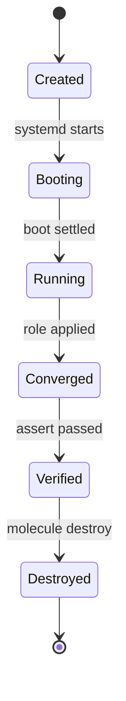
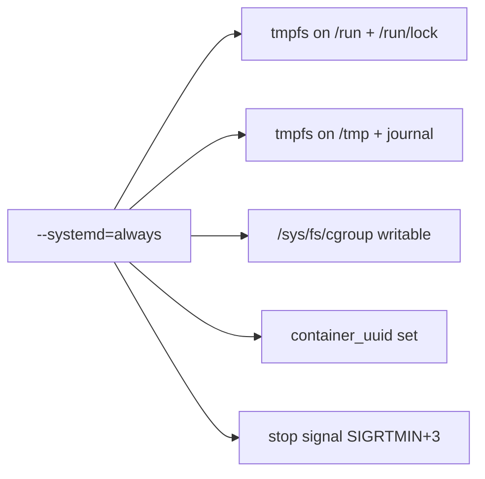

# systemd inside a Podman container

## You are here

[Home](./index.md) → [Quickstart](./quickstart.md) → **you are here**. **What you will be able to
do:** start a container in which `systemd` is process 1, apply an Ansible role that manages a
`.service` unit, and prove the unit is running — without losing half a day to bad advice.

## What this page is for

Almost every container image you will ever meet has **no `systemd` in it**, and a container
without `systemd` cannot test a role that manages services. This page is the short, correct
route to fixing that: which Podman flags are genuinely required, which four keys go in
`molecule.yml`, and — most importantly — which online advice is folklore that sends you the wrong
way for hours. Read one section only? Read
[Myths that will waste your time](#myths-that-will-waste-your-time).

> **The short version:** `--systemd=always` is the only flag you need. Nothing else in the
> folklore is required, and one famous flag (`--privileged`) actively makes things worse.
>
> **But `--systemd=always` exiting 0 is not the same as your test having run.** A scenario whose
> `molecule.yml` omits `groups: [molecule]` skips every play, asserts nothing, and still exits
> **0**. See [Trap 3](#the-four-keys-that-matter) before you trust a green run.

> ### Background: "Three ideas you need first"
>
> **(a) PID 1 — the first process in a container.** A **PID** is a *process identifier*: the
> number the operating system gives every running process. Linux always has one process numbered
> 1, and everything else descends from it. Starting a container starts **one** process inside it,
> and that process is PID 1 there. Ordinary images ship a command like `sleep`, so `sleep` is
> PID 1. **`systemd` refuses to run unless it *is* PID 1** — it checks, finds something else, and
> prints `System has not been booted with systemd as init system (PID 1). Can't operate.` That one
> check causes most beginner failures on this page. In the [glossary](./glossary.md), **init** is
> the traditional name for that first process.
>
> **(b) cgroup v2 — why your host must already have it.** A **cgroup** is a Linux *control
> group*: a kernel feature that groups processes so the system can limit and account for their
> CPU, memory and process count. `systemd` does not merely *use* cgroups — it **manages itself**
> through them, so if it cannot write to the cgroup filesystem it cannot start at all. `systemd`
> as PID 1 therefore needs a host on **cgroup v2**, the unified hierarchy and the default on
> current distributions: Podman 5.x only deprecated cgroup v1, **Podman 6.0 removed it
> entirely**, and `systemd` before version 230 has no cgroup v2 support at all.
>
> **(c) What "systemd mode" in Podman actually switches on.** `--systemd=always` does not start
> `systemd` for you. It prepares the *container* so `systemd` *can* start: memory-only filesystems
> (`tmpfs`) on `/run`, `/run/lock`, `/tmp` and `/var/lib/journal`; a clean stop signal; one
> environment variable; and — the part that matters — **on cgroup v2, `/sys/fs/cgroup` mounted
> writable inside the container** (see [the diagram
> below](#what---systemdalways-changes)). Everything else stays your job: your image must contain
> `systemd`, and your command must be `/sbin/init`.

## The answer in one table

The verdict from the research corpus, flag by flag.

| Podman flag | Verdict | Why, in one line |
|---|---|---|
| `--systemd=always` | **RECOMMENDED — and required once your command is not literally an init** | The only thing that mounts `/sys/fs/cgroup` writable on cgroup v2; without systemd mode `systemd` cannot write its own cgroups. The `--systemd` default `true` auto-detects a literal init and also works, so `always` is the *robust* choice rather than an absolute one. In `molecule.yml`: `systemd: always`. |
| `--cgroupns=host` | **OPTIONAL — redundant on cgroup v2** | Podman already gives the container its own cgroup, and systemd mode mounts `/sys/fs/cgroup` writable. |
| `--cap-add SYS_ADMIN` | **OPTIONAL — only when a unit needs it** | For units using `PrivateTmp=`, `ProtectSystem=`, `ProtectHome=`, `PrivateNetwork=`, `ReadWriteDirectories=` or `InaccessibleDirectories=`. In `molecule.yml`: `capabilities: [SYS_ADMIN]`. |
| `--privileged` | **FOLKLORE — and harmful** | It makes the container reach `degraded` instead of `running`. See [Myth 1](#myths-that-will-waste-your-time). |
| `setsebool -P container_manage_cgroup true` | **FOLKLORE — legacy** | Podman ≥ 2.0 already labels a systemd container `container_init_t`, which may write the cgroup filesystem. |
| Editing `/etc/containers/policy.json` | **FOLKLORE — Docker-era** | A stock Fedora `policy.json`, with no edits, reaches `running`. |
| `-v /sys/fs/cgroup:/sys/fs/cgroup:ro` | **FOLKLORE — Docker-era** | `--systemd=always` already mounts it **writable** on cgroup v2. |
| `--cgroup-manager=cgroupfs` | **FOLKLORE — premise inverted** | `cgroupfs` was the cgroup-v1-era workaround. The default, `systemd`, is what you want. |
| `--cgroups=disabled` | **NOT RECOMMENDED** | Nothing upstream recommends it; it conflicts with `--cgroupns` and `--cgroup-parent`, and it was buggy. |
| `--security-opt label=disable` | **NOT NEEDED** | Same reason as the SELinux boolean above. |
| `--annotation run.oci.keep_original_groups=1` | **IRRELEVANT** | A `crun` annotation about *supplementary groups*. Use `podman run --group-add keep-groups`. |

In raw Podman the whole fix is one flag, verified on a fully **rootless** Podman with **cgroup
v2** and **SELinux** (the *Security-Enhanced Linux* mandatory access control that Fedora and
RHEL ship, usually left in **Enforcing** mode):
`podman run -d --name inst --systemd=always <image-with-systemd>`, plus `--cap-add SYS_ADMIN` if
a unit needs it. **Rootless works** — it is not a compromise, and CI systems running Molecule are
almost always rootless.

## How to do it in Molecule

### The four keys that matter

These four lines are the whole trick, copied verbatim from
[`REFERENCE-CONFIG.md`](./REFERENCE-CONFIG.md) §2. A **fifth** key — the one that decides whether
your test asserts anything at all — is called out separately below, because it is easy to delete
and nothing complains:

```yaml
    command: /sbin/init        # what runs as PID 1
    override_command: true     # let Molecule honour `command` instead of substituting a sleep loop
    systemd: always            # turn on Podman's systemd mode
    privileged: false          # never `true` — see Myth 1
```

- **`command: /sbin/init`** — makes the image's init system the top process. Without it, `sleep`
  is PID 1 and `systemd` never starts.
- **`override_command: true`** — stops Molecule replacing your command with
  `bash -c "while true; do sleep 10000; done"`. **Required when the image's own `CMD` is not an
  init**; not required when it already is one. See Trap 2 for the precise rule.
- **`systemd: always`** — puts Podman into systemd mode. **Never write `true` here.** See Trap 1.
- **`privileged: false`** — stated explicitly so nobody flips it to `true`. See
  [Myth 1](#myths-that-will-waste-your-time).

> #### Trap 1 — write `always`, and know exactly why
> `podman run --systemd` **defaults to `true`**, and `true` only switches systemd mode on when
> the container command is *literally* one of `systemd`, `/usr/sbin/init`, `/sbin/init` or
> `/usr/local/sbin/init`.
>
> **So is `always` required? No — and this page used to say it was, which was wrong.** With
> `command: /sbin/init`, the default `true` **also works**; that was checked by running it, not
> assumed. `always` is the **robust** choice because it removes the dependence on that
> auto-detection, and it becomes **genuinely required the moment `command:` is not literally an
> init** — `command: /usr/lib/systemd/systemd`, or a wrapper script. Then auto-detection cannot
> see an init, systemd mode never engages, and you get
> `System has not been booted with systemd as init system (PID 1). Can't operate.`
>
> **Never write `true` and never write `false`.** `false` switches the mode off outright; `true`
> is the fragile middle. Use `always`, and the question never arises.
>
> #### Trap 2 — `override_command: true`, and when it is genuinely required
> Molecule's Podman driver does not necessarily run the command you wrote. Without this key it
> substitutes `["bash","-c","while true; do sleep 10000; done"]` so the container stays alive
> between steps; `override_command: true` is the switch that makes it use yours instead.
>
> **The precise rule, because "mandatory" was also too strong here:** the substitution happens,
> and this key is **genuinely required**, when the **image's own `CMD` is not an init**. If the
> image's `CMD` *is* already an init, the substituted sleep loop never takes effect, so systemd
> boots as PID 1 from the image's own `CMD` and the key is **not required**.
> `registry.access.redhat.com/ubi9/ubi-init:latest` is such an image. Set the key anyway — it
> makes the file independent of the image's `CMD` — but you should know which case you are in.
>
> One documented exception, and it is the mirror image of the rule above: if your `Dockerfile.j2`
> declares a `CMD` directive you intend to rely on, the driver's own docstring says to set
> `override_command: False` instead.
>
> #### Trap 3 — the one that fails **green**: you also need `groups: [molecule]`
> The four keys above make systemd *work*. None of them makes your test *run*. Molecule builds
> its Ansible groups from `platforms[*].groups`, whose default is `["ungrouped"]` — there is **no
> implicit `molecule` group**. Without this fifth key, `hosts: molecule` in `converge.yml` and
> `verify.yml` matches nothing:
>
> ```console
> PLAY [Verify systemd and the test service] *************************************
> skipping: no hosts matched
> ...
> SCENARIO RECAP
> default                   : actions=8  successful=6  disabled=0  skipped=0  missing=1  failed=0
> $ echo $?
> 0
> ```
>
> **Every play skipped, not one assertion ran, and the exit code was 0.** Three separate reviews
> had passed that configuration before it was ever run. The line is
> `groups: [molecule]`, under `platforms[0]`, and it appears in the complete file below.

## The lifecycle of a systemd scenario container



**What this shows:** one systemd scenario container, from the moment Molecule creates it to the
moment it is thrown away.

In reading order: Molecule creates the container, empty — no `systemd` has started. Because
`command: /sbin/init` and `override_command: true` are both set, it boots and `systemd` becomes
PID 1, reaching a stable target (`running`, or the equally acceptable `degraded`). Then
`converge` applies your role, installing and starting a `.service` unit; `verify` asserts the
unit is active; `destroy` removes the container. The two middle states are where Molecule's
assertions live — the only part of this page about testing rather than about `systemd`.

## What `--systemd=always` changes



**What this shows:** the five things one flag switches on inside the container — and the third
is the only load-bearing one.

Left to right: `--systemd=always` causes five changes. Podman puts an in-memory `tmpfs` on
`/run` and `/run/lock`, the directories `systemd` keeps its runtime state in, and another on
`/tmp` and `/var/lib/journal`. It sets the environment variable `container_uuid`, and changes the
stop signal to `SIGRTMIN+3`, which is why a stopped container shuts down cleanly. Most
importantly it mounts `/sys/fs/cgroup` **writable** — the cgroup filesystem from background point
(b) — which is what lets `systemd` create the cgroup tree it needs. Podman's own wording: this
"allows systemd to run in a confined container without any modifications." Leave the flag out and
the container exits with `State.ExitCode=255` and **empty logs**.

## Your image has to have systemd, and Python

An **image** is the pre-baked filesystem template a container is created from. A **tag** is the
version label on that template — `:latest`, `:bookworm`, `:9`.

**No mainstream container image ships `systemd`.** Verified absent from `debian:bookworm`,
`debian:bookworm-slim`, `ubuntu:24.04`, `fedora:latest`, `quay.io/fedora/fedora:latest`,
`quay.io/centos/centos:stream9`, `quay.io/centos/centos:stream10` and `ubi9/ubi-minimal`.
`fedora:latest` is *"Fedora Linux 44 (Container Image)"* — a minimal variant that deliberately
excludes `systemd`. A **second, separate** requirement beginners conflate with this one: the
image must also have **Python**, because Ansible's built-in tasks need it — *"the container image
**must** have Python installed to be able to run many of the builtin tasks."* A bare `alpine`
image fails on most `ansible.builtin` modules, and this applies to the
[quickstart](./quickstart.md) image too.

| Option | Image | Result | Notes |
|---|---|---|---|
| **A. Prebuilt init image (recommended)** | `registry.access.redhat.com/ubi9/ubi-init:latest` (systemd 252) or `registry.access.redhat.com/ubi10/ubi-init:latest` (systemd 257) | **`running`** | Nothing to build. **Free, pullable without a Red Hat subscription.** `:latest` is a **moving target** — append `@sha256:<digest>` for anything you depend on ([how](./authoring/custom-images.md#pin-your-base-image)). |
| **B. Build your own** | A `Dockerfile.j2` on a distro base | Varies | → [`authoring/custom-images.md`](./authoring/custom-images.md). The Debian recipe was **built and booted** during research; the Fedora and Ubuntu recipes are adaptations, marked UNVERIFIED on that page. |
| **C. Arch Linux** | `docker.io/library/archlinux:latest` (systemd 261.3) | `degraded` | Works, but a **rolling release**: not reproducible. |

**Do not use:** `M1tch/dind-systemd` and `nickchase/systemd-container` — both were the
commonly-cited de-facto references and both are **dead, HTTP 404**. There is also **no official
`systemd`-upstream container recipe**: its official recipes are `systemd-nspawn` examples —
*namespace* containers, not container images.

> **And a documented upstream bug you hit if you follow Molecule's own guide:** that guide
> recommends `quay.io/centos/centos:stream10` + `command: /sbin/init`. **That image has no
> `systemd` and cannot work** — all 59 active `quay.io/centos/centos` tags were enumerated and
> none contain `init`.

## The complete `molecule.yml`

Verbatim from [`REFERENCE-CONFIG.md`](./REFERENCE-CONFIG.md) §2b; every option is annotated in
[`reference/molecule-yml.md`](./reference/molecule-yml.md). The `converge.yml` that installs and
starts a test unit is §3.2 of the same file, and the runnable tree is
[`examples/systemd-unit/`](../examples/systemd-unit/).

```yaml
---
# molecule/<scenario>/molecule.yml
# A scenario whose container runs systemd as PID 1.

driver:
  name: podman

platforms:
  - name: instance
    # ---- Option A: use a prebuilt init image (recommended, nothing to build) ----
    image: registry.access.redhat.com/ubi9/ubi-init:latest
    # Supply chain: `latest` is a moving tag, so two runs are not the same build and the
    # registry decides what you execute. OPTIONAL: append `@sha256:<digest>` to pin it --
    # get one with `podman image inspect --format '{{index .Digest}}' <the image above>`.
    # ---- Option B: build your own (uncomment the three lines below, and set
    #      `image` to a base WITHOUT systemd, e.g. debian:bookworm-slim) ----
    # pre_build_image: false          # MANDATORY: the default is `true`, which silently
    #                                 # skips the build. `item.image` above is the FROM line.
    # dockerfile: Dockerfile.j2       # optional; Dockerfile.j2 in the scenario dir is the default
    command: /sbin/init
    override_command: true
    systemd: always
    privileged: false
    # ---------------------------------------------------------------------------
    # REQUIRED (DBG-1). Molecule builds its Ansible groups from this key, defaulting
    # to ["ungrouped"] -- so there is NO implicit `molecule` group. Omit this line and
    # `hosts: molecule` in converge.yml/verify.yml matches nothing: every play reports
    # "skipping: no hosts matched" and `molecule test` still EXITS 0. Silent false pass.
    groups:
      - molecule
    # ---------------------------------------------------------------------------
    # Only uncomment when a unit genuinely needs it (PrivateTmp=, ProtectSystem=,
    # ProtectHome=, PrivateNetwork=, ReadWriteDirectories=, InaccessibleDirectories=).
    # systemd's own docs say do NOT drop CAP_SYS_ADMIN or CAP_MKNOD; Podman's defaults
    # include neither, so add only the one you need.
    # capabilities:
    #   - SYS_ADMIN

provisioner:
  name: ansible
  inventory:
    host_vars:
      instance:
        ansible_connection: containers.podman.podman

dependency:
  name: galaxy
  options:
    requirements-file: ${MOLECULE_SCENARIO_DIRECTORY}/requirements.yml

scenario:
  test_sequence:
    - dependency
    - destroy
    - create
    - converge
    - idempotence
    - verify
    - cleanup
    - destroy
```

**Two files this block does not list, and why it must not.** `create.yml` and `destroy.yml` are
**not** required and must **not** be shipped under the `podman` driver: a scenario's own
`create.yml` is resolved *before* the driver's, so it **overrides** the driver's own playbook,
only the inert local stub runs, **no container is ever created**, and `converge` dies with
`Command execution failed: Container 'instance' not found`. `molecule init` writes both files —
**delete them**; `molecule.yml` *is* the create/destroy configuration under a driver. Separately,
this `test_sequence` calls the `cleanup` step, which `molecule init` does **not** scaffold, so
add a minimal `cleanup.yml` (or Molecule prints `Missing playbook` every run and the recap reads
`missing=1`). The complete five-file set is: this `molecule.yml`, `requirements.yml`, the
`converge.yml` in [`REFERENCE-CONFIG.md`](./REFERENCE-CONFIG.md) §3.2, the `verify.yml` in §7, and
`cleanup.yml`.

## Myths that will waste your time

> **This is the highest-value section on the site.** Every row is folklore a beginner meets on
> the first two pages of search results. Three come from Molecule's or Podman's *own*
> documentation, and two of those are **wrong**. Read Myth 1 twice.

| You will read online | What is actually true | The fix |
|---|---|---|
| **1. "You need `--privileged` for systemd in a container."** The Podman driver's own docstring says *"make sure to set the `privileged`, `command`, and `environment` values"* — and its own example shows `privileged: true`. Molecule's per-platform recipe repeats it. | **No — it makes things worse.** Privileged mode stops masking `/sys`, so three kernel-filesystem mount units become real mount units and fail. The container then reaches `degraded` instead of `running`: `● sys-kernel-config.mount loaded failed failed Kernel Configuration File System`, `● sys-kernel-debug.mount loaded failed failed Kernel Debug File System`, `● sys-kernel-tracing.mount loaded failed failed Kernel Trace File System`. It cannot help anyway: *"Containers running in a user namespace (e.g., rootless containers) cannot have more privileges than the user that launched them."* **This is a real documentation bug in the `molecule-plugins` driver — report it upstream.** | Leave `privileged: false`. If one unit needs real privileges, add **only** `SYS_ADMIN` — see [When systemd does not come for free](#when-systemd-does-not-come-for-free). |
| **2. "Run `setsebool -P container_manage_cgroup true`."** `podman-run(1)` still carries the note *"The `container_manage_cgroup` boolean must be enabled for this to be allowed on an SELinux separated system."* | **Legacy.** `podman-troubleshooting.md` §8 is authoritative: *"Prior to Podman 2.0 … Only do this on systems running older versions of Podman."* On Podman ≥ 2.0 with container-selinux ≥ 2.132, Podman labels a systemd container `container_init_t`, which may already write the cgroup filesystem. Verified on Fedora 44, SELinux **Enforcing**: `getsebool container_manage_cgroup` → **`off`**, process label `system_u:system_r:container_init_t:s0:c938,c1001`, and `systemd` still booted to `running`. | Do nothing. Only run it if you are reading **actual AVC denials** in the audit log. The [pre-flight check](./preflight.md) reports SELinux state without any of this. |
| **3. "You must edit `/etc/containers/policy.json` to allow `/sys/fs/cgroup`."** | **Nothing is required.** A stock Fedora `policy.json` — no `mounts` array, no `cgroupns` key — reaches `running` with no edits. Docker-era advice from before Podman had `--systemd`. | Do not touch the file. If you meet this advice, you are reading a pre-Podman page. |
| **4. "Set `--cgroup-manager=cgroupfs` for rootless."** | **The premise is inverted.** `cgroupfs` was the cgroup-v1-era workaround. The default is `systemd`, and that is what you want, because `systemd.io/CONTAINER_INTERFACE` prescribes a `*.scope` unit with `Delegate=yes` — exactly what the `systemd` cgroup manager produces. | Leave it unset. The default is correct. See the version caveat below. |
| **5. "Add `--cgroups=disabled` so the container does not fight the host."** | **Nothing recommends it.** `podman-run(1)` describes it neutrally and notes it *"conflicts with cgroup options (`--cgroupns` and `--cgroup-parent`)"*. It was a cgroup-v1 / rootless workaround and was buggy — `containers/podman#20910` reported `--cgroups=disabled` still changed cgroups. Quadlet's default is `CgroupsMode=split`, not `enabled`. | Drop the flag. Systemd mode handles cgroups for you. |
| **6. "`--cgroupns=host` is needed so `systemd` can see its cgroup tree."** | **Redundant on cgroup v2.** `podman-run(1)`: *"If the host uses cgroups v1, the default is set to host. On cgroups v2, the default is private."* Podman already creates the container's own cgroup and systemd mode mounts `/sys/fs/cgroup` writable. Verified `running` with and without. | Add it only if the workload must *see the host's* tree — e.g. inspecting host-level `memory.events`. |
| **7. "Set `ENV SYSTEMD_ETC=/usr/lib/systemd` in the Containerfile."** | **Not a `systemd` requirement at all.** It appears nowhere in `systemd`'s source or in `CONTAINER_INTERFACE`. It is a community Containerfile convention — harmless, and present in our canonical Containerfile for familiarity. | Ignore the line. Do not go hunting for it when something breaks. |
| **8. "Add `--annotation run.oci.keep_original_groups=1`."** | **About supplementary groups, not `systemd`.** From `crun.1.md`: *"crun will skip the `setgroups` syscall…"* It is for supplementary-group and device-access cases, superseded by `podman run --group-add keep-groups` (Podman ≥ 3.2). It appears in `containers.conf.5` only as the *example* under `**annotations** = []` — which is exactly why people copy it. | You do not need it. If you do, use `--group-add keep-groups`. |
| **9. "A `molecule.yml` needs no `groups:` key — `hosts: molecule` is built in."** | **No — and this is the worst item on the table, because it fails *green*.** Molecule builds its Ansible groups from `platforms[*].groups`, defaulting to `["ungrouped"]` (`platform.get("groups", ["ungrouped"])`). There is **no implicit `molecule` group**, so `hosts: molecule` matches nothing: every play reports `skipping: no hosts matched`, **zero assertions execute**, `failed=0`, and `molecule test` **exits 0**. Molecule's own scaffolded `converge.yml` uses `hosts: all`, which is why nobody notices. Measured, not hypothesised — and three reviews passed it first. | Add `groups: [molecule]` to `platforms[0]`. Then prove the run was not vacuous: `PLAY RECAP` must show **`ok=N` with `N>0`**, and there must be **zero** `skipping: no hosts matched` lines. See Trap 3. |
| **10. "`molecule init` made `create.yml` and `destroy.yml`, so I should keep them."** | **No — under the `podman` driver, shipping them breaks the scenario.** Molecule resolves the scenario's own `create.yml` *before* the driver's, so the `create` step runs only the inert local stub, **no container is ever built**, and `converge` dies with `Command execution failed: Container 'instance' not found`. The step still prints `Executed: Successful`, which is what makes it so confusing — the driver's real tasks (`Create molecule instance(s)`, `Wait for instance(s) creation to complete`) simply never run. | **Delete both files.** They are scaffolded because the *default* driver needs them, not because a container driver does. Under `podman`, `molecule.yml` is the create/destroy configuration. Ship `create.yml` only if you deliberately want to own the whole lifecycle — and then also ship `tasks/create-fail.yml`. |

> **A version caveat on Myth 4, honestly stated.** The released `podman-rootless(7)` 5.4.2 man
> page still says rootless *"requires the --cgroup-manager … to use systemd"*, but a January 2026
> doc change removed that bullet from the current tree. The cgroup-v2 requirement stated here is a
> **Podman 6.0 / kernel** fact both versions agree on, not a man-page quote.

## `degraded` is not a failure, and `podman logs` is empty

`systemctl is-system-running` prints one of several words, and **two are both correct** for your
purposes: `running` (reached `multi-user.target` cleanly — the ideal) and `degraded` (reached the
target, but at least one unit failed). **`degraded` is the normal rootless outcome, not a
failure.** The units that typically fail were captured verbatim on `archlinux:latest`, rootless:
`dbus-broker.service` (*"Exiting due to fatal error: -107"*), `dbus.socket`,
`systemd-resolved.service` (`status=217/USER`) and its two sockets, `systemd-homed.service`,
`systemd-firstboot.service`. These are rootless-container artifacts, not problems with your
test — read them with `systemctl --failed`.

> **The rule that follows: never assert that `is-system-running` equals `running`.** A step
> written as `is-system-running | grep running` passes on `degraded`, because it is a substring
> match; a step written as `== 'running'` **fails a perfectly good system**. Assert on **your own
> unit** with `service_facts` — written out in full as
> `ansible.builtin.service_facts` (a *Fully Qualified Collection Name*, which is how Ansible
> collection modules are named: `ansible.builtin` is the collection built into Ansible itself) —
> which is exactly what the canonical `verify.yml` does, and the check you should copy. The `converge.yml` in
> [`REFERENCE-CONFIG.md`](./REFERENCE-CONFIG.md) §3.2 follows the same rule in its wait task: it
> waits until the state is `running` **or** `degraded`, with `failed_when: false`, because
> `degraded` returns non-zero. Other distributions:
> [`troubleshooting.md`](./troubleshooting.md).
>
> **UNVERIFIED:** whether Ansible's `systemd` module works while `dbus-broker` is down. Both
> `systemctl` and `podman exec` worked in exactly that container, so the risk did not
> materialise — but it was not directly confirmed.

And `podman logs` showing **nothing** is also normal, not a symptom: `systemd` as PID 1 writes to
the **journal**, not the container's standard output, and `journalctl` works out of the box
because `--systemd=always` puts a `tmpfs` on `/var/lib/journal`:

```bash
podman exec instance journalctl -u molecule-demo.service --no-pager
podman exec instance systemctl --failed --no-pager
```

## Verify it yourself

Do not take this page's word for it. Every block has a **You should see** panel.

### 1. Is my host on cgroup v2?

```bash
stat -fc %T /sys/fs/cgroup
podman info --format '{{.Host.CGroupsVersion}}'
```

**You should see** `cgroup2fs`, then `v2`:

```console
$ stat -fc %T /sys/fs/cgroup
cgroup2fs
$ podman info --format '{{.Host.CGroupsVersion}}'
v2
```

`tmpfs` instead of `cgroup2fs` means cgroup v1 — and then nothing on this page works.

### 2. Does an image boot to `systemd` — before you involve Molecule?

Debugging an image by hand is much faster than debugging it through Molecule:

```bash
# Build the image by hand first
podman build -t sd-debian:local -f Dockerfile.j2 .

# Run it with systemd mode
podman run -d --name inst --systemd=always localhost/sd-debian:local

# Check that systemd is the top process
podman exec inst systemctl is-system-running
# expect: running

# Check that nothing failed
podman exec inst systemctl --failed --no-pager
# expect: no output at all
```

**You should see:**

```console
$ podman exec inst systemctl is-system-running
running

$ podman exec inst systemctl --failed --no-pager

$ podman exec inst journalctl -n 3 --no-pager
Sep 28 09:13:51 ... systemd[1]: Finished systemd-update-utmp-runlevel.service - Record Runlevel Change in UTMP.
Sep 28 09:13:51 ... systemd[1]: Startup finished in 88ms.
```

`running` **or** `degraded` are both correct, and `Startup finished in 88ms` is the line that
tells you `systemd` finished booting. No custom image yet? The recommended prebuilt one was
verified the same way: `podman run -d --systemd=always
registry.access.redhat.com/ubi10/ubi-init:latest /sbin/init`, then `podman exec <c> systemctl
is-system-running` → `running`. `<c>` is the container name Podman printed; add `--name inst`
yourself if you prefer. Clean up with `podman stop <c>` — a clean shutdown, precisely because of
that stop signal — then `podman rm --force <c>`. Molecule removes its own containers with
`molecule destroy`; see [`usage.md`](./usage.md).

### 3. Is `systemd` *really* PID 1?

This is the one assertion that matters, and the first thing the canonical `verify.yml` does. Run
`podman exec inst cat /proc/1/comm` and `podman exec inst readlink -f /proc/1/exe`.

**You should see:**

```console
$ podman exec inst cat /proc/1/comm
systemd
$ podman exec inst readlink -f /proc/1/exe
/usr/lib/systemd/systemd
```

`/proc/1/comm` contains `systemd`, or `init` on images that symlink it — which is why the
canonical playbook accepts either. The second path is the `systemd` **binary**; some
distributions print `/lib/systemd/systemd` instead. Either way it must be `systemd`, never a
shell.

### 4. And inside Molecule?

The canonical `verify-systemd` playbook is in [`REFERENCE-CONFIG.md`](./REFERENCE-CONFIG.md) §7,
in full. It proves two things: `systemd` is PID 1, and the service your test started is running —
the second via `service_facts` on **your unit**, never `is-system-running`.

**You should see** (best case: `running`, nothing failed):

```console
TASK [Confirm systemd is the top process] *****************************************
ok: [instance] => {
    "changed": false,
    "msg": "systemd is PID 1."
}

TASK [Confirm systemd is running the managed service] *******************************
ok: [instance] => {
    "changed": false,
    "msg": "molecule-demo.service is active."
}
```

**You should also accept** `degraded` with a handful of the units listed earlier: both success
messages still appear, because neither assertion depends on the overall system state.

> #### Did my test actually run? — `molecule test` exiting 0 does not prove it did
>
> A play that matches no hosts is **not a failure**. It reports `skipping: no hosts matched`,
> `failed=0`, and the command **exits 0**. So before you believe a green `molecule test` — the
> page's own crux playbook included — check both of these on the same run:
>
> 1. **The `PLAY RECAP` shows `ok=N` with `N > 0`.** A real run of the canonical `converge.yml` +
>    `verify.yml` ends like this, on a live host, asserting two things:
>
>    ```console
>    PLAY RECAP *********************************************************************
>    instance                   : ok=7    changed=0    unreachable=0    failed=0    skipped=0    rescued=0    ignored=0
>    ```
>
>    `ok=0` — or no `PLAY RECAP` line for your instance at all — means nothing ran.
> 2. **There are zero `skipping: no hosts matched` lines** in the whole output. One appearing
>    anywhere means that play asserted nothing and the run is worthless, whatever the exit code.
>
> A third, free signal: the two `success_msg` values above — `systemd is PID 1.` and
> `molecule-demo.service is active.` — should be in the output. Absent means the asserts did not
> execute. Also check the scenario recap reads `missing=0`; a non-zero `missing` is the
> `cleanup` step finding no `cleanup.yml`.
>
> **One line causes this, and it is not in the flag list:** `groups: [molecule]` under
> `platforms[0]`. See Trap 3.

## The `group_vars` trap

**This is the one failure that produces no error message at all.** You set
`container_systemd: always`, you read it back, it says `always`, and nothing changes.

Molecule's own shipped Podman example contains `group_vars/molecule.yml` with
`container_systemd: false`. A `group_vars/` file **outranks** the `vars:` block set inline on the
group in `inventory/hosts.yml`, so the inline `always` is **silently ignored** — no warning, no
error, no non-zero exit code. Molecule's own guide documents this trap under "common failure
modes". Precedence, strongest first: a `group_vars/` file → an inline group `vars:` block →
`host_vars/`. When two places set one key, the stronger wins, silently.

**The fix:** have **no `group_vars/` directory at all** — every example tree here does it that
way. If you copied a Molecule example that has one, delete the `container_systemd: false` line.
Check before you blame anything else: `find . -path '*/group_vars/*' -name '*.yml'`.

**The Ansible-native layout**, in which this trap can occur — verbatim from
[`REFERENCE-CONFIG.md`](./REFERENCE-CONFIG.md) §2b:

```yaml
# inventory/hosts.yml
# NOTE: do NOT also ship a group_vars/molecule.yml with `container_systemd: false`.
# group_vars outranks an inline group `vars:`, so your `always` is silently ignored.
# This trap is present in Molecule's own shipped Podman example.
all:
  children:
    molecule:
      hosts:
        instance:
          container_image: registry.access.redhat.com/ubi9/ubi-init:latest
      vars:
        ansible_connection: containers.podman.podman
        container_command: /sbin/init
        container_systemd: always
```

> That is the *alternative* to the driver block used on this page — upstream's documented happy
> path, which the research corpus calls *"the single biggest finding"* in the driver material.
> This site teaches the driver block because the three `systemd` knobs are declarative keys in one
> file rather than variables threaded through inventory. **Sourcing note:** the precedence rule
> above is quoted from Molecule's own guide; we did not reproduce it in a running scenario.

## When systemd does not come for free

Most of the time `--systemd=always` is enough. It is not enough when a **unit** asks `systemd` to
build a private, sandboxed environment — that needs privileges the default container lacks, and
`systemd`'s own documentation is blunt about it. From `CONTAINER_INTERFACE`, "What You Shouldn't
Do": **do not drop `CAP_MKNOD`**, because `PrivateDevices=` gives a service its own private,
minimal `/dev` and setting it up needs this capability; and **do not drop `CAP_SYS_ADMIN`**,
because *"A number of fs namespacing related settings, such as `PrivateDevices=`,
`ProtectHome=`, `ProtectSystem=`, `MountFlags=`, `PrivateTmp=`, `ReadWriteDirectories=`,
`ReadOnlyDirectories=`, `InaccessibleDirectories=` need to be able to open new mount namespaces…
You break all services that make use of these flags if you drop the flag."* It adds: *"We
recommend against"* running without both — without them it silently turns those settings off and
*"those services will hence run in a different, less secure environment"*.

**And here is the catch that surprises people:** the default Podman capability set **includes
neither** `CAP_SYS_ADMIN` nor `CAP_MKNOD`. A rootless default is:

```text
CAP_CHOWN,CAP_DAC_OVERRIDE,CAP_FOWNER,CAP_FSETID,CAP_KILL,CAP_NET_BIND_SERVICE,
CAP_SETFCAP,CAP_SETGID,CAP_SETPCAP,CAP_SETUID,CAP_SYS_CHROOT
```

So a unit using those settings will either lose its sandboxing or fail outright. **The fix is to
add exactly one capability, and only when you need it** — from the canonical `molecule.yml`,
uncommented:

```yaml
    # Only uncomment when a unit genuinely needs it (PrivateTmp=, ProtectSystem=,
    # ProtectHome=, PrivateNetwork=, ReadWriteDirectories=, InaccessibleDirectories=).
    # systemd's own docs say do NOT drop CAP_SYS_ADMIN or CAP_MKNOD; Podman's defaults
    # include neither, so add only the one you need.
    # capabilities:
    #   - SYS_ADMIN
```

A **Linux capability** is a permission grantable to a process independently of which user runs
it; `CAP_SYS_ADMIN` is the broad "system administration" one. It is narrower and safer than
`--privileged`, and it is what `systemd` itself recommends. With user namespaces capabilities are
virtualised — `CAP_SYS_ADMIN` *inside* the container is not `CAP_SYS_ADMIN` *outside*. Do **not**
reach for `--privileged` here; Myth 1 is what happens.

## Next

- **Run the whole thing** — [`examples/systemd-unit/`](../examples/systemd-unit/) is a complete,
  runnable scenario. Copy it and change one unit. **Build your own image** —
  [`authoring/custom-images.md`](./authoring/custom-images.md) has the verified Debian
  Containerfile and the inferred Fedora and Ubuntu ones, marked as such.
- **Learn the surrounding craft** — [`authoring/index.md`](./authoring/index.md) is the front
  door; [`authoring/writing-tests.md`](./authoring/writing-tests.md) covers assertions in general.
- **Look up a key** — [`reference/molecule-yml.md`](./reference/molecule-yml.md) documents every
  driver option, including the ones this page tells you not to use. **It broke** —
  [`troubleshooting.md`](./troubleshooting.md). **A word you did not know** —
  [`glossary.md`](./glossary.md). **Background first** —
  [`concepts/how-molecule-works.md`](./concepts/how-molecule-works.md).

## Sources

Every claim traces to the research corpus (`.research/02-podman-systemd-container.md`) or to one
of these, which is where the corpus itself sourced it:

- `podman-run(1)`, the `--systemd` option — <https://docs.podman.io/en/latest/markdown/podman-run.1.html> · its source file — <https://github.com/containers/podman/blob/main/docs/source/markdown/options/systemd.md>
- Podman troubleshooting, §8 *"Permission denied when running systemd within a Podman container"* — <https://github.com/containers/podman/blob/main/troubleshooting.md>
- The container-manager contract `systemd` prescribes — <https://systemd.io/CONTAINER_INTERFACE/>
- Molecule's systemd guide (source of the CentOS Stream bug and the `group_vars` trap) — <https://molecule.readthedocs.io/guides/systemd-container> · its Podman driver, where the wrong `privileged: true` advice lives — <https://github.com/ansible-community/molecule-plugins/tree/main/src/molecule_plugins/podman/>
- `crun.1.md`, what `run.oci.keep_original_groups` is — <https://github.com/containers/crun/blob/main/crun.1.md> · `containers/podman#20910`, `--cgroups=disabled` still changed cgroups — <https://github.com/containers/podman/issues/20910>
- Podman 5.0 release notes (cgroup v1 deprecation) — <https://blog.podman.io/2024/03/podman-5-0-has-been-released> · rootless caveats, incl. the version disagreement in Myth 4 — <https://github.com/containers/podman/blob/main/rootless.md>

**Attribution:** this page displays no brand marks. Brand licences are recorded centrally in
[`assets/ATTRIBUTION.md`](../assets/ATTRIBUTION.md).
