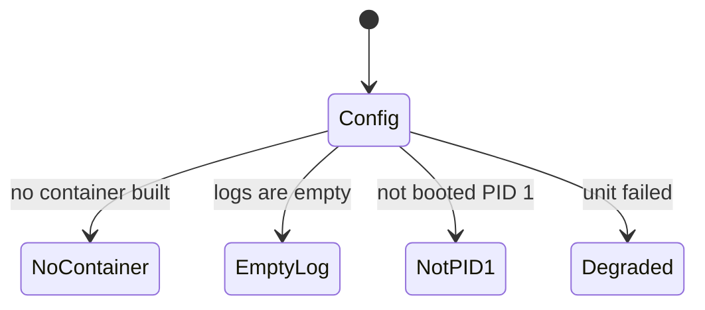
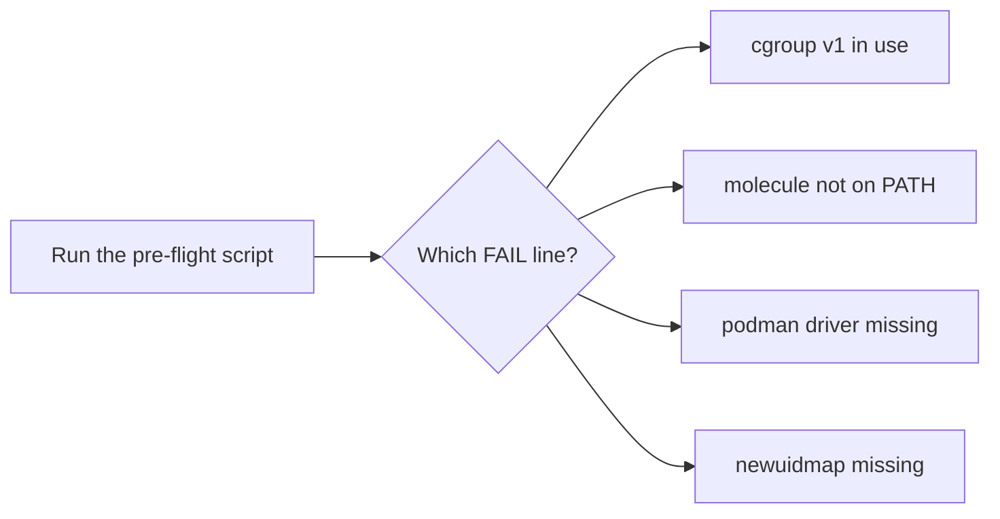

# Troubleshooting — what went wrong, in the order it usually goes wrong

## You are here

[Docs home](./index.md) → **Troubleshooting**. (If you have not installed anything yet, start at
the [pre-flight check](./preflight.md) instead — it is one read-only script and it names the fix
for you.)

**What you will be able to do:** match the exact message on your screen to the cause and the
one-line fix, without reading anybody else's blog post.

**How to use this page.** Every entry is one problem, and every entry starts with the message
you are actually looking at, in a code block you can copy. Find your string, read the cause, do
the fix. Entries are ordered by how often they actually happen. If the fix does not work, the
last paragraph of the entry is your next hypothesis — read that before searching the web.

> **The very first entry is the one that wastes the most people's time, because it does not
> look like a failure.** Read it even if you have an error message.

Every message on this page is verbatim from a real run on Fedora 44 with podman 5.8.7,
molecule 26.9.0 and ansible-core 2.21.4, or verbatim from an upstream document. Nothing here is
paraphrased. Where a string is *not* documented upstream, the entry says so.

---

## 1. 🔴 `skipping: no hosts matched` on every play — and `molecule test` still exits 0

**This is the most important entry on this page. Read it even if everything else works.**

### The symptom — no hosts matched

```console
$ molecule test
INFO     [default > converge] Executing
[WARNING]: Could not match supplied host pattern, ignoring: molecule
PLAY [Converge] ****************************************************************
skipping: no hosts matched
...
INFO     [default > verify] Executing
[WARNING]: Could not match supplied host pattern, ignoring: molecule
PLAY [Verify systemd and the test service] *************************************
skipping: no hosts matched
...
SCENARIO RECAP
default                   : actions=8  successful=6  disabled=0  skipped=0  missing=1  failed=0
$ echo $?
0
```

**Exit code 0. `failed=0`. Every play skipped. Not one assertion ran.**

### What it means — no hosts matched

Molecule ran every step, every step reported `Successful`, and the command reported success —
while your `converge.yml` and your `verify.yml` did literally nothing. This is a **silent false
pass**. It is worse than a crash, because a crash is visible.

### The most likely cause — no hosts matched

**`platforms[*].groups` is missing from your `molecule.yml`.**

Molecule builds its Ansible groups from that one key, and the default is `["ungrouped"]`. There
is **no implicit `molecule` group**. Verified in the installed Molecule source,
`molecule/provisioner/ansible.py:261`:

```python
        for platform in self._config.platforms.instances:
            for group in platform.get("groups", ["ungrouped"]):
```

So the instance lands in a group called `ungrouped`, your play targets `hosts: molecule`, and
`molecule` matches nothing. Proven directly by printing the groups from inside a task:

```console
"msg": "GROUPS=['all', 'ungrouped']"                 # before the fix
"msg": "GROUPS=['all', 'molecule', 'ungrouped']"     # after the fix
```

### The fix — no hosts matched

Add one key to your platform block:

```yaml
platforms:
  - name: instance
    image: registry.access.redhat.com/ubi9/ubi-init:latest
    # REPRODUCIBILITY: `:latest` is a moving target. For anything you depend on,
    # pin the digest instead - same image, unchanging bytes:
    #   image: registry.access.redhat.com/ubi9/ubi-init@sha256:<64-hex-digest>
    # Find the digest with: podman image inspect --format '{{index .RepoDigests 0}}' \
    #   registry.access.redhat.com/ubi9/ubi-init:latest
    # REQUIRED. Molecule builds its Ansible groups from this key, defaulting to
    # ["ungrouped"] -- so there is NO implicit `molecule` group. Omit this line and
    # `hosts: molecule` in converge.yml/verify.yml matches nothing: every play reports
    # "skipping: no hosts matched" and `molecule test` still EXITS 0. Silent false pass.
    groups:
      - molecule
```

Then prove the run was real — see [How to read a Molecule
failure](#how-to-read-a-molecule-failure) below. You need `ok=N` with `N > 0` in the
`PLAY RECAP`, and **zero** `no hosts matched` lines.

### If that does not work — the next hypotheses — no hosts matched

1. A **typo in the `hosts:` line** of the playbook. `hosts: molecule` must match the group
   exactly, in lower case.
2. Your platform's `name` does not match the inventory hostname. In the canonical setup
   `platforms[0].name: instance` *is* the container name and the inventory hostname, so they
   cannot drift apart — but if you renamed one and not the other, the group is populated under a
   name nothing addresses.
3. A **`group_vars/` directory is quietly winning.** `group_vars` outranks an inline `vars:`
   block, so a `container_systemd: false` in `group_vars/molecule.yml` silently overrides your
   `systemd: always`. This trap is present in Molecule's own shipped example. The canonical
   project has no `group_vars/` at all, for that reason — see
   [multi-scenario.md](./authoring/multi-scenario.md).

**Why three independent expert reviews missed this:** the configuration is syntactically perfect
and semantically plausible. It is completely inert, and there is no error to read. Only running
it caught it. See [`REFERENCE-CONFIG.md` §2d](./REFERENCE-CONFIG.md) for the full non-vacuity
check.

---

## 2. 🔴 `FileNotFoundError: [Errno 2] No such file or directory: 'ansible-config'`

### The symptom — ansible-config not found

```console
$ molecule --version
Traceback (most recent call last):
  ...
  File "/usr/lib64/python3.14/subprocess.py", line 1990, in _execute_child
    raise child_exception_type(errno_num, err_msg, err_filename)
FileNotFoundError: [Errno 2] No such file or directory: 'ansible-config'
$ echo $?
1
```

It can also appear as a traceback on any Molecule command, because the same call is made on the
way in.

### What it means — ansible-config not found

Molecule never printed a version. It crashed before doing anything. **`ansible-config` is a
program Molecule shells out to at start-up**, through the `ansible-compat` library, which runs
`["ansible-config", "dump"]` to learn the Ansible version.

### The most likely cause — ansible-config not found

**`ansible-core` is not installed.** This is the one that catches everyone: **Molecule 26.9 does
not declare `ansible-core` as a hard dependency.** So `pip install molecule` reports success,
gives you a `molecule` command, and leaves you with a binary that cannot start.

### The fix — ansible-config not found

Install all three packages **together**, so they share one virtual environment:

```bash
pipx install molecule ansible-core molecule-plugins
```

Naming `ansible-core` explicitly is the point. `pipx --include-deps` only pulls
*declared* dependencies, and this one is not declared.

> **Honest note on the method.** Molecule's own documentation says *"pip is the only supported
> installation method"* and *"It is highly recommended that you install molecule in a virtual
> environment."* `pipx` **is** pip inside a per-application virtual environment, so it satisfies
> both of Molecule's own requirements. But Molecule's documentation does **not** name `pipx`.
> See [install/index.md](./install/index.md) for both positions, quoted.

### If that does not work — the next hypothesis — ansible-config not found

**The virtual environment's `bin/` directory is not on your `PATH`.** The packages can all be
installed correctly and still be invisible. Confirm it:

```console
$ which molecule ansible-config
```

`PATH` is the list of folders your shell searches when you type a command name. If `molecule`
resolves but `ansible-config` does not, that is your problem. Fixes, in order:

1. If you used `pipx`, run `pipx ensurepath`, then close the shell and open a new one (or
   `source ~/.bashrc`).
2. If you used a plain `venv`, activate it: `source /path/to/venv/bin/activate`. The same
   command then has to work: `ansible-config --version`.
3. As a last resort, point the shell at the folder directly:
   `export PATH=/path/to/venv/bin:$PATH`.

**Verify the fix** — this is the regression test, and it is one command:

```console
$ molecule --version
molecule 26.9.0 using python 3.14
    ansible:2.21.4
```

If that prints a version and an `ansible:` line, the problem is gone.

---

## 3. 🔴 `value of state must be one of: absent, drained, present, started, stopped, got: directory`

### The symptom — wait_for state rejected

```console
TASK [Wait for systemd to finish booting] **************************************
[ERROR]: Task failed: Module failed: value of state must be one of:
         absent, drained, present, started, stopped, got: directory
Origin: molecule/default/converge.yml:8:7
fatal: [instance]: FAILED! => {"msg": "value of state must be one of: ... got: directory"}
```

### What it means — wait_for state rejected

Your converge playbook failed on its **first task**. This is a hard error, not a warning.

### The most likely cause — wait_for state rejected

`ansible.builtin.wait_for` was given `state: directory`. That state **no longer exists**. In
ansible-core 2.21.4 the module declares (at `ansible/modules/wait_for.py:494`):

```python
    state=dict(type='str', default='started',
               choices=['absent', 'drained', 'present', 'started', 'stopped']),
```

The string `directory` occurs **zero times** in the module. The `directory`, `file` and
`socket` states were removed.

### The fix — wait_for state rejected

```yaml
    - name: Wait for systemd to finish booting
      ansible.builtin.wait_for:
        path: /run/systemd/system
        state: present      # was: directory  -> fatal on ansible-core >= 2.19
        timeout: 30
```

`present` is the "does this path exist" test, which is what the original task meant.
(`started`, the module's default, is the same test for a path.)

### If that does not work — wait_for state rejected

You are probably running an older `ansible-core` than you think. Check with
`ansible --version`. If it really is older, `directory` may still be accepted there — but
`present` works on every version, so keep `present` and move on.

---

## 4. 🔴 `Container 'instance' not found`

### The symptom — container not found

```console
INFO     [default > create] Executing
PLAY [Create] ******************************************************************
TASK [Populate instance config dict] *******************************************
skipping: [localhost]
TASK [Convert instance config dict to a list] **********************************
skipping: [localhost]
INFO     [default > create] Executed: Successful      <-- "successful", but nothing was created
...
TASK [Wait for systemd to finish booting] **************************************
[ERROR]: Task failed: Command execution failed: Container 'instance' not found
```

### What it means — container not found

The `create` step claimed success and **no container was ever built**. The failure appears later,
in `converge`, when the connection plugin goes looking for a container that does not exist.

### The most likely cause — container not found

**You shipped `create.yml` and `destroy.yml`.** `molecule init` scaffolds both, and it looks
like they belong there. They do not — not under the `podman` driver. Molecule resolves a
scenario's own `create.yml` **before** the driver's, so your scaffolded stub wins and the
driver's real playbook never runs.

You can see the stub in the output above: two tasks, both `skipping: [localhost]`, and nothing
else. The driver's own playbook contains `Create Dockerfiles from image names`, `Create podman
network dedicated to this scenario`, `Create molecule instance(s)` and `Wait for instance(s)
creation to complete` — **none of which appear in that run.**

### The fix — container not found

**Delete both files.**

```bash
rm molecule/<scenario>/create.yml molecule/<scenario>/destroy.yml
```

Under the `podman` driver, `molecule.yml` **is** the create-and-destroy configuration. There is
nothing to scaffold. Re-run and the container will appear.

### If that does not work — container not found

You may be deliberately taking over provisioning, in which case you own the entire container
lifecycle and must also ship `tasks/create-fail.yml`. The Ansible-native route (no driver) is the
only other place these files are used, and it is labelled as such in
[`REFERENCE-CONFIG.md`](./REFERENCE-CONFIG.md) §9.1.

> **Note the asymmetry**, because it confuses people: `cleanup.yml` is the opposite case. It has
> **no** driver playbook, so shipping it is always safe and recommended — see entry 15.

---

## 5. 🔴 `System has not been booted with systemd as init system (PID 1). Can't operate.`

### The symptom — not booted with systemd

```console
System has not been booted with systemd as init system (PID 1). Can't operate.
Failed to connect to bus: Host is down
```

Usually followed by a non-zero exit, sometimes with an empty `podman logs`.

### What it means — not booted with systemd

`systemd` is refusing to run. **`systemd` will only run as process number 1** — a *PID* is the
number the operating system gives each running process, and starting a container starts exactly
one process, which is PID 1 inside it. Ordinary images ship a command like `sleep`, so `sleep`
becomes PID 1, and `systemd` finds something else there.

### The most likely cause — not booted with systemd

**The container is not running `systemd` as PID 1.** In `molecule.yml` terms, one of these is
wrong:

| Key | Correct value | What happens if it is wrong |
|---|---|---|
| `command` | `/sbin/init` | `sleep` becomes PID 1 and your command is ignored |
| `override_command` | `true` | the driver substitutes `["bash","-c","while true; do sleep 10000; done"]` and your `command:` silently does nothing |
| `systemd` | `always` | systemd mode never engages, so `/sys/fs/cgroup` is not made writable |

### The fix — not booted with systemd

```yaml
    command: /sbin/init
    override_command: true
    systemd: always
    privileged: false
```

**Honest precision about which of these is required** — this is the version we measured, not the
one you will read elsewhere:

- `systemd: always` is the **robust** choice. Podman's `--systemd` already defaults to `true`,
  and `true` engages systemd mode when the command is *literally* `systemd`, `/usr/sbin/init`,
  `/sbin/init` or `/usr/local/sbin/init`. So with `command: /sbin/init` the default `true` also
  works — verified, not assumed. It becomes **genuinely required** the moment `command:` is not
  literally an init (for example `command: /usr/lib/systemd/systemd`, or a wrapper script).
  **Never write `true`. Never write `false`.** Write `always`.
- `override_command: true` is **required exactly when the image's own `CMD` is not an init.**
  When the image `CMD` is already an init — `ubi9/ubi-init` is — the substituted sleep loop
  never takes effect, so the key is not strictly needed. Set it anyway so the file does not
  depend on the image's `CMD`.

### If that does not work — the next hypotheses, in order — not booted with systemd

1. **The image has no `systemd` at all.** This is the most common one and it is not obvious.
   `fedora:latest`, `debian:bookworm`, `ubuntu:24.04`, `ubi-minimal` and every
   `quay.io/centos/centos:stream*` tag were probed: none contain an `init`. (Molecule's *own*
   systemd guide currently recommends `quay.io/centos/centos:stream10` + `command: /sbin/init`.
   That combination cannot work — it is a documented upstream bug.) Use
   `registry.access.redhat.com/ubi9/ubi-init:latest`, which was verified to boot to `running`.
   **Pin it by digest** for anything you depend on —
   `registry.access.redhat.com/ubi9/ubi-init@sha256:<64-hex-digest>` — because `:latest` moves
   under you, and a "it worked yesterday" report is impossible to act on without knowing which
   bytes ran. Get the digest from
   `podman image inspect --format '{{index .RepoDigests 0}}' registry.access.redhat.com/ubi9/ubi-init:latest`.
2. **A `group_vars/` file is winning.** See entry 1, hypothesis 3.
3. **`Failed to create manager: No such file or directory`** — this string comes from the
   systemd client libraries when there is no `/run/systemd`, i.e. systemd never started as PID 1.
   The diagnosis is solid, but note honestly: **this exact literal is not documented in
   `podman/troubleshooting.md` or on systemd.io.** If you see it, the causes above still apply.
4. **Your host is on cgroup v1, or rootless without delegation.** See entry 10.

Full background, including every flag that is *not* needed, is in
[systemd-in-containers.md](./systemd-in-containers.md). Its
[Myths that will waste your time](./systemd-in-containers.md#myths-that-will-waste-your-time)
section is the shortest route through the folklore.

---

## 6. 🟡 `degraded` instead of `running`

### The symptom — degraded, not running

```console
$ podman exec <container> systemctl is-system-running
degraded
$ podman exec <container> systemctl --failed --no-pager
● sys-kernel-config.mount  loaded failed failed Kernel Configuration File System
● sys-kernel-debug.mount   loaded failed failed Kernel Debug File System
● sys-kernel-tracing.mount loaded failed failed Kernel Trace File System
```

### What it means — degraded, not running

systemd reached its boot target, but one or more units failed. **This is often benign.** Read on
before you "fix" anything.

### The most likely cause — degraded, not running

**`privileged: true`.** If you found it on a blog, in a search result, or — this is the awkward
one — **in the `molecule-plugins` Podman driver docstring's own example**, then you have been
given bad advice. It was measured on this exact setup: privileged mode unmask `/sys`, so three
kernel-filesystem mount units become real mount units and fail, and the container lands in
`degraded` instead of `running`.

It cannot help anyway: *"Containers running in a user namespace (e.g., rootless containers)
cannot have more privileges than the user that launched them."*

### The fix — degraded, not running

```yaml
    privileged: false
```

Re-measured: `privileged: false` → `running`, **0 failed units**. This is a real documentation
bug in the `molecule-plugins` driver and is worth reporting upstream.

If one specific unit genuinely needs extra rights, add **only** `SYS_ADMIN` rather than going
back to `privileged: true` — see [systemd-in-containers.md](./systemd-in-containers.md).

### If that does not work — `degraded` with different failed units — degraded, not running

In a **rootless** container the usual culprits are services that expect a full host:

- `dbus-broker.service` — *"Exiting due to fatal error: -107"*
- `dbus.socket`
- `systemd-resolved.service` — `status=217/USER`
- `systemd-resolved-monitor.socket` · `systemd-resolved-varlink.socket`
- `systemd-homed.service` · `systemd-firstboot.service`

These are rootless-container artifacts, **not problems with your test**. Read them with
`systemctl --failed` and then move on.

### How to read the state properly — degraded, not running

```bash
systemctl is-system-running          # the one-word summary
systemctl --failed --no-pager        # who actually failed, and why
systemctl status <unit> --no-pager   # one specific unit
journalctl -b -u <unit> --no-pager   # its log since boot
```

**The rule that follows: never assert that `is-system-running` equals `running`.** A step
written as `is-system-running | grep running` passes on `degraded`, because that is a substring
match; a step written as `== 'running'` **fails a perfectly good system**. Assert on **your own
unit** with `ansible.builtin.service_facts` instead — an *FQCN*, a **Fully Qualified Collection
Name**, which is how Ansible collection modules are named. That is exactly what the canonical
`verify.yml` does; copy it from [`REFERENCE-CONFIG.md` §7.2](./REFERENCE-CONFIG.md).

> **UNVERIFIED:** whether Ansible's `systemd` module works while `dbus-broker` is down. Both
> `systemctl` and `podman exec` worked in exactly that container, so the risk did not
> materialise — but it was not directly confirmed. The site uses `service_facts` anyway, so it
> does not matter.

---

## 7. 🟡 The container exits immediately and `podman logs` is empty

### The symptom — container exits at once

The container is gone, or dead, right after `create`. `podman logs <container>` prints nothing.
`podman inspect` shows a non-zero exit code, often `255`.

### What it means — container exits at once

**Empty logs are the normal result when `systemd` never started** — there was no process to write
any. The silence *is* the information. Look at the exit code, not the log.

### The most likely cause — container exits at once

**systemd mode is not actually on**, so Podman never prepared the container for `systemd` to
start. That means `systemd: false`, or no `systemd` key at all combined with a `command:` that is
not literally an init (so Podman's default `true` cannot auto-detect one).

### The fix — container exits at once

```yaml
    command: /sbin/init
    override_command: true
    systemd: always
```

### If that does not work — the diagnostic sequence that actually finds it — container exits at once

```bash
podman ps -a --filter name=<container>                          # is it even there?
podman inspect <container> --format '{{.State.Status}} {{.State.ExitCode}} {{.State.Error}}'
podman inspect <container> --format '{{.ProcessLabel}}'          # SELinux hosts: container_init_t?
podman exec <container> readlink -f /proc/1/exe                 # expect: .../systemd
podman exec <container> cat /run/systemd/container              # expect: podman/docker/oci/...
```

If the container is not there at all, that is entry 4, not this one. If `/proc/1/exe` is not
`systemd`, go back to entry 5.

---

## 8. 🟡 `stdout_lines: []` — a `command` task produced nothing

### The symptom — empty stdout_lines

```console
TASK [Print the diagnostics] ***************************************************
ok: [instance] => {
    "sd.stdout_lines": []
}
```

The task reports `ok` and returns an **empty list**, even though you wrote a command that prints
something.

### What it means — empty stdout_lines

`ansible.builtin.command` **does not invoke a shell**. Your whole string becomes a single
program name, that program does not exist, the exec fails, and `failed_when: false` swallows the
error so quietly that the task still reports `ok`.

### The most likely cause — empty stdout_lines

**You used `command` for a compound command.** The characters `;` and `||` are *shell* syntax.
A shell is the program that interprets them. `command` does not use one.

The canonical case, which produced exactly the empty list above, was:

```yaml
    - name: Show the systemd state and any failed units (diagnostic, non-fatal)
      ansible.builtin.command: "systemctl is-system-running; systemctl --failed --no-pager || true"
      register: sd
      changed_when: false
      failed_when: false
```

### The fix — empty stdout_lines

```yaml
    - name: Show the systemd state and any failed units (diagnostic, non-fatal)
      ansible.builtin.shell: "systemctl is-system-running; systemctl --failed --no-pager || true"
      register: sd
      changed_when: false
      failed_when: false
```

`ansible.builtin.shell` **does** run a shell, so it honours `;` and `||`. Verified: it reproduces
the expected output exactly —

```console
"msg": [
    "running",
    "  UNIT LOAD ACTIVE SUB DESCRIPTION",
    "0 loaded units listed."
]
```

**The rule:** use `command` for a single executable, `shell` for anything with `;`, `|`, `&&`,
`||`, pipes or globs. If you want the raw output as a list of lines, register the result and
read `stdout_lines` — and make sure the module can actually produce it.

> **Cosmetic, left alone on purpose:** the real header renders as
> `UNIT LOAD ACTIVE SUB DESCRIPTION`, not with the column padding you may have seen written out
> somewhere. The padding is tab-width dependent. Do not "fix" it.

---

## 9. 🟡 `No module named systemd` — or most tasks fail because the image has no Python

### The symptom — no module named systemd

Most `ansible.builtin` tasks fail in `converge`, or you see:

```text
No module named systemd
```

### What it means — no module named systemd

**The image does not have Python installed.** This is a hard requirement, not a nice-to-have.
Molecule's own documentation puts it plainly: the container image *"must have Python installed to
be able to run many of the builtin tasks."* Ansible ships its logic to the target machine as a
small Python program; no Python, no tasks.

`No module named systemd` is the narrower version: `python3-systemd` — the Python bindings for
the systemd libraries — is missing. That is a *dependency* problem, not a boot problem.

### The most likely cause — no module named systemd

**You chose a minimal image.** **Bare `alpine` will not work** and never will: it is built around
a different package manager and does not carry the Python build that Ansible needs.

The image that was measured working, and which this site uses as the default, is
`registry.access.redhat.com/ubi9/ubi-init:latest` — it has Python, `systemd` and `/sbin/init`
already, so you build nothing. **Pin it by digest**
(`…/ubi9/ubi-init@sha256:<64-hex-digest>`) once you depend on it, so a change in behaviour later
is attributable rather than mysterious.

### The fix — no module named systemd

Either use an image that already has Python, or build one —
[custom-images.md](./authoring/custom-images.md) has the verified Debian Containerfile. For the
narrower case, install the bindings in the image:

- Debian / Ubuntu: `apt-get install -y python3-systemd` (installing `systemd` pulls it in)
- Fedora / RHEL family: `dnf install -y python3-systemd-libs`

### If that does not work — no module named systemd

`podman exec <container> python3 --version` tells you immediately whether Python is there. If
it prints a version and the tasks still fail, the problem is somewhere else — most likely
connection entry 1, the silent false pass.

---

## 10. 🟡 cgroup problems — `stat -fc %T /sys/fs/cgroup` is not `cgroup2fs`

### The symptom — cgroup v1 or absent

Either the pre-flight check says so:

```console
== 1. Control groups (cgroups)
  FAIL  cgroup v1 is in use
```

or Podman reports a missing controller:

```text
Error: OCI runtime error: crun: the requested cgroup controller `cpu` is not available
Error: OCI runtime error: crun: the requested cgroup controller `cpuset` is not available
```

or, on a host with very old systemd:

```text
Failed to get D-Bus connection: Operation not permitted
Error: non zero exit code: 1: OCI runtime error
```

### What it means — cgroup v1 or absent

A **cgroup** is a Linux *control group*: a kernel feature that groups processes so the system
can limit and account for their CPU, memory and process count. `systemd` does not merely *use*
cgroups — it **manages itself** through them. If it cannot write to the cgroup filesystem, it
cannot start.

There are two hierarchies. **cgroup v1** is the old, split one. **cgroup v2** is the unified
hierarchy, and it is the default on current distributions. **Podman 5.x only deprecated cgroup
v1; Podman 6.0 removed it entirely.** `systemd` before version 230 has no cgroup v2 support at
all.

### The most likely cause — cgroup v1 or absent

**Your host is on cgroup v1.** Check with one command:

```console
$ stat -fc %T /sys/fs/cgroup
cgroup2fs
```

`cgroup2fs` is the value you need. `tmpfs` means cgroup v1.

### The fix — cgroup v1 or absent

You cannot change this from inside Molecule. It is a host property. Either:

1. Run on a distribution release that defaults to cgroup v2 — current Fedora, Ubuntu, Arch and
   Mageia all do, or
2. Boot the kernel with `systemd.unified_cgroup_hierarchy=1`, or
3. Run a Podman virtual machine that is cgroup v2 (the macOS path always is).

### If that does not work — the delegation case — cgroup v1 or absent

**Rootless Podman additionally needs the cgroup v2 hierarchy delegated to your user.** Without
it, the container boots but you cannot set resource limits, and you get the `crun: the requested
cgroup controller ... is not available` errors above.

The fix is a drop-in for the per-user systemd service:

```bash
sudo mkdir -p /etc/systemd/system/user@.service.d
sudo tee /etc/systemd/system/user@.service.d/delegate.conf <<'CONF'
[Service]
Delegate=memory pids cpu cpuset
CONF
```

**To undo this later**, delete the drop-in and re-exec systemd. This restores the stock
delegation, so do it if the workaround causes trouble elsewhere on the machine:

```bash
sudo rm -f /etc/systemd/system/user@.service.d/delegate.conf
sudo systemctl daemon-reexec
```

Then **log out and back in** (or run `systemctl daemon-reexec`) for it to take effect. Confirm
with `systemctl show user@.service -p Delegate` — it should print
`Delegate=cpu cpuset memory pids`.

> **UNVERIFIED / version-dependent:** whether the *"No cgroup V1 Support"* line appears in your
> Podman man page. It is present in the released 5.4.2 `podman-rootless(7)` page and was removed
> from upstream `main` by the 2026-01-29 documentation pass. This is exactly why this site never
> cites a Podman man page without naming its version, and states cgroup v2 as a Podman 6.0 /
> kernel fact instead.

The full recipe, including the per-platform packages, is in
[install/index.md](./install/index.md); the rootless prerequisites are in
[install/rootless-podman.md](./install/rootless-podman.md).

---

## 11. 🟡 SELinux denials, and the `setsebool` advice that is legacy

### The symptom — SELinux denials

The container will not start, and the **host's** audit log shows denials. *SELinux* is
**Security-Enhanced Linux**, the mandatory-access-control system Fedora and RHEL-family
distributions ship, usually left in **Enforcing** mode.

```bash
sudo journalctl -k --since "5 min ago" --no-pager | grep -i avc
```

An **AVC** denial is one of those lines. You will see `avc:  denied` and a source and target
type, commonly `container_t` or `unconfined_t` against `cgroup` files while the container is
starting.

A second, different family is a **volume** problem, not a cgroup one:

```text
Permission denied
touch: cannot touch ...: Permission denied
```

### What it means — SELinux denials

SELinux blocked something the container was allowed to do. Read the denial first; do not guess
at a fix.

### The most likely cause, and the folklore you must not follow — SELinux denials

Most blog posts — and `podman-run(1)` itself — will tell you to run:

```bash
setsebool -P container_manage_cgroup true
```

**That is legacy advice and you almost certainly do not need it.** On Podman 2.0 or newer, with
`container-selinux` 2.132 or newer, Podman labels a systemd-mode container
`container_init_t`, which may already write the cgroup filesystem. Podman's own
`troubleshooting.md` §8 says so: *"Only do this on systems running older versions of Podman."*

Measured on this exact host, with SELinux **Enforcing** and the boolean **off**:

```console
$ getsebool container_manage_cgroup
container_manage_cgroup --> off            # <-- the boolean is OFF

$ podman inspect s1 --format '{{.ProcessLabel}}'
system_u:system_r:container_init_t:s0:c938,c1001     # <-- the special systemd-mode label

$ podman exec s1 systemctl is-system-running
running
```

### The fix — SELinux denials

**Do nothing.** Only run `setsebool` if you are reading **actual AVC denials** in the audit log
while the container is starting. `getsebool container_manage_cgroup` being `off` is the normal,
healthy state on a modern host.

Also **do not** edit `/etc/containers/policy.json`. A stock Fedora `policy.json` — no `mounts`
array, no `cgroupns` key — reaches `running` with no edits at all. That is Docker-era advice.

### If you really do have a volume `Permission denied` — SELinux denials

That is a **label** problem, not a cgroup problem. The documented fixes are the
`--security-opt label=disable` option, the `:z` / `:Z` volume suffixes, `chcon -t
container_file_t`, or an SELinux equivalence record via `semanage fcontext -a`. Read
[install/rootless-podman.md](./install/rootless-podman.md) before changing labels on your home
directory — that is a decision with consequences, not a first move.

---

## 12. 🟡 Ubuntu: `podman info` fails, or rootless containers cannot start

### The symptom — Ubuntu podman info

`podman info` errors out, and the pre-flight check reports:

```console
== 2. Podman (the container engine)
  PASS  podman found: podman version 4.9.3
  FAIL  podman is installed but 'podman info' failed
```

Rootless Podman commands may also fail with a clone/permission error mentioning user namespaces.

### What it means — Ubuntu podman info

The engine is installed but the kernel or a security module is refusing to let it set up a
**user namespace** — the unprivileged mapping that lets a normal user act as `root` *inside* a
container. **AppArmor** is the mandatory-access-control system Ubuntu ships; it carries a
per-program restriction that can block exactly this.

### The most likely cause — Ubuntu podman info

Ubuntu's per-program AppArmor restriction on unprivileged user namespaces.

### The fix — start with the narrow one (Fix A) — Ubuntu podman info

Check first:

```console
$ sysctl kernel.apparmor_restrict_unprivileged_userns
kernel.apparmor_restrict_unprivileged_userns = 1
```

If it is `1`, that is the setting blocking you. **There are two ways to deal with it. Take the
narrow one first.** Fix A changes AppArmor's rules for `podman` and nothing else on your system.
Fix B, below, disables the control system-wide and permanently — read its warning before you
consider it.

#### Fix A — narrow, and the one to use

Give Podman **its own** AppArmor profile that permits making user namespaces, and leave the
global restriction switched on. This is the approach Ubuntu 24.04 shipped a new profile flag
(`flags=(unconfined)`) to enable.

```bash
sudo tee /etc/apparmor.d/podman >/dev/null <<'EOF'
abi <abi/4.0>,
include <tunables/global>

/usr/bin/podman flags=(unconfined) {
  userns,
  include if exists <local/podman>
}
EOF

sudo apparmor_parser -r /etc/apparmor.d/podman
```

**You should see:** no output, and your prompt back. Silence is success here.

Then confirm the fix took:

```bash
podman run --rm alpine sh -c 'echo userns-ok'
```

**You should see:**

```
userns-ok
```

If your `podman` binary is not at `/usr/bin/podman`, change the path in the profile — find out
with `which podman`.

> **To undo Fix A**, delete the profile and reparse:
>
> ```bash
> sudo rm -f /etc/apparmor.d/podman
> sudo apparmor_parser -r /etc/apparmor.d/podman
> ```

#### Fix B — broad fallback: turn the restriction off system-wide

Only if Fix A does not resolve it. This is the documented fallback: it turns the restriction
off for the whole system.

> **Say this plainly: Fix B switches off a real security control.** 44% of Google's observed
> Linux exploits needed unprivileged user namespaces. Turning the restriction off is not
> cosmetic — it is a trade of real security for convenience, across your whole system, for every
> program. **Prefer Fix A.** Reach for Fix B only when Fix A does not work, and know what you are
> giving up.

Turn it off, now:

```bash
echo 0 | sudo tee /proc/sys/kernel/apparmor_restrict_unprivileged_userns
```

**And to make it survive a reboot:**

```bash
echo kernel.apparmor_restrict_unprivileged_userns=0 | \
  sudo tee /etc/sysctl.d/99-podman.conf
```

You may also see this third command offered alongside the two above. **It is not part of the
fix**, and it does more than it looks like it does:

```bash
sudo sysctl --system   # reloads EVERY sysctl under /etc, not just this one knob
```

`sysctl --system` re-reads all of `/etc/sysctl.conf`, `/etc/sysctl.d/*.conf` and
`/run/sysctl.d/*.conf` and re-applies every setting in them. Any other sysctl drop-in on the
machine — from a vendor package, a tuning script, or another tool you have installed — is
re-applied at the same moment, whether or not you meant to change it. The two commands above
already take effect immediately; the drop-in file already takes effect on the next boot. So
`sudo sysctl --system` buys nothing here and carries a blast radius wider than the problem.

#### Reverting Fix B

```bash
sudo rm -f /etc/sysctl.d/99-podman.conf
sudo sysctl -w kernel.apparmor_restrict_unprivileged_userns=1
```

#### Do not confuse the two similar settings

| Setting | What it is | Is it your problem? |
|---|---|---|
| `kernel.apparmor_restrict_unprivileged_userns` | Ubuntu's per-program AppArmor restriction. **This is the one.** | **Only if the live check above prints `1`.** If it prints `0`, this is not your problem and neither fix applies — look elsewhere. When it *is* the problem, Fix A resolves it without touching this setting at all; Fix B changes it. |
| `kernel.unprivileged_userns_clone` | The **legacy**, all-or-nothing switch that disables user namespaces for the *entire* system. | **No.** Turning it off is not the fix, and disabling it wholesale is a much broader change than you want. |

> **UNVERIFIED:** whether the AppArmor user-namespace restriction is active on Ubuntu 26.04 and
> on 25.10 specifically. The `sysctl` check above is the live test — read the value, do not
> assume. Whether Canonical ships a ready-made AppArmor profile with a `flags=(unconfined) {
> userns, }` allowance for `podman` is also unverified; the page gives the pattern and the live
> check rather than promising a file exists.

Full instructions, including the raw `sysctl` value to expect on each release, are in
[install/ubuntu.md](./install/ubuntu.md).

---

## 13. 🟡 `molecule drivers` does not list `podman`, or `molecule` is not on your PATH

### The symptom — driver not listed

Either the pre-flight check says:

```console
== 6. Molecule and the Podman driver
  FAIL  the 'podman' driver is missing
```

or you type `molecule` and your shell says `molecule: command not found`, or
`molecule drivers` prints a list with no `podman` line in it.

### What it means — driver not listed

Two different problems, and the message tells you which.

**`command not found`** means the Molecule program itself is not where your shell looks.

**No `podman` in the drivers list** means Molecule is installed but the *driver* — the piece
that teaches Molecule how to manage containers — is not.

### The most likely cause — driver not listed

`molecule-plugins` is **in no distribution repository anywhere**: not Fedora, not Ubuntu, not
Arch, not Homebrew, not Mageia. Even Arch's `molecule 26.9.0-1` package does not depend on it.
So it is a separate install on every platform.

### The fix — driver not listed

```bash
pipx inject molecule molecule-plugins
```

If Molecule is not installed at all, install all three at once (see entry 2 — `ansible-core`
matters):

```bash
pipx ensurepath
pipx install molecule ansible-core molecule-plugins
```

Then **close the shell and open a new one**, or `source ~/.bashrc`, so the new `PATH` entry
takes effect.

### Verify — driver not listed

```console
$ molecule --version
molecule 26.9.0 using python 3.14
    ...
$ molecule drivers
docker
containers
gce
azure
ec2
openstack
vagrant
podman
default
```

### If that does not work — the different-venv case — driver not listed

**`molecule-plugins` got installed into a different virtual environment than the `molecule` on
your `PATH`.** This happens when you install Molecule with your distribution's package manager
or with plain `pip`, and then install the plugins with `pipx` (or the reverse). Two different
environments; the plugins are invisible to the Molecule that runs.

Diagnose it in one line — both paths must be in the same tree:

```console
$ which -a molecule
$ pipx list
```

If they disagree, pick one install method for both. This site uses `pipx` for both, and
[install/mageia.md](./install/mageia.md) §4 covers the distribution-package case where the
packaged Molecule shadows it.

---

## 14. ⚪ `Missing playbook` for `cleanup`, and `missing=1` in the recap

### The symptom — missing cleanup playbook

```console
WARNING  [default > cleanup] Executed: Missing playbook (Remove from test_sequence to suppress)
...
SCENARIO RECAP: missing=1
```

### What it means — missing cleanup playbook

**Nothing is broken.** This is a warning, not a failure. The `cleanup` step is in your
`test_sequence` but there is no `cleanup.yml` beside `molecule.yml` to run. Molecule says so and
carries on.

### The most likely cause — missing cleanup playbook

**`molecule init` does not scaffold `cleanup.yml`** — it scaffolds five files and this is not
one of them — but the `test_sequence` in the canonical configuration calls the `cleanup` step.

### The fix — missing cleanup playbook

Ship the file. The stub is enough:

```bash
# molecule/<scenario>/cleanup.yml
---
- name: Clean up
  hosts: molecule
  gather_facts: false
  tasks: []
```

Or, if you have nothing to clean up, remove `cleanup` from `test_sequence` instead. Either one
makes the warning go away.

**Shipping the file is the better choice here**, and the reason is worth knowing: `cleanup.yml`
has **no** driver playbook, so shipping it can never shadow anything. That is the exact opposite
of `create.yml` / `destroy.yml` (entry 4), where shipping a file silently breaks the run.

---

## 15. ⚪ `CRITICAL 'molecule/*/molecule.yml' glob failed.  Exiting.`

### The symptom — molecule.yml glob failed

```console
$ molecule list
CRITICAL 'molecule/*/molecule.yml' glob failed.  Exiting.
ERROR    'molecule/*/molecule.yml' glob failed.  Exiting.
```

Every Molecule command fails the same way. There is no hint about the cause.

### What it means — molecule.yml glob failed

Molecule looked for `molecule/<scenario>/molecule.yml` and found nothing. A *glob* is a
wildcard filename pattern; `molecule/*/molecule.yml` means "one folder inside `molecule/`, then
`molecule.yml`". The message names a pattern you have probably never seen, which is why it reads
as gibberish.

### The most likely cause — molecule.yml glob failed

**Your `molecule.yml` is in the wrong place.** A flat `molecule.yml` at the project root is not
a layout Molecule supports. It has to be one folder deep, inside a folder called `molecule`.

### The fix — molecule.yml glob failed

The one true path is:

```text
<project>/
└── molecule/
    └── default/          <- or any name you like; this is the scenario name
        ├── molecule.yml
        ├── converge.yml
        ├── verify.yml
        ├── requirements.yml
        └── cleanup.yml
```

Move the file, then re-run `molecule list`. This is stated as a precondition in
[`REFERENCE-CONFIG.md`](./REFERENCE-CONFIG.md) §0, and every path comment in this project is
written `molecule/<scenario>/…` so a copied block cannot imply a root-level file. The
tree is drawn in full in [project-layout.md](./authoring/project-layout.md).

### If that does not work — molecule.yml glob failed

If `molecule/` exists but you still get this, the scenario folder is empty or the filename is
not exactly `molecule.yml` (the extension matters — not `molecule.yaml`).

---

## 16. ⚪ The build used your old image, or `pre_build_image` is doing the opposite of what you expected

### The symptom — stale image build

You changed a `Dockerfile.j2`, re-ran `molecule test`, and the container behaved exactly as it
did before your change.

### What it means — stale image build

Molecule did not rebuild the image. `molecule test` starts by **destroying**, so your edit
existed for a fraction of a second.

### The most likely cause — stale image build

**`pre_build_image` defaults to `true`,** and Molecule reuses an image with that name if it
already exists. This is deliberate — it makes repeat runs fast — and it is exactly why the
first entry in the "slow run" problem (entry 22) and this one are the same setting seen from two
sides.

### The fix — stale image build

```yaml
    pre_build_image: false
```

Set it while you are iterating on an image. Set it back to `true` (or remove it) once the image
is settled, so ordinary test runs stay fast.

If you want to be certain the image is gone:

```bash
podman rmi localhost/<your-image-name>:latest
```

That is a **locally built** image, so `:latest` is the only tag it has and a digest pin does not
apply — the bytes are whatever your last build produced. Reproducibility here comes from
rebuilding from the same Containerfile, not from the image reference.

---

## 17. ⚪ `Containerfile: Syntax error - can't find =` while building an image

### The symptom — Containerfile syntax error

```console
Error: parsing main Dockerfile: Containerfile: Syntax error - can't find = in "/proc/sys/kernel/random/uuid"
```

### What it means — Containerfile syntax error

Your `Containerfile.j2` has a line that Podman's parser cannot read. The `= ` in the message
points at an assignment it did not expect.

### The most likely cause — Containerfile syntax error

**The `container_uuid` line.** This is a widely-copied line, and it does not work:

```dockerfile
ENV container_uuid=$(cat /proc/sys/kernel/random/uuid)
```

Podman's `ENV` form is `ENV key=value` and does not run a command substitution. Verified: this
exact line produces the error above.

### The fix — Containerfile syntax error

**Delete the line.** Podman sets `container_uuid` at run time anyway, so nothing is lost.

### If that does not work — Containerfile syntax error

Read the message again — it names the file and the offending text. A `Dockerfile.j2` is a
Jinja2 template, so an unrendered `{{ ... }}` will also parse as garbage. Check that your
scenario name and any variables you reference are actually defined.

---

## 18. ⚪ `Failed to add pause process to systemd sandbox cgroup` on Arch

### The symptom — Arch pause cgroup

A `crun` warning appears when you run Podman:

```text
Failed to add pause process to systemd sandbox cgroup
```

### What it means — Arch pause cgroup

**Nothing. Ignore it.** `crun` is the container runtime Podman uses, and this is a cosmetic
message about its own internal pause process. It does not affect your container.

### The most likely cause — Arch pause cgroup

It is specific to Arch's packaging and appears on ordinary `podman version` calls, before you
have done anything at all.

### The fix — Arch pause cgroup

**There is no fix, and you should not look for one.** Do not edit `containers.conf`, do not
switch runtimes, do not file a bug. The [pre-flight check](./preflight.md) treats it as a known,
harmless line on Arch.

---

## 19. ⚪ The first run takes forever

### The symptom — slow first run

`molecule test` sits on `create` for minutes with no output, then everything is fast afterwards.

### What it means — slow first run

**Podman is downloading the container image.** That is the dominant cost of a first run, and it
is a network transfer of hundreds of megabytes.

### The most likely cause — slow first run

The image has never been pulled on this machine. Nothing is wrong.

### The fix — pull it first, outside the test — slow first run

```bash
podman pull registry.access.redhat.com/ubi9/ubi-init:latest
# If molecule.yml pins a digest, pull that exact reference instead:
#   podman pull registry.access.redhat.com/ubi9/ubi-init@sha256:<64-hex-digest>
```

Then the first `molecule test` starts immediately. Do it once per machine, or once per CI job
with a cache step.

The [CI page](./authoring/ci.md) has the cached version of this, which is the only place in this
project where a cache step is recommended rather than measured.

### If that does not work — slow first run

A *second* slow phase is legitimate: `idempotence` in the `test_sequence` deliberately runs your
converge playbook **twice**. That is the point of the step, and it is where idempotence problems
surface. It is not the same as a slow first run, and it is not worth "fixing" by removing the
step.

> **UNVERIFIED:** this site does not quote a run time. Every number in the results on
> [`examples/VERIFICATION.md`](../examples/VERIFICATION.md) is a count, not a duration, because
> the host it ran on is not a machine most readers have. If you measure yours, the honest thing
> to do is report your own seconds, not to quote one here.

---

## 20. ⚪ macOS: the machine is not running, or the remote client cannot find it

### The symptom — macOS machine stopped

Podman commands on macOS fail with an error about not being able to reach the **podman machine**
or its **socket**. `molecule test` fails at `create` with a connection error rather than a YAML
error.

### What it means — macOS machine stopped

On macOS there is no Linux kernel to run containers on, so Podman runs them inside a **virtual
machine** (a *VM*) called the *podman machine*. The `podman` command on your Mac is a **remote
client** (`podman-remote`) that talks to that VM. A **socket** is the local endpoint the two use
to talk. If the VM is not running, or the client and the VM disagree, the client has nothing to
connect to.

### The most likely cause, in order — macOS machine stopped

1. **The machine has not been started.** A fresh install, or a reboot, leaves it stopped.
2. **The client and the machine are different versions.** Podman requires them to match; the
   `.pkg` installer and Homebrew can drift apart.
3. **`MOLECULE_PODMAN_EXECUTABLE` is not set for the remote client** — needed when `podman` on
   your PATH is not already the remote binary.

### The fix — macOS machine stopped

```bash
podman machine list          # is it running?
podman machine start         # start it
podman machine info          # confirm
```

If the machine does not exist yet, create and start it in one step:

```bash
podman machine init --now
```

If the client cannot be found, point Molecule at the remote binary explicitly:

```bash
export MOLECULE_PODMAN_EXECUTABLE=podman-remote
```

On Homebrew, `podman` is **already** a symlink to `podman-remote`, so the default works there.

### If that does not work — macOS machine stopped

`podman machine stop && podman machine start` fixes a surprising number of "it worked yesterday"
reports. If the machine is in a genuinely bad state, `podman machine reset` rebuilds it from
scratch — you lose its contents but nothing else.

> **Intel Macs are unsupported, and there is no workaround.** Podman 6.0 removed Intel Mac
> support outright, Homebrew moved Intel to Tier 3 in September 2026 with no bottles, and the
> podman formula is hard-locked to `arch: :arm64`. This is an **Apple Silicon only** path.
>
> **Colima is not an alternative** — it does not support Podman.
>
> The full install path, including the `--provider` choice and the in-VM cgroup verification
> commands, is in [install/macos.md](./install/macos.md).
>
> **UNVERIFIED on this site:** every macOS claim above is version-dependent and **none of it
> was executed** — the verification host was x86_64 Fedora. Treat the macOS page as a documented
> path, not a measured one.

---

## 21. ⚪ Mageia: the packaged Molecule is years old and shadows yours

### The symptom — Mageia packaged Molecule

`molecule --version` prints a number far below `26.9.0`, and a `molecule` binary you installed
yourself is not being used.

### What it means — Mageia packaged Molecule

Your distribution ships a `molecule` package, and it is **older than the current release by
years**. Two Molecules are now on your system and the wrong one wins.

### The most likely cause — Mageia packaged Molecule

The distribution package installs into a system folder that comes earlier on your `PATH` than
`~/.local/bin` or the `pipx` application directory.

### The fix — Mageia packaged Molecule

Pick one and make it the one that runs:

```bash
which -a molecule          # shows every 'molecule' on the system, in PATH order
```

Then either remove the packaged one (`dnf remove molecule`) or put your own directory first on
`PATH`. Full instructions, including how Mageia's `shadow-utils` situation affects
`newuidmap`, are in [install/mageia.md](./install/mageia.md).

> **UNVERIFIED:** Mageia's `newuidmap` situation and its **PEP 668**
> `EXTERNALLY-MANAGED` status are recorded in the corpus as unconfirmed.

---

## How to read a Molecule failure

A Molecule run ends with two different summaries, and **neither one is enough on its own**.

### The `SCENARIO RECAP` — one line per scenario — Mageia packaged Molecule

```console
SCENARIO RECAP
default                   : actions=8  successful=6  disabled=0  skipped=0  missing=1  failed=0
```

Read it field by field:

| Field | What it counts | What a healthy value looks like |
|---|---|---|
| `actions` | how many steps the scenario ran | the length of your `test_sequence` |
| `successful` | steps that did their job | equal to `actions`, minus `missing` |
| `failed` | steps that broke | `0` |
| `skipped` | steps you disabled | `0` unless you disabled one |
| `missing` | steps with **no playbook file** | `0` — a non-zero value is entry 14 |
| `disabled` | steps turned off in config | `0` |

**`failed=0` does not mean your test passed.** It means *no step raised an error*. A step whose
playbook matched no hosts raises no error, because there was nothing to run. That is exactly the
silent false pass in entry 1, and the recap reads exactly like a healthy run.

### The `PLAY RECAP` — one line per Ansible host — Mageia packaged Molecule

```console
PLAY RECAP *********************************************************************
instance                   : ok=7    changed=0    unreachable=0    failed=0    skipped=0    rescued=0    ignored=0
```

**This is the line that tells you whether your test actually did anything.** `ok` is the number
of tasks that ran and succeeded. On a real, systemd-backed run it is a non-zero number:

| What you see | What it means |
|---|---|
| `ok=7` (or any `N > 0`) | Tasks ran. The test is real. |
| `ok=0` | **Nothing ran.** Every task was skipped. Stop here. |
| no `PLAY RECAP` line for your instance at all | The play never selected your host. Entry 1. |
| `unreachable=1` | Ansible could not connect to the container. Entries 4, 12, 20. |
| `changed=1` in the **idempotence** step | A task is doing work on every run. That step is doing its job. |

### The three checks, together — Mageia packaged Molecule

1. **`PLAY RECAP` shows `ok=N` with `N > 0`.** This is the whole test.
2. **Zero `skipping: no hosts matched` lines** anywhere in the output. One appearing means that
   play asserted nothing, whatever the exit code says.
3. **`SCENARIO RECAP` reads `missing=0`.**

A fourth signal is free: the `success_msg` strings you wrote into your assertions should appear
in the output. `systemd is PID 1.` and `molecule-demo.service is active.` — if they are absent,
the assertions did not execute.

### The four ways a container fails, and the message each one gives you — Mageia packaged Molecule

**Figure: every container failure on this page, and the first message it produces.** The states
are the four ways a scenario can go wrong before your playbook gets a say; the labels are the
words you will see first. If your message is `Container 'instance' not found` you are in
`NoContainer`; if you have nothing at all you are in `EmptyLog`; if you get the PID 1 refusal you
are in `NotPID1`; if the container runs but reports trouble you are in `Degraded`.



**The text alternative:** a scenario begins in `Config`. From there it can fail four ways.
`NoContainer` produces `Command execution failed: Container 'instance' not found` (entry 4).
`EmptyLog` produces an empty `podman logs` with a non-zero exit code (entry 7). `NotPID1`
produces `System has not been booted with systemd as init system (PID 1). Can't operate.` (entry
5). `Degraded` produces `degraded` from `systemctl is-system-running` (entry 6). A fifth way, not
shown, fails even earlier and produces no container message at all: `skipping: no hosts matched`
in every play with exit code 0 (entry 1).

---

## Still stuck: run the pre-flight check first

**If you arrived here without knowing which entry you needed, do not read all 21. Run one
script.** It is read-only, free, offline, never writes outside
Podman's own storage directory (which `podman` may create on first use) and
never uses `sudo`. It
asks eight questions and names the fix for whichever one you failed.

**Figure: the pre-flight check is a routing step, not a test.** It does not tell you whether
Molecule works. It tells you which of the host-level things is missing, and each answer points at
one fix. Run it before reading further.



**The text alternative:** run the pre-flight script and read its `FAIL` lines. `cgroup v1 in use`
sends you to the install index, then entry 10. `molecule not on your PATH` sends you to the
install index, then entry 13. `the 'podman' driver is missing` sends you to entry 13's install
command. `newuidmap is missing` sends you to the rootless Podman page, then entry 13. Two
outcomes are normal and are not failures: `SELinux is Enforcing` is the well-tested case, and a
`FAIL molecule is not on your PATH` is the expected result if you have not installed Molecule
yet.

Real output from both states — before and after installing Molecule — is on the
[pre-flight page](./preflight.md). The script itself is
[`scripts/molecule-preflight.sh`](./scripts/molecule-preflight.sh).

---

## How to report a problem usefully

Three commands. Paste the **complete output** of all three, and nothing will be ambiguous. Each
one is on the list for a specific reason, and each answers a different question.

### 1. `molecule --version` — which versions, in which environment? — Mageia packaged Molecule

```console
$ molecule --version
molecule 26.9.0 using python 3.14
    ansible:2.21.4
    ...
```

**Why it matters:** the *first* line is Molecule's own version and the Python interpreter it is
running under. The `ansible:` line is a **separate** package, `ansible-core`, and it moves
independently of Molecule. Every version-dependent error on this page turns on the gap between
them — `state: directory` is one that only exists because Molecule can be newer or older than
`ansible-core`. Also: if this command itself fails with entry 2, you have already found your
bug, and pasting this traceback saves everyone a round trip.

### 2. `podman info` — what is the engine actually configured to do? — Mageia packaged Molecule

```console
$ podman info
```

**Why it matters:** it is the only single place that reports the whole engine state at once —
whether you are running **rootless**, the **cgroup** version, the cgroup manager, the **SELinux**
state, and the storage driver. Entries 10, 11 and 12 are all decided by this output.

> **One trap, and it is a bad one.** You will see this command in blogs and forum answers:
>
> ```text
> podman info --format '{{.Host.Security.SelinuxEnabled}}'
> ```
>
> **Do not run it.** On podman 5.8.7 that field does not exist, and the command fails with
> *"can't evaluate field SelinuxEnabled in type define.SecurityInfo"*. The form that does work is
> `{{json .Host.Security}}`, read as `.selinuxEnabled`. Plain `podman info` has no such problem.
> That is why the pre-flight script asks SELinux a different question entirely — it runs
> `getenforce`.

### 3. The failing command, with `-v` — what actually happened? — Mageia packaged Molecule

```console
$ molecule -v test
```

or, when the failure is inside one step, that step on its own:

```console
$ molecule -v converge
```

**Why it matters:** plain `molecule test` hides Ansible's task output. The `-v` flag raises
**Ansible**'s verbosity, which is what turns `[WARNING]: Could not match supplied host pattern,
ignoring: molecule` into the actual task list. Put the flag **before** the subcommand — that is
where the top-level flag lives, and `molecule test -v` is a different invocation.

Add `molecule --debug` when even `-v` is not enough; it is Molecule's own maximum verbosity.

### One more, if you are on macOS — Mageia packaged Molecule

```console
$ podman machine info
```

It reports the client/server version pair, which is what decides whether entry 20 applies.

### What makes a report answerable in one round trip — Mageia packaged Molecule

- **All three outputs, complete, not a screenshot and not a paraphrase.**
- **The exact command you ran**, including any `-v` or `--debug`.
- **The `molecule.yml` you ran it against** — or at least the `platforms:` and `driver:` blocks,
  which is where entries 1, 4, 5, 6 and 16 live.
- **Whether it passes on a clean checkout.** If `molecule init scenario` followed by
  `molecule test` fails on your machine, that is a much more useful report than "my role does
  not work".
- **What you expected**, in one sentence. Most of this page is a mismatch between two plausible
  expectations, and naming yours is what makes the mismatch findable.

---

## Next

- **Not sure whether your machine is ready at all** — [`preflight.md`](./preflight.md) runs one
  read-only script and names the fix for whichever check failed. Nothing else on this site costs
  you less time.
- **Understand the flags people get wrong** — [`systemd-in-containers.md`](./systemd-in-containers.md),
  and specifically its [Myths that will waste your
  time](./systemd-in-containers.md#myths-that-will-waste-your-time) section. Nine of the eleven
  entries above are folklore corrections, and that page is where the reasoning lives.
- **Get the configuration right the first time** — [`REFERENCE-CONFIG.md`](./REFERENCE-CONFIG.md)
  holds every canonical file, with the reasons kept inline as comments.
- **Write an assertion you can trust** — [`authoring/writing-tests.md`](./authoring/writing-tests.md),
  including why you should assert on your own unit rather than on `is-system-running`.
- **See it working** — [`examples/systemd-unit/`](../examples/systemd-unit/) is a complete
  scenario whose output was captured from a real run, and
  [`examples/VERIFICATION.md`](../examples/VERIFICATION.md) is that transcript.
- **Rootless, SELinux or identity mapping is in the way** —
  [`install/rootless-podman.md`](./install/rootless-podman.md) and
  [`install/ubuntu.md`](./install/ubuntu.md).
- **A question this page did not answer** — [`faq.md`](./faq.md). A word you did not know —
  [`glossary.md`](./glossary.md). Still stuck after all of it —
  [`authoring/index.md`](./authoring/index.md).

---

## Attribution

This page displays no brand marks or logos. Brand and licence records live in
[`../assets/ATTRIBUTION.md`](../assets/ATTRIBUTION.md). Product and distribution names are used
to identify the software being discussed, not to imply endorsement.

---

## Sources

Every message on this page is either captured from a real run or quoted from a primary source.
The run in question: **Fedora 44, x86_64, podman 5.8.7 rootless, SELinux Enforcing, cgroup v2,
molecule 26.9.0, `molecule_plugins` 26.9.28, ansible-core 2.21.4, Python 3.14.** Full transcript
and per-claim verdicts: [`../examples/VERIFICATION.md`](../examples/VERIFICATION.md).

**Entry 1 — the silent false pass**

- Molecule source, `molecule/provisioner/ansible.py:261` — `for group in platform.get("groups", ["ungrouped"]):` (read in the installed 26.9.0 package)
- The executed run: `skipping: no hosts matched` in every play, `SCENARIO RECAP … failed=0`, `echo $?` → `0`
- The group proof: `GROUPS=['all', 'ungrouped']` before the fix, `GROUPS=['all', 'molecule', 'ungrouped']` after
- [`REFERENCE-CONFIG.md` §2d](./REFERENCE-CONFIG.md) — the non-vacuity check this site publishes
- [`quickstart.md`](./quickstart.md) — the same check on the beginner path

**Entry 2 — `ansible-config`**

- Reproduced live on this host: with the virtual environment's `bin/` off `PATH`, `molecule --version` raises `FileNotFoundError: [Errno 2] No such file or directory: 'ansible-config'`, exit 1; with it on `PATH` the same command prints `molecule 26.9.0 using python 3.14` / `ansible:2.21.4`
- `ansible_compat/config.py` — the `["ansible-config", "dump"]` call Molecule reaches at start-up via `molecule/app.py`
- <https://docs.ansible.com/projects/molecule/> — *"pip is the only supported installation method"*; *"It is highly recommended that you install molecule in a virtual environment"*
- <https://pipx.pypa.io/stable/> — `pipx` installs each application into its own virtual environment

**Entry 3 — `wait_for`**

- `ansible/modules/wait_for.py:494` in ansible-core 2.21.4 — `choices=['absent', 'drained', 'present', 'started', 'stopped']`; `directory` occurs zero times
- The executed failure: `[ERROR]: Task failed: Module failed: value of state must be one of: absent, drained, present, started, stopped, got: directory`
- <https://docs.ansible.com/projects/ansible/latest/collections/ansible/builtin/wait_for_module.html>

**Entry 4 — `Container 'instance' not found`**

- Molecule's resolution order: a scenario's own `create.yml` is resolved before the driver's
- `molecule_plugins/podman/playbooks/create.yml` — `Create Dockerfiles from image names`, `Create podman network dedicated to this scenario`, `Create molecule instance(s)`, `Wait for instance(s) creation to complete`
- The executed run: two `skipping: [localhost]` tasks, then `Executed: Successful`, then `Command execution failed: Container 'instance' not found`

**Entry 5 — systemd is not PID 1**

- `System has not been booted with systemd as init system (PID 1). Can't operate.` followed by `Failed to connect to bus: Host is down` — captured twice, including with `--systemd=false`
- `podman run --systemd` default `true`; `true` engages systemd mode only for a literal `systemd`, `/usr/sbin/init`, `/sbin/init` or `/usr/local/sbin/init` — <https://docs.podman.io/en/latest/markdown/podman-run.1.html>
- Image probe: no `init` in `fedora:latest`, `debian:bookworm`, `ubuntu:24.04`, `ubi-minimal`, or any of the active `quay.io/centos/centos` tags; `registry.access.redhat.com/ubi9/ubi-init:latest` boots to `running` — the probe ran against `:latest` because a digest cannot be known in advance, so re-probe against `…/ubi9/ubi-init@sha256:<64-hex-digest>` if you need this result to be reproducible
- Molecule's systemd guide, source of the CentOS Stream recommendation — <https://molecule.readthedocs.io/guides/systemd-container>
- `Failed to create manager: No such file or directory` — the diagnosis is consistent with the above, but **this exact literal is not documented in `podman/troubleshooting.md` or on systemd.io**
- <https://systemd.io/CONTAINER_INTERFACE/>

**Entry 6 — `degraded`**

- Measured: `--privileged` → `degraded`, with exactly `sys-kernel-config.mount`, `sys-kernel-debug.mount` and `sys-kernel-tracing.mount` failed; `privileged: false` → `running`, 0 failed
- `podman-run(1)`: *"Containers running in a user namespace (e.g., rootless containers) cannot have more privileges than the user that launched them."*
- The wrong advice this corrects lives in the `molecule-plugins` Podman driver docstring — <https://github.com/ansible-community/molecule-plugins/tree/main/src/molecule_plugins/podman/>
- Rootless captured failed units: `dbus-broker.service` (*"Exiting due to fatal error: -107"*), `dbus.socket`, `systemd-resolved.service` (`status=217/USER`), `systemd-resolved-monitor.socket`, `systemd-resolved-varlink.socket`, `systemd-homed.service`, `systemd-firstboot.service`

**Entries 7, 10, 11 — host prerequisites**

- `stat -fc %T /sys/fs/cgroup` → `cgroup2fs`; `tmpfs` means cgroup v1
- `Error: OCI runtime error: crun: the requested cgroup controller 'cpu' is not available` and the same for `cpuset` — Podman `troubleshooting.md` §26, and the `Delegate=` fix in §3.2.C
- `Failed to get D-Bus connection: Operation not permitted` — Podman `troubleshooting.md` §16 (the cgroup-v2-on-old-systemd case; do not misdiagnose it as a general D-Bus problem)
- `Getenforce` → `Enforcing` with `getsebool container_manage_cgroup` → `off` and process label `system_u:system_r:container_init_t:s0:c938,c1001`, and systemd still reaching `running` — Podman `troubleshooting.md` §8: *"Only do this on systems running older versions of Podman."* · <https://docs.podman.io/en/latest/markdown/podman-run.1.html>
- Podman 5.0 release notes (cgroup v1 deprecation) — <https://blog.podman.io/2024/03/podman-5-0-has-been-released> · rootless prerequisites and the version disagreement in the *"No cgroup V1 Support"* bullet — <https://github.com/containers/podman/blob/main/rootless.md>
- `podman-troubleshooting.md` §1, the shared-volume `Permission denied` family and its label fixes — <https://github.com/containers/podman/blob/main/troubleshooting.md>

**Entry 8 — `command` versus `shell`**

- `ansible.builtin.command` does not invoke a shell; the whole string becomes one `argv[0]`
- Executed: `command` → `"sd.stdout_lines": []`; `shell` → `["running", "  UNIT LOAD ACTIVE SUB DESCRIPTION", "0 loaded units listed."]`
- <https://docs.ansible.com/projects/ansible/latest/collections/ansible/builtin/shell_module.html>

**Entry 9 — no Python**

- Molecule's `docs/examples/podman.md`: the container image *"must have Python installed to be able to run many of the builtin tasks."*
- `No module named systemd` — a `ModuleNotFoundError` from the `systemd.journal` / `systemd.daemon` / `dbus` Python bindings; **this exact literal is not itself a documented upstream string**, but the diagnosis is standard import semantics

**Entries 12, 21 — platform specifics**

- Ubuntu: `sysctl kernel.apparmor_restrict_unprivileged_userns` is the per-program AppArmor restriction; `kernel.unprivileged_userns_clone` is the legacy all-or-nothing switch. **UNVERIFIED:** whether the restriction is active on Ubuntu 26.04 and 25.10, and whether Canonical ships a ready-made AppArmor profile for `podman`
- `molecule-plugins` is in no distribution repository on any platform — <https://pypi.org/project/molecule-plugins/> (latest `26.9.28`; requires `molecule>=25.1.0`, Python `>=3.10`)
- Mageia: **UNVERIFIED** — the `newuidmap` situation (`shadow-utils 4.13` only) and PEP 668 `EXTERNALLY-MANAGED` status

**Entry 15 — the glob**

- Reproduced live on this host: `molecule list` outside a scenario directory prints `CRITICAL 'molecule/*/molecule.yml' glob failed.  Exiting.` and then the same line prefixed `ERROR`

**Entries 16–19 — build and runtime**

- `pre_build_image` defaults to `true`; `Error: parsing main Dockerfile: Containerfile: Syntax error - can't find = in "/proc/sys/kernel/random/uuid"` — measured build failure
- The `crun` warning is recorded as cosmetic in [`preflight.md`](./preflight.md) and [`install/arch.md`](./install/arch.md); `crun.1.md`, what `run.oci.keep_original_groups` is — <https://github.com/containers/crun/blob/main/crun.1.md>
- **UNVERIFIED:** this site quotes no run time anywhere, because the verification host is not a machine most readers have

**Entry 20 — macOS**

- Podman 6.0 removed Intel Mac support; Homebrew moved Intel to Tier 3 in September 2026 with no bottles; the podman formula is hard-locked to `depends_on arch: :arm64`; on Homebrew `podman` is a symlink to `podman-remote` (`bin.install_symlink bin/"podman-remote" => "podman"` in the formula)
- Podman 6.0 removed `--cgroup-manager` from both `podman machine init` and `podman machine set`; `containers.conf(5)` says it must be edited inside the machine
- **None of the macOS path was executed** — the verification host was x86_64 Fedora
