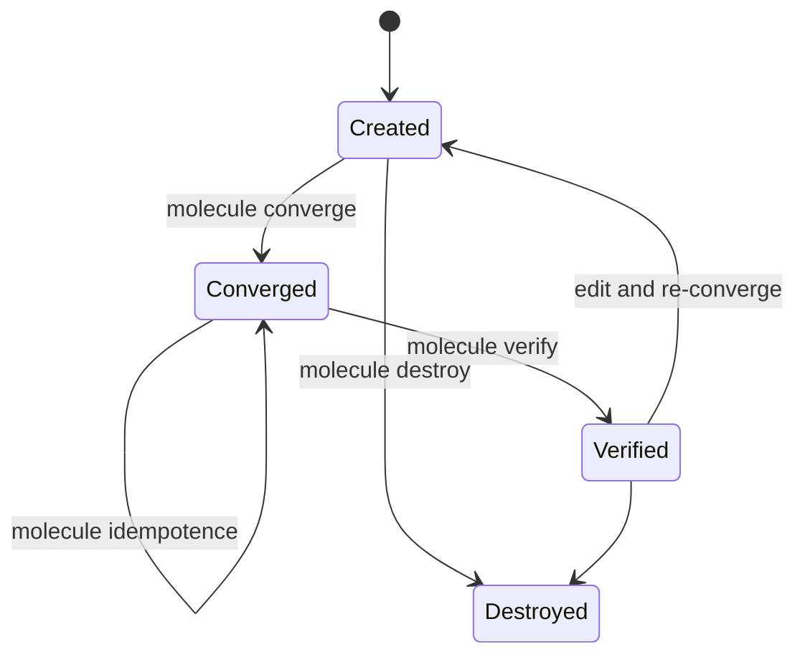

# Usage — the day-to-day commands

> **You are here:** [Docs home](./index.md) → [Install](./install/index.md) → [Quickstart](./quickstart.md) → **Usage** → [CLI reference](./reference/cli.md)

**What you will be able to do:** run any Molecule command with confidence, choose between
`molecule test` and the individual steps, target one scenario out of several, and tell the
difference between a green run that tested something and a green run that tested nothing.

---

## Every command, in one table

Molecule has exactly **two classes** of command. There are no others. Everything you will find
in a blog post that is not in one of these two tables does not exist.

- **Special commands** do one standalone job. They are not part of a test run.
- **Actions** are the named steps inside a test sequence. You can run one on its own, or let
  `molecule test` run them in the order your `molecule.yml` lists.

### Special commands

| Command | What it does | Needs running first | What it costs | Use this when |
|---|---|---|---|---|
| `molecule drivers` | Lists the drivers Molecule can see. | Nothing. | **Nothing** — it prints a list, touches no container and no network. | The `podman` driver is missing, or you want to confirm `molecule-plugins` reached the same environment `molecule` did. |
| `molecule init scenario <name>` | Creates `molecule/<name>/` and writes 5 files into it. | Nothing. | Instant on disk. Refuses if the folder exists and is not empty. | Starting a new scenario. This is the *only* subcommand of `molecule init`. |
| `molecule list` | One row per scenario: name, its `test_sequence`, its drivers. | Nothing. | **Nothing** — it reads configuration. | You have more than one scenario and want to see their names before targeting one. |
| `molecule login` | Drops you into an interactive shell inside the running container. | **`create`** — the container must exist. | Free to open; costs nothing until you exit. | You want to poke at a converge result: read a log, run `systemctl --failed`, look in a directory. |
| `molecule matrix` | Prints the ordered list of actions the current scenario would run. | Nothing. | **Nothing** — it reads `scenario.test_sequence`. | You want to know which steps a `molecule test` will take, without taking them. |
| `molecule reset` | Removes every container labelled `owner=molecule`. | Nothing. | Touches the container engine. Removes **all** of them, not one scenario's. | Your machine has accumulated half-finished containers and you want a clean slate. |

### Actions

| Command | What it does | Needs running first | What it costs | Use this when |
|---|---|---|---|---|
| `molecule check` | Sanity check of the scenario and its parameterisation. | Nothing. | **Nothing** on the network; reads config. | You edited `molecule.yml` and want a cheap first look before spending a container. |
| `molecule cleanup` | Runs `cleanup.yml` — removes artefacts a previous run left behind. | Anything; it is normally last-but-one. | Runs a playbook against `localhost`. | Your scenario writes files or state **outside** the container and needs tidying. |
| `molecule converge` | Runs `converge.yml` — **applies** your role or content. | **`create`** — there must be a container. | Runs a playbook inside the container. This is the expensive step. | You have changed the thing under test and want to see it applied. |
| `molecule create` | Starts the container from the image named in `platforms:`. | Nothing. | **The slowest single step** — image pull on first run, then container start. | Always, as the first step of the everyday loop. |
| `molecule dependency` | Installs the roles and collections listed in `requirements.yml`. | Nothing. | **Network** — it talks to Ansible Galaxy. | After you add a collection or role to `requirements.yml`. Rarely worth repeating by hand. |
| `molecule destroy` | Deletes the container. | Nothing. | Touches the container engine; fast. | You are finished, or you want a clean slate before `create`. |
| `molecule idempotence` | Runs `converge.yml` a **second** time and fails if anything changed. | **`converge`** must have run and succeeded. | Roughly a second full `converge`. | Before you commit. It catches tasks that act on every run. |
| `molecule prepare` | Runs `prepare.yml` — installs fixtures before converge. | `create`. | A playbook. | You need a package, a user or a file present *before* your role runs. Not scaffolded; you write it. |
| `molecule side-effect` | Runs `side_effect.yml` — makes a change you will undo in another scenario. | `create`. | A playbook. | You test that something can be **undone**. Not scaffolded. |
| `molecule syntax` | `ansible-playbook --syntax-check` across the scenario's playbooks. Parses; does not run. | Nothing. | Seconds. No container. | You want to catch a YAML typo before waiting on a container. |
| `molecule test` | Runs the whole `test_sequence`, in order, for every scenario. | Nothing. | The most expensive command. Creates, converges, converges again, verifies, destroys. | The default. Anything else is a special case — see below. |
| `molecule verify` | Runs `verify.yml` — **asserts** the outcome. This is the step that decides pass or fail. | **`converge`** must have run. | A playbook. Cheap relative to `converge`. | After any change to your role, to prove the result. |

> **"What it costs" is about what the command *touches*, not milliseconds.** A command that
> says *network* or *starts a container* is the slow one. Everything marked **nothing** reads
> local files and returns immediately, which makes `molecule matrix`, `molecule list` and
> `molecule syntax` the right tools for "what would happen if I ran this?".

Full detail on each one, with a worked example and its most common failure:
[CLI reference](./reference/cli.md).

---

## Commands that do not exist

> ### ⚠️ `molecule add`, `molecule remove` and `molecule lint` have been **removed**
>
> Not deprecated. **Gone.** There is no source file for any of them in Molecule's command
> package, and no mention of them in its current documentation. A large amount of the internet
> still tells you to type them, which is why this page disagrees with most tutorials you will
> find by searching.

| What a tutorial will tell you to type | What to type instead |
|---|---|
| `molecule add default` | `molecule init scenario default` |
| `molecule remove reverse` | `rm -r molecule/reverse` |
| `molecule lint` | `ansible-lint`, run on its own |

There is one more spelling trap in the same family: the command is **`molecule idempotence`**,
with an *e*. `molecule idempotency` does not exist.

`molecule init` has **exactly one** subcommand: `scenario`. Running `molecule init` with no
argument prompts for the name and defaults it to `default`.

**The reliable way to see the truth on any machine** is the command list itself:

```bash
molecule --help
```

---

## The everyday loop

This is the loop you will run dozens of times. Four commands, in this order, run from the
directory that contains `molecule/`.

```bash
molecule create
```

**You should see:** a `CREATE` banner, then `podman ps` shows one row whose `NAMES` column
contains `instance` with status `Up`.

```bash
molecule converge
```

**You should see:** a `CONVERGE` banner, then your tasks with `changed: [instance]` or
`ok: [instance]`. The word `changed` means the task actually did something.

```bash
molecule verify
```

**You should see:** a `VERIFY` banner and your `ok: [instance]` assertions. This is the step
that decides pass or fail.

```bash
molecule destroy
```

**You should see:** a `DESTROY` banner, then `podman ps` shows no rows.



**The container's states as you drive them by hand, and the one loop back that changes everything.**

*`create` starts the container. `converge` applies your role. `idempotence` converges again
and must change nothing. `verify` asserts the result. From `Verified` you can go straight back
to `Created` — that is the edit-and-re-converge cycle, and it is why this loop is fast: you
never recreate the container, you only re-run the one step you changed. `destroy` ends it, from
either end. Unlike `molecule test`, nothing destroys the container for you at the end, so it is
still there when you finish.*

**The one thing to understand about this loop:** the container **stays alive between commands**.
`molecule test` throws it away at the end of every run; this loop does not. That is the whole
reason to run the steps individually — you keep the machine you were just working on, and
`molecule login` still works.

### When you would skip a step

| Skip | When | What you give up |
|---|---|---|
| `create` | The container is already running. `podman ps` shows it. | Nothing — this is the common case in the loop. |
| `converge` | You changed `verify.yml` only, not the thing under test. | The assertion would check a stale state. Do skip it: this is the single most common time saved. |
| `converge` | Nothing changed at all, and you only want to see assertions. | Never skip it for a clean `molecule test` — see the next section. |
| `verify` | You are mid-way through writing the role and have nothing to assert yet. | All value. A run with no `verify` proves nothing, and **still exits 0**. |
| `destroy` | You are about to edit the role and re-converge. | Nothing now, but the container is still there tomorrow. `podman ps` will remind you. |

---

## `molecule test` versus running the steps yourself

`molecule test` runs the `test_sequence` from your `molecule.yml`, for every scenario in the
project, and — in the canonical sequence — **destroys the container at the end**.

| | `molecule test` | The four individual steps |
|---|---|---|
| What it runs | The whole `test_sequence` | Exactly what you name |
| The container afterwards | **Gone** — the sequence ends in `destroy` | **Still there** |
| Repeat cost | Full: create, converge, converge again, verify, destroy | Only the step you re-run |
| Several scenarios | Runs all of them, or `-s` one | Always one |
| Use it when | You want the answer, and you are leaving the machine | You are iterating, and you want to keep the machine |

**Which to use, in one line:** iterate with the four steps, then run `molecule test` once
before you commit or push — because `molecule test` is also the only run that proves
`idempotence` and that a clean machine produces a green result.

> ### ⚠️ A green `molecule test` is not proof that your test ran
>
> If a play matches no hosts, Molecule reports `skipping: no hosts matched`, `failed=0`, and
> **exits 0**. This was measured on this project's own examples: every play skipped, not one
> assertion executed, exit code `0`.
>
> On the same run, check both:
>
> 1. **`PLAY RECAP` shows `ok=N` with `N > 0`.** `ok=0` means nothing ran.
> 2. **There are zero `skipping: no hosts matched` lines** anywhere in the output.
>
> The usual cause is a missing `groups:` key under `platforms[0]`, because **Molecule builds
> its Ansible groups from that key and there is no implicit `molecule` group**. Add
> `groups: [molecule]`. Full check and the one-line fix:
> [Did my test actually run?](./systemd-in-containers.md#4-and-inside-molecule) and
> [`molecule.yml` reference](./reference/molecule-yml.md#groups).

---

## The test sequence

`molecule test` does not have a hard-coded order. It runs whatever your `molecule.yml` lists
under `scenario.test_sequence`. Two values matter.

**The default that `molecule init scenario` scaffolds** — longer, because it includes the
steps a beginner has not written yet:

```yaml
    test_sequence:
      - dependency
      - cleanup
      - destroy
      - syntax
      - create
      - prepare
      - converge
      - idempotence
      - side_effect
      - verify
      - cleanup
      - destroy
```

**The official Podman sequence** — what this project uses, because it is shorter and matches
the driver-based configuration:

```yaml
    test_sequence:
      - dependency
      - destroy
      - create
      - converge
      - idempotence
      - verify
      - cleanup
      - destroy
```

| Step | What it does | Beginner note |
|---|---|---|
| `dependency` | Installs roles and collections from `requirements.yml`. | Runs first so everything after it has what it needs. |
| `cleanup` | Removes artefacts from a previous run. | Appears at the start *and* the end. **It needs `cleanup.yml` to exist**, or Molecule prints `Missing playbook` on every run and the recap reads `missing=1`. |
| `destroy` | Deletes the containers. | Also at both ends, so a crashed run cannot poison the next one. |
| `syntax` | Checks the playbooks parse. Does not run them. | Catches a typo in seconds. |
| `create` | Creates the containers. | Under a driver, `molecule.yml` **is** the create configuration. |
| `prepare` | Installs fixtures before converge. | Not scaffolded; you write it. |
| `converge` | **Applies** your role. | The step that does the work. |
| `idempotence` | Converge a second time; assert nothing changed. | Catches tasks that act on every run. |
| `side_effect` | Makes a change, to be undone in a second scenario. | Not scaffolded. |
| `verify` | **Asserts** the outcome. | The step that decides pass or fail. |

To see the order for your own project without running it:

```bash
molecule matrix
```

**You should see:** the action names, in order, one per line. It reads `molecule.yml` and
returns immediately.

---

## Targeting one scenario

A **scenario** is one directory under `molecule/`. If you have only one, the flag is
unnecessary. If you have several, it is how you stop testing all of them.

```bash
molecule list
```

**You should see:** one row per scenario, with its name, its steps and its drivers. The names
here are the names you pass to `-s`.

```bash
molecule test -s default
```

**You should see:** only that scenario's steps run.

| Flag | What it does |
|---|---|
| `-s <name>` | Target one scenario. Same thing spelled `--scenario-name <name>`. |
| `-s <group>/<name>` | Target a nested scenario, using `/` as the separator. |
| `-s "<group>/*"` | Target a whole group of nested scenarios with a wildcard. |
| `--all` | Run everything, explicitly. |
| `--parallel` | Run the scenarios at the same time. |

> **The one warning about `--parallel`:** watch the `create` step. Two scenarios creating
> containers at once compete for the same image pull, and under rootless Podman for the same
> cgroup and network setup. If a parallel run behaves differently from a serial one, that step
> is the first place to look.

Further reading: [multi-scenario](./authoring/multi-scenario.md#running-one-scenario-or-all-of-them).

---

## What Molecule passes through to Ansible — and what it does not

Molecule does not run tasks itself. For every step that has a playbook, it runs
**`ansible-playbook`**. So the question "can I pass an Ansible flag?" has a precise answer,
and it is narrower than most tutorials imply.

**The one documented pass-through channel is `--`.** Everything after it is handed to
`ansible-playbook` untouched:

```bash
molecule converge -- -vvv --tags foo,bar
```

That is the corpus's own example, verbatim. Molecule's documentation is explicit about the
trade-off: *"Use this option with care, as there is no sanitation or validation of input."*
Anything after `--` overrides what the `provisioner`'s `options` section of `molecule.yml`
set.

**For a flag you want on every run, do not repeat it on the command line — set it in
`molecule.yml`.** The key is `ansible.executor.args.ansible_playbook`, and it is a real,
documented key:

```yaml
ansible:
  executor:
    args:
      ansible_playbook:
        - --diff
        - --inventory=inventory/
```

**What the corpus does not verify, and this page therefore does not document as working:** a
bare `-e` or `-v` typed directly to `molecule`. They are Ansible's flags, not Molecule's, and
no Molecule documentation in the corpus lists them among its own options. If you need one, use
`--` for that one run or the `executor.args` list above for all of them. `molecule --help` is
the authority on your machine.

Two global flags Molecule *does* document, and they are its own:

| Flag | What it does |
|---|---|
| `molecule --debug test` | More verbose output. Put it **before** the subcommand. This is the flag to reach for when you are collecting a bug report. |
| `molecule --version` | Prints the Molecule version and the `ansible-core` it is using. If this fails with `ansible-config: not found`, your problem is an install, not a test — see [environment variables](./reference/env-vars.md#environment-variables-do-not-fix-an-install-problem). |

---

## Driving it from a Makefile or a shell script

**The exit code is the contract.** `0` means Molecule reported success; anything else means
it reported failure. That is what a `Makefile`, a shell script or CI reads.

```make
.PHONY: test
test:            ## run every scenario
	molecule test

.PHONY: converge
converge:        ## apply, keep the container
	molecule create
	molecule converge

.PHONY: verify
verify:          ## assert, keep the container
	molecule verify

.PHONY: clean
clean:           ## remove every molecule container
	molecule reset
```

```bash
#!/usr/bin/env bash
set -euo pipefail

molecule test
echo "green, and the assertions ran"
```

`set -euo pipefail` is the habit worth copying: without it, a failing command in the middle of
a multi-line script does not stop the script.

> ### ⚠️ Do not build automation on the exit code alone
>
> A scenario with a missing `groups:` key exits **0** having asserted nothing. In a script,
> that is a green pipeline testing nothing — and it will stay green forever, because nothing
> will ever change.
>
> If a script's verdict has to be trustworthy, add the non-vacuity check to it: the
> `PLAY RECAP` must show `ok=N` with `N > 0`, and there must be zero
> `no hosts matched` lines. The exact two conditions are in
> [`REFERENCE-CONFIG.md`](./REFERENCE-CONFIG.md) §2d, and
> [Did my test actually run?](./systemd-in-containers.md#4-and-inside-molecule) explains them
> for a human reader.

---

## Next

- **Look up one command** — [`reference/cli.md`](./reference/cli.md) has every real command,
  alphabetical, with a worked example and its most common failure.
- **Look up one setting** — [`reference/molecule-yml.md`](./reference/molecule-yml.md) covers
  every key the Podman driver reads, with a "get this wrong and…" line for each.
- **Look up one variable** — [`reference/env-vars.md`](./reference/env-vars.md), including the
  one that tutorials recommend and that does not exist.
- **Now build your own** — [`authoring/index.md`](./authoring/index.md) is the front door;
  [`authoring/writing-tests.md`](./authoring/writing-tests.md) is where assertions get good.
- **Something broke** — [`troubleshooting.md`](./troubleshooting.md), ordered by how often each
  failure bites. A word you did not know: [`glossary.md`](./glossary.md).

---

## Attribution

No brand marks or logos are displayed on this page. Brand and licence records live in
[`../assets/ATTRIBUTION.md`](../assets/ATTRIBUTION.md); product names identify the software
being discussed and imply no endorsement.

---

## Sources

- <https://docs.ansible.com/projects/molecule/> — the `molecule` command list: the six special
  commands and the actions, and the `--` pass-through
- <https://github.com/ansible/molecule/blob/main/src/molecule/command/__init__.py> — the
  authoritative list of registered commands. It contains **no** `add.py`, `remove.py` or
  `lint.py`, which is how the removals were verified
- <https://github.com/ansible/molecule/blob/main/src/molecule/command/init/init.py> — `init`
  registers exactly one subcommand, `scenario`
- <https://github.com/ansible/molecule/tree/main/src/molecule/data/templates/scenario> — the
  five scaffold templates, and the absence of the rest
- <https://github.com/ansible-community/molecule-plugins/blob/main/src/molecule_plugins/podman/driver.py> —
  the Podman driver, including the `reset()` label filter and the default container command
- Internal, reproducible: the two `test_sequence` values and the step table are copied from
  [`REFERENCE-CONFIG.md`](./REFERENCE-CONFIG.md) §9.2; the non-vacuity check from §2d. The YAML
  in this page is the single source of truth — no page in this project re-types a config file.
